# MySQL 架构

<p align="center">

</p>

# MySQL 数据类型

1. 整型

|   类型    | 字节  | 位数 |  最小值  |  最大值  |
| --------- | ---- | ---- | ------- | -------- |
|           | byte |  bit | signed  | signed   |
| tinyint   | 1    | 8    | -2<sup>7</sup> = -128  | 2<sup>7</sup>-1 = 127 |
| smallint  | 2    | 16   |         |          |
| mediumint | 3    | 24   |         |          |
| int       | 4    | 32   | -2<sup>31</sup> = -2147483648 | 2<sup>31</sup>-1 = 2147483647 |
| bigint    | 8    | 64   |         |          |

`tinyint`, `smallint`,`mediumint`, `int`, `bigint` 分别使用 8, 16, 24, 32, 64 位存储空间，一般情况下越小的列越好。

`int(N)`我们只需要记住：

- 无论 N 等于多少，永远占 4 个字节；
- N 只是规定了交互工具显示字符的个数，对于存储和计算来说是没有意义的；
- N 表示的是显示宽度，不足的用 0 补足，超过的无视长度而直接显示整个数字，但这要整型设置了`unsigned zerofill`才有效。

2. 浮点数

**float 和 double 类型**

| 数据类型      | 字节数  |    备注     |
|:------------:|:-------:|:-----------:|
| float        |    4    | 单精度浮点数 |
| double       |    8    | 双精度浮点数 |

`float(M, D)`、`double(M, D)` 的用法规则：

- D 表示浮点型数据小数点之后的精度，假如超过 D 位则四舍五入，即 1.233 四舍五入为 1.23，1.237 四舍五入为 1.24；
- M 表示浮点型数据总共的位数，M = 5，D = 2 则表示总共支持五位，即小数点前只支持 3 位数，若数据整数或小数部分超过范围，插入就会报错；
- 当我们不指定 M、D 的时候，会按照实际的精度来处理。

**decimal 类型**

`decimal` 数据类型用于在数据库中存储精确的数值，经常用来存储货币数据，如价格，工资，账户余额等。

`decimal(M，D)` 表示列可以存储 D 位小数的 M 位数。十进制列的实际范围取决于精度和刻度。

- M 是表示有效数字数的精度，范围是 1〜65，默认值为 10；
- D 是表示小数点后的位数，范围是 0〜30 且 D <= M，默认值为 0。

与 `int` 数据类型一样，`decimal` 类型也具有 `unsigned` 和 `zerofill` 属性。 

如果使用 `unsigned` 属性，则 `decimal unsigned` 的列将不接受负值。

如果使用 `zerofill`，MySQL 将把显示值填充到 0 以显示由列定义指定的宽度。另外，如果我们对 `decimal` 列使用 `zerofill`，MySQL 会自动将 `unsigned` 属性添加到列。

MySQL 分别为整数和小数部分分配存储空间。MySQL 使用二进制格式存储 `decimal` 值。它将 9 位数字包装成 4 个字节。

对于每个部分，需要 4 个字节来存储 9 位数的每个倍数。剩余位数所需的存储如下表所示：

| 剩余位数 |   0   | 1 – 2 | 3 – 4 | 5 - 6 | 7 - 9 |
|:-------:|:-----:|:-----:|:-----:|:-----:|:-----:|
|  字节数  |   0   |   1   |   2   |   3   |   4   |

例如，`decimal(19,9)` 小数部分具有 9 位数字，整数部分具有 10 位数字，小数部分需要 4 个字节；整数部分对于前 9 位数字需要 4 个字节，1 个剩余位需要 1 个字节。总共需要 4 + 4 + 1 = 9 个字节。

插入数据：

- 当数值在其取值范围之内，小数位多了，则四舍五入后直接截断多出的小数位；
- 若数值在其取值范围之外，则直接报 `Out of range value` 错误。

**用法总结**

- `float`、`double` 类型存在精度丢失问题，即写入数据库的数据未必是插入数据库的数据，而 `decimal` 无论写入数据中的数据是多少，都不会存在精度丢失问题，这就是我们要引入 `decimal` 类型的原因，`decimal` 类型常见于银行系统、互联网金融系统等对小数点后的数字比较敏感的系统中。

- CPU 原生支持 `float`、`double` 运算，但是不支持 `decimal` 类型的计算，因此 `decimal` 的计算比前二者需要更高的代价。

3. 字符串

|  数据类型   |             含义             |
|:----------:|:-----------------------------|
| char(n)    | 固定长度，最多255个字符        |
| varchar(n) | 可变长度，最多65535个字符      |
| tinytext   | 可变长度，最多255个字符        |
| text       | 可变长度，最多65535个字符      |
| mediumtext | 可变长度，最多$2^24 - 1$个字符 |
| longtext   | 可变长度，最多$2^32 - 1$个字符 |

**char 和 varchar**

- `char(n)` 若存入字符数小于 n，则以空格补于其后，查询之时再将空格去掉。所以 `char` 类型存储的字符串末尾不能有空格，`varchar` 不限于此；

- `varchar` 会保留字符串末尾的空格，而 `char` 会删除。

- `char` 是定长的。`char(n)` 固定长度，`char(4)` 不管是存入几个字符，都将占用 4 个字节；

- `varchar` 是变长的。`varchar(n)` 是存入的实际字符数 + 1 个字节（n <= 255）或 2 个字节(n > 255)，所以 `varchar(4)` 存入 3 个字符将占用 4 个字节； 

- `char` 类型的字符串检索速度要比 `varchar` 类型的快。

- `varchar` 这种变长类型能够节省空间，因为只需要存储必要的内容。但是在执行 update 时可能会使行变得比原来长，当超出一个页所能容纳的大小时，就要执行额外的操作。MyISAM 会将行拆成不同的片段存储，而 InnoDB 则需要分裂页来使行放进页内。

**如何选择数据类型**

选择原则：根据选定的存储引擎，确定如何选择合适的数据类型。

- MyISAM 存储引擎和数据列：MyISAM 数据表，最好使用固定长度（`char`）的数据列代替可变长度（`varchar`）的数据列；

- MEMORY 存储引擎和数据列：MEMORY 数据表目前都使用固定长度的数据行存储，因此无论使用 `char` 或 `varchar` 列都没有关系，两者都是作为 `char` 类型处理的；

- InnoDB 存储引擎和数据列：建议使用 `varchar` 类型。

**varchar 和 text**

- `varchar` 可指定 n，`text` 不能指定，内部存储 `varchar` 是存入的实际字符数 + 1 个字节（n <= 255）或 2 个字节(n > 255)，text 是实际字符数 + 2 个字节；

- `text` 类型不能有默认值；

- `varchar` 可直接创建索引，`text` 创建索引要指定前多少个字符。`varchar` 查询速度快于 `text`，在都创建索引的情况下，`text` 的索引似乎不起作用。

4. 时间和日期

|  数据类型   |             含义             |
|:----------:|:-----------------------------|
| date       | 日期 '2008-12-2'             |
| time       | 时间 '12:25:36'              |
| datetime   | 日期时间 '2008-12-2 22:06:4   |
| timestamp  | 自动存储记录修改时间           |

MySQL 中提供了两种相似的日期时间类型：`datetime` 和 `timestamp`。

- `datetime` 能够保存从 1001 年到 9999 年的日期和时间，精度为秒，使用 **8** 字节的存储空间；`timestamp` 和 UNIX 时间戳相同，保存从 1970 年 1 月 1 日午夜（格林威治时间）以来的秒数，使用 **4** 字节，只能表示从 1970 年到 2038 年；

- `datetime` 与时区无关；`timestamp` 和时区有关，也就是说一个时间戳在不同的时区所代表的具体时间是不同的。

- MySQL 提供了 `FROM_UNIXTIME()` 函数把 UNIX 时间戳转换为日期，并提供了 `UNIX_TIMESTAMP()` 函数把日期转换为 UNIX 时间戳。

- 应该尽量使用 `timestamp`，因为它比 `datetime` 空间效率更高。

5. 二进制类型

MySQL 中，`BLOB` 是一个二进制大型对象，是一个可以存储大量数据的容器，它能容纳不同大小的数据。

|  数据类型   |          最大存储空间         |
|:----------:|:----------------------------:|
| tinyblob   | 255 B                        |
| blob       | 65 KB                        |
| mediumblob | 16 MB                        |
| longblob   | 4 GB                         |

**blob 和 text**

- 存储方式不同。`text` 以文本存储，英文存储区分大小写；`blob` 以二进制方式存储，不区分大小写；

- `blob` 存储的数据只能整体读出；

- `text` 可以指定字符集，`blob` 不用指定字符集。


# 数据库中的范式

为了建立冗余较小、结构合理的数据库，设计数据库时必须遵循一定的规则。在关系型数据库中，这种规则就是范式。范式是符合某一种级别的关系模式的集合。

目前关系型数据库有六种范式，分别为：第一范式（1NF）、第二范式（2NF）、第三范式（3NF）、第四范式（4NF）、第五范式（5NF）和第六范式（6NF）。

满足最低要求的范式是第一范式（1NF）。在第一范式的基础上进一步满足更多规范要求的称为第二范式（2NF），其余范式以次类推。通常来讲，数据库只需满足第三范式 (3NF）就可以了。

范式的包含关系：一个数据库设计如果符合第二范式，一定也符合第一范式。如果符合第三范式，一定也符合第二范式…

* 1NF：属性不可分.
* 2NF：属性完全依赖于主键 [消除部分子函数依赖].
* 3NF：属性不依赖于其它非主属性 [消除传递依赖].
* BCNF（巴斯-科德范式）：在1NF基础上，任何非主属性不能对主键子集依赖[在3NF基础上消除对主码子集的依赖].
* 4NF：要求把同一表内的多对多关系删除.
* 5NF（完美范式）：从最终结构重新建立原始结构.

<p align="center">

</p>


## 第一范式 (1NF)

第一范式（1NF）用来确保每列的原子性，要求每列（或者每个属性值）都是不可再分的最小数据单元（也称为最小的原子单元）。

1NF 是所有关系型数据库的最基本要求，也就是说，只要在关系型数据库中已经存在的数据表，一定是符合 1NF 的。

**第一范式存在的问题**

以下面这张 stu 表来说明存在的问题：

<p align="center">
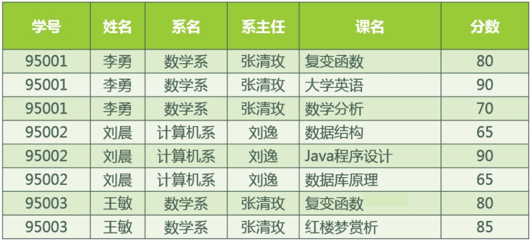
</p>

- 数据冗余过大

每一名学生的学号、姓名、系名、系主任这些数据重复多次，每个系与对应的系主任的数据也重复多次。

- 插入异常

假如学校新建了一个系，但是暂时还没有招收任何学生，那么添加数据时，会将系名与系主任的数据单独地添加到数据表中，而没有添加学生列的数据，数据添加不合法。

- 删除异常

删除时会将整行的数据删除，假如将某个系中所有学生相关的记录都删除，那么所有系与系主任的数据也就随之消失了（一个系所有学生都没有了，并不表示这个系就没有了）。

- 修改异常

假如李勇转系到法律系，那么为了保证数据库中数据的一致性，需要修改三条记录中系与系主任的数据。


## 第二范式 (2NF)

第二范式（2NF）在第一范式的基础上更进一层，要求表中的每列都和主键相关，即要求实体的唯一性。如果一个表满足第一范式，并且除了主键以外的其他列全部都依赖于该主键，那么该表满足第二范式。

将 1NF 转换为 2NF 只有一个办法，就是将大数据表拆分成两个或者更多个更小的数据表，这个过程叫做模式分解。

模式分解的方法不是唯一的，对于上图的 stu 表分成选课表和学生表：

<p align="center">
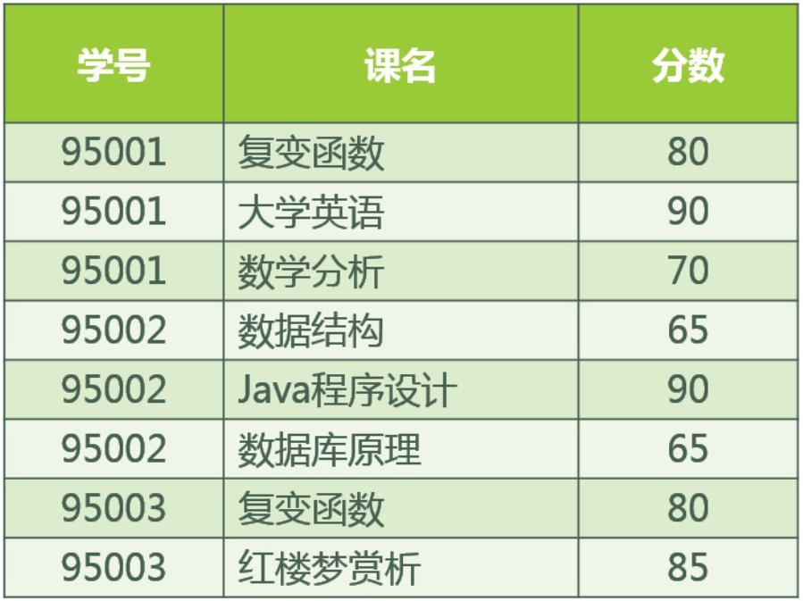
</p>

<p align="center">

</p>

**第二范式存在的问题**

观察改进后满足第二范式的stu表是否还存在第一范式的问题：

- 李勇转系到法律系
只需要修改一次李勇对应的系的值即可。——有改进

- 数据冗余是否减少了？
学生的姓名、系名与系主任，不再像之前一样重复那么多次了。——有改进

- 删除某个系中所有的学生记录
该系的信息仍然全部丢失。——无改进

- 插入一条暂无学生的新系的记录
因为学生表的码是学号，不能为空，所以此操作不被允许。——无改进


## 第三范式 (3NF)

第三范式（3NF）在第二范式的基础上更进一层，第三范式是确保每列都和主键列直接相关，而不是间接相关，即限制列的冗余性。如果一个关系满足第二范式，并且除了主键以外的其他列都依赖于主键列，列和列之间不存在相互依赖关系，则满足第三范式。

为了让数据表满足 3NF 的要求，必须进一步进行模式分解为以下形式：

<p align="center">

</p>

<p align="center">

</p>

<p align="center">

</p>

由此，1NF、2NF 的问题皆得到了改进。


## 反范式化

不满足范式的数据库设计，就是反范式化。

我们需要知道对于项目的最终用户来说，用户关心的是方便，清晰的数据结果。所以在设计数据库时，设计人员和客户在数据库的设计规范化和性能之间会有一定的矛盾。

上面我们通过三大范式将 stu 表分解出三个表，为了满足客户的需求，最终可能需要通过三个表之间的连接查询，来得到客户需要的数据结果，插入数据同样如此，对于客户输入的数据，我们需要分开插入到三个不同的表中。

由此可以看出，为了满足三大范式，我们的数据操作性能会受到相应的影响。

所以，在实际的数据库设计中，既要考虑三大范式，避免数据的冗余和各种数据操作异常，又要考虑数据访问性能。为了减少表连接，提高数据库的访问性能，也可以允许适当的数据冗余列，这也许就是最合适的数据库设计方案。

**范式化和反范式化的优缺点**

1. 范式化

优点如下：
- 减少了数据冗余；
- 范式化后的表中只有很少的重复数据，更新时只需要更新较少的数据，所以范式化的更新操作比反范式化更快；
- 范式化的表通常比反范式化更小。

缺点如下：
- 范式化的表在查询时经常需要很多的关联，这会导致性能降低；
- 增加了索引优化的难度。

2. 反范式化

优点如下：
- 可以减少表的关联；
- 可以更好地进行索引优化。

缺点如下：
- 数据表存在数据冗余及数据维护异常；
- 对数据的修改需要更多的成本。


# 数据库的事务

<p align="center">

</p>

MySQL 事务主要用于处理操作量大，复杂度高的数据。数据库的事务指的是满足数据库的 ACID 特性的一组操作，可以通过 Commit 提交一个事务，也可以使用 Rollback 进行回滚。

MySQL 中默认采用自动提交（AUTOCOMMIT）模式。如果不显式使用 START TRANSACTION 语句来开始一个事务，那么每个查询都会被当做一个事务自动提交。

开启标志：

```sql
任何一条 DML 语句(insert、update、delete)执行，标志事务的开启。
```

结束标志(提交或者回滚)：

```sql
提交：成功的结束，将所有的DML语句操作历史记录和底层硬盘数据来一次同步
回滚：失败的结束，将所有的DML语句操作历史记录全部清空

```


## ACID 特性

1. 原子性（Atomicity）

原子性是指事务是一个不可分割的工作单位，事务中的操作要么全部成功，要么全部失败。比如在同一个事务中的 SQL 语句，要么全部执行成功，要么全部执行失败。

回滚可以用日志来实现，日志记录着事务所执行的修改操作，在回滚时反向执行这些修改操作即可。

2. 一致性（Consistency）

事务必须使数据库从一个一致性状态变换到另外一个一致性状态。以转账为例子，A 向 B 转账，假设转账之前这两个用户的钱加起来总共是 100，那么 A 向 B 转账之后，不管这两个账户怎么转，A 用户的钱和 B 用户的钱加起来的总额还是 100，这个就是事务的一致性。

3. 隔离性（Isolation）

隔离性是当多个用户并发访问数据库时，比如操作同一张表时，数据库为每一个用户开启的事务，不能被其他事务的操作所干扰，多个并发事务之间要相互隔离。

即要达到这么一种效果：对于任意两个并发的事务 T1 和 T2，在事务 T1 看来，T2 要么在 T1 开始之前就已经结束，要么在 T1 结束之后才开始，这样每个事务都感觉不到有其他事务在并发地执行。

4. 持久性（Durability）

一旦事务提交，则其所做的修改将会永远保存到数据库中。即使系统发生崩溃，事务执行的结果也不能丢失。

可以通过数据库备份和恢复来实现，在系统发生奔溃时，使用备份的数据库进行数据恢复。

事务的 ACID 特性概念简单，但不是很好理解，主要是因为这几个特性不是一种平级关系：

- 只有满足一致性，事务的执行结果才是正确的；
- 在无并发的情况下，事务串行执行，隔离性一定能够满足。此时只要能满足原子性，就一定能满足一致性；
- 在并发的情况下，多个事务并发执行，事务不仅要满足原子性，还需要满足隔离性，才能满足一致性；
- 事务满足持久化是为了能应对数据库奔溃的情况。

<p align="center">

</p>


## 并发一致性问题 

1. 丢失修改

图解：
```markdown
T1 和 T2 两个事务都对一个数据进行修改，T1 先修改，T2 随后修改，T2 的修改覆盖了 T1 的修改。
```

<p align="center">

</p>

2. 脏数据读取（针对未提交数据）

如果一个事务中对数据进行了更新，但事务还没有提交，另一个事务可以 “看到” 该事务没有提交的更新结果。这样造成的问题就是，如果第一个事务回滚，那么，第二个事务在此之前所 “看到” 的数据就是一笔脏数据。 （脏读又称无效数据读出。一个事务读取另外一个事务还没有提交的数据叫脏读。 ）

图解：
```markdown
T1 修改一个数据，T2 随后读取这个数据。如果 T1 撤销了这次修改，那么 T2 读取的数据是脏数据。
```

<p align="center">

</p>

解决办法：
```markdown
把数据库的事务隔离级别调整到 READ_COMMITTED
```

3. 不可重复读

是指在一个事务内，多次读同一数据。在这个事务还没有结束时，另外一个事务也访问该同一数据。那么，在第一个事务中的两次读数据之间，由于第二个事务的修改，那么第一个事务两次读到的的数据可能是不一样的。这样在一个事务内两次读到的数据是不一样的，因此称为是不可重复读。（同时操作，事务 1 分别读取事务 2 操作时和提交后的数据，读取的记录内容不一致。不可重复读是指在同一个事务内，两个相同的查询返回了不同的结果。 ）

图解：
```markdown
T2 读取一个数据，T1 对该数据做了修改。
如果 T2 再次读取这个数据，此时读取的结果和第一次读取的结果不同。
```

<p align="center">

</p>

解决办法：
```markdown
如果只有在修改事务完全提交之后才可以读取数据，则可以避免该问题。
把数据库的事务隔离级别调整到 REPEATABLE_READ
```

4. 幻读

事务 T1 读取一条指定的 Where 子句所返回的结果集，然后 T2 事务新插入一行记录，这行记录恰好可以满足T1 所使用的查询条件。然后 T1 再次对表进行检索，但又看到了 T2 插入的数据。 （和可重复读类似，但是事务 T2 的数据操作仅仅是插入和删除，不是修改数据，读取的记录数量前后不一致）。

幻读的重点在于新增或者删除（数据条数变化）。

图解：
```markdown
T1 读取某个范围的数据，T2 在这个范围内插入新的数据，T1 再次读取这个范围的数据，
此时读取的结果和和第一次读取的结果不同。
```

<p align="center">

</p>

解决办法：
```markdown
如果在操作事务完成数据处理之前，任何其他事务都不可以添加新数据，则可避免该问题。
把数据库的事务隔离级别调整到 SERIALIZABLE_READ
```


## 事务隔离级别

1. 读未提交 (Read Uncommitted)

最低的隔离等级，允许其他事务看到没有提交的数据，会导致**脏读**。

2. 读已提交 (Read Committed)

被读取的数据可以被其他事务修改，这样可能导致**不可重复读**。也就是说，事务读取的时候获取读锁，但是在读完之后立即释放（不需要等事务结束），而写锁则是事务提交之后才释放，释放读锁之后，就可能被其他事务修改数据。

3. 可重复读 (Repeated Read)

所有被 Select 获取的数据都不能被修改，这样就可以避免一个事务前后读取数据不一致的情况。但是却没有办法避免**幻读**，因为这个时候其他事务不能更改所选的数据，但是可以增加数据，即前一个事务有读锁但是没有范围锁。

MySQL InnoDB 引擎的**默认隔离级别**。

注意：现在主流数据库都使用 `MVCC` 并发控制，使用之后 RR（可重复读）隔离级别下可以很大程度上避免幻读现象的发生（注意是很大程度避免，并不是彻底避免）。

4. 串行化 (Serializable)

所有事务一个接着一个的执行，这样可以避免幻读（phantom read），对于基于锁来实现并发控制的数据库来说，串行化要求在执行范围查询的时候，需要获取范围锁，如果不是基于锁实现并发控制的数据库，则检查到有违反串行操作的事务时，需回滚该事务。 

**总结**

四个级别逐渐增强，每个级别解决一个问题，事务隔离级别遇越高，性能越差，大多数环境 Read committed 就可以用了。

| 隔离级别 | 脏读 | 不可重复读 | 幻读 |
|:-------:|:----:|:----------:|:------:|
| 未提交读 | √    | √          | √      |
| 提交读   | ×    | √          | √      |
| 可重复读 | ×    | ×          | √      |
| 可串行化 | ×    | ×          | ×      |


## MVCC

Multiversion (version) concurrency control (MCC or MVCC) 多版本并发控制，是是一种并发控制的方法，一般在数据库管理系统中，实现对数据库的并发访问，在编程语言中实现事务内存。MVCC 在 MySQL InnoDB 中的实现主要是为了提高数据库并发性能，用更好的方式去处理读写冲突，做到即使有读写冲突时，也能做到不加锁，非阻塞并发读。

并发控制常用的是锁，当线程要对一个共享资源进行操作的时候，加锁是一种非常简单粗暴的方法(事务开始时给 DQL 加读锁，给 DML 加写锁)，这其实就是悲观锁，会给其他事务造成堵塞，从而影响数据库性能。

另外一种方式是，当一个线程需要对一个共享资源进行操作的时候，不对它进行加锁，而是在操作完成之后进行判断，这就是乐观锁。

MVCC 多版本并发控制是 MySQL 中基于乐观锁理论实现隔离级别的方式，用于读已提交和可重复读取隔离级别的实现。

### MVCC 的两种读形式

* 快照读

读取的只是当前事务的可见版本，不用加锁。简单的 `select` 操作就是快照读 (`select * from table where id = xxx`)，即不加锁的非阻塞读，提高数据库的并发查询能力；快照读的前提是隔离级别不是串行级别，串行级别下的快照读会退化成当前读；之所以出现快照读的情况，是基于提高并发性能的考虑，快照读的实现是基于多版本并发控制，即 MVCC，可以认为 MVCC 是行锁的一个变种，但它在很多情况下，避免了加锁操作，降低了开销；既然是基于多版本，即快照读可能读到的并不一定是数据的最新版本，而有可能是之前的历史版本。

* 当前读

读取的是当前版本，读取时还要保证其他并发事务不能修改当前记录，会对读取的记录进行加锁。比如特殊的读操作（加读写锁）、更新/插入/删除操作。

比如：

```sql
 select * from table where xxx lock in share mode，
 select * from table where xxx for update，
 update table set....
 insert into table (xxx,xxx) values (xxx,xxx)
 delete from table where id = xxx
```

### MVCC 的实现原理

在 InnoDB 中的每一条记录实际都会存在三个隐藏列：

|	id | name | password | DB_ROW_ID | DB_TRX_ID | DB_ROLL_PTR |
|:--:|:----:|:--------:|:---------:|:---------:|:-----------:|
| id | name | password |   主键    |   事务id   |	 回滚指针   |

- DB_ROW_ID：主键，如果有自定义主键，那么该值就是主键；如果没有主键，那么就会使用定义的第一个唯一索引；如果没有唯一索引，那么就会默认生成一个隐藏列作为主键。

- DB_TRX_ID：事务 ID，是根据事务产生时间顺序自动递增的，是独一无二的。如果某个事务执行过程中对该记录执行了增、删、改操作，那么 InnoDB 存储引擎就会记录下该条事务的 id。

- DB_ROLL_PTR：回滚指针，本质上就是一个指向记录对应的 undolog 的一个指针，InnoDB 通过这个指针找到之前版本的数据。

<p align="center">
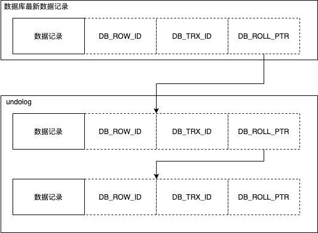
</p>

版本 V1、V2 并不是物理上真实存在的，而是每次需要的时候根据当前版本和 undolog 计算出来的。比如，需要 V1 的时候，就是通过 V3 依次执行 U2、U1 算出来的。

可以将这些 undolog 都连起来，串成一个链表，形成版本链。版本链的头节点就是当前记录最新的值。

在 InnoDB 中，事务中的 delete 操作实际上并不是真正的删除掉数据行，而是一种 delete Mark 操作，在记录上标识删除，真正的删除工作需要后台 purge 线程去完成。

```markdown
purge 线程作用:
1、清理 undolog；
2、清除 page 里面带有 delete_Bit 标识的数据行。
```

MVCC 使用的便是**删除标识**字段、**事务 ID** 字段和**回滚指针**字段：

|	id | name | password |  Deleted	  | DB_TRX_ID | DB_ROLL_PTR |
|:--:|:----:|:--------:|:----------:|:---------:|:-----------:|
| id | name | password |true / false|   事务id   |	 回滚指针   |

### MVCC 的操作实现

**更新主键**

聚簇索引和二级索引都无法进行 in place update，都会产生两个版本。

`update` 分两步执行，先删除该行，再插入一行目标行。

<p align="center">
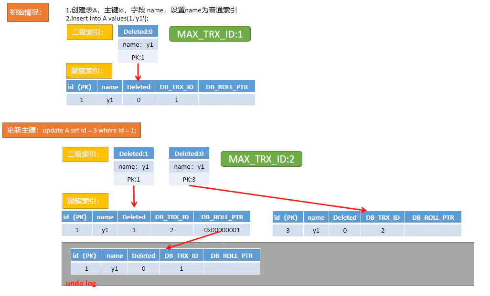
</p>
**更新非主键**

聚簇索引可以 in place update，二级索引产生两个版本。

聚簇索引记录 undolog，二级索引不记录 undolog。

更新二级索引的同时需要判断是否修改索引页面的 MAX_TRX_ID。

<p align="center">
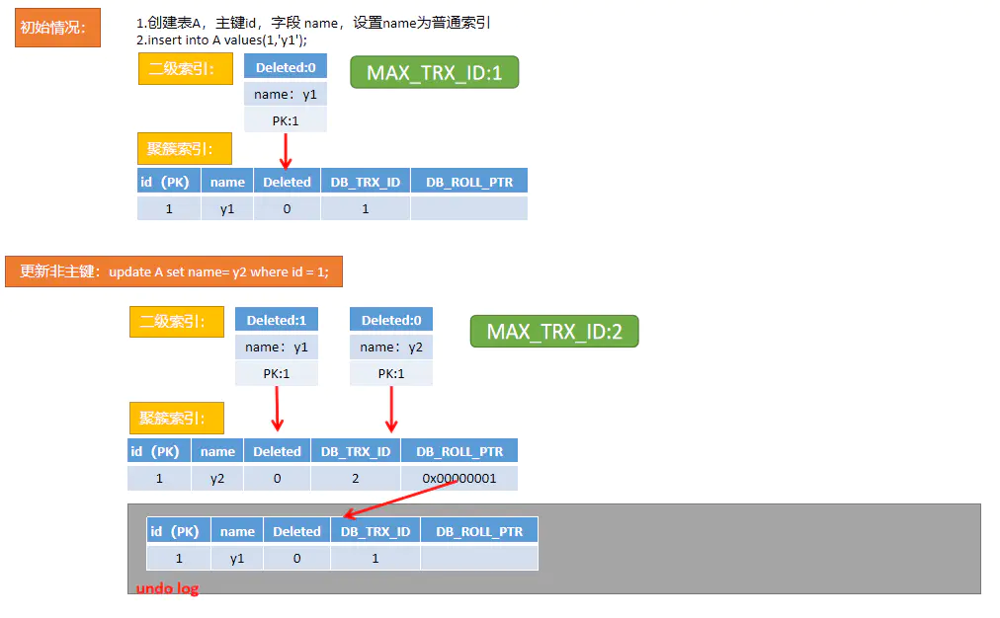
</p>

**删除操作**

<p align="center">
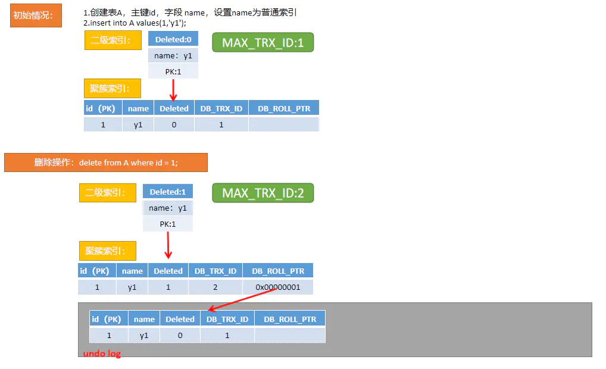
</p>

### Read View

Read View 主要是 InnoDB 在实现 MVCC 时用来做可见性判断的。当我们某个事务执行**快照读**的时候，创建一个 Read View 读视图，用来判断当前事务能够看到哪个版本的数据，既可能是当前最新的数据，也有可能是该行记录的 undolog 里面的某个版本的数据。

Read View 几个**属性**：

- `trx_ids`: 当前系统活跃（未提交）事务版本号集合；
- `low_limit_id`: 高水位线，创建当前 read view 时“系统活跃事务最大版本号 + 1”；
- `up_limit_id`: 低水位线，创建当前 read view 时“系统活跃事务最小版本号”
- `creator_trx_id`: 创建当前 read view 的事务版本号；

Read View **可见性判断**条件：

- `trx_id` < `up_limit_id` || `trx_id` == `creator_trx_id`（显示）

如果数据事务 ID（trx_id）小于 read view 中的最小活跃事务 ID（up_limit_id），则可以肯定该数据是在当前事务启之前就已经存在了的，所以可以显示。

或者数据事务 ID（trx_id）等于 creator_trx_id，说明这个数据就是当前事务自己生成的，这种情况下此数据也是可以显示的。

- `trx_id` >= `low_limit_id`（不显示）

如果数据事务 ID（trx_id）大于 read view 中的当前系统的最大事务 ID，则说明该数据是在当前 read view 创建之后才产生的，所以数据不显示。

- `up_limit_id` <= `trx_id` < `low_limit_id` 
  - `trx_id` $\notin$ `trx_ids`（显示）
  说明 Read View 产生的时候事务已经 commit 了，这种情况数据则可以显示。
  - `trx_id` $\in$ `trx_ids`（不显示）
  说明 Read View 产生的时候事务还在活跃，还没有 Commit，该事务修改的数据，当前事务也是看不见的。

简单来说：

<p align="center">
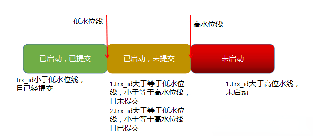
</p>

绿色部分的数据可见；红色部分的数据不可见；黄色部分中的数据，如果已经提交了，可见，未提交的话，则不可见。

### MVCC 的工作流程

1. 查询主键索引

生成 Read View 读视图；

通过主键查找记录，根据记录里的 `DB_TRX_ID` 与 Read View 读视图进行可见性判断；

配合 `DB_ROLL_PTR` 回滚指针和 undolog 来找到当前事务可见的数据记录。

2. 查询二级索引

二级索引没有三个隐藏列（`DB_TRX_ID`，`DB_ROLL_PTR`，`DB_ROW_ID`），如何实现一致读、可重复读？

更新二级索引列时，旧的二级索引记录将被删除标记（并非真正的删除），新记录将被插入；如果二级索引记录被标记为删除，或者二级索引页被更新的事务更新，则不使用覆盖索引技术（要通过聚簇索引查找正确版本）。

如果启用了索引条件下推（ICP）优化，首先会通过索引下推过滤掉不符合要求的行，来避免使用聚簇索引查找。如果找到匹配的记录，即使在删除标记的记录中，InnoDB 也会在聚簇索引中查找该记录。

> Innodb 的一个优化：max_trx_id 只会给更新事务分配 trx_id。
>
> 对于只读事务 id 的分配，不会使用 max_trx_id 的值（也不会使 max_trx_id 的值自增），而是一个很大的 trx_id，这是 innodb 使用当前事务的 trx 变量的地址转换成整数，然后在加上 2 的 48 次方计算得来的。这种计算方式，计算出来的 trx_id 值会比较大，刚好可以和更新事务做区分，同时不同的事务 trx 变量的地址值也是不同的，所以只读事务 trx_id 一般情况下，也是不会相同。
>
> 这种优化方案，可以减少 trx_id 申请的次数，所以 max_trx_id 增加的速度也就变慢了，同时也减少了 trx_id 申请过程中锁冲突的几率。

具体查询步骤：

- 生成 Read View 读视图；

- 比较读视图的 `up_limit_id` 与 `MAX_TRX_ID` 大小；
  - 如果 `MAX_TRX_ID` 小于本次 Read View 的 `up_limit_id`，则全部可见，过滤记录中的有效记录；
  - 否则，无法通过二级索引判断可见性，需要一次遍历每条记录，反查到聚簇索引记录，通过聚簇索引记录来判断可见性。

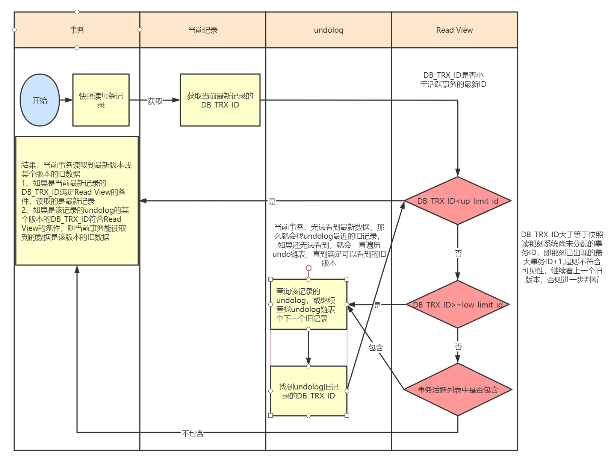

### MVCC 与隔离级别

MVCC 只在 Read Commited（读已提交） 和 Repeatable Read（可重读读） 两种隔离级别下工作。

- 在 RC 隔离级别下，是每个快照读都会生成并获取最新的 Read View，因此我们在 RC 级别下的事务中可以看到别的事务提交的更新；

- 在 RR 隔离级别下，则是同一个事务中的第一个快照读才会创建 Read View，之后的快照读获取的都是同一个 Read View，从而做到可重复读。

### MVCC 能否解决幻读

幻读：在一次事务里面，多次查询之后，结果集的个数不一致的情况叫做幻读，多出来或者少的那一行被叫做幻行。

- 在快照读情况下，mysql 通过 mvcc 来避免幻读；

- 在当前读情况下，mysql 通过 next-key 来避免幻读；

- 不能把快照读和当前读得到的结果不一样这种情况认为是幻读，这是两种不同的使用。所以 mysql 的 RR 级别是解决了幻读的。


## MySQL 日志文件

### undolog

undolog 也就是我们常说的回滚日志文件，主要用于事务中执行失败、进行回滚，以及 MVCC 中对于数据历史版本的查看。由**引擎层**的 InnoDB 引擎实现，是**逻辑日志**，记录数据被修改前的值，比如把 `id = 'B'` 修改为 `id = 'B2'`，那么 undo 日志就会用来存放 `id = 'B'` 的记录。

undolog 的存储由 InnoDB 存储引擎实现，数据保存在 InnoDB 的数据文件中，InnoDB 存储引擎对 undolog 的管理采用段（segment）的方式，具体来说是一种命名为回滚段（rollback segment）的数据结构。每个回滚段中有 1024 个 undolog segment。

<p align="center">
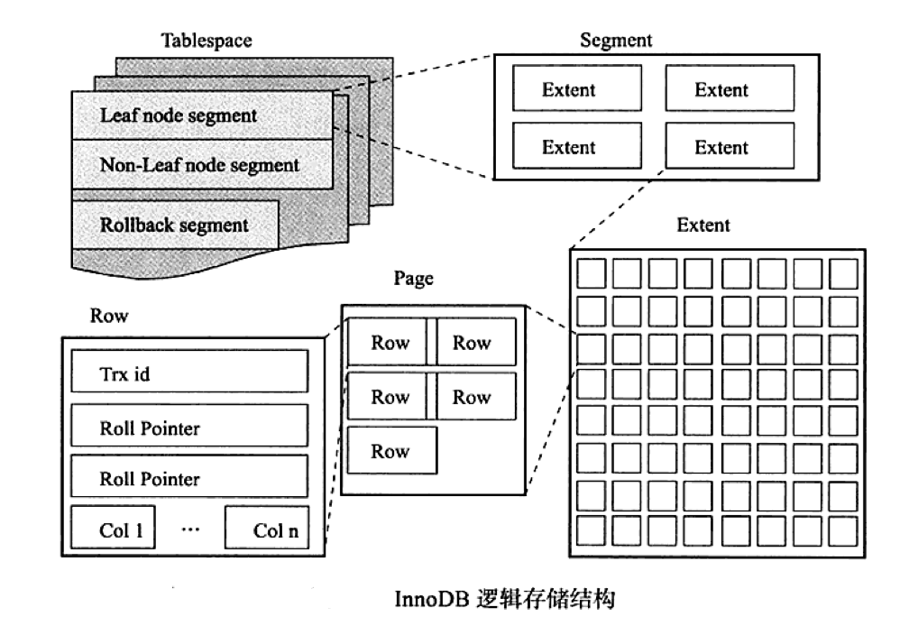
</p>

当一条数据需要更新前，会先把修改前的记录存储在 undolog 中，如果这个修改出现异常，则会使用 undolog 来实现回滚操作，保证事务的一致性。当事务提交之后，undolog 并不会立马被删除，而是会被放到待清理链表中，待判断没有事务用到该版本的信息时才可以清理相应 undolog。

undolog 保存了事务发生之前的数据的一个版本，用于回滚，同时可以提供多版本并发控制下的读（MVCC），也即非锁定读。

undolog 有两种：

- Insert undolog ：insert 生成的日志，仅在事务回滚中需要，并且可以在事务提交后立即丢弃；

- Update undolog：update/delete 生成的日志，除了用于事务回滚，还用于一致性读取，只有不存在 innodb 为其分配快照的事务之后才能丢弃它们，在一致读取中可能需要 update undolog 中的信息来构建数据库行的早期版本。

用 undolog 实现原子性和持久化的事务的简化过程：

假设有 A、B 两个数据，值分别为 1、2。

A. 事务开始
B. 记录 A=1 到 undolog 中
C. 修改 A=3
D. 记录 B=2 到 undolog 中
E. 修改 B=4
F. 将 undolog 写到磁盘 ------- undolog 持久化
G. 将数据写到磁盘 ------- 数据持久化
H. 事务提交 ------- 提交事务

之所以能同时保证原子性和持久化，是因为以下特点：

- 更新数据前记录 undolog；
- 为了保证持久性，必须将数据在事务提交前写到磁盘，只要事务成功提交，数据必然已经持久化到磁盘；
- undolog 必须先于数据持久化到磁盘。如果在 G、H 之间发生系统崩溃， undolog 是完整的，可以用来回滚；
- 如果在 A - F 之间发生系统崩溃，因为数据没有持久化到磁盘，所以磁盘上的数据还是保持在事务开始前的状态。

缺陷：每个事务提交前将数据和 undolog 写入磁盘，这样会导致大量的磁盘 IO，因此性能较差。如果能够将数据缓存一段时间，就能减少 IO 提高性能，但是这样就会失去事务的持久性。


### redolog

redolog 重做日志文件，是记录数据修改之后的值，用于持久化到磁盘中。

redolog 由**引擎层**的 InnoDB 引擎实现，是**物理日志**，记录的是物理数据页修改的信息，比如“某个数据页上内容发生了哪些改动”。当一条数据需要更新时，InnoDB 会先将数据更新，接着记录 redolog 在内存中，然后找个时间将 redolog 的操作执行到磁盘上的文件上。不管是否提交成功都会记录，要是回滚了，那就连回滚的修改也记录。redolog 确保了事务的持久性。

innodb 是以**页**为单位来管理存储空间的，任何的增删改差操作最终都会操作完整的一个页，会将整个页加载到 buffer pool 中，然后对需要修改的记录进行修改，修改完毕不会立即刷新到磁盘，因为此时的刷新是一个随机io，而且仅仅修改了一条记录，刷新一个完整的数据页的话过于浪费了。但是如果不立即刷新的话，数据此时还在内存中，此时发生系统崩溃最终数据会丢失.

因此引入了 redolog，也就是说，修改完后，不立即刷新，而是记录一条日志，日志内容就是记录哪个表空间，哪个页面，多少偏移量，什么数据发生了什么变更。这样即使系统崩溃，再恢复后，也可以根据 redolog 进行数据恢复。另外，redolog 是循环写入固定的文件，是**顺序**写入磁盘的。

<p align="center">
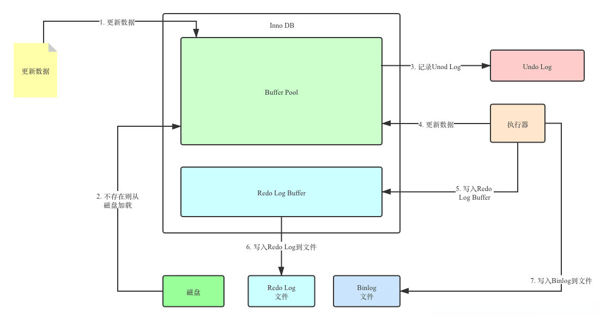
</p>

redolog 包括两部分：

1. 内存中的日志缓冲（redolog buffer），该部分日志是易失性的；

2. 磁盘上的重做日志文件（redolog file），该部分日志是持久的。

在一个事务中，可能会发生多次的数据修改，对应的就是多个数据页多个偏移量位置的字段变更，也就是说会产生多条 redolog，而且因为在同一个事物中，这些 redolog，也是不可再分的，也就是说，一个组的 redolog 在持久化的时候，不能部分成功，部分失败，否则的话，就会破坏事务的原子性。

另外为了提升性能，redolog 是按照块组织在一起，然后写入到磁盘中的，类似于数据的页，而且引入了 redo log buffer，默认的大小为 16MB。buffer 中分了很多的 block，每个 block 的大小为 512kb，每一个事务产生的所有 redolog 称为一个组（group）。

redolog 写入磁盘全流程：

- 将一组 redolog 写入 redolog buffer（依然在内存中，依旧是为了调节 CPU 与磁盘写入速度的矛盾）；
- redolog buffer 写入 page cache（OS 内核缓冲区里的页，操作系统会找个时间自动刷到磁盘。或者你调用 fsync 函数就能确保刷盘）；
- page cache 的数据刷到磁盘。

redolog 的刷盘时机通过一个参数 `innodb_flush_log_at_trx_commit` 控制，可选值如下：

1：commit 的时候进行刷盘。这也是最保险的，因为如果这个时候崩溃了代表没有 commit 成功，因此也不用恢复什么数据。这种情况保证了数据落盘，但是性能较差；
2：commit 的时候，只是刷新进 page cache，具体的刷盘时机不确定；
0：后台线程，每秒刷新一次到磁盘中，不仅写入 page cache 还会调用 fsync。这种情况很危险，但是性能最好。

为了保证事务的持久性，推荐使用 1。

#### MySQL 的两阶段提交

对于 MySQL InnoDB 存储引擎而言，每次修改后，不仅需要记录 redolog，还需要记录 binlog，而且这两个操作必须保证同时成功或者同时失败，否则就会造成数据不一致。为此 Mysql 引入两阶段提交。

如果先写 redolog 再写 binlog：

<p align="center">

</p>

先写 binlog 再写 redolog：

<p align="center">
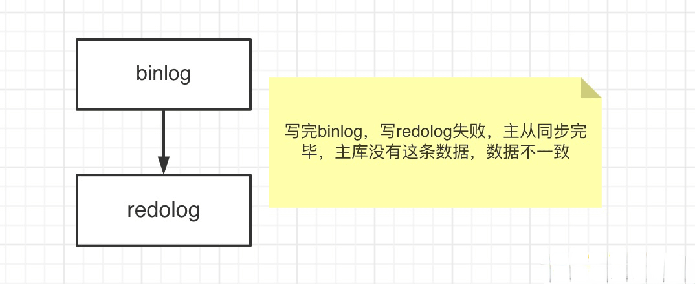
</p>

两阶段提交：

<p align="center">
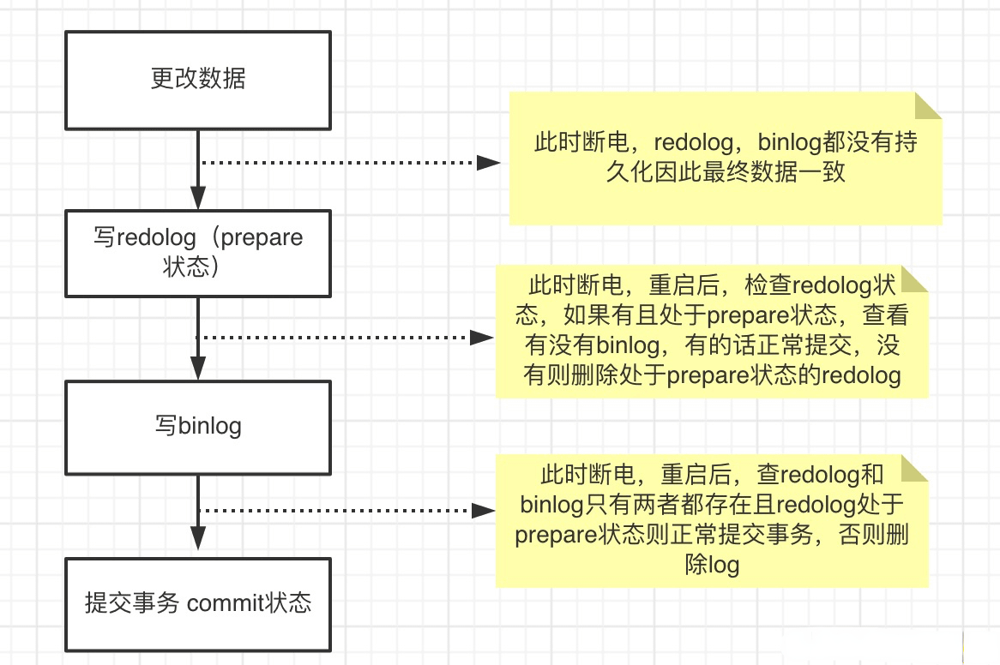
</p>


### binlog

binlog 由 Mysql 的 **Server 层**实现，是**逻辑日志**，记录的是 sql 语句的原始逻辑，比如把 `id = 'B'` 修改为 `id = 'B2'`。

binlog 会写入指定大小的物理文件中，是追加写入的，当前文件写满则会创建新的文件写入。

产生：**事务提交**的时候，一次性将事务中的 sql 语句按照一定的格式记录到 binlog 中。

用于复制和恢复：在主从复制中，从库利用主库上的 binlog 进行重播（执行日志中记录的修改逻辑），实现主从同步；业务数据不一致或者错了，用 binlog 进行恢复。

binlog 有三种格式 statement，row 以及 mixed，默认使用 statement，建议使用 row 格式。

- `statement` ：语句级别，记录执行的 DDL 及 DML 语句
  - 优点: 性能最优，日志量少 
  - 缺点: 主从复制情况下会有些语句不支持，比如语句中包含 UUID 函数，以及 LOAD DATA IN FILE 语句等，可能会导致主备不一致。

- `row` ：行级别，用行的形式记录执行的 DDL 及 DML
  - 优点: 数据一致性高 
  - 缺点: 性能略低于语句级别

- `mixed` ：混合级别，MySQL 自动判断是记录行还是记录语句，官方推荐的模式

binlog 数据结构如下：

<p align="center">
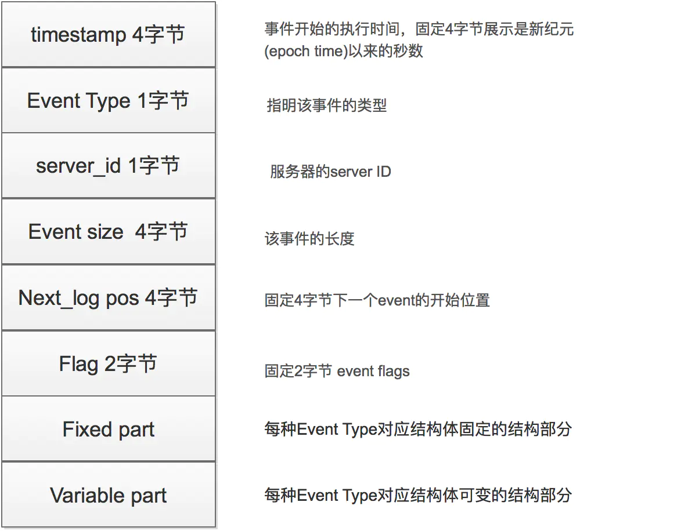
</p>


# 存储引擎

## MyISAM

MySQL 5.5 版本之前的默认存储引擎，在 `5.0` 以前最大表存储空间最大 `4G`，`5.0` 以后最大 `256TB`。

Myisam 存储引擎由 `.myd`（数据）和 `.myi`（索引文件）组成，`.frm`文件存储表结构（所有存储引擎都有）。

**特性**

- 不支持事务
- 并发性和锁级别：为表级锁，写入和读互斥，对于读写混合的操作不好
- 表损坏修复
- 支持的索引类型：全文索引、R 树索引
- 支持表压缩：（使用 myisampack）压缩后，此表为只读，不可以写入

**应用场景**

- 只读类应用（插入不频繁，查询非常频繁）
- 空间类应用（唯一支持空间函数的引擎）
- 做很多 count 的计算

## InnoDB

MySQL 5.5 及之后版本的默认存储引擎。

**特性**

- InnoDB 为事务性存储引擎
- 完全支持事务的 ACID 特性
- Redolog（实现事务的持久性）和 Undolog（为了实现事务的原子性，存储未完成事务log，用于回滚）
- 支持行级锁
- 行级锁可以最大程度的支持并发
- 行级锁是由存储引擎层实现的

**应用场景**

- 可靠性要求比较高，或者要求事务
- 表更新和查询都相当的频繁，并且行锁定的机会比较大的情况

## Memory

**特性:**

- 也称为 HEAP 存储引擎，数据保存在内存中（数据库重启后会导致数据丢失）
- 支持 HASH 索引（等值查找）和 B-Tree 索引（范围查找）
- 所有字段都为固定长度，varchar(10) == char(10)
- 不支持 BLOB 和 TEXT 等大字段
- Memory 存储使用表级锁（性能可能不如 innodb） 

- Memory 存储引擎默认表大小只有 `16M`，可以通过 `max_heap_table_size` 参数调整 

**应用场景:**

- 用于查找或是映射表（例如邮编和地区的对应表）
- 用于保存数据分析中产生的中间表
- 用于缓存周期性聚合数据的结果表

注意： Memory 数据易丢失，所以要求数据可再生

## 其它存储引擎

**CSV**

文件系统存储特点：

- 数据以文本方式存储在文件中
- `.csv`文件存储表内容
- `.csm`文件存储表的元数据，如表状态和数据量
- `.frm`存储表的结构

CSV存储引擎特点：

- 以 CSV 格式进行数据存储
- 所有列都不能为 NULL
- 不支持索引
- 可以对数据文件直接编辑（其他引擎是二进制存储，不可编辑）

应用场景：

- 作为数据交换的中间表

**Archive**

特性：

- 以 zlib 对表数据进行压缩，磁盘 I/O 更少
- 数据存储在 ARZ 为后缀的文件中（表文件为 `a.arz`，`a.frm`）
- 只支持 insert 和 select 操作（不可以 delete 和 update，会提示没有这个功能）
- 只允许在自增 ID 列上加索引

应用场景：

* 日志和数据采集类应用

**Federated**

特性：

- 提供了访问远程 MySQL 服务器上表的方法
- 本地不存储数据，数据全部放在远程服务器上
- 本地服务器存储表的结构文件`.frmfile` 
- 远程服务器存储表的`.frm`文件和数据文件
- 增删改查都是通过 mysql api 接口连接符来访问运行的
- 远程数据库支持 mysql 的 MyISAM 和 innoDB 存储引擎

使用 Federated 默认是禁止的。如果需要启用，需要在启动时增加 Federated 参数。

## 存储引擎的选择

**选择存储引擎需要考虑的条件**

* 是否需要事务
* 是否可以热备份
* 崩溃恢复
* 存储引擎的特性  

注意：不要混合使用存储引擎

推荐：Innodb

**MyISAM 和 InnoDB 引擎的区别**

特性：

* MyISAM 不支持外键，而 InnoDB 支持；
* MyISAM 是非事务安全型的，而 InnoDB 是事务安全型的；
* MyISAM 锁的粒度是表级，而 InnoDB 支持行级锁定；
* MyISAM 支持全文类型索引，而 InnoDB 不支持全文索引；
* MyISAM 相对简单，所以在效率上要优于 InnoDB，小型应用可以考虑使用 MyISAM；
* MyISAM 表是保存成文件的形式，在跨平台的数据转移中使用 MyISAM 存储会省去不少的麻烦；
* InnoDB 表比 MyISAM 表更安全，可以在保证数据不会丢失的情况下，切换非事务表到事务表（alter table tablename type = innodb）。

应用场景：

* MyISAM 管理非事务表。它提供高速存储和检索，以及全文搜索能力。如果应用中需要执行大量的 SELECT 查询，那么 MyISAM 是更好的选择；
* InnoDB 用于事务处理应用程序，具有众多特性，包括 ACID 事务支持。如果应用中需要执行大量的 INSERT或 UPDATE 操作，则应该使用 InnoDB，这样可以提高多用户并发操作的性能。

# 表空间

**系统表空间**

- 相关定义 ： 一般用来存放 MySQL 系统相关信息的一个特殊的共享表空间；
- 存放路径 ： 默认为 MySQL 初始化路径下的 `ibdata1` 文件；
- 存放内容 ： InnoDB data dictionary（InnoDB 数据字典，元数据信息）、doublewrite buffer（双写缓冲区）、change buffer（修改缓冲区）、undo logs 以及用户创建的表也可以指定在系统表空间（但一般不这么做）。


**独立表空间**

- 相关定义： 一般用来存放用户创建的表数据及索引的一个独立表空间，即一张表对应一个表空间文件；
- 存放路径： 默认为 MySQL 初始化路径下对应数据库名称文件夹下的 `.frm` (表结构文件)，`.ibd` (数据 + 索引)，`.opt` (数据库默认字符集及排序方式)；
注：MyISAM 引擎下由于其数据和索引是分开存放的，没有 `ibd` 文件，对应为 `.MYD`（数据），`.MYI`（索引）。
- 存放内容：用户表数据及索引；
- 控制参数：`innodb_file_per_table` 是否开启单表表空间，该参数为全局参数，可动动态修改，默认为 ON，如果设置为 OFF，在没有显式指定表空间情况下，数据及索引默认存放到系统表空间 `ibdata` 下。


**独立表空间和系统表空间应该如何抉择？**

可以比较下两者之间的差别进行选择：

* 系统表空间：无法简单的收缩大小（这很恐怖，会导致 ibdata1 一直增大，即使删除了数据也不会变小）；
* 独立表空间：可以通过 `optimize table` 命令重组表空间内部数据排列（同时也是主键索引的重新排列），回收多余空间（收缩系统文件）；
* 系统表空间：会产生 I/O 瓶颈（因为只有一个文件）；
* 独立表空间：可以向多个文件刷新数据；

注意：Innodb 引擎使用独立表空间（mysql 5.6 版本以后默认是独立表空间）

**系统表转移为独立表的步骤（非常繁琐）**

* 使用 `mysqldump` 导出所有数据库表数据
* 停止 mysql 服务，修改参数，并且删除 Innodb 相关文件
* 重启 mysql 服务，重建 mysql 系统表空间
* 重新导入数据


# MySQL 索引

索引能够轻易将查询性能提升几个数量级。

- 对于非常小的表、大部分情况下简单的全表扫描比建立索引更高效；
- 对于中到大型的表，索引就非常有效；
- 但是对于特大型的表，建立和维护索引的代价将会随之增长。这种情况下，需要用到一种技术可以直接区分出需要查询的一组数据，而不是一条记录一条记录地匹配，例如可以使用分区技术。

索引是在存储引擎层实现的，而不是在服务器层实现的，所以不同存储引擎具有不同的索引类型和实现。


索引的特点：

* 可以加快数据库的检索速度；
* 降低数据库插入、修改、删除等维护的速度；
* 只能创建在表上，不能创建到视图上；
* 既可以直接创建又可以间接创建；
* 可以在优化隐藏中使用索引；
* 使用查询处理器执行 SQL 语句，在一个表上，一次只能使用一个索引。


索引的优点:

* 可以创建唯一性索引，保证数据库表中每一行数据的唯一性；
* 大大加快数据的检索速度，这是创建索引的最主要的原因；
* 加速数据库表之间的连接，在实现数据的参考完整性方面特别有意义；
* 在使用分组和排序子句进行数据检索时，同样可以显著减少查询中分组和排序的时间；
* 通过使用索引，可以在查询中使用优化隐藏器，提高系统的性能。

索引的缺点:

* 创建索引和维护索引要耗费时间，这种时间随着数据量的增加而增加；
* 索引需要占用物理空间，除了数据表占用数据空间之外，每一个索引还要占一定的物理空间，如果建立聚簇索引，那么需要的空间就会更大；
* 当对表中的数据进行增加、删除和修改的时候，索引也需要维护，降低了数据维护的速度。

 

## 索引结构

目前大部分数据库系统及文件系统都采用 B- Tree 或其变种 B+ Tree 作为索引结构。

### B Tree

B-tree（多路搜索树，并不是二叉的）是一种常见的数据结构，也就是我们常说的 B 树。使用 B-tree 结构可以显著减少定位记录时所经历的中间过程，从而加快存取速度。按照翻译，B 通常认为是 Balance 的简称。这个数据结构一般用于数据库的索引，综合效率较高。

数据结构：

<p align="center">

</p>

定义一条数据记录为一个二元组 [key, data]，B-Tree 是满足下列条件的数据结构：

* 所有叶节点具有相同的深度，也就是说 B-Tree 是平衡的；
* 一个节点中的 key 从左到右非递减排列；
* 如果某个指针的左右相邻 $key$ 分别是 $key_i$ 和 $key_{i+1}$，且不为 null，则该指针指向节点的所有 $key ≥ key_i$ 且 $key ≤ key_{i+1}$。

查找算法：首先在根节点进行二分查找，如果找到则返回对应节点的 data，否则在相应区间的指针指向的节点递归进行查找。

由于插入删除新的数据记录会破坏 B-Tree 的性质，因此在插入删除时，需要对树进行一个分裂、合并、旋转等操作以保持 B-Tree 性质。

### B+ Tree

<p align="center">

</p>

与 B-Tree 相比，B+Tree 有以下不同点：

* 每个节点的指针上限为 2d 而不是 2d+1（d 为节点的出度）；
* 内节点不存储 data，只存储 key；
* 叶子节点不存储指针。

顺序访问指针:

<p align="center">

</p>

一般在数据库系统或文件系统中使用的 B+Tree 结构都在经典 B+Tree 基础上进行了优化，在叶子节点增加了顺序访问指针，做这个优化的目的是为了提高区间访问的性能。

### 索引数据结构的选择依据

**为什么采用 B Tree / B+ Tree 而非红黑树等平衡树?**

红黑树等平衡树也可以用来实现索引，但是文件系统及数据库系统普遍采用 B Tree / B+ Tree 作为索引结构，主要有以下两个原因：

* 更少的检索次数

平衡树检索数据的时间复杂度等于树高 h，而树高大致为 $O(h)=O(log_dN)$，其中 d 为每个节点的出度。红黑树的出度为 2，而 B Tree 的出度一般都非常大。红黑树的树高 h 很明显比 B Tree 大非常多，因此检索的次数也就更多。

B+Tree 相比于 B-Tree 更适合外存索引，因为 B+Tree 内节点去掉了 data 域，因此可以拥有更大的出度，检索效率会更高。

* 利用计算机预读特性

为了减少磁盘 I/O，磁盘往往不是严格按需读取，而是每次都会预读。这样做的理论依据是计算机科学中著名的局部性原理：当一个数据被用到时，其附近的数据也通常会马上被使用。预读过程中，磁盘进行顺序读取，顺序读取不需要进行磁盘寻道，并且只需要很短的旋转时间，因此速度会非常快。

对 B- Tree 来说，每次新建节点时，直接申请一个页的空间，这样就保证一个节点物理上也存储在一个页里，加之计算机存储分配都是按页对齐的，就实现了一个 node 只需一次 I/O。

B- Tree 中一次检索最多需要 h-1 次 I/O（根节点常驻内存），渐进复杂度为 $O(h) = O(log_dN)$。一般实际应用中，出度 d 是非常大的数字，通常超过 100，因此 h 非常小（通常不超过 3）。

而红黑树这种结构，逻辑上很近的节点（父子）物理上可能很远，无法利用局部性，所以红黑树的 I/O 渐进复杂度也为 O(h)，效率却明显比 B- Tree 差很多。

**为何选择用 B+ 树做索引而不用 B- 树?**

* I/O 次数更少

B- 树 / B+ 树 的特点就是每层节点数目非常多，层数很少，目的就是为了就少磁盘 IO 次数，但是 B- 树的每个节点都有 data 域（指针），这无疑增大了节点大小，说白了增加了磁盘 IO 次数（磁盘 IO 一次读出的数据量大小是固定的，单个数据变大，每次读出的就少，IO 次数增多，一次 IO 多耗时），而 B+ 树除了叶子节点其它节点并不存储数据，节点小，磁盘 IO 次数就少。

* 支持区间访问

B+ 树所有的 Data 域在叶子节点，一般来说都会进行一个优化，就是将所有的叶子节点用指针串起来。这样遍历叶子节点就能获得全部数据，这样就能进行区间访问。在数据库中基于范围的查询是非常频繁的，而 B 树不支持这样的遍历操作。


## 索引分类

### 按照数据结构划分

| 特性 | 说明 | InnoDB | MyISAM | MEMORY |
| ---- | --- |:------:|:------:|:------:|
| B 树索引 <br/> B-tree indexes    | 自增 ID 物理连续性更高；<br/>二叉树，红黑树高度不可控 | √      | √      | √      |
| R 树索引 <br/> R-tree indexes    | 空间索引      |        | √      |        |
| 哈希索引 <br/> Hash indexes      | 无法做范围查询 | √      |        | √      |
| 全文索引 <br/> Full-text indexes |               | √      | √      |        |

1. B 树索引

- Oracle 和 MongoDB 的索引都是 B-Tree。

- B+ Tree 索引是大多数 MySQL 存储引擎的默认索引类型。

因为不再需要进行全表扫描，只需要对树进行搜索即可，因此查找速度快很多。除了用于查找，还可以用于排序和分组。

可以指定多个列作为索引列，多个索引列共同组成键。

B+ Tree 索引适用于全键值、键值范围和键前缀查找，其中键前缀查找只适用于最左前缀查找。

如果不是按照索引列的顺序进行查找，则无法使用索引。

InnoDB 的 B+ Tree 索引分为**主索引**和**辅助索引**。

主索引的叶子节点 data 域记录着完整的数据记录，这种索引方式被称为聚簇索引。因为无法把数据行存放在两个不同的地方，所以一个表只能有一个聚簇索引。

<p align="center">

</p>

辅助索引的叶子节点的 data 域记录着主键的值，因此在使用辅助索引进行查找时，需要先查找到主键值，然后再到主索引中进行查找。

<p align="center">

</p>

2. 哈希索引

InnoDB 引擎有一个特殊的功能叫 “自适应哈希索引”，当某个索引值被使用的非常频繁时，会在 B+Tree 索引之上再创建一个哈希索引，这样就让 B+Tree 索引具有哈希索引的一些优点，比如快速的哈希查找。

哈希索引能以 O(1) 时间进行查找，但是失去了有序性，它具有以下限制：

* 无法用于排序与分组；
* 只支持精确查找，无法用于部分查找和范围查找。

3. R 树索引（空间数据索引）

MyISAM 存储引擎支持空间数据索引，可以用于地理数据存储。空间数据索引会从所有维度来索引数据，可以有效地使用任意维度来进行组合查询。

必须使用 GIS 相关的函数来维护数据。

### 按照键划分

* PROMARY KEY (主键索引)：不允许出现相同的索引内容，也不可以有 NULL 值；
* UNIQUE (唯一索引)：不允许出现相同的索引内容，可以有 NULL 值；
* INDEX (普通索引)：允许出现相同的索引内容；
* fulltext index (全文索引)：可以针对值中的某个单词，但效率很低；
* 组合索引：实质上是将多个字段建到一个索引里，列值的组合必须唯一。

MyISAM 存储引擎支持全文索引，用于查找文本中的关键词，而不是直接比较是否相等。查找条件使用 MATCH AGAINST，而不是普通的 WHERE。

全文索引一般使用倒排索引实现，它记录着关键词到其所在文档的映射。

InnoDB 存储引擎在 MySQL 5.6.4 版本中也开始支持全文索引。

### 聚簇索引和非聚簇索引

聚簇索引与非聚簇索引的区别是：叶子节点是否存放一整行记录。

InnoDB **主键**使用的是聚簇索引，MyISAM 不管是主键索引，还是二级索引使用的都是非聚簇索引。

<p align="center">

</p>

1. 对于聚簇索引表来说（左图），表数据是和主键一起存储的，主键索引的叶结点存储行数据（包含了主键值），二级索引的叶结点存储行的主键值。
使用 B+ 树作为索引的存储结构，非叶子节点都是索引关键字，不存储对应记录的具体内容或内容地址；叶子节点上的数据是主键与具体记录（数据内容）。

1. 对于非聚簇索引表来说（右图），表数据和索引是分成两部分存储的，主键索引和二级索引存储上没有任何区别。使用 B+ 树作为索引的存储结构，所有的节点都是索引，叶子节点存储的是索引 + 索引对应记录的数据。

因此，聚簇索引的叶子节点就是数据节点，而非聚簇索引的叶子节点仍然是索引节点，只不过有指向对应数据块的指针。


## 索引操作

### 创建索引

在执行 CREATE TABLE 语句时可以创建索引，也可以单独用 CREATE INDEX 或 ALTER TABLE 来为表增加索引。

* ALTER TABLE

ALTER TABLE 用来创建普通索引、UNIQUE 索引或 PRIMARY KEY 索引。

```sql
 ALTER TABLE table_name ADD INDEX index_name (column_list)
 ALTER TABLE table_name ADD UNIQUE (column_list)
 ALTER TABLE table_name ADD PRIMARY KEY (column_list)
```

其中 `table_name` 是要增加索引的表名，`column_list` 指出对哪些列进行索引，多列时各列之间用逗号分隔。索引名 `index_name` 可选，缺省时，MySQL 将根据第一个索引列赋一个名称。另外，ALTER TABLE 允许在单个语句中更改多个表，因此可以在同时创建多个索引。

* CREATE INDEX

CREATE INDEX 可对表增加普通索引或 UNIQUE 索引。

```sql
 CREATE INDEX index_name ON table_name (column_list)
 CREATE UNIQUE INDEX index_name ON table_name (column_list)
```

`table_name`、`index_name` 和 `column_list` 具有与 ALTER TABLE 语句中相同的含义，索引名不可选。另外，不能用 CREATE INDEX 语句创建 PRIMARY KEY 索引。

**命名规则**

* 对于需要加索引的字段，要在 where 条件中
* 数据量少的字段不需要加索引
* 如果 where 条件中是 OR 关系，加索引不起作用
* 符合最左原则

**索引类型**

在创建索引时，可以规定索引能否包含重复值。如果不包含，则索引应该创建为 PRIMARY KEY 或 UNIQUE 索引。对于单列惟一性索引，这保证单列不包含重复的值。对于多列惟一性索引，保证多个值的组合不重复。 PRIMARY KEY 索引和 UNIQUE 索引非常类似。

事实上，PRIMARY KEY 索引仅是一个具有名称 PRIMARY 的 UNIQUE 索引。这表示一个表只能包含一个 PRIMARY KEY，因为一个表中不可能具有两个同名的索引。 


### 删除索引

可以利用 ALTER TABLE 或 DROP INDEX 语句来删除索引。类似于 CREATE INDEX 语句，DROP INDEX 可以在 ALTER TABLE 内部作为一条语句处理。

```sql
 DROP INDEX index_name ON talbe_name
 ALTER TABLE table_name DROP INDEX index_name
 ALTER TABLE table_name DROP PRIMARY KEY
```

其中，前两条语句是等价的，删除掉 `table_name` 中的索引 `index_name`。

第 3 条语句只在删除 PRIMARY KEY 索引时使用，因为一个表只可能有一个 PRIMARY KEY 索引，因此不需要指定索引名。如果没有创建 PRIMARY KEY 索引，但表具有一个或多个 UNIQUE 索引，则 MySQL 将删除第一个 UNIQUE 索引。

如果从表中删除了某列，则索引会受到影响。对于多列组合的索引，如果删除其中的某列，则该列也会从索引中删除。如果删除组成索引的所有列，则整个索引将被删除。

```sql
select max(hbs_bh) from zl_yhjbqk
select qc_bh,count(*) from zl_yhjbqk group by qc_bh
```


### 查询是否用到索引

使用解释函数 explain，只需添加在 sql 语句之前即可：

表中的索引：


查看 sql 是否用到索引：


我们只需要注意最重要的 type 的信息，其很明显地体现了是否用到索引：

type 结果值从好到坏依次是：

system > const > eq_ref > **ref** > fulltext > ref_or_null > index_merge > unique_subquery > index_subquery > **range** > index > ALL

一般来说，得保证查询至少达到 range 级别，最好能达到 ref，否则就可能会出现性能问题。

- possible_keys：sql 所用到的索引；

- key：显示 MySQL 实际决定使用的键（索引）。如果没有选择索引，键是 NULL；

- rows: 显示 MySQL 认为它执行查询时必须检查的行数。

> 注意： 如遇到字段太长，添加不了索引，而又不能减小字段长度，则可以需要指定索引长度。如：
>
> CREATE  INDEX  索引名称  ON  表名  (字段名(size)) ;
>
> CREATE  INDEX   IDX_ELEMENT_XXX  ON  table_element (xxx_id(200)) ;
>
> 给 table_element 表中的 xxx_id 字段添加指定 200 长度的索引 IDX_ELEMENT_XXX


## 联合索引

**什么是联合索引**

两个或更多个列上的索引被称作联合索引，联合索引又叫复合索引。对于复合索引：Mysql 从左到右的使用索引中的字段，一个查询可以只使用索引中的一部份，但只能是最左侧部分。

例如索引是 key index (a,b,c)，可以支持 [a]、[a,b]、[a,b,c] 3 种组合进行查找，但不支 [b,c] 进行查找。当最左侧字段是常量引用时，索引就十分有效。

例如，定义一个联合索引：

```sql
CREATE INDEX idx_name_age ON user(name,age);
```

查询名称为 liudehua 的年龄：

```sql
mysql> select name, age from user where name = 'liudehua';
```

上述语句中，查找的字段 name 和 age 都包含在联合索引 idx_name_age 的索引树中，这样的查询叫作覆盖索引查询。

**最左前缀匹配原则**

1. 在 MySQL 建立联合索引时会遵守最左前缀匹配原则，即最左优先。

在检索数据时从联合索引的最左边开始匹配，Mysql 会一直向右匹配直到遇到范围查询（`>、<、between、like`）。

就比如 `a=3 and b=4 and c>5 and d=6 ` 如果建立 (abcd) 顺序的索引，d 就用不到索引了，如果建立 (abdc) 的索引则都可以用到索引，其中 abd 的顺序可以任意调整，因为查询优化器会重新编排（即使是 c>5 and b=4 and d=6 and a=3 也会全部用到 abdc 索引 ）。

2. `=` 和 `in` 可以乱序，比如`a=1 and b=2 and c=3` 建立 (abc) 索引可以任意顺序，mysql 查询优化器会优化顺序。

这里需要注意下, 比如 abc 索引，那么只要查询条件有 a 即可用到 abc 索引（如 abc ab ac a），没有 a 就用不到。

最左前缀匹配成因：Mysql 创建复合索引的规则是根据索引最左边的字段进行排序，在第一个字段排序的基础上再进行第二个字段排序，类似于 `order by col1，col2…`，所以第一个字段是绝对有序的，第二个字段就是无序的了，所以 Mysql 强调最左前缀匹配。

**联合索引的作用**

1. 减少开销

建一个组合索引 (col1,col2,col3)，实际相当于建了 (col1), (col1,col2), (col1,col2,col3) 三个索引。每多一个索引，都会增加写操作的开销和磁盘空间的开销。对于大量数据的表，使用组合索引会大大的减少开销。

2. 覆盖索引

通常指一个查询语句的执行只用从索引中就能够取得，不必从数据表中读取。也可以称之为实现了索引覆盖。

对组合索引 (col1,col2,col3)，如果有如下的 `sql: select col1,col2,col3 from test where col1=1 and col2=2`。那么 MySQL 可以直接通过遍历索引取得数据，而无需回表，这减少了很多的随机 io 操作。减少 io 操作，特别是随机 io，其实是 dba 主要的优化策略。

所以，在实际应用中，覆盖索引是主要的提升性能的优化手段之一。

3. 效率高。

索引列越多，通过索引筛选出数据的速度越快。


## 索引失效

**适合建立索引的情况**

* 如果 SQL 查询中出现在关键字 `order by`、`group by`、`distinct`   后面的字段，建立索引；

* 在 `union` 等集合操作的结果集字段上建立索引，其建立索引的目的同上；

* 经常用作查询选择 `where` 后的字段，建立索引；

* 经常用作表连接 `join` 的属性上，建立索引；

* 考虑使用索引覆盖。对数据很少被更新的表，如果用户经常只查询其中的几个字段，可以考虑在这几个字段上建立索引，从而将表的扫描改变为索引的扫描。

**不适合建立索引的情况**

* 如果 MySQL 估计使用全表扫描比使用索引快，则不适用索引。

如果列 key 均匀分布在 1 和 100 之间，下面的查询使用索引就不是很好：

```sql
> select * from table_name where key>1 and key<90;
```

* 如果条件中有 or，即使其中有条件带索引也不会使用。

使用 or 的查询语句，如果在 key1 上有索引而在 key2 上没有索引，则该查询也不会走索引。

```sql
> select * from table_name where key1='a' or key2='b'
```

* 复合索引，如果索引列不是复合索引的第一部分，则不使用索引（即不符合最左前缀）。

复合索引为 (key1, key2)，则该查询不会使用索引。

```sql
> select * from table_name where key2='b'
```
* 如果 `like` 是以 % 开始的，则该列上的索引不会被使用。


```sql
> select * from table_name where key1 like '%a'
```

* 如果列为字符串，则 `where` 条件中必须将字符常量值加引号，否则即使该列上存在索引，也不会被使用。

使用 `where` 的查询语句，key1 列保存的是字符串，即使 key1 上有索引，也不会被使用。

```sql
select * from table_name where key1=1;
```

* 如果使用 MEMORY/HEAP 表，并且 `where` 条件中不使用 “=” 进行索引列，那么不会用到索引，head 表只有在 “=” 的条件下才会使用索引。

```markdown
通过 explain sql 可查看 SQL 是否走了索引。
```

**索引未命中的原因**

* 索引规范不合理，sql 解析器不命中索引；
* 表中索引是以表中数据量字段最多的建立的，sql 解析器不命中索引(实际就是索引没用，最后全局查找了)；
* bool 的字段做索引，sql 选择器不命中索引；
* 模糊查询 %like；
* 索引列参与计算，使用了函数；
* 非最左前缀顺序；
* where 对 null 判断；
* where 不等于；
* or 操作有至少一个字段没有索引；
* 需要回表的查询结果集过大（超过配置的范围）。


## 注意事项

* 索引不会包含有 NULL 值的列

只要列中包含有 NULL 值都将不会被包含在索引中，复合索引中只要有一列含有 NULL 值，那么这一列对于此复合索引就是无效的。所以我们在数据库设计时不要让字段的默认值为 NULL。

* 使用短索引

对串列进行索引，如果可能应该指定一个前缀长度。例如，有一个 CHAR(255) 的列，如果在前 10 个或 20 个字符内，多数值是惟一的，那么就不要对整个列进行索引。短索引不仅可以提高查询速度而且可以节省磁盘空间和 I/O 操作。

* 排序的索引问题

mysql 查询只使用一个索引，因此如果 `where` 子句中已经使用了索引的话，那么 `order by` 中的列是不会使用索引的。因此数据库默认排序可以符合要求的情况下不要使用排序操作；尽量不要包含多个列的排序，如果需要最好给这些列创建复合索引。

* like 语句操作

一般情况下不鼓励使用 `like` 操作，如果必须要使用，考虑如何使用也是一个问题。`like “%name%”` 不会使用索引，而 `like “name%”` 可以使用索引。

* 不要在列上进行运算

* 不使用 NOT IN 操作

NOT IN 操作不会使用索引，而是进行全表扫描。NOT IN 可以用 NOT EXISTS 代替。

* `where` 的查询条件里有不等号 (where column != …)，mysql 将无法使用索引。

* 如果 `where` 字句的查询条件里使用了函数 (where DAY(column)=…)，mysql 将无法使用索引。

* 对于那些定义为 `text`、`image` 和 `bit` 数据类型的列，不应该增加索引。因为这些列的数据量要么相当大，要么取值很少。

* 在 `join` 操作中（需要从多个数据表提取数据时），mysql 只有在主键和外键的数据类型相同时才能使用索引，否则即使建立了索引也不会使用。


# 锁类型

MySQL 的引擎 InnoDB 的加锁问题，一直是一个面试中常问的话题。例如，数据库如果有高并发请求，如何保证数据完整性？产生死锁问题如何排查并解决？在工作过程中，也会经常用到乐观锁、排它锁等。

<p align="center">
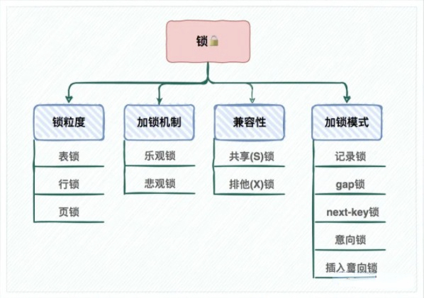
</p>

注意：MySQL 是一个支持插件式存储引擎的数据库系统。接下来我们的分析，都是基于 InnoDB 存储引擎，其他引擎的表现，会有较大的区别。

* 版本查看
```sql
select version();
```
* 存储引擎查看

MySQL 给开发者提供了查询存储引擎的功能,可以通过下面的命令查看：
```sql
SHOW ENGINES
```


## 加锁机制

### 乐观锁

乐观锁顾名思义，就是每次去拿数据的时候都认为别人不会修改，所以不会上锁，但是在更新的时候会判断一下在此期间别人有没有去更新这个数据。

乐观锁在数据库上的实现完全是逻辑的，不需要数据库提供特殊的支持。一般的做法是在需要锁的数据上增加一个版本号，或者时间戳。

通过**数据版本（Version）记录机制**实现，是乐观锁最常用的一种实现方式。什么是数据版本？即为数据增加一个版本标识，一般是通过为数据库表增加一个数字类型的 “version” 字段来实现。

当读取数据时，将 version 字段的值一同读出，数据每更新一次，对此 version 值加 1。当我们提交更新的时候，判断数据库表对应记录的当前版本信息与第一次取出来的 version 值进行比对，如果数据库表当前版本号与第一次取出来的 version 值相等，则予以更新，否则认为是过期数据。

```go 
1. SELECT data AS old_data, version AS old_version FROM …;
2. 根据获取的数据进行业务操作，得到new_data和new_version
3. UPDATE SET data = new_data, version = new_version WHERE version = old_version
if (updated row > 0) {
    // 乐观锁获取成功，操作完成
} else {
    // 乐观锁获取失败，回滚并重试
}
```

乐观锁适用于多读的应用类型，这样可以提高吞吐量，像数据库如果提供类似于 `write_condition` 机制的其实都是提供的乐观锁。

应用示例:

1. 数据库表设计

```sql
select id,value,version from TABLE where id=#{id}
```

2. 每次更新表中的value字段时，为了防止发生冲突，需要这样操作
```sql
update TABLE
set value=2,version=version+1
where id=#{id} and version=#{version};
```

### 悲观锁

与乐观锁相对应的就是悲观锁了。悲观锁就是在操作数据时，认为此操作会出现数据冲突，所以在进行每次操作时都要通过获取锁才能进行对相同数据的操作，这点跟 Java 中的 synchronized 很相似，所以悲观锁需要耗费较多的时间。

悲观锁是由数据库自己实现了的，要用的时候，我们直接调用数据库的相关语句就可以了。

共享锁和排它锁是悲观锁的不同实现，它俩都属于悲观锁的范畴。

要使用悲观锁，我们必须关闭 MySQL 数据库的自动提交属性，因为 MySQL 默认使用 autocommit 模式，也就是说，当你执行一个更新操作后，MySQL 会立刻将结果进行提交。

我们可以使用命令设置 MySQL 为非 autocommit 模式：
```sql
set autocommit=0;
# 设置完autocommit后，我们就可以执行我们的正常业务了。具体如下：

# 1. 开始事务 (三者选一就可以)
begin; / begin work; / start transaction;

# 2. 查询表信息
select status from TABLE where id=1 for update;

# 3. 插入一条数据
insert into TABLE (id,value) values (2,2);

# 4. 修改数据为
update TABLE set value=2 where id=1;

# 5. 提交事务
commit;/commit work;
```


## 锁粒度

### 表级锁

表级别的锁定是 MySQL 各存储引擎中最大颗粒度的锁定机制。该锁定机制最大的特点是实现逻辑非常简单，带来的系统负面影响最小。所以获取锁和释放锁的速度很快。

当然，锁定颗粒度大所带来最大的负面影响就是出现锁定资源争用的概率也会最高，致使并发度大打折扣。

使用表级锁定的主要是 MyISAM，MEMORY，CSV 等一些非事务性存储引擎。

### 行级锁

行级锁定最大的特点就是锁定对象的颗粒度很小，由于锁定颗粒度很小，所以发生锁定资源争用的概率也最小，能够给予应用程序尽可能大的并发处理能力而提高一些需要高并发应用系统的整体性能。

虽然能够在并发处理能力上面有较大的优势，但是行级锁定也因此带来了不少弊端。由于锁定资源的颗粒度很小，每次获取锁和释放锁需要做的事情也更多，所以速度慢，内存消耗大。此外，行级锁定也最容易发生死锁。

使用行级锁定的主要是 InnoDB 存储引擎。

- InnoDB 行锁是通过给索引上的索引项加锁来实现的。所以，只有通过索引条件检索数据，InnoDB 才使用行级锁，否则，InnoDB 将使用表锁；

- MySQL 的行锁是针对索引加的锁，不是针对记录加的锁，所以即使是访问不同行的记录，如果使用了相同的索引键，也是会出现锁冲突的。

- 即便在条件中使用了索引字段，但具体是否使用索引来检索数据是由 MySQL 通过判断不同执行计划的代价来决定的，如果 MySQL 认为全表扫描效率更高，比如对一些很小的表，它就不会使用索引，这种情况下 InnoDB 将使用表锁，而不是行锁。

**总结：**

- 表级锁：开销小，加锁快；不会出现死锁；锁定粒度大，发生锁冲突的概率高，并发度低；
- 行级锁：开销大，加锁慢；会出现死锁；锁定粒度小，发生锁冲突的概率低，并发度高。


## 兼容性

共享锁和排他锁与粒度无关，既可以是行锁，也可以是表锁。

### 共享（S）锁

共享锁又称读锁（read lock），是读取操作创建的锁。其他用户可以并发读取数据，但任何事务都不能对数据进行修改（获取数据上的排他锁），直到已释放所有共享锁。

如果事务 T 对数据 A 加上共享锁后，则其他事务只能对 A 再加共享锁，不能加排他锁。获得共享锁的事务只能读数据，不能修改数据。

```sql
#结果集的数据都会加共享锁
SELECT * from TABLE where id = "1"  lock in share mode;
```

在查询语句后面增加 `lock in share mode，MySQL` 会对查询结果中的每行都加共享锁，当没有其他线程对查询结果集中的任何一行使用排他锁时，可以成功申请共享锁，否则会被阻塞。其他线程也可以读取使用了共享锁的表，而且这些线程读取的是同一个版本的数据。

加上共享锁后，对于 `update,insert,delete` 语句会自动加排它锁。

### 排他（X）锁

排他锁（exclusive lock）也叫又称写锁（writer lock）。

若在一个事务上对数据对象 A 加上 X 锁，该事务可以读 A 也可以修改 A，其他事务不能再对 A 加任何锁，直到该事物释放 A 上的锁。这保证了其他事务在该事物释放 A 上的锁之前不能再读取和修改 A。排它锁会阻塞所有的排它锁和共享锁。

使用方式：在需要执行的语句后面加上 `for update` 就可以了。

```sql
select status from TABLE where id=1 for update;
```

由于对于表中 id 字段为主键，就也相当于索引。执行加锁时，会将 id 这个索引为 1 的记录加上锁，那么这个锁就是行锁。

**总结：**

<p align="center">
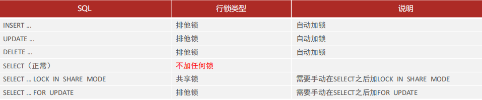
</p>
### 三级封锁协议

- 一级封锁协议：事务在修改数据之前必须先对其加 X 锁，直到事务结束才释放。

  可以解决丢失修改问题（两个事务不能同时对一个数据加 X 锁，避免了修改被覆盖）。

- 二级封锁协议：在一级的基础上，事务在读取数据之前必须先加 S 锁，读完后释放。

  可以解决脏读问题（如果已经有事务在修改数据，就意味着已经加了 X 锁，此时想要读取数据的事务并不能加 S 锁，也就无法进行读取，避免了读取脏数据）。

- 三级封锁协议：在二级的基础上，事务在读取数据之前必须先加 S 锁，直到事务结束才能释放。

  可以解决不可重复读问题（避免了在事务结束前其它事务对数据加 X 锁进行修改，保证了事务期间数据不会被其它事务更新）。

### 两段锁协议

> 定义：事务必须严格分为两个阶段对数据进行加锁和解锁的操作，第一阶段加锁，第二阶段解锁。

也就是说一个事务中一旦释放了锁，就不能再申请新锁了。

可串行化调度是指，通过并发控制，使得并发执行的事务结果与某个串行执行的事务结果相同。

事务遵循两段锁协议是保证可串行化调度的充分条件（注意不是充要条件，而是充分条件。即事务遵循两段锁协议一定能保证可串行化调度，但保证可串行化调度不一定需要遵循两段锁协议）。


##  记录锁、间隙锁和临键锁

### 记录锁

<p align="center">
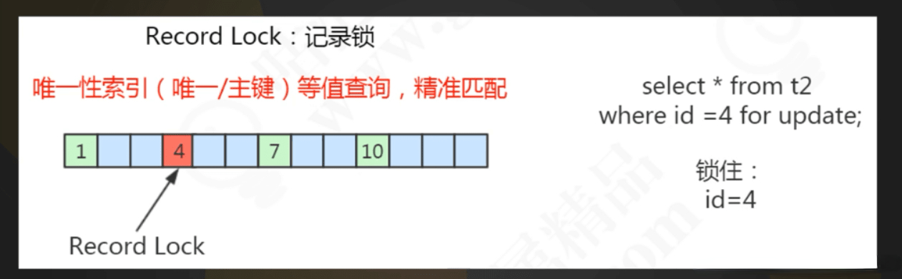
</p>

对表中的记录加锁，叫做`记录锁（Record Locks）`，简称行锁。比如：

```sql
SELECT * FROM `test` WHERE `id`=1 FOR UPDATE;
```

它会在 id=1 的记录上加上记录锁，以阻止其他事务插入，更新，删除 id=1 这一行。

需要注意的是：

- id 列必须为唯一索引列或主键列，否则上述语句加的锁就会变成临键锁；
- 同时查询语句必须为精准匹配（=），不能为 >、<、like 等，否则也会退化成临键锁。

在通过主键索引与唯一索引对数据行进行 UPDATE 操作时，也会对该行数据加记录锁：

```sql
-- id 列为主键列或唯一索引列 
UPDATE SET age = 50 WHERE id = 1;
```

记录锁是锁住索引记录，而不是真正的数据记录。如果要锁的列没有索引，进行全表记录加锁。记录锁也是排它（X）锁，所以会阻塞其他事务对其插入、更新、删除。

### 间隙锁

<p align="center">
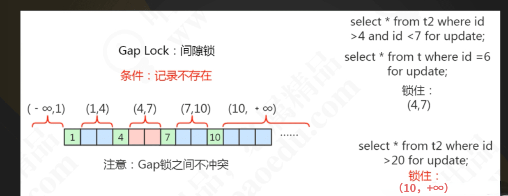
</p>

`间隙锁（Gap Locks）`是 Innodb 在 RR（可重复读）隔离级别下为了解决幻读问题时引入的锁机制。间隙锁是 innodb 中行锁的一种。

当我们查询数据用范围查询而不是相等条件查询时，查询条件命中索引，并且没有查询到符合条件的记录，此时就会将查询条件中的范围数据进行锁定（即使是范围库中不存在的数据也会被锁定）。

请务必牢记：使用间隙锁锁住的是一个区间，而不仅仅是这个区间中的每一条数据。

举例来说，假如 emp 表中只有 101 条记录，其 empid 的值分别是 1,2,...,100,101，下面的 SQL：

```sql
SELECT * FROM emp WHERE empid > 100 FOR UPDATE
```

当我们用条件检索数据，并请求共享或排他锁时，InnoDB 不仅会对符合条件的 empid 值为101的记录加锁，也会对 empid 大于 101（这些记录并不存在）的“间隙”加锁。

这个时候如果你插入 empid 等于 102 的数据的，如果那边事物还没有提交，那你就会处于等待状态，无法插入数据。

### 临键锁

<p align="center">

</p>

`临键锁（Next-Key Locks）`是记录锁和间隙锁的组合，它指的是加在某条记录以及这条记录前面间隙上的锁。也可以理解为一种特殊的间隙锁。通过临建锁可以解决幻读的问题。 

每个数据行上的非唯一索引列上都会存在一把临键锁，当某个事务持有该数据行的临键锁时，会锁住一段左开右闭区间的数据。需要强调的一点是，InnoDB 中行级锁是基于索引实现的，临键锁只与非唯一索引列有关，在唯一索引列（包括主键列）上不存在临键锁。

假设有如下表（InnoDB，RR 隔离级别：id 主键, age 普通索引）：

<p align="center">
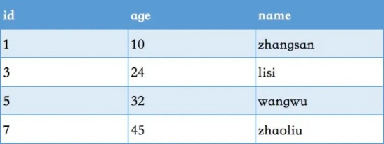
</p>

该表中 age 列潜在的临键锁有：

(-∞, 10],
(10, 24],
(24, 32],
(32, 45],
(45, +∞],

在事务 A 中执行如下命令：

```sql
-- 根据非唯一索引列 UPDATE 某条记录 
UPDATE table SET name = Vladimir WHERE age = 24; 
-- 或根据非唯一索引列 锁住某条记录 
SELECT * FROM table WHERE age = 24 FOR UPDATE; 
```

不管执行了上述 SQL 中的哪一句，之后如果在事务 B 中执行以下命令，则该命令会被阻塞：

```sql
INSERT INTO table VALUES(100, 26, 'tianqi'); 
```

很明显，事务 A 在对 age 为 24 的列进行 UPDATE 操作的同时，也获取了 (24, 32] 这个区间内的临键锁。

**总结：**

<p align="center">
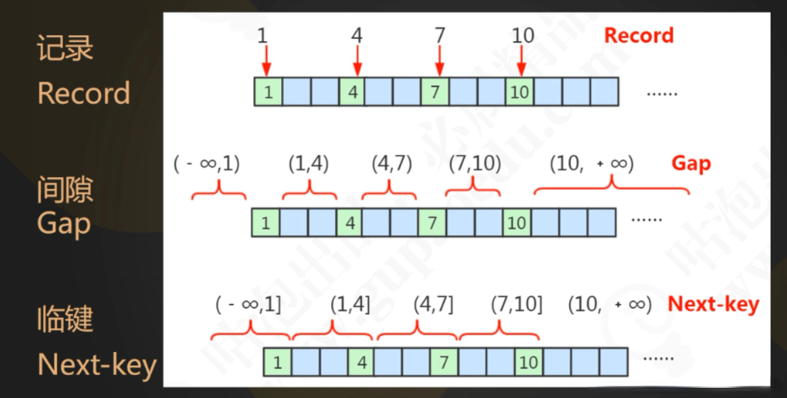
</p>

- InnoDB 中的行锁的实现依赖于索引，一旦某个加锁操作没有使用到索引，那么该锁就会退化为表锁；
- 记录锁存在于包括主键索引在内的唯一索引中，锁定单条索引记录；
- 间隙锁存在于非唯一索引中，锁定开区间范围内的一段间隔，它是基于临键锁实现的；
- 临键锁存在于非唯一索引中，该类型的每条记录的索引上都存在这种锁，它是一种特殊的间隙锁，锁定一段左开右闭的索引区间。


## 意向锁和插入意向锁

### 意向锁

意向锁又分为 `意向共享锁（IS）` 和 `意向排他锁（IX）`。

- 意向共享(IS)锁：事务有意向对表中的某些行加共享锁（S锁）。

```sql
-- 事务要获取某些行的 S 锁，必须先获得表的 IS 锁。 
SELECT column FROM table ... LOCK IN SHARE MODE;
```

- 意向排他(IX)锁：事务有意向对表中的某些行加排他锁（X锁）。

```sql
-- 事务要获取某些行的 X 锁，必须先获得表的 IX 锁。
SELECT column FROM table ... FOR UPDATE;
```

**注意：**

- 意向共享锁（IS）和 意向排他锁（IX）都是表锁；
- 意向锁是一种不与行级锁冲突的表级锁；
- 意向锁是 InnoDB 自动加的，不需用户干预；
- 意向锁是在 InnoDB 下存在的内部锁，对于 MyISAM 而言没有意向锁之说。

意向锁存在的目的就是为了让 InnoDB 中的行锁和表锁更高效的共存。

举个例子，下面有一张 users 表（InnoDB RR 隔离级别 id 是主键）：

<p align="center">
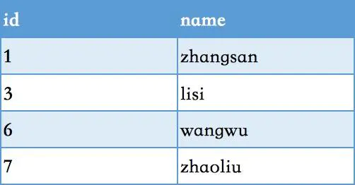
</p>

事务 A 获取了某一行的排他锁，并未提交：

```sql
SELECT * FROM users WHERE id = 6 FOR UPDATE; 
```
事务 B 想要获取 users 表的表锁：

```sql
LOCK TABLES users READ; 
```

因为共享锁与排他锁互斥，所以事务 B 在视图对 users 表加共享锁的时候，必须保证：

- 当前没有其他事务持有 users 表的排他锁；
- 当前没有其他事务持有 users 表中任意一行的排他锁 。

为了检测是否满足第二个条件，事务 B 必须在确保 users 表不存在任何排他锁的前提下，去检测表中的每一行是否存在排他锁。很明显这是一个效率很差的做法，但是有了意向锁之后，事务 B 只要看表上有没有意向排他锁，有则说明表中有些行被排他锁锁住了，因此事务 B 申请表的写锁会被阻塞。这样就高效多了。

我们再来看下 `共享锁（S）`、`排他锁（X）`、`意向共享锁（IS）`、`意向排他锁（IX）`的兼容性：

<p align="center">
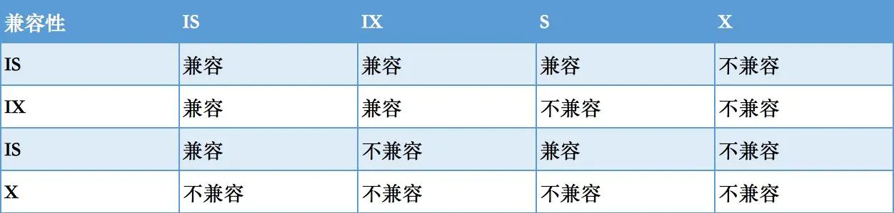
</p>

注意：这里的排他(X)/共享(S)锁指的都是表锁！意向锁不会与行级的共享/排他锁互斥！行级别的 X 和 S 按照上面的兼容性规则即可。

意向锁与意向锁之间永远是兼容的，因为当你不论加行级的 X 锁或 S 锁，都会自动获取表级的 IX 锁或者 IS 锁。也就是你有 10 个事务，对不同的 10 行加了行级 X 锁，那么这个时候就存在 10 个 IX 锁。

假如这时候有个事务想对整个表加排它（X）锁，那它不需要遍历每一行是否存在 S 或 X 锁，而是看有没有存在意向锁，只要存在一个意向锁，那这个事务就加不了表级排它（X）锁，要等上面 10 个 IX 全部释放才行。

### 插入意向锁

`插入意向锁` 是在插入一条记录行前，由 INSERT 操作产生的一种**间隙锁**。该锁用以表示插入意向，当多个事务在同一区间（gap）插入位置不同的多条数据时，事务之间不需要互相等待。

假设存在两条值分别为 4 和 7 的记录，两个不同的事务分别试图插入值为 5 和 6 的两条记录，每个事务在获取插入行上独占的（排他）锁前，都会获取（4，7）之间的间隙锁，但是因为数据行之间并不冲突，所以两个事务之间并不会产生冲突（阻塞等待）。

插入意向锁的特性可以分成两部分：

- 插入意向锁是一种特殊的间隙锁 —— 间隙锁可以锁定开区间内的部分记录；
- 插入意向锁之间互不排斥，所以即使多个事务在同一区间插入多条记录，只要记录本身（主键、唯一索引）不冲突，那么事务之间就不会出现冲突等待。

需要强调的是，虽然插入意向锁中含有意向锁三个字，但是它并不属于意向锁而属于间隙锁，因为意向锁是表锁而插入意向锁是行锁。

举个例子，下面有张表（id 主键，age 普通索引）：

<p align="center">

</p>

首先事务 A 插入了一行数据，并且没有 commit：

```sql
INSERT INTO users SELECT 4, 'Bill', 15; 
```

随后事务 B 试图插入一行数据：

```sql
INSERT INTO users SELECT 5, 'Louis', 16; 
```

这里事务 A 使用了记录锁和插入意向锁，并不会阻塞事务 B。

如果只是使用普通的间隙锁会怎么样呢？我们在看事务 A，其实它一共获取了 3 把锁：

- id 为 4 的记录行的记录锁
- age 区间在（10，15）的间隙锁
- age 区间在（15，20）的间隙锁

最终，事务 A 插入了该行数据，并锁住了（10，20）这个区间。随后事务 B 试图插入一行数据：

```sql
INSERT INTO users SELECT 5, 'Louis', 16; 
```

因为 16 位于（15，20）区间内，而该区间内又存在一把间隙锁，所以事务 B 别说想申请自己的间隙锁了，它甚至不能获取该行的记录锁，自然只能乖乖的等待 事务 A 结束，才能执行插入操作。很明显，这样做事务之间将会频繁陷入阻塞等待，插入的并发性非常之差。

**总结：**

- InnoDB 在 RR 的事务隔离级别下，使用插入意向锁来控制和解决并发插入；
- 插入意向锁是一种特殊的间隙锁；
- 插入意向锁在锁定区间相同但记录行本身不冲突的情况下互不排斥。


## 死锁

死锁（Deadlock）是指两个或两个以上的进程在执行过程中，因争夺资源而造成的一种互相等待的现象，若无外力作用，它们都将无法推进下去。此时称系统处于死锁状态或系统产生了死锁，这些永远在互相等待的进程称为死锁进程。

解除正在死锁的状态有两种方法：

第一种：

1. 查询是否锁表
```sql
show OPEN TABLES where In_use > 0;
```
2. 查询进程（如果您有 SUPER 权限，您可以看到所有线程。否则，您只能看到您自己的线程）
```sql
show processlist
```
3. 杀死进程 id（就是上面命令的 id 列）
```sql
kill id
```

第二种：

1. 查看当前的事务
```sql
SELECT * FROM INFORMATION_SCHEMA.INNODB_TRX;
```
2. 查看当前锁定的事务
```sql
SELECT * FROM INFORMATION_SCHEMA.INNODB_LOCKS;
```
3. 查看当前等锁的事务
```sql
SELECT * FROM INFORMATION_SCHEMA.INNODB_LOCK_WAITS;
```
杀死进程
```sql
kill PID
```
如果系统资源充足，进程的资源请求都能够得到满足，死锁出现的可能性就很低，否则就会因争夺有限的资源而陷入死锁。其次，进程运行推进顺序与速度不同，也可能产生死锁。 

产生死锁的四个必要条件：

* 互斥条件：一个资源每次只能被一个进程使用；
* 请求与保持条件：一个进程因请求资源而阻塞时，对已获得的资源保持不放；
* 不剥夺条件：进程已获得的资源，在末使用完之前，不能强行剥夺；
* 循环等待条件：若干进程之间形成一种头尾相接的循环等待资源关系。

虽然不能完全避免死锁，但可以使死锁的数量减至最少。将死锁减至最少可以增加事务的吞吐量并减少系统开销，因为只有很少的事务回滚，而回滚会取消事务执行的所有工作。

我们可以通过下面的方法优化最大限度地降低死锁:

* 按同一顺序访问对象
* 避免事务中的用户交互
* 保持事务简短并在一个批处理中
* 使用低隔离级别
* 使用绑定连接

**参考资料**

* [视频：MySQL 事务的隔离级别与锁](https://www.jikexueyuan.com/course/1524.html)


# MySQL 高可用方案

我们在考虑MySQL数据库的高可用的架构时，主要要考虑如下几方面：

- 如果数据库发生了宕机或者意外中断等故障，能尽快恢复数据库的可用性，尽可能的减少停机时间，保证业务不会因为数据库的故障而中断；

- 用作备份、只读副本等功能的非主节点的数据应该和主节点的数据实时或者最终保持一致；

- 当业务发生数据库切换时，切换前后的数据库内容应当一致，不会因为数据缺失或者数据不一致而影响业务。

关于对高可用的分级在这里我们不做详细的讨论，这里只讨论常用高可用方案的优缺点以及高可用方案的选型。


## 主从或主主半同步复制

使用双节点数据库，搭建单向或者双向的半同步复制。在 5.7 以后的版本中，由于 lossless replication、logical 多线程复制等一些列新特性的引入，使得 MySQL 原生半同步复制更加可靠。

常见架构如下：

<p align="center">

</p>

通常会和 proxy、keepalived 等第三方软件同时使用，即可以用来监控数据库的健康，又可以执行一系列管理命令。如果主库发生故障，切换到备库后仍然可以继续使用数据库。

主从复制实现：

<p align="center">

</p>

- 在主库把数据更改记录到 binlog 中；　　
- 从库将主库的日志复制到自己的 relaylog 中（I/O 线程）；
- 从库读取 relaylog 中的事件，将其重放到从库上（SQL 线程）。

```markdown
异步复制模式：主库在执行完客户端提交的事务后，只要将执行逻辑写入到 binlog 后，就立即返回给客户端，并不关心从库是否执行成功，这样就会有一个隐患，就是在主库执行的 binlog 还没同步到从库时，主库挂了，这个时候从库就就会被强行提升为主库，有可能造成数据丢失。

同步复制模式：当主库执行完客户端提交的事务后，需要等到所有从库也都执行完这一事务后，才返回给客户端执行成功。因为要等到所有从库都执行完，执行过程中会被阻塞，等待返回结果，所以性能上会有很严重的影响。

半同步复制模式：介于异步和同步之间的一种复制模式，主库在执行完客户端提交的事务后，要等待至少一个从库接收到 binlog 并将数据写入到 relaylog 中才返回给客户端成功结果。半同步复制模式，比异步模式提高了数据的可用性，但是也产生了一定的性能延迟，最少要一个 TCP/IP 连接的往返时间。
```

**优点：**

- 架构比较简单，使用原生半同步复制作为数据同步的依据；
- 双节点，没有主机宕机后的选主问题，直接切换即可；
- 双节点，需求资源少，部署简单；

**缺点：**

- 完全依赖于半同步复制，如果半同步复制退化为异步复制，数据一致性无法得到保证；
- 需要额外考虑 haproxy、keepalived 的高可用机制。


## 半同步复制优化

半同步复制机制是可靠的。如果半同步复制一直是生效的，那么便可以认为数据是一致的。但是由于网络波动等一些客观原因，导致半同步复制可能发生超时而切换为异步复制，那么这时便不能保证数据的一致性。所以尽可能地保证半同步复制，便可提高数据的一致性。

该方案同样使用双节点架构，但是在原有半同复制的基础上做了功能上的优化，使半同步复制的机制变得更加可靠。

可参考的优化方案如下：

1. 双通道复制

半同步复制由于发生超时后，复制断开，当再次建立起复制时，同时建立两条通道，其中一条半同步复制通道从当前位置开始复制，保证从机知道当前主机执行的进度。另外一条异步复制通道开始追补从机落后的数据。当异步复制通道追赶到半同步复制的起始位置时，恢复半同步复制。

<p align="center">
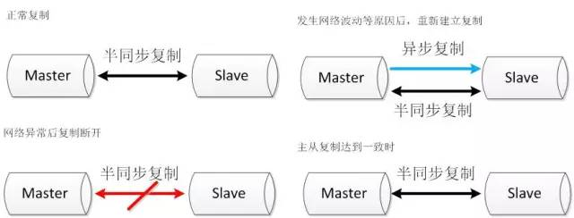
</p>


2. binlog 文件服务器

搭建两条半同步复制通道，其中连接文件服务器的半同步通道正常情况下不启用，当主从的半同步复制发生网络问题退化后，启动与文件服务器的半同步复制通道。当主从半同步复制恢复后，关闭与文件服务器的半同步复制通道。

<p align="center">
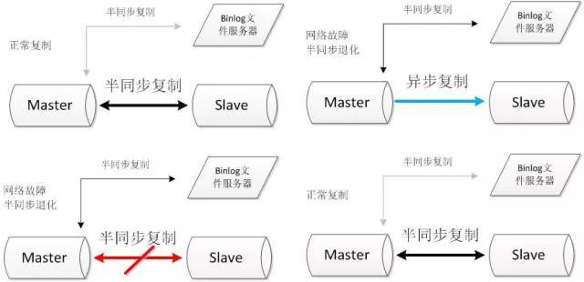
</p>

**优点：**

- 双节点，需求资源少，部署简单；
- 架构简单，没有选主的问题，直接切换即可;
- 相比于原生复制，优化后的半同步复制更能保证数据的一致性。

**缺点：**

- 需要修改内核源码或者使用 mysql 通信协议。需要对源码有一定的了解，并能做一定程度的二次开发。
- 依旧依赖于半同步复制，没有从根本上解决数据一致性问题。


## 高可用架构优化

将双节点数据库扩展到多节点数据库，或者多节点数据库集群。可以根据自己的需要选择一主两从、一主多从或者多主多从的集群。

由于半同步复制，存在接收到一个从机的成功应答即认为半同步复制成功的特性，所以多从半同步复制的可靠性要优于单从半同步复制的可靠性。并且多节点同时宕机的几率也要小于单节点宕机的几率，所以多节点架构在一定程度上可以认为高可用性是好于双节点架构的。

但是由于数据库数量较多，所以需要数据库管理软件来保证数据库的可维护性。可以选择 MMM、MHA 或者各个版本的 proxy 等等。

常见方案如下：

1. MHA + 多节点集群

MHA Manager 会定时探测集群中的 master 节点，当 master 出现故障时，它可以自动将最新数据的 slave 提升为新的 master，然后将所有其他的 slave 重新指向新的 master，整个故障转移过程对应用程序完全透明。

<p align="center">

</p>

MHA Node 运行在每台 MySQL 服务器上，主要作用是切换时处理二进制日志，确保切换尽量少丢数据。

MHA 也可以扩展到如下的多节点集群：

<p align="center">
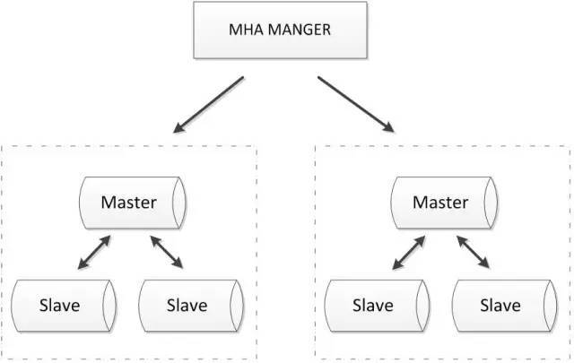
</p>

**优点：**

- 可以进行故障的自动检测和转移；
- 可扩展性较好，可以根据需要扩展 MySQL 的节点数量和结构；
- 相比于双节点的 MySQL 复制，三节点/多节点的 MySQL 发生不可用的概率更低；

**缺点：**

- 至少需要三节点，相对于双节点需要更多的资源；
- 逻辑较为复杂，发生故障后排查问题，定位问题更加困难；
- 数据一致性仍然靠原生半同步复制保证，仍然存在数据不一致的风险;
- 可能因为网络分区发生脑裂现象。

2. zookeeper + proxy

Zookeeper 使用分布式算法保证集群数据的一致性，使用 zookeeper 可以有效地保证 proxy 的高可用性，较好地避免网络分区现象的产生。

<p align="center">

</p>

**优点：**

- 较好的保证了整个系统的高可用性，包括 proxy、MySQL；
- 扩展性较好，可以扩展为大规模集群；

**缺点：**

- 数据一致性仍然依赖于原生的 mysql 半同步复制；
- 引入 zk，整个系统的逻辑变得更加复杂。


## 共享存储

共享存储实现了数据库服务器和存储设备的解耦，不同数据库之间的数据同步不再依赖于 MySQL 的原生复制功能，而是通过磁盘数据同步的手段，来保证数据的一致性。

1. SAN 共享储存

SAN 的概念是允许存储设备和处理器（服务器）之间建立直接的高速网络（与 LAN 相比）连接，通过这种连接实现数据的集中式存储。常用架构如下：

<p align="center">

</p>

使用共享存储时，MySQL 服务器能够正常挂载文件系统并操作，如果主库发生宕机，备库可以挂载相同的文件系统，保证主库和备库使用相同的数据。

**优点：**

- 两节点即可，部署简单，切换逻辑简单；
- 很好的保证数据的强一致性；
- 不会因为 MySQL 的逻辑错误发生数据不一致的情况；

**缺点：**

- 需要考虑共享存储的高可用；
- 价格昂贵。

2. DRBD 磁盘复制

DRBD 是一种基于软件、基于网络的块复制存储解决方案，主要用于对服务器之间的磁盘、分区、逻辑卷等进行数据镜像，当用户将数据写入本地磁盘时，还会将数据发送到网络中另一台主机的磁盘上，这样的本地主机（主节点）与远程主机（备节点）的数据就可以保证实时同步。常用架构如下：

<p align="center">
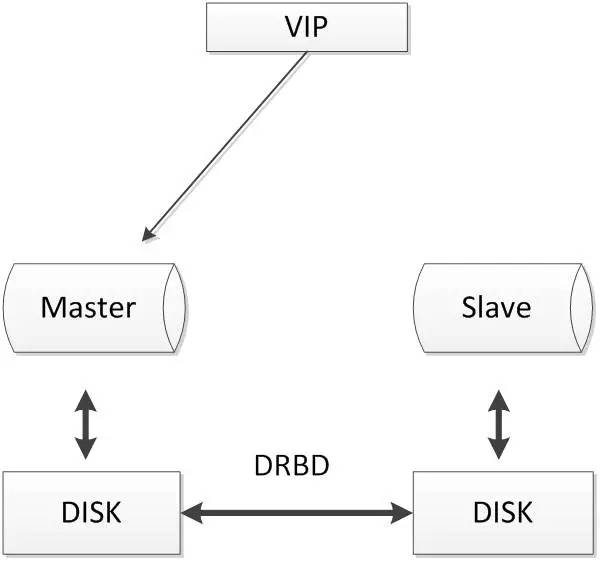
</p>

当本地主机出现问题，远程主机上还保留着一份相同的数据，可以继续使用，保证了数据的安全。

DRBD 是 linux 内核模块实现的快级别的同步复制技术，可以与 SAN 达到相同的共享存储效果。

**优点：**

- 两节点即可，部署简单，切换逻辑简单；
- 相比于 SAN 储存网络，价格低廉；
- 保证数据的强一致性；

缺点：

- 对 I/O 性能影响较大；
- 从库不提供读操作。


## 分布式协议

分布式协议可以很好解决数据一致性问题。比较常见的方案如下：

1. MySQL cluster

MySQL cluster 是官方集群的部署方案，通过使用 NDB 存储引擎实时备份冗余数据，实现数据库的高可用性和数据一致性。

<p align="center">

</p>

**优点：**

- 全部使用官方组件，不依赖于第三方软件；
- 可以实现数据的强一致性；

**缺点：**

- 国内使用的较少；
- 配置较复杂，需要使用 NDB 储存引擎，与 MySQL 常规引擎存在一定差异；
- 至少三节点。

2. Galera

基于 Galera 的 MySQL 高可用集群， 是多主数据同步的 MySQL 集群解决方案，使用简单，没有单点故障，可用性高。常见架构如下：

<p align="center">

</p>

**优点：**

- 多主写入，无延迟复制，能保证数据强一致性；
- 有成熟的社区，有互联网公司在大规模的使用；
- 自动故障转移，自动添加、剔除节点；

**缺点：**

- 需要为原生 MySQL 节点打 wsrep 补丁；
- 只支持 innodb 储存引擎；
- 至少三节点。

3. PAXOS

Paxos 算法解决的问题是一个分布式系统如何就某个值（决议）达成一致。这个算法被认为是同类算法中最有效的。Paxos 与 MySQL 相结合可以实现在分布式的 MySQL 数据的强一致性。常见架构如下：

<p align="center">

</p>

优点：

- 多主写入，无延迟复制，能保证数据强一致性；
- 有成熟理论基础；
- 自动故障转移，自动添加、剔除节点；

**缺点：**

- 只支持 innodb 储存引擎；
- 至少三节点。


# 其它问题

## MySQL 中 utf8 和 utf8mb4 区别

MySQL 在 5.5.3 之后增加了这个 `utf8mb4` 的编码，mb4 就是 `most bytes 4` 的意思，专门用来兼容四字节的 `unicode`。好在 `utf8mb4` 是 `utf8` 的超集，除了将编码改为 `utf8mb4` 外不需要做其他转换。当然，为了节省空间，一般情况下使用utf8也就可以了。

Mysql支持的 `utf8` 编码最大字符长度为 3 字节，如果遇到 4 字节的宽字符就会插入异常了。三个字节的 UTF-8 最大能编码的 `Unicode` 字符是 `0xffff`，也就是 `Unicode` 中的基本多文种平面（BMP）。

任何不在基本多文本平面的 Unicode 字符，都无法使用 Mysql 的 `utf8` 字符集存储。包括 Emoji 表情（Emoji 是一种特殊的 Unicode 编码，常见于 ios 和 android 手机上），和很多不常用的汉字，以及任何新增的 Unicode 字符等等。

Mysql 中保存 4 字节长度的 UTF-8 字符，需要使用 `utf8mb4` 字符集，但只有 5.5.3 版本以后的才支持（查看版本：`select version();`）。因此呢，为了获取更好的兼容性，应该总是使用 `utf8mb4` 而非 `utf8`. 

对于 CHAR 类型数据，`utf8mb4` 会多消耗一些空间，根据 Mysql 官方建议，使用 VARCHAR 替代 CHAR。


## MySQL 中 truncate 和 delete 的区别

<p align="center">

</p>

1. 条件删除
   

这个比较好理解，因为 delete 是可以带 where 的，所以支持条件删除；而 truncate 只能删除整个表。

```markdown
# delete - 条件删除
DELETE FROM student WHERE id = 1;
# delete - 删除整个表的数据
DELETE FROM student;
# truncate - 删除整个表的数据
TRUNCATE TABLE student;
```

2. 事务回滚

由于 delete 是数据操作语言（DML - Data Manipulation Language），操作时原数据会被放到 rollback segment 中，可以被回滚；而 truncate 是数据定义语言（DDL - Data Definition Language)，操作时不会进行存储，不能进行回滚。

3. 清理速度

在数据量比较小的情况下，delete 和 truncate 的清理速度差别不是很大。但是数据量很大的时候就能看出区别。由于第二项中说的，truncate 不需要支持回滚，所以使用的系统和事务日志资源少。delete 语句每次删除一行，并在事务日志中为所删除的每行记录一项，固然会慢，但是相对来说也较安全。

4. 高水位重置

随着不断地进行表记录的 DML 操作，会不断提高表的高水位线（HWM），delete 操作之后虽然表的数据删除了，但是并没有降低表的高水位，随着 DML 操作数据库容量也只会上升，不会下降。所以如果使用 delete，就算将表中的数据减少了很多，在查询（select 等）时还是很和 delete 操作前速度一样。

truncate 操作会重置高水位线，数据库容量也会被重置，之后再进行 DML 操作速度也会有提升。


## sql 的执行顺序

现在有下面一个表 t ,存储了每个商品类别的成交明细，我们需要通过下面这张表获取订单量大于 10 对应的类别，并从中取出订单量前 3 的商品类别，会有一些测试的订单（catid=c666 的为测试），我们需要过滤掉。

| catid | orderid |
| ----- | ------- |
| c1    | 1       |
| c1    | 2       |
| c1    | 3       |
| c2    | 4       |
| c2    | 5       |
| c3    | 6       |
| ...   | ...     |
| c100  | 10000   |

要做上面的需求，我们的 Sql 可以这么写：

```sql
select
 catid,
 count(orderid) as sales
from
 t
where
 catid <> "c666"
group by
 catid
having
 count(orderid) > 10
order by
 count(orderid) desc
limit 3
```

上面的 Sql 代码中涉及到 `select、from、where、group by、having、order by、limit` 这 7 个关键词，基本上包括了 Sql 中所有的查询关键词，上面的顺序是这 7 个关键词的语法顺序，也就是你在写代码的时候，应该按照这个顺序写，那这7个关键词的执行顺序是什么样的呢？

首先我是不是需要知道我要从哪个表去获取我想要的，也就是 from；现在我知道从哪个表获取了，可是并不是这个表里面所有的信息都是我需要的，我需要把一些不需要的去掉(比如测试订单)，或是把一些我需要的筛选出来，这就是 where；现在我把我需要的订单明细筛选出来，可是我想要每个品类的订单量，这个时候是不是需要做一个分组聚合，也就是 group by；分组聚合后的结果也并不是我们全部都要，我们只要大于 10 的品类，所以需要把大于 10 的筛选出来，非大于 10 的品类过滤掉，这就是 having；现在我们想要的大部分信息都已经出来了，我们就可以用 select 把他们查询出来了；因为我们最后需要取前三的品类，所以我们需要把查询出来的结果进行一个降序排列，即 order by；最后一步就是只把前三显示出来，做一个限制就行，也就是 limit。

总结如下：

> from - where - group by - having - select - order by - limit