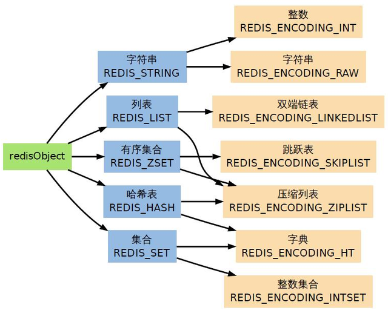
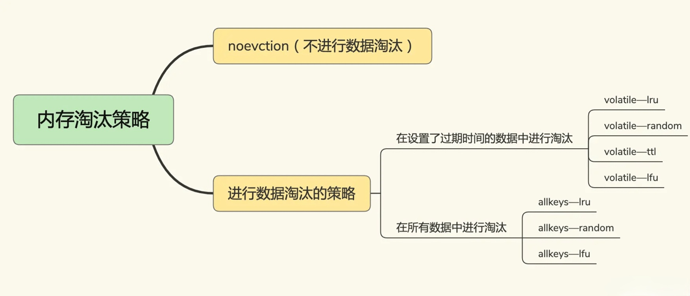
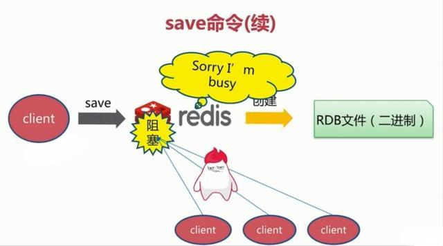
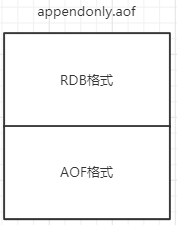
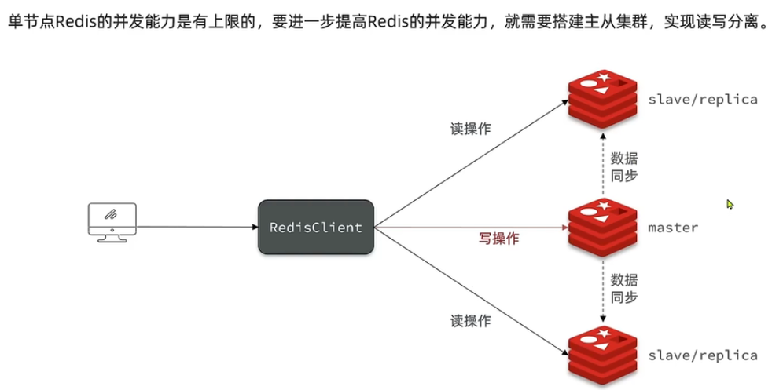
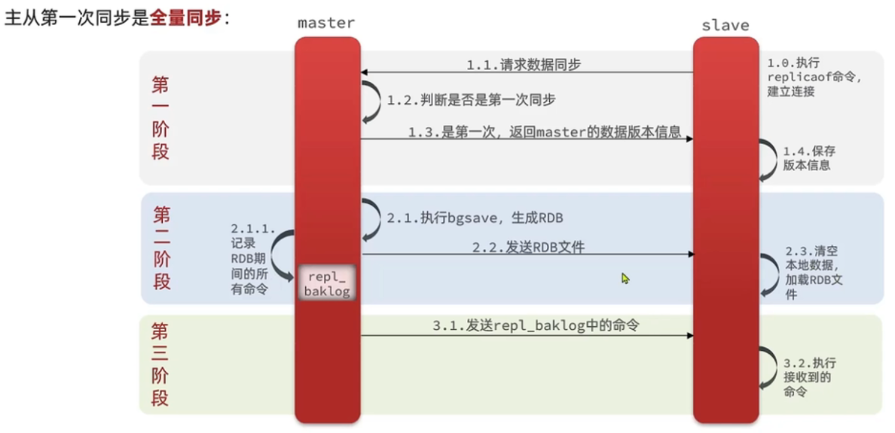
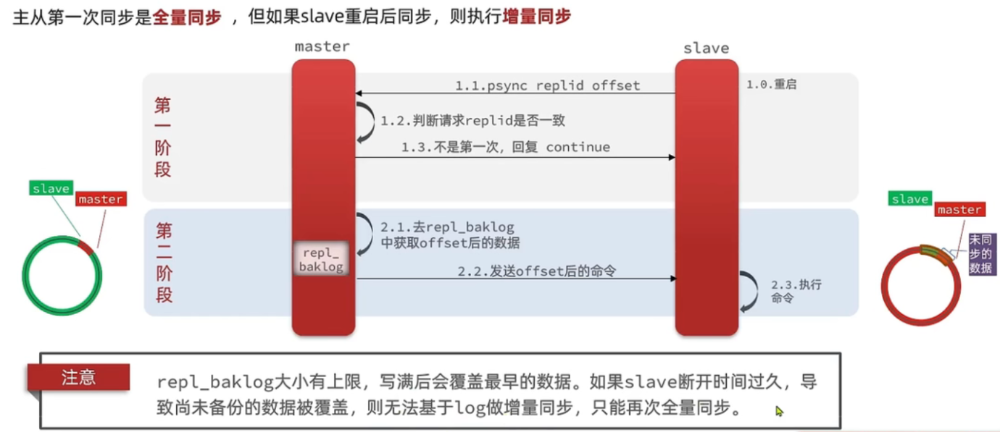
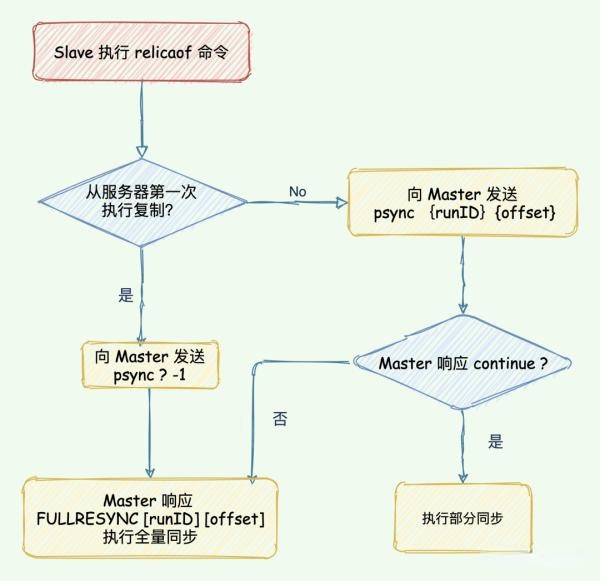

# 数据类型

## 主要数据类型

Redis 相对于 Memcache 等其他的缓存产品，有一个比较明显的优势就是 Redis 不仅仅支持简单的 key-value 类型的数据，同时还提供 list，set，zset，hash 等数据结构的存储。

Redis 主要有五大数据类型：

1. string

`string` 是 Redis 最基本的数据类型，它是二进制安全的，意思是 Redis 的 string 可以包含任何数据，比如图片或者序列化的对象，一个 redis 中字符串 value 最多可以是 512M。

典型使用场景：计数、限制次数等。

2. hash

`hash` 是一个键值对集合，是一个 string 类型的 key 和 value 的映射表，key 还是 key，但是 value 是一个键值对（key-value）。

典型使用场景：由于查询的时间复杂度是 O(1)，用于缓存一些信息。

3. list

`list` 列表，它是简单的字符串列表，按照插入顺序排序，你可以添加一个元素到列表的头部（左边）或者尾部（右边），它的底层实际上是个链表。列表有两个特点：有序 & 可以重复（与集合、有序集合相对比）。

典型使用场景：栈、队列、有限集合、消息队列等。

4. set

Redis 的 `set` 是 string 类型的无序集合。相对于列表，集合也有两个特点：无序 & 不可重复。

典型使用场景：利用集合的交并集特性，比如在社交领域，我们可以很方便的求出多个用户的共同好友，共同感兴趣的领域等。

5. zset

`zset`（sorted set 有序集合），和上面的 set 一样，也是 string 类型元素的集合，但是它是有序的。

典型使用场景：和 set 一样，zset 也可以用于社交领域的相关业务，并且还可以利用 zset 的有序特性，做类似排行榜的业务。


# 底层数据结构

<p align="center">

</p>

大多数情况下，Redis 使用`简单字符串` SDS 作为字符串的表示，相对于 C 语言字符串，SDS 具有常数复杂度获取字符串长度，杜绝了缓存区的溢出，减少了修改字符串长度时所需的内存重分配次数，以及二进制安全能存储各种类型的文件，并且还兼容部分 C 函数。

通过为 `链表` 设置不同类型的特定函数，Redis 链表可以保存各种不同类型的值，除了用作列表键，还在发布与订阅、慢查询、监视器等方面发挥作用。

Redis 的 `字典` 底层使用哈希表实现，每个字典通常有两个哈希表，一个平时使用，另一个用于 rehash 时使用，使用链地址法解决哈希冲突。

`跳跃表` 通常是有序集合的底层实现之一，表中的节点按照分值大小进行排序。

`整数集合` 是集合键的底层实现之一，底层由数组构成，升级特性能尽可能的节省内存。

`压缩列表` 是 Redis 为节省内存而开发的顺序型数据结构，通常作为列表键和哈希键的底层实现之一。


## 简单动态字符串（SDS）

Redis 是用 C 语言写的，但是 Redis 的字符串，却不是 C 语言中的字符串（即以空字符’\0’结尾的字符数组），它自己构建了一种名为 `简单动态字符串`（simple dynamic string，SDS）的抽象类型，并将 SDS 作为 Redis 的默认字符串表示。

一般来说，SDS 除了保存数据库中的字符串值以外，SDS 还可以作为缓冲区（buffer）：包括 AOF 模块中的 AOF 缓冲区以及客户端状态中的输入缓冲区。

### 数据结构

```c
struct sdshdr{
    //记录 buf 数组中已使用字节的数量
    //等于 SDS 保存字符串的长度
    int len;
    //记录 buf 数组中未使用字节的数量
    int free;
    //字节数组，用于保存字符串
    char buf[];
}
```

用 SDS 保存字符串 “Redis” 具体图示如下：

<p align="center">

</p>

### 特性

1. 常数复杂度获取字符串长度

由于 len 属性的存在，我们获取 SDS 字符串的长度只需要读取 len 属性，时间复杂度为 O(1)。而对于 C 语言，获取字符串的长度通常是经过遍历计数来实现的，时间复杂度为 O(n)。通过 strlen key 命令可以获取 key 的字符串长度。

2. 杜绝缓冲区溢出

我们知道在 C 语言中使用 strcat 函数来进行两个字符串的拼接，一旦没有分配足够长度的内存空间，就会造成缓冲区溢出。而对于 SDS 数据类型，在进行字符修改的时候，会首先根据记录的 len 属性检查内存空间是否满足需求，如果不满足，会进行相应的空间扩展，然后在进行修改操作，所以不会出现缓冲区溢出。

3. 减少修改字符串的内存重新分配次数

C 语言由于不记录字符串的长度，所以如果要修改字符串，必须要重新分配内存（先释放再申请），因为如果没有重新分配，字符串长度增大时会造成内存缓冲区溢出，字符串长度减小时会造成内存泄露。

而对于 SDS，由于 len 属性和 free 属性的存在，对于修改字符串 SDS 实现了空间预分配和惰性空间释放两种策略：

- `空间预分配`：对字符串进行空间扩展的时候，扩展的内存比实际需要的多，这样可以减少连续执行字符串增长操作所需的内存重分配次数。

- `惰性空间释放`：对字符串进行缩短操作时，程序不立即使用内存重新分配来回收缩短后多余的字节，而是使用 free 属性将这些字节的数量记录下来，等待后续使用。（当然 SDS 也提供了相应的 API，当我们有需要时，也可以手动释放这些未使用的空间。）

4. 二进制安全

因为 C 字符串以空字符作为字符串结束的标识，而对于一些二进制文件（如图片等），内容可能包括空字符串，因此 C 字符串无法正确存取；而所有 SDS 的API 都是以处理二进制的方式来处理 buf 里面的元素，并且 SDS 不是以空字符串来判断是否结束，而是以 len 属性表示的长度来判断字符串是否结束。

5. 兼容部分 C 字符串函数

虽然 SDS 是二进制安全的，但是一样遵从每个字符串都是以空字符串结尾的惯例，这样可以重用 C 语言库 <string.h> 中的一部分函数。

**总结：**

<p align="center">

</p>


## 链表

链表是一种常用的数据结构，C 语言内部是没有内置这种数据结构的实现，所以 Redis 自己构建了链表的实现。

### 数据结构

```c
typedef  struct listNode{
  //前置节点
  struct listNode *prev;
  //后置节点
  struct listNode *next;
  //节点的值
  void *value;  
}listNode
```

通过多个 listNode 结构就可以组成链表，这是一个双向链表，Redis 还提供了操作链表的数据结构：

```c
typedef struct list{
  //表头节点
  listNode *head;
  //表尾节点
  listNode *tail;
  //链表所包含的节点数量
  unsigned long len;
  //节点值复制函数
  void (*free) (void *ptr);
  //节点值释放函数
  void (*free) (void *ptr);
  //节点值对比函数
  int (*match) (void *ptr,void *key);
}list;
```

### 特性

- 双端：链表具有前置节点和后置节点的引用，获取这两个节点时间复杂度都为O(1)；

- 无环：表头节点的 prev 指针和表尾节点的 next 指针都指向 NULL,对链表的访问都是以 NULL 结束；　

- 计数：带链表长度计数器，通过 len 属性获取链表长度的时间复杂度为 O(1)；

- 多态：链表节点使用 void* 指针来保存节点值，可以保存各种不同类型的值。


## 字典

字典又称为符号表或者关联数组、或映射（map），是一种用于保存键值对的抽象数据结构。字典中的每一个键 key 都是唯一的，通过 key 可以对值来进行查找或修改。C 语言中没有内置这种数据结构的实现，所以字典依然是 Redis 自己构建的。

### 数据结构

Redis 的字典使用哈希表作为底层实现：

```c
typedef struct dictht{
  //哈希表数组
  dictEntry **table;
  //哈希表大小
  unsigned long size;
  //哈希表大小掩码，用于计算索引值
  //总是等于 size-1
  unsigned long sizemask;
  //该哈希表已有节点的数量
  unsigned long used;
}dictht
```

哈希表是由数组 table 组成，table 中每个元素都是指向 dict.h/dictEntry 结构，dictEntry 结构定义如下：

```c
typedef struct dictEntry{
  //键
  void *key;
  //值
  union{
    void *val;
    uint64_tu64;
    int64_ts64;
  }v;

  //指向下一个哈希表节点，形成链表
  struct dictEntry *next;
}dictEntry
```

key 用来保存键，val 属性用来保存值，值可以是一个指针，也可以是 uint64_t 整数，也可以是 int64_t 整数。

<p align="center">

</p>

### 特性

1. 哈希算法

Redis 计算哈希值和索引值方法如下：

```c
#1、使用字典设置的哈希函数，计算键 key 的哈希值
hash = dict->type->hashFunction(key);
#2、使用哈希表的sizemask属性和第一步得到的哈希值，计算索引值
index = hash & dict->ht[x].sizemask;
```

2. 解决哈希冲突

采用**链地址法**来解决哈希冲突，通过 next 这个指针可以将多个哈希值相同的键值对连接在一起。

3. 扩容和收缩

当哈希表保存的键值对太多或者太少时，就要通过 rehash（重新散列）来对哈希表进行相应的扩展或者收缩。具体步骤：

- 如果执行扩展操作，会基于原哈希表创建一个大小等于 ht[0].used*2n 的哈希表（也就是每次扩展都是根据原哈希表已使用的空间扩大一倍创建另一个哈希表）。相反如果执行的是收缩操作，每次收缩是根据已使用空间缩小一倍创建一个新的哈希表；

- 重新利用上面的哈希算法，计算索引值，然后将键值对放到新的哈希表位置上；

- 所有键值对都迁徙完毕后，释放原哈希表的内存空间。

触发扩容的条件：

- 服务器目前没有执行 BGSAVE 命令或者 BGREWRITEAOF 命令，并且负载因子大于等于 1；

- 服务器目前正在执行 BGSAVE 命令或者 BGREWRITEAOF 命令，并且负载因子大于等于 5。

```markdown
负载因子 = 哈希表已保存节点数量 / 哈希表大小
```

4. 渐近式 rehash

什么叫渐进式 rehash？也就是说扩容和收缩操作不是一次性、集中式完成的，而是分多次、渐进式完成的。如果保存在 Redis 中的键值对只有几个几十个，那么 rehash 操作可以瞬间完成，但是如果键值对有几百万，几千万甚至几亿，那么要一次性的进行 rehash，势必会造成 Redis 一段时间内不能进行别的操作。

所以 Redis 采用渐进式 rehash，这样在进行渐进式 rehash 期间，字典的删除查找更新等操作可能会在两个哈希表上进行，第一个哈希表没有找到，就会去第二个哈希表上进行查找。但是进行增加操作，一定是在新的哈希表上进行的。


## 跳跃表

跳跃表（skiplist）是一种有序数据结构，它通过在每个节点中维持多个指向其它节点的指针，从而达到快速访问节点的目的。

<p align="center">

</p>

### 数据结构

Redis 中跳跃表节点定义如下：

```c
typedef struct zskiplistNode {
  //层
  struct zskiplistLevel{
    //前进指针
    struct zskiplistNode *forward;
    //跨度
    unsigned int span;
  }level[];

  //后退指针
  struct zskiplistNode *backward;
  //分值
  double score;
  //成员对象
  robj *obj;
} zskiplistNode
```

多个跳跃表节点构成一个跳跃表：

```c
typedef struct zskiplist{
  //表头节点和表尾节点
  structz skiplistNode *header, *tail;
  //表中节点的数量
  unsigned long length;
  //表中层数最大的节点的层数
  int level;
}zskiplist;
```

<p align="center">

</p>

搜索：从最高层的链表节点开始，如果比当前节点要大和比当前层的下一个节点要小，那么则往下找，也就是和当前层的下一层的节点的下一个节点进行比较，以此类推，一直找到最底层的最后一个节点，如果找到则返回，反之则返回空。

插入：首先确定插入的层数，有一种方法是假设抛一枚硬币，如果是正面就累加，直到遇见反面为止，最后记录正面的次数作为插入的层数。当确定插入的层数 k 后，则需要将新元素插入到从底层到 k 层。

删除：在各个层中找到包含指定值的节点，然后将节点从链表中删除即可，如果删除以后只剩下头尾两个节点，则删除这一层。


### 特性

- 由很多层结构组成；

- 每一层都是一个有序的链表，排列顺序为由高层到底层，都至少包含两个链表节点，分别是前面的 head 节点和后面的 nil 节点；

- 最底层的链表包含了所有的元素；

- 如果一个元素出现在某一层的链表中，那么在该层之下的链表也全都会出现（上一层的元素是当前层的元素的子集）；

- 链表中的每个节点都包含两个指针，一个指向同一层的下一个链表节点，另一个指向下一层的同一个链表节点。


## 整数集合

整数集合（intset）是 Redis 用于保存整数值的集合抽象数据类型，它可以保存类型为 int16_t、int32_t 或者 int64_t 的整数值，并且保证集合中不会出现重复元素。

### 数据结构

```c
typedef struct intset{
  //编码方式
  uint32_t encoding;
  //集合包含的元素数量
  uint32_t length;
  //保存元素的数组
  int8_t contents[];
}intset;
```

整数集合的每个元素都是 contents 数组的一个数据项，它们按照从小到大的顺序排列，并且不包含任何重复项。length 属性记录了 contents 数组的大小。

需要注意的是虽然 contents 数组声明为 int8_t 类型，但是实际上 contents 数组并不保存任何 int8_t 类型的值，其真正类型由 encoding 来决定。

### 特性

1. 升级

当我们新增的元素类型比原集合元素类型的长度要大时，需要对整数集合进行升级，才能将新元素放入整数集合中。具体步骤：

- 根据新元素类型，扩展整数集合底层数组的大小，并为新元素分配空间；

- 将底层数组现有的所有元素都转成与新元素相同类型的元素，并将转换后的元素放到正确的位置，放置过程中，维持整个元素顺序都是有序的；

- 将新元素添加到整数集合中（保证有序）。

升级能极大地节省内存。

2. 降级

整数集合不支持降级操作，一旦对数组进行了升级，编码就会一直保持升级后的状态。


## 压缩列表

压缩列表（ziplist）是 Redis 为了节省内存而开发的，是由一系列特殊编码的连续内存块组成的顺序型数据结构，一个压缩列表可以包含任意多个节点（entry），每个节点可以保存一个字节数组或者一个整数值。

压缩列表并不是对数据利用某种算法进行压缩，而是将数据按照一定规则编码在一块连续的内存区域，目的是节省内存。

### 数据结构

<p align="center">

</p>


压缩列表的每个节点构成如下：

<p align="center">

</p>

`previous_entry_ength`：记录压缩列表前一个字节的长度。previous_entry_ength 的长度可能是 1 个字节或者是 5 个字节，如果上一个节点的长度小于 254，则该节点只需要一个字节就可以表示前一个节点的长度了，如果前一个节点的长度大于等于 254，则 previous length 的第一个字节为 254，后面用四个字节表示当前节点前一个节点的长度。利用此原理即当前节点位置减去上一个节点的长度即得到上一个节点的起始位置，压缩列表可以从尾部向头部遍历。这么做很有效地减少了内存的浪费。

`encoding`：节点的 encoding 保存的是节点的 content 的内容类型以及长度，encoding 类型一共有两种，一种字节数组，一种是整数，encoding 区域长度为 1 字节、2 字节或者 5 字节。

`content`：content 区域用于保存节点的内容，节点内容类型和长度由 encoding 决定。


# 数据存储

Redis 中的命令是数据类型敏感型的，也就是说你不能在 list 上执行 set 命令，否则你将得到一个执行错误的提示。可以通过 redis-cli 或其他你使用的编程语言中的接口给 Redis server 发送命令。

想像一下，一个简单的 SQL 数据库表，像一些应用中会用到的保存用户数据的表：

| id   | username | password | name  | surname |
| ---- | -------- | -------- | ----- | ------- |
| 1    | user1    | pass1    | Bob   | Smith   |
| 2    | user2    | pass2    | Mario | Rossi   |

假如我们想把上面的数据存储到 Redis 中，你会如何在 Redis 中设计数据库方案呢？也许以应用的视觉来看会更直观一些。使用 SQL，我们在 SELECT 中通过指定用户 id来获得一个用户信息，换句话说就是需要有用于区分不同数据实体的方式，所以我们可以通过一个唯一的标识来标识和获取用户信息。所以如果在 redis 的 key 中加入用户的 id 信息，那么我们的查询需求就解决了，在 redis 中，数据被存储成如下形式：

**Key　　　　　　　　Value**
user:1:username　　user1
user:1:password　　 pass1
user:1:name　　　　Bob
user:1:surname　　  Smith
user:2:username　　user2
user:2:password　　 pass2
user:2:name 　　　   Mario
user:2:surname 　　 Rossi

在 Redis 中如何保证 id 值的唯一性呢。在 SQL 中，可以通过"id int primary key auto_increment"定义自增主键来实现，现在我们也需要一种类似的方式为每个用户生成一个不同的 id。根据前面可用的数据类型中提到的数字数据，Redis 中的方案是这样的：创建一个 key"user:next_id"，并把它作为计数器，每当要添加新用户时，就对 key"user:next_id"执行 INCR 命令。

下一个面临的问题是查询用户列表。也许你认为我们上面的数据存储已经足以查询出用户列表：可以先获得"user:next_id"的当前值 counter，然后通过一步或多步遍历 0 到 counter 获得用户数据。但如果某个用户从系统中删除(下面会讲到删除操作)，而我们会遍历 0 到 counter 中的所有 id，这时就会有些 id 查询不到任何数据。

尽管这通常不是问题，但我们不想在不存在的用户数据上浪费时间，所以需要创建另外一个 key"user:list"，其 value 为 list 或 set 类型，用于存储每一个新增的用户 id，并在必要的时候从"user:list"中删除该 id。我更倾向于使用 list，因为它可能通过 LRANGE 命令实现分页功能。

还有一个要面临的问题是"数据完整性"，看看我们在删除用户时会发生什么吧。我们需要删除每一个对此用户的引用，也就是说，需要删除下面所有的key"user:id:*","user:username:id"，以及"user:list"中的用户 id。


## 过期时间


## 缓存淘汰

Redis内存不足的缓存淘汰策略提供了 8 种。

- noeviction：当内存使用超过配置的时候会返回错误，不会驱逐任何键；

- volatile-lru：加入键的时候，如果过限，首先从设置了过期时间的键集合中驱逐最久没有使用的键；

- volatile-random：加入键的时候如果过限，从过期键的集合中随机驱逐；

- volatile-ttl：从配置了过期时间的键中驱逐马上就要过期的键；

- volatile-lfu：从所有配置了过期时间的键中驱逐使用频率最少的键；
- allkeys-lru：加入键的时候，如果过限，首先通过 LRU 算法驱逐最久没有使用的键；
- allkeys-random：加入键的时候如果过限，从所有 key 随机删除；
- allkeys-lfu：从所有键中驱逐使用频率最少的键。



这八种大体上可以分为 4 中，lru、lfu、random、ttl。

- lru：Least Recently Used)，最近最少使用；

- lfu：Least Frequently Used，最不经常使用法；

- ttl：Time To Live，生存时间；

- random：随机。

默认是 noeviction：对于写请求不再提供服务，直接返回错误（DEL 请求和部分特殊请求除外）。


# 持久化

Redis 是一个内存数据库，数据保存在内存中，但是我们都知道内存的数据是易失的，因此 Redis 提供了持久化的机制，分别是 RDB (Redis DataBase) 和 AOF (Append Only File)。

Redis 数据保存到磁盘上的主要流程：

（1）客户端向服务端发送写操作（数据在客户端的内存中）。

（2）数据库服务端接收到写请求的数据（数据在服务端的内存中）。

（3）服务端通过 write 这个系统调用，将数据往磁盘上写（数据在系统内存的缓冲区中）。

（4）操作系统将缓冲区中的数据转移到磁盘控制器上（数据在磁盘缓存中）。

（5）磁盘控制器将数据写到磁盘的物理介质中（数据真正落到磁盘上）。


## RDB 机制

RDB 持久化是指在指定的时间间隔内将内存中的数据集快照写入磁盘，是 Redis **默认**的持久化方式，这种方式是就是将内存中数据以快照的方式写入到二进制文件中，默认的文件名为 dump.rdb。

在我们安装了 redis 之后，所有的配置都是在 redis.conf 文件中，里面保存了 RDB 和 AOF 两种持久化机制的各种配置。

### 触发机制

既然 RDB 机制是通过把某个时刻的所有数据生成一个快照来保存，那么就应该有一种触发机制，是实现这个过程。对于RDB来说，提供了三种机制：save、bgsave、自动化。

1. save 触发方式

该命令会阻塞当前 Redis 服务器，执行 save 命令期间，Redis 不能处理其他命令，直到 RDB 过程完成为止。具体流程如下：

<p align="center">

</p>

执行完成时候如果存在老的 RDB 文件，就用新的替代掉旧的。我们的客户端可能是几万或者几十万，这种方式显然不可取。

2. bgsave 触发方式

执行该命令时，Redis 借助了 linux 系统的写时复制（Copy-On-Write）技术，在生成快照的同时，仍然可以接收命令处理数据。具体流程如下：

<p align="center">

</p>

简单来说，bgsave 进程是由主进程 fork 生成的子进程，可以共享主进程所有的内存数据。

bgsave 进程运行后，开始读取主进程的内存数据，也就是 redis 的内存数据，将内存数据写入到 dump.rdb 文件中。此时，如果主进程处理的命令是读操作，则 bgsave 进程不受影响。如果主进程处理了写操作，则会对该命令操作的数据复制一份，生成副本，bgsave 进程会把这个副本写入到 dump.rdb 文件中，而在这个过程中，主进程仍可执行命令。

阻塞只发生在 fork 阶段，一般时间很短。基本上 Redis 内部所有的 RDB 操作都是采用 bgsave 命令。

<p align="center">

</p>

3. 自动触发

自动触发是由我们的配置文件来完成的。在 `redis.conf` 配置文件中，里面有如下配置，我们可以去设置：

（1） `save`：这里是用来配置触发 Redis 的 RDB 持久化条件，也就是什么时候将内存中的数据保存到硬盘。比如 “save m n”。表示 m 秒内数据集存在 n 次修改时，自动触发 bgsave。如果不需要持久化，那么你可以注释掉所有的 save 行来停用保存功能。

（2） `stop-writes-on-bgsave-error` ：默认值为 yes。当启用了 RDB 且最后一次后台保存数据失败，Redis 是否停止接收数据。这会让用户意识到数据没有正确持久化到磁盘上，否则没有人会注意到灾难（disaster）发生了。如果 Redis 重启了，那么又可以重新开始接收数据了。

（3） `rdbcompression` ；默认值是 yes。对于存储到磁盘中的快照，可以设置是否进行压缩存储。

（4） `rdbchecksum` ：默认值是 yes。在存储快照后，我们还可以让 redis 使用 CRC64 算法来进行数据校验，但是这样做会增加大约 10% 的性能消耗，如果希望获取到最大的性能提升，可以关闭此功能。

（5） `dbfilename` ：设置快照的文件名，默认是 dump.rdb

（6） `dir`：设置快照文件的存放路径，这个配置项一定是个目录，而不能是文件名。


### 优缺点

优点：

- RDB 文件紧凑，全量备份，非常适合用于进行备份和灾难恢复；

- 生成 RDB 文件的时候，redis 主进程会 `fork()` 一个子进程来处理所有保存工作，主进程不需要进行任何磁盘 IO 操作；

- dump.rdb 是二进制文件，所以当 redis 服务崩溃恢复的时候，能很快地将文件数据恢复到内存之中。

缺点：

- RDB 每次持久化需要将所有内存数据写入文件，然后替换原有文件，当内存数据量很大的时候，频繁地生成快照会**很耗性能**；

- RDB 快照是一次全量备份，存储的是内存数据的二进制序列化形式，存储上非常紧凑。当进行快照持久化时，会开启一个子进程专门负责快照持久化，子进程会拥有父进程地址空间内容的复制，父进程修改内存不会影响到子进程，所以在快照持久化期间修改的数据不会被保存，**可能丢失数据**。


## AOF 机制

全量备份总是耗时的，有时候就需要一种更加高效的方式 —— AOF，其工作机制很简单，redis 会将每一个收到的写命令都通过 `write` 函数追加到文件中。通俗的理解就是日志记录。

### 原理

#### 持久化原理

<p align="center">

</p>

redis 每执行一次修改数据命令，都会将该命令追加到 `appendonly.aof` 文件中（先写入 os cache，然后通过 `fsync` 刷盘）。

#### 文件重写原理

AOF 的方式也同时带来了另一个问题：`appendonly.aof` 文件中存储的是执行命令，所以会产生很多没用的命令，导致持久化文件变得越来越大。

为了压缩 AOF 的持久化文件，redis 提供了 `bgrewriteaof` 命令。将内存中的数据以命令的方式保存到临时文件中，同时会 fork 出一条新进程来将文件重写。

<p align="center">

</p>

重写 AOF 文件的操作，并没有读取旧的 AOF 文件，而是将整个内存中的数据库内容用命令的方式重写了一个新的 AOF 文件，这点和快照有点类似。

> 执行 BGSAVE 命令或者 BGREWRITEAOF 命令的过程中，Redis 需要创建当前服务器进程的子进程，而大多数操作系统都采用写时复制（copy-on-write）来优化子进程的使用效率，所以在子进程存在期间，服务器会提高哈希表负载因子的阈值，从而避免在子进程存在期间进行哈希表扩展操作，避免不必要的内存写入操作，最大限度地节约内存。

#### 触发机制

1. appendfsync `always`

同步持久化，每次发生数据变更会被立即记录到磁盘，性能较差但数据完整性比较好。

2. appendfsync `everysec`

异步操作，每秒刷盘一次，如果一秒内宕机，可能会有数据丢失。兼顾性能和安全。

3. appendfsync `no`

将刷盘操作交给系统，很快，但不安全。

<p align="center">

</p>

推荐使用 everysec，该策略下，最多会丢 1 秒的数据。

### 优缺点

优点：

- AOF 可以更好地保护数据不丢失，一般 AOF 会每隔 1 秒，通过一个后台线程执行一次 `fsync` 操作，最多丢失 1 秒钟的数据；

- AOF 日志文件没有任何磁盘寻址的开销，写入性能非常高，文件不容易破损；

- AOF 日志文件即使过大的时候，出现后台重写操作，也不会影响客户端的读写；

- AOF 日志文件的命令通过非常可读的方式进行记录，这个特性非常适合做灾难性的**误删除的紧急恢复**。比如某人不小心用 flushall 命令清空了所有数据，只要这个时候后台 rewrite 还没有发生，那么就可以立即拷贝 AOF 文件，将最后一条 flushall 命令给删了，然后再将该 AOF 文件放回去，就可以通过恢复机制，自动恢复所有数据。

缺点：

- 对于同一份数据来说，AOF 日志文件通常比 RDB 数据快照**文件更大**；

- AOF 开启后，支持的写 QPS（Queries-per-second，每秒查询率，是对一个特定的查询服务器在规定时间内所处理流量多少的衡量标准） 会比 RDB 支持的**写 QPS 低**，因为 AOF 一般会配置成每秒 fsync 一次日志文件，当然每秒一次 fsync 性能也还是很高的；

- 以前 AOF 发生过 bug，就是通过 AOF 记录的日志，进行数据恢复的时候，没有恢复一模一样的数据出来。


## RDB 和 AOF 的选择

需求不同选择的也不一定，但是通常都是结合使用。Redis 启动时如果既有 rdb 文件又有 aof 文件，则优先选择 aof 文件恢复数据，因为 aof 一般来说数据更全一点。

<p align="center">

</p>


## 混合持久化

重启 Redis 时，我们很少使用 RDB 来恢复内存状态，因为会丢失大量数据。我们通常使用 AOF 日志重放，但是重放 AOF 日志性能相对 RDB 来说要慢很多，这样在 Redis 实例很大的情况下，启动需要花费很长的时间。Redis 4.0 为了解决这个问题，带来了一个新的持久化选项——混合持久化。

通过如下配置可以开启混合持久化（必须先开启 aof）：

```c
# aof‐use‐rdb‐preamble yes
```

如果开启了混合持久化，AOF 在重写时，不再是单纯将内存数据转换为 RESP 命令写入 AOF 文件，而是将重写这一刻之前的内存做 RDB 快照处理，并且将 RDB 快照内容和增量的 AOF 修改内存数据的命令存在一起，都写入新的 AOF 文件，新的文件一开始不叫 appendonly.aof，等到重写完新的 AOF 文件才会进行改名，覆盖原有的 AOF 文件，完成新旧两个 AOF 文件的替换。

于是在 Redis 重启的时候，可以先加载 RDB 的内容，然后再重放增量 AOF 日志就可以完全替代之前的 AOF 全量文件重放，因此重启效率大幅得到提升。

混合持久化 AOF 文件结构如下：

<p align="center">

</p>


# 主从架构

**为什么要搭建主从架构？**

- 使用 redis 的场景大多都是 ”读多写少“，为了提高读操作的并发能力，需要配置多台 redis 从节点，接收读操作请求；
- 主节点主要负责写操作；
- 主节点接收写操作，更新 redis 中数据后，需要及时同步到其他从节点，保证客户端读取到 redis 集群中任意一台机器上的数据都是相同的（保证数据一致性）。

一般的 redis 主从集群架构，包含3个节点：一个主节点，两个从节点。



**如何开启主从关系？**

配置实例之间的主从关系有两种模式：

- 修改配置文件（永久生效）

  在 redis.conf 中添加一行配置：`slaveof <masterip> <masterport>`

- 使用 redis-cli 客户端连接到 redis 服务，执行 slaveof 命令（重启后失效）

  `slaveof <masterip> <masterport>`

> 5.0 以后新增命令 replicaof，与 slaveof 效果一致。


## 主从同步

### sync 命令

Redis 主从同步可以分为数据的全量同步和增量同步两种。

`全量同步`，一般发生在从节点启动后连接到主节点时，只要连接一次就会发生一次全量同步，大致的步骤如下：

1. 从节点启动后连接到主节点，会给主节点发送一个 sync 命令请求同步数据；
2. 主节点收到命令后，进行 RDB 快照持久化，并开始用缓冲区记录后续的写命令。快照持久化完成后，将快照文件发送给从节点；
3. 从节点收到快照文件后，会丢弃掉旧的数据，然后加载收到的快照文件；
4. 主节点发送完快照文件后，开始发送缓冲区的写命令给从节点；
5. 从节点加载完了快照文件，开始接收并执行写命令，到这里一次全量同步完成。

`增量同步`，完成了全量同步，相当于从节点已经初始化结束，开始正式工作。此后开始增量同步：

1. 主节点上每执行一个写命令，就会给从节点发送同样的命令；
2. 从节点会接收并执行写命令，完成一次增量同步。

> 在 Redis 2.8 之前，只能使用 sync 命令来主从同步数据，sync 命令不管 slave 是第一次启动还是断线重连，都会全量复制数据。在 Redis 2.8 之后使用 psync 命令来完成主从数据同步，psync 弥补了 sync 只能全量同步数据的问题，psync 的同步过程分为全量复制跟增量复制。


### psync 命令

在 Redis 2.8 之后使用 `psync` 命令代替 sync 命令执行同步操作，psync 具备了数据`全量重同步`和`部分重同步`模式。

- 全量重同步：跟 redis2.8 之前的版本一样全量复制；
- 部分重同步：salve 断开又重新连时，在命令传播阶段，只需要发送与 master 断开这段时间执行的写命给 slave 即可，可以理解为增量同步。





psync 执行过程中有三个比较重要的概念：

1. runid
   每个 Redis 服务器都会有一个表明自己身份的 ID。在 psync 中发送的这个 ID 是指之前连接的 Master 的 ID，如果没保存这个 ID，psync 的命令会使用 ”psync ? -1” 这种形式发送给 Master，表示需要全量复制。
2. offset（复制偏移量）
   在主从复制的 Master 和 Slave 双方都会各自维持一个 offset。Master 成功发送 N 个字节的命令后会将 Master 里的 offset 加上 N，Slave 在接收到 N 个字节命令后同样会将 Slave 里的 offset 增加 N。Master 和 Slave 如果状态是一致的那么它的的 offset 也应该是一致的。
3. 复制积压缓冲区
   复制积压缓冲区是由 Master 维护的一个固定长度环形积压队列（FIFO 队列），它的作用是缓存已经传播出去的命令。当 Master 进行命令传播时，不仅将命令发送给所有 Slave，还会将命令写入到复制积压缓冲区里面。

复制积压缓冲区本质上是一个固定长度的循环队列，默认情况下积压队列的大小为 1MB，可以通过配置文件设置队列大小：

> #设置复制积压缓冲区大小，积压队列越大，允许主从数据库断线的时间就越长
> repl-backlog-size 10mb

Redis 同时也提供了当没有 slave 需要同步的时候，多久可以释放环形队列，默认一小时：

> #没有 slave 连接时，多久释放一次复制积压缓冲区
> repl-backlog-ttl 3600

psync 的执行过程：



如上图，PSYNC 执行过程和 SYNC 的区别在于：salve 连接时，判断是否需要全量同步，全量同步的逻辑过程和 SYNC 一样。PSYNC 执行步骤如下：

1. 客户端向服务器发送 SLAVEOF 命令，即 salve 向 master 发起连接请求时，slave 根据自己是否保存 Master runid 来判断是否是第一次连接。
2. 如果是第一次同步则向 Master 发送 PSYNC ? -1 命令来进行完整同步；如果是重连接，会向Master 发送 PSYNC runid offset 命令（runid 是 master 的身份 ID，offset 是从节点同步命令的全局迁移量）。
3. Master 接收到 PSYNC 命令后，首先判断 runid 是否和本机的 id 一致，如果一致则会再次判断 offset 偏移量和本机的偏移量相差有没有超过复制积压缓冲区大小，如果没有那么就给 Slave 发送 CONTINUE，此时 Slave 只需要等待 Master 传回失去连接期间丢失的命令；如果 runid 和本机 id 不一致或者 offset 差距超过了复制积压缓冲区大小，那么就会返回 FULLRESYNC runid offset，Slave 将 runid 保存起来，并进行全量同步。


主节点在命令传播时，主数据库会将每一个写命令传递给从数据库的同时，都会将写命令存放到积压队列，并记录当前积压队列中存放命令的全局偏移量 offset。当 salve 重连接时，master 会根据从节点传的 offset 在环形积压队列中找到断开这段时间执行的命令，并同步给 salve 节点，达到增量同步结果。


### 复制实现

Redis 采用了`乐观复制`的策略，也就是在一定程度内容忍主从数据库的内容不一致，但是保持主从数据库数据的最终一致性。

具体来说，Redis 在主从复制的过程中，本身就是异步的，在主从数据库执行完客户端请求后会立即将结果返回给客户端，并异步的将命令同步给从数据库，但是这里并不会等待从数据库完全同步之后，再返回客户端。这一特性虽然保证了主从复制期间性能不受影响，但是也会产生一个数据不一致的时间窗口，如果在这个时间窗口期间网络突然断开连接，就会导致两者数据不一致。如果不在配置文件中添加其他策略，那就默认会采用这种方式，乐观二字也就体现在这里。 

为了防止主从不一致不可控，redis 提供了以下两个参数来做约束：

```java
#代表至少 N 台从服务器完成复制，才允许主服务器可写入，否则会返回错误。 
min-slaves-to-write 3 

#允许从服务器断开连接的时间（单位s） 
min-slaves-max-lag 10
```

还有一个参数也会影响主从之间的延时：

```java
repl-disable-tcp-nodelay
    
设置成 yes，则 redis 会合并小的 TCP 包从而节省带宽，但会增加同步延迟，造成 master 与 slave 数据不一致；设置成 no，则 redis master 会立即发送同步数据，几乎没有延迟。
```

复制实现的具体步骤为：

1. 建立套接字连接 

   从服务器根据设置的套接字创建连向主服务器的套接字连接，主服务器接收从服务器的套接字连接之后，为该套接字创建响应的客户端状态，并将此时的从服务器看做是主服务器的客户端，也就是该从服务器同时具备服务器与客户端两个身份。

2. 发送 PING 命令 

   PING 命令主要有两种作用：虽然建立了套接字连接，但是还未使用过，通过发送 PING 命令检查套接字的读写状态是否正常；通过发送 PING 命令检查主服务器能否正常处理命令请求，能处理主服务器回复 PONG。

3. 身份验证 

   从服务器接收到主服务器返回的 “PONG” 回复，接下来就需要考虑身份验证的事。如果从服务器设置了 masterauth 选项，那么进行身份验证；如果从服务器没有设置 masterauth 选项，那么不进行身份验证。

4. 发送端口信息 

   在身份验证步骤之后，从服务器将执行命令 REPLCONF listening-port <port>，向主服务器发送从服务器的监听端口号。

5. 同步 

   从服务器向主服务器发送 SYNC 命令、PSYNC 命令，执行同步操作。

6. 命令传播 

   主从服务器进入命令传播阶段，主服务器只要将自己执行的写命令发送给从服务器，而从服务器只要一直执行并接收主服务器发来的写命令。


## 主从集群的优化

可以从以下几个方面来优化 Redis 主从集群：

- 在 master 中配置 `repl-diskless-sync yes` 启用无磁盘复制，避免全量同步时的磁盘 IO；
- Redis 单节点上的内存占用不要太大，减少 RDB 导致的过多磁盘 IO；
- 适当提高 repl_baklog 的大小，以使 slave 宕机时尽快实现故障恢复，尽可能避免全量同步；
- 限制一个 master 上的 slave 节点数量，如果实在太多 slave，则可以采用主-从-从链式结构，减少 master 压力。

