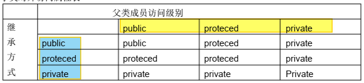
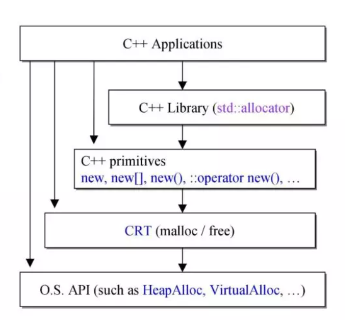
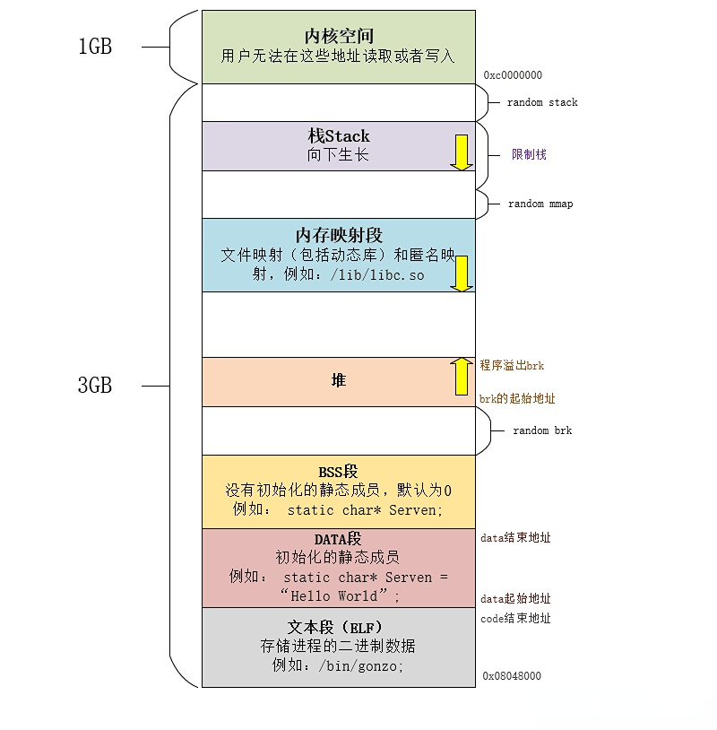
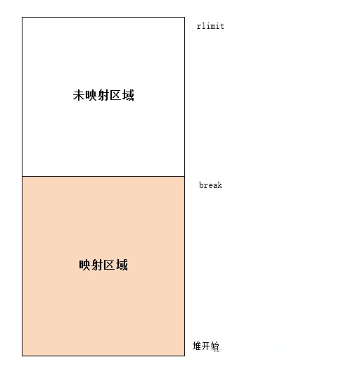
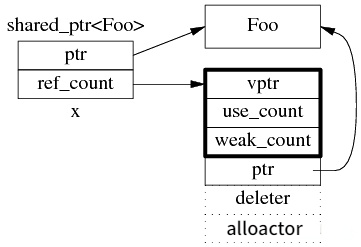
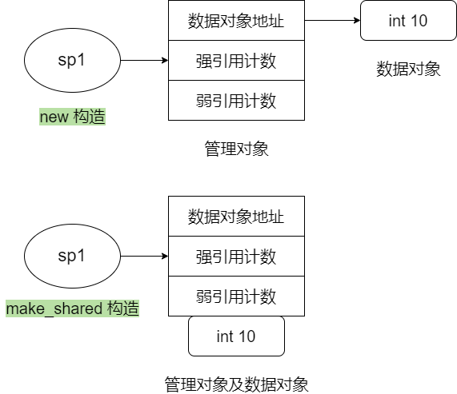

# 变量


# 函数

## 内联函数

以 `inline` 修饰的函数叫做内联函数，**编译**时 C++ 编译器在调用内联函数的地方展开，没有函数调用建立栈帧的开销，能够提升程序运行的效率。引入内联函数的主要原因是用它替代 C 中表达式形式的宏定义，解决一些频繁调用的小函数大量消耗栈空间（栈内存）的问题。

```c
inline double imag(const complex& x)
{
  return x.imag ();
}
```

- inline 的使用是有所限制的，inline 只适合函数体内代码简单的函数使用，不能包含复杂的结构控制语句例如 while、switch，并且内联函数本身不能是直接递归函数（即自己内部调用自己）；

- inline 函数仅仅是一个对编译器的建议，最后能否真正内联取决于编译器，如果它认为函数不复杂，能在调用点展开，就会真正内联，因此不是说声明了内联就会内联，声明内联只是一个建议而已；

- 定义在类中的成员函数缺省都是内联的，如果在类定义时就在类内给出函数定义，那当然最好。如果在类中未给出成员函数定义，而又想内联该函数的话，那在类外要加上 inline，否则就认为不是内联的。例如下面这个例子：

```c
class complex
{ 
public:
    complex (double r = 0, double i = 0) : re (r), im (i) {}
    complex& operator += (const complex&);
    double real () const { return re; }
    double imag () const { return im; }
private:
    double re, im;
    friend complex& __doapl (complex*, const complex&);
};
```

其中构造函数、real 和 imag 函数默认会成为 inline 候选。

**内联函数可以是虚函数吗？**

内联函数是编译时展开函数体，所以在此时就需要有实体，而虚函数是运行时才有实体，所以内联函数不可以为虚函数。

**虚函数可以内联吗？**

当呈现非多态的时候，虚函数可以内联。因为内联函数是在编译的时候确定函数的执行位置的， 当函数呈现多态的时候，在编译的时候不知道是将基类的函数地址还是派生类的地址写入虚函数表中，所以当非多态的时候就会将基类的虚函数地址直接写入虚函数表中，然后通过内联将代码地址写入。


## 构造函数

该部分参考 [C++类成员变量初始化顺序问题](./img/ctor_init_list.png)

> https://blog.csdn.net/no_sying_nothing/article/details/51958547

以前面的代码为例，该代码在构造函数初始化列表中给两个成员变量赋值：

```c
complex (double r = 0, double i = 0) : re (r), im (i)
```

当然也可以这样在构造函数体中初始化：

```c
complex (double r = 0, double i = 0)
{
    this.re = r;
    this.im = i;
}
```

这样做看似可以达到相同的效果，都给两个成员变量赋值了，但其实两者还是有本质区别的。使用构造函数参数赋值方式比在函数体内赋值效率要高。

类对象的构造顺序显示，进入构造函数体后，进行的是计算，是对成员变量的赋值操作，显然，赋值和初始化是不同的，这样就体现出了效率差异。如果不用成员初始化类表，那么类对自己的类成员分别进行的是一次隐式的默认构造函数的调用，和一次赋值操作符的调用，如果是类对象，这样做效率就得不到保障。

此外，构造函数需要初始化的数据成员，不论是否显式地出现在构造函数的成员初始化列表中，都会在该处完成初始化，并且初始化的顺序和其在类中声明时的顺序是一致的，与列表的先后顺序无关，所以要特别注意，保证两者顺序一致才能真正保证其效率和准确性。

总结：

* 成员变量在使用初始化列表初始化时，与构造函数中初始化成员列表的顺序无关，**只与定义成员变量的顺序有关**。因为成员变量的初始化次序是根据变量在内存中次序有关，而内存中的排列顺序早在编译期就根据变量的定义次序决定了；

* 如果不使用初始化列表初始化，在构造函数内初始化时，此时与成员变量在构造函数中的位置有关；

* 类中 **const 成员常量必须在构造函数初始化列表中初始化**；

* 静态成员是类所有的对象的共享的成员，而不是某个对象的成员。它在对象中不占用存储空间，这个属性为整个类所共有，不属于任何一个具体对象。所以**静态成员不能在类的内部初始化**，只能在类的外部初始化。比如声明一个学生类，其中一个成员为学生总数，则这个变量就应当声明为静态变量，应该根据实际需求来设置成员变量。

下面是 C++ 类成员变量初始化顺序：

1. 基类的静态变量或全局变量

2. 派生类的静态变量或全局变量

3. 基类的成员变量

4. 派生类的成员变量


### 默认构造函数

默认构造函数（default constructor）就是在没有显式提供初始化式时调用的构造函数，它由不带参数的构造函数，或者为所有的形参提供默认实参的构造函数定义。如果定义某个类的变量（对象）时没有提供初始化时就会使用默认构造函数。

如果我们的类没有显式地定义构造函数，那么编译器就会为我们隐式地定义一个默认构造函数。这个由编译器创建的构造函数又称为**合成的默认构造函数**（synthesized default constructor）。

合成的默认构造函数只适合非常简单的类，有三个原因：

- **只有当类没有声明任何构造函数的时侯，编译器才会自动地生成默认构造函数。**

  当你定义了其他的构造函数时，除非我们再定义一个默认构造函数，否则类将没有默认构造函数。

- **对于某些类来说，合成的默认构造函数可能执行错误的操作。**

  如果类包含有内置类型或者复合类型的成员，则只有当这些成员全都被赋予了类内的初始值时，这个类才适合于使用合成的默认构造函数。

- **有的时候编译器不能为某些类合成默认的构造函数。**

  - 类中包含一个其他类类型的成员且这个成员的类型没有默认构造函数，那么编译器将无法初始化该成员。这种时候，我们必须自定义默认构造函数，否则该类将没有任何可用的默认构造函数。我们可以使用 = default 要求编译器生成合成的版本（可以对默认构造函数和拷贝控制成员使用）。
  - 在新标准下，我们可以定义删除的函数（deleted function）——使用 = delete 。删除的函数是这样一种函数：我们虽然声明了它们，但不能以任何方式来使用它们。

下面提供两个示例解释为什么有的时候编译器不能为某些类合成默认的构造函数：

```cpp
class test1{ //test1没有默认构造函数
    int a;
    test1(int x){ //这里声明了其他的构造函数，所以不会有合成的默认构造函数
        a = x;
    }
};
 
class test2{
    test1 t1; //一个其他类类型的成员
    int a;
};
 
int main(){
    test t2; //会报很多错，其中包含：
             // error: use of deleted function 'test2::test2()'
             // error: no matching function for call to 'test1::test1()'
}
 
//本例对应情况 1 
//如果给test1声明默认构造函数则编译成功
```

```cpp
class test1{
    int a;
    test1() = delete; //使用 =delete 声明
};
 
int main(){
    test1 t1; // error: use of deleted function 'test1::test1()'
}
 
//对应情况 2
```

**是不是所有的类都有默认构造函数？**答案是否定的。

对于具有类类型的成员，会调用该成员所属类自身的默认构造函数实现初始化，如果该成员所属类不存在默认构造函数，则必须自己定义构造函数以初始化列表方式来对类类型数据成员进行初始化。

内置类型成员的初值依赖于对象如何定义，如果对象在全局作用域中定义（即不在任何函数中）或定义为静态局部对象，则这些成员将被初始化为 0；如果对象在局部作用域中定义，则这些成员没有初始化。除了给它们赋值之外，出于其他任何目的对未初始化成员的使用都没有定义。

合成的默认构造函数一般适用于仅包含类类型成员的类。而对于含有内置类型或复合类型成员的类，则通常应该定义他们自己的构造函数初始化这些成员。

特别说明，如果要求进行值初始化，则合成的默认构造函数会进行值初始化。像动态生成类类型对象时加了空括号要求值初始化，或者定义顺序容器只提供容器大小时会进行值初始化。

**哪些情况下必须要提供默认的构造函数？**

1. 当你使用静态分配的数组，而数组元素类型是某个类的对象时，就要调用默认的构造函数，比如下面的代码。

   ```cpp
   Object buffer[10]; // call default constructor
   ```

2. 当你使用动态分配的数组，而数组元素类型是某个类的对象时，就要调用默认的构造函数，比如下面的代码，如果 Object 没有默认的构造函数，是无法通过编译的，因为 new 操作符要调用 Object 类的无参构造函数类初始化每个数组元素。

   ```cpp
   Object* buffer = new Object[10];
   ```

3. 当你使用标准库的容器时，如果容器内的元素类型是某个类的对象时，那么这个类就需要默认的构造函数，原因同上。

   ```cpp
   vector<Object> buffer;
   ```

4. 一个类 A 以另外某个类 B 的对象为成员时，如果 A 提供了无参构造函数，而 B 未提供，那么 A 则无法使用自己的无参构造函数。

   

### 构造函数重载

下面是某类的两个构造函数：

```c
complex (double r = 0, double i = 0) : re (r), im (i){}
complex () : re(0), im(0) {}
```

这两个构造函数定义是没有问题的，但是在无参初始化该类对象时将产生冲突，因为第一个构造函数已经有参数默认初始化列表了，定义该类对象时可以不加入参数，这就产生了冲突。试想如下初始化对象，调用的是对象的哪个构造函数：

```
complex c1
```

因此，当需要设置重载构造函数时，前面必须先声明默认构造函数（二选一）。


### 拷贝构造函数

拷贝构造函数是一种特殊的构造函数，它在创建对象时，是使用同一类中之前创建的对象来初始化新创建的对象。拷贝构造函数通常用于：

- 通过使用另一个同类型的对象来初始化新创建的对象。

  例如，下面的两条语句都会引发复制构造函数的调用，用以初始化 c2。

  ```cpp
  Complex c2(c1);
  Complex c2 = c1;
  ```

  这两条语句是等价的。

  注意，第二条语句是初始化语句，不是赋值语句。赋值语句的等号左边是一个早已有定义的变量，赋值语句不会引发复制构造函数的调用。例如：

  ```cpp
  Complex c1, c2; c1 = c2 ;
  c1=c2;
  ```

  这条语句不会引发复制构造函数的调用，因为 c1 早已生成，已经初始化过了。

- 复制对象把它作为参数传递给函数。

  如果函数 F 的参数是类 A 的对象，那么当 F 被调用时，类 A 的复制构造函数将被调用。换句话说，作为形参的对象，是用复制构造函数初始化的，而且调用复制构造函数时的参数，就是调用函数时所给的实参。如果形参是一个对象，那么形参的值是否等于实参，取决于该对象所属的类的复制构造函数是如何实现的。

  以对象作为函数的形参，在函数被调用时，生成的形参要用复制构造函数初始化，这会带来时间上的开销。如果用对象的引用而不是对象作为形参，就没有这个问题了。但是以引用作为形参有一定的风险，因为这种情况下如果形参的值发生改变，实参的值也会跟着改变。

  如果要确保实参的值不会改变，又希望避免复制构造函数带来的开销，解决办法就是将形参声明为对象的 const 引用。例如：

  ```cpp
  void Function(const Complex & c)
  {
      ...
  }
  ```

  这样，Function 函数中出现任何有可能导致 c 的值被修改的语句，都会引发编译错误。

- 复制对象，并从函数返回这个对象。

  如果函数的返冋值是类 A 的对象，则函数返冋时，类 A 的复制构造函数被调用。换言之，作为函数返回值的对象是用复制构造函数初始化的，而调用复制构造函数时的实参，就是 return 语句所返回的对象。

  需要说明的是，有些编译器出于程序执行效率的考虑，编译的时候进行了优化，函数返回值对象就不用复制构造函数初始化了，但这并不符合 C++ 的标准。

复制构造函数的参数可以是 const 引用，也可以是非 const 引用。 一般使用前者，这样既能以常量对象（初始化后值不能改变的对象）作为参数，也能以非常量对象作为参数去初始化其他对象。一个类中写两个复制构造函数，一个的参数是 const 引用，另一个的参数是非 const 引用，也是可以的。

如果在类中没有定义拷贝构造函数，编译器会自行定义一个。大多数情况下，其作用是实现从源对象到目标对象逐个字节的复制，即使得目标对象的每个成员变量都变得和源对象相等。编译器自动生成的复制构造函数称为“默认复制构造函数”。

如果类带有指针变量，并有动态内存分配，则它必须有一个拷贝构造函数。拷贝构造函数的最常见形式如下：

```cpp
classname (const classname &obj) {
   // 构造函数的主体
}
```

在这里，obj 是一个对象引用，该对象是用于初始化另一个对象的。

当一个类中存在指针类型的成员变量时，该类必须要提供拷贝构造函数和重载 = 运算符，通过这种方法可以避免“浅拷贝”问题（只是拷贝了指向某区间的地址，但没有拷贝其实际的内容，如果那个区间被释放了，该类析构时调用析构函数时将报错）。

例如：

```cpp
class String
{
public:
    String(const char* cstr = 0);
    String(const String& str);
    String& operator=(const String& str);
    ~String();
    char* get_c_str() const { return m_data; }
private:
    char* m_data;
};

inline
String::String(const char* cstr = 0)
{
    if (cstr) {
        m_data = new char[strlen(cstr)+1];
        strcpy(m_data, cstr);
    } else {
        // 未指定初值 
        m_data = new char[1];
        *m_data = '\0';
    }
}

inline
String::String(const String& str)
{
    m_data = new char[ strlen(str.m_data) + 1 ];//同类互为友元，故可以调用私有成员
    strcpy(m_data, str.m_data);
}

inline
String::~String()
{
    delete[] m_data;
}
```

可以这样调用：

```cpp
String s1(),
String s2("hello");
String* p = new String("hello");
delete p;
```

**为什么 C++ 中的拷贝构造函数的形参不能使用值或者指针传递？**

- 如果使用值传递的话，那么调用拷贝构造函数的时候，首先需要将实参传递给形参，这个传递的时候又要调用拷贝构造函数，这样就会造成无限递归，最后发生栈溢出，但事实上编译器在语法检查上就已经是禁止这种行为的；

- 如果使用指针传递，这样定义的构造函数实际是一个自定义的有参构造函数，而并非拷贝构造。拷贝构造函数只有一个，如果自定义了拷贝构造函数，编译器直接调用自定义的拷贝构造，否则编译器会自动合成一个。

例如：

```cpp
#include <iostream.h>   
  
class CExample  
{  
    int m_nTest;  
public:  
      
    CExample(int x):m_nTest(x) //带参数构造函数   
    {   
       cout << "constructor with argument/n";  
    }  
      
   CExample(const CExample & ex) //拷贝构造函数   
    {  
        m_nTest = ex.m_nTest;  
        cout << "copy constructor/n";  
    }  
      
    CExample& operator = (const CExample &ex)//赋值函数(赋值运算符重载)   
    {     
        cout << "assignment operator/n";  
        m_nTest = ex.m_nTest;  
        return *this;       
     } 
    void myTestFunc(CExample ex)  
    {  
    }  
};  
 
int main()  
{  
    CExample aaa(2);  
    CExample bbb(3);  
    bbb = aaa;  
    CExample ccc = aaa;  
    bbb.myTestFunc(aaa);  
          return 0;     
}  
```

输出结果：

```cpp
constructor with argument      // CExample aaa(2);
constructor with argument      // CExample bbb(3);
assignment operator            // bbb = aaa;
copy constructor               // CExample ccc = aaa;
copy constructor               //  bbb.myTestFunc(aaa);
```


**拷贝构造函数被调用的场景有哪些？**

- 用 = 初始化变量时


- 将一个对象作为实参传递给一个非引用类型的形参

- 从一个返回类型为非引用类型的函数返回一个对象

- 用花括号列表初始化一个数组中的元素或者一个聚合类中的成员


### 移动构造函数与右值

先看下面这段代码：

```cpp
#include <iostream>
#include <stdlib.h>
using namespace std;

class Object
{
public:
	Object() {
		std::cout << "Object()" << std::endl;
	}
	~Object(){
	}

	Object(const Object& object) {
		std::cout << "Object(const Object&)" << std::endl;
	}
    
	Object getObject(void) {
		Object obj;
		return obj;
	}
};

int main(void)
{
	Object o1;
	Object o2 = o1.getObject();

	return 0;
}
```

代码中有一个 Object 类，object 提供了无参和拷贝构造函数，除此之外还定义了一个 getObject 函数，在该函数中会创建一个 Object 临时对象，然后将其返回。在 main 函数中创建了一个 Object o1，然后调用 o1 的 getObject 函数返回一个临时对象（右值），使用该临时对象来初始化 Object o2。输出结果如下：

```
Object()
Object()
Object(const Object&)
```

可以看到，o1 和 obj 临时对象的构造函数输出了，除此之外，o2 的拷贝构造函数也调用了。其实在执行**Object o2 = o1.getObject();** 时，o1.getObject() 返回右值时会创建一个临时对象，本应该再次调用一次构造函数，但是这里由于编译器的优化，这个临时对象就是函数中的 obj 本身。所以本应该打印四次构造函数，但由于编译器的优化只打印了三次。

下面对代码进行改动，在 Object 类中添加移动构造函数：

```cpp
Object(const Object&& object) {
	std::cout << "Object(const Object&&)" << std::endl;
}
```

执行结果如下：

```
Object()
Object()
Object(const Object&&)
```

这次调用的是 o2 的移动构造函数，也就是说创建的临时对象 obj 的值直接赋值给了 o2，中间不会再有临时对象产生，这就达到了我们想要的效果，**相当于临时对象 obj 的生命被延续到 o2 了**。

有了上面的基础之后就可以介绍 move 函数了，这个函数可以将一个左值转换为右值，下面修改测试代码，看看效果如何：

```cpp
int main(void)
{
	Object o1;
	Object o3 = move(o1);
    
	return 0;
}
```

运行结果如下：

```
Object()
Object(const Object&&)
```

调用的是o3对象的移动构造函数，换言之就是将o1对象的所有权转让给了o3，没有生成中间对象。

测试代码可见src/128.moveCopy.cpp。


## 析构函数

创建对象时系统会自动调用构造函数进行初始化工作，同样，销毁对象时系统也会自动调用一个函数来进行清理工作，例如释放分配的内存、关闭打开的文件等，这个函数就是析构函数。

析构函数（Destructor）也是一种特殊的成员函数，没有返回值，不需要程序员显式调用（程序员也没法显式调用），而是在销毁对象时自动执行。构造函数的名字和类名相同，而析构函数的名字是在类名前面加一个~符号。

形式：~类名()｛｝ 

例子： ~Student() { }

注意事项：

- 析构函数没有返回值，没有参数；
- 析构函数的作用是用于释放[堆空间]；
- 析构函数不可以重载；
- 执行前先执行构造函数，执行后即将消失时再执行析构函数；
- 若在主函数中，则析构函数在主函数结束时再调用，因为此时对象的作用域是主函数全部，此时打印就不会打印析构里的东西，只会在 `return 0 ; `（结束函数的作用）后再打印。

> malloc 不会触发构造函数，new 会；free 不会触发析构函数，delete 会。


### 析构函数调用时机

只有当类的某个实例化对象的构造函数执行完毕，而且该对象退出作用域时，才会执行析构函数。如果在执行构造函数的过程中抛出了异常，就不会调用析构函数。

析构函数在对象被销毁时调用，而对象的销毁时机与它所在的内存区域有关。

- 在所有函数之外创建的对象是全局对象，它和全局变量类似，位于内存分区中的**全局数据区**，**程序**在结束执行时会调用这些对象的析构函数。

- 在函数内部创建的对象是局部对象，它和局部变量类似，位于**栈区**，**函数**执行结束时会调用这些对象的析构函数。

- new 创建的对象位于**堆区**，通过 **delete** 删除时才会调用析构函数；如果没有 delete，析构函数就不会被执行。


### 派生类的构造函数与析构函数调用顺序

构造函数和析构函数的调用顺序是**先构造的后析构，后构造的先析构**。

构造函数的调用顺序规则如下所述：

- 基类构造函数。如果有多个基类，则构造函数的调用顺序是某类在**类派生表**中出现的顺序，而不是它们在成员初始化表中的顺序；

- 成员类对象构造函数。如果有多个成员类对象，则构造函数的调用顺序是对象在**类中被声明**的顺序，而不是它们出现在成员初始化表中的顺序；

- 派生类构造函数。

而析构函数的调用顺序与构造函数的调用顺序正好相反，将上面 3 点内容中的顺序反过来用就可以了，即：首先调用派生类的析构函数；其次再调用成员类对象的析构函数；最后调用基类的析构函数。

 

## 常成员函数

在一个类中，如果成员函数中没有改变成员函数操作（例如 get 操作），那么建议在该方法声明处加入 const 关键字，如果不加入 const 关键字，那么 c++ 编译器将认为该函数可能会修改类的成员变量，下面这个例子就演示了该现象，测试代码如下所示：

```c
#include <iostream>
using namespace std;

class complex
{
public:
	complex(double r = 0, double i = 0) : re(r), im(i) {}
	complex& operator += (const complex&);
	double real() const { return re; }
	double imag() const { return im; }
private:
	double re, im;
};

int main(void)
{
	const complex c1(2, 1);
	cout << c1.real() << endl;
	cout << c1.imag() << endl;
	return 0;
}
```

在类 complex 中，real 和 imag 函数都使用了 const 修饰，在 main 函数中初始化了一个 const 修饰的 complex 对象 c1，现在编译运行没有问题，输出结果如下：

```
2
1
```

但是如果去掉那两个函数的const修饰：

```c
double real()  { return re; }
double imag()  { return im; }
```

编译报错如下：

```
错误	1	error C2662: “double complex::real(void)”: 不能将“this”指针从“const complex”转换为“complex &”

错误	2	error C2662: “double complex::imag(void)”: 不能将“this”指针从“const complex”转换为“complex &”
```


## 函数参数传递

推荐传递引用，而非指针。一个对象的引用可以认为是给该对象起了个“别名”，对形参的操作其实就是对实参的操作。它们名字不一样，但指向的地址空间却是一样的，所以使用引用不会有函数列表中的“对象创建”的开销：

```c
complex& operator += (const complex&);
```

如果采用该方法赋值：

```c
complex& operator += (const complex*);
```

那么进入函数时还需要为 complex 指针分配一些空间，在 32 位系统上指针是一个变量，会额外分配 4 bytes 空间（两个不同指针，但指向同一块地址）。

函数参数传递，如果不需要改变参数值，建议使用 const reference 减小开销。


## 函数返回引用

返回值建议使用引用，但如果返回引用的是该函数的一个局部变量，那么不能使用引用，因为该局部变量在函数调用后就以及销毁了，引用可以认为是给当前对象换了个别名，如果当前对象已经被销毁，那么该“别名”也就失去了意义，不存在了。例如下面这些函数绝不可 return by reference，因为它们返回的必定是 local object：

```c
inline complex operator + (const complex& x, const complex& y)
{
    return complex (real (x) + real (y), imag (x) + imag (y));
}

inline complex operator + (const complex& x, double y)
{
    return complex (real (x) + y, imag (x));
}
```


## 友元

当你想在类的成员函数外部直接访问对象的私有成员时，C++ 就提供了友元（friend）的概念。在类中指定的友元就可以访问该类中受保护的内容。

1. 成员函数作为友元

成员函数作为友元即：类 B 中的成员函数被类 A 视为友元，在这种情况下可以使用类 B 中被视为友元的函数访问类 A 中的受保护信息。

```cpp
#include <iostream>
#include <string>

using namespace std;

class A;

class B{
public:
	B();

	void find_name();  //必须是处于 public 下的成员函数才能做为友元
	
	A *theA;
private:
	void find_id();   //该成员函数处于 private 下所以无法作为友元
};

class A{
	friend void B::find_name();
public:
	A();
private:
	string name;
	int id;
};
A::A(){
	name = "qwea";
	id = 10;
}
B::B(){
	theA = new A;
}

void B::find_name(){
	cout << theA->name << endl;
}

void test(){
	B theB;
	theB.find_name();
}

int main()
{
	test();
	return 0;
}
```

2. 类作为友元

类作为友元即：类 B 将类 A 视为友元，在这种情况下，类 A 中的方法都能访问类 B 中受保护元素。

```cpp
#include <iostream>
#include <string>

using namespace std;

class B;

class A{
public:
	A();
	void find_name();
	void find_id();
	
	B *theB;
};

class B{
	friend class A;  //将类 A 视为友元，使其内的方法能访问类 B 中受保护内容
public:
	B();
private:
	string name;
	int id;
};

A::A(){
	theB = new B;
}

B::B(){
	name = "qaz";
	id = 10;
}

void A::find_name(){
	cout << theB->name << endl;
}

void A::find_id(){
	cout << theB->id << endl;
}

void test(){
	A theA;
	theA.find_name();
	theA.find_id();
}

int main(){
	test();

	return 0;
}
```

3. 全局函数作为友元

全局函数作为友元即为类 A 将一个 全局函数视为友元，在这种情况下，该全局函数能访问到类 A 中受保护内容。

```cpp
#include <iostream>
#include <string>

using namespace std;

void find_NameAndId();

class A{
	friend void find_NameAndId(A theA);

public:
	A();

private:
	string name;
	int id;
};

A::A(){
	name = "tgh";
	id = 10;
}

void find_NameAndId(A theA){
	cout << theA.name << endl;
	cout << theA.id << endl;
}

int main(){
	A theA;

	find_NameAndId(theA);

	return 0;
}
```


## 重载

### 重载等号运算符

还是前面的 String 案例，这里给 String 类编写一个 “=” 重载函数：

```cpp
inline String& String::operator = (const String& str)
{
    if (this == &str)
        return *this;
    delete[] m_data;
    m_data = new char[ strlen(str.m_data) + 1 ];
    strcpy(m_data, str.m_data);
    return *this;
}
```

从代码中可以看到，在正式进行拷贝操作前，代码通过一个

```c
if (this == &str)
    return *this;
```

判断是否是对象自身给自身赋值，这样做非常有必要，因为代码的下一行调用delete[]操作符清空了缓存区m_data的内容，然后再进行拷贝，如果不进行自检，那么如果是给自身赋值，那么麻烦就大了，该m_data中的内容已经清空了，无法赋值，这将导致错误。


### 重载前置 ++ 和后置 ++

看下面这个案例：

```cpp
class Complex
{
private:
	int a;
	int b;
public:
	Complex(int a, int b)
	{
		this->a = a;
		this->b = b;
	}
	// 前置++
	Complex& operator++()
	{
		this->a++;
		this->b++;
		return *this;
	}
	// 后置++
	Complex operator++(int)
	{
		Complex temp(a, b);
		this->a++;
		this->b++;
		return temp;
	}

	void printc()
	{
		cout << a << "+" << b << "i" << endl;
	}
};

int main(void)
{
	Complex c3(1,1);
	(c3++).printc(); // 1+1i
	c3.printc(); // 2+2i
	++c3;
	c3.printc(); // 3+3i
	return 0;
}
```


### 重载运算符的限制

1. 重载后的运算符至少有一个操作数时用户定义的类型

   例如：不能将减法运算符（-）重载为计算两个double 值得和，而不是它们的差。

2. 使用运算符时不能违反运算符原来的句法规则

   例如：不能将求模运算符（%）重载成使用一个操作数。

3. 不能修改运算符的优先级

   因此，重载加号运算符，则新的运算符与原来的加号具有相同的优先级。

4. 不能创建新运算符

   例如不能定义 operator **（）函数来表示求幂。

5. 以下运算符不能重载：

   sizeof

   .   成员运算符

   .*    成员指针运算符

   ::     作用域解析运算符

   ? :    条件运算符

   typeid   一个RTTI运算符

   const_cast   强制类型转换运算符

   dynamic_cast   强制类型转换运算符

   reinterpret_cast   强制类型转换运算符

   static_cast   强制类型转换运算符

6. 下列运算符只能通过成员函数进行重载

   =      赋值运算符
   （）函数调用运算符
   []     下标运算符
   ->    通过指针访问类成员的运算符

### 重载、覆盖和隐藏

|      |       范围       | 函数名 | 参数列表 | 返回值类型 |       关键字        |
| :--: | :--------------: | :----: | :------: | :--------: | :-----------------: |
| 重载 |     同一类中     |  相同  |   不同   |   无限制   |       无限制        |
| 覆盖 | 基类和派生类之间 |  相同  |   相同   |    相同    | 必须有 virtual 修饰 |
| 隐藏 | 基类和派生类之间 |  相同  |  无限制  |   无限制   |       无限制        |

**重载（Overload）**：

1、重载是通过不同的方法参数来区分的，例如不同的参数个数，不同的参数类型，不同的参数顺序；

2、不能通过方法的访问权限、返回值类型和抛出的异常类型来进行重载；

3、对于继承来说，如果基类方法的访问权限是 private，那么派生类就不能重载。

**覆盖（Override，重写）**：

1、派生类中覆盖的方法必须要和基类中被覆盖的方法有相同的函数名和参数；

2、派生类中覆盖的方法的返回值必须和基类中被覆盖的方法有相同的返回值；

3、派生类中覆盖的方法所抛出的异常必须和基类中被覆盖的方法所抛出的异常一致，或者是其子类；

4、基类中被覆盖的方法的访问权限不能是 private，否则在其子类中只是新定义了一个方法，并没有对其进行覆盖。。

**重载和覆盖的区别：**

1、覆盖是基类和派生类之间的关系，是垂直关系；而重载是在同一个类中方法之间的关系，是水平关系；

2、覆盖只能由一个方法或只能由一对方法产生关系；重载是多个方法之间的关系；

3、覆盖要求参数列表相同；重载要求参数列表不同；

4、覆盖关系中，调用方法体是根据对象的类型来决定的；而重载关系是根据调用时的实参表与形参表来选择方法体的。

**隐藏（Hidden）：**

- 如果派生类的函数与基类的函数同名，但是参数不同。此时，不论有无 virtual 关键字，基类的函数将被隐藏（注意别与重载混淆）；

- 如果派生类的函数与基类的函数同名，并且参数也相同，但是基类函数没有 virtual关键字。此时，基类的函数被隐藏（注意别与覆盖混淆）。


## 虚函数

### 多态

面向对象的语言有三大特性：**封装、继承、多态**。

派生类对象的地址可以赋值给基类指针。对于通过基类指针调用基类和派生类中都有的同名、同参数表的虚函数的语句，编译时并不确定要执行的是基类还是派生类的虚函数；而当程序运行到该语句时，如果基类指针指向的是一个基类对象，则基类的虚函数被调用，如果基类指针指向的是一个派生类对象，则派生类的虚函数被调用。这种机制就叫作 ``多态（polymorphism）``。

- 静态多态（编译阶段，地址早绑定）

  - 重载：包括普通函数的重载和成员函数的重载；
  - 模板：通过将类型作为参数传递给模板，可使编译器生成该类型的函数；

- 动态多态（运行阶段，地址晚绑定）

  在程序执行期间（非编译期）判断所引用对象的实际类型，根据其实际类型调用相应的方法。

  - 派生类
  - 虚函数

`虚函数`，是运行期间多态的体现。运行期多态发生的三个条件：继承关系、虚函数覆盖、父类指针或引用指向子类对象。

**继承与多态的区别：**

- 继承是子类使用父类的方法，而多态则是父类使用子类的方法；
- 继承是为了代码重用，减少重复代码的出现；
- 多态是为了接口重用，增强接口的扩展性。


### 实例

```cpp
#include <iostream>

using namespace std;

int main(int argc, char const *argv[])
{
    class Base
    {
    public:
        virtual void vir_func() { cout << "virtual function, class Base" << endl; }
        void func() { cout << "normal function, class Base" << endl; }
    };

    class A: public Base
    {
    public:
        virtual void vir_func() { cout << "virtual function, class A" << endl; }
        void func() { cout << "normal function, class A" << endl; }
    };

    class B: public Base
    {
    public:
        virtual void vir_func() { cout << "virtual function, class B" << endl; }
        void func() { cout << "normal function, class B" << endl; }
    };

    Base *base = new(Base); Base *a = new(A); Base *b = new(B);
    base -> func(); a -> func(); b -> func();
    cout << "##################################" << endl;
    base -> vir_func(); a -> vir_func(); b -> vir_func();
    cout << "##################################" << endl;
    ((A *)b) -> vir_func(); ((A *)b) -> func();
    
    return 0;
}
```

运行结果：

```shell
normal function, class Base       
normal function, class Base       
normal function, class Base       
##################################
virtual function, class Base
virtual function, class A
virtual function, class B
##################################
virtual function, class B
normal function, class A
```

在上述例子中，我们首先定义了一个基类 Base，基类有一个名为 vir_func 的虚函数，和一个名为 func 的普通成员函数。而类 A，B 都是由类 Base 派生的子类，并且都对成员函数进行了重载。

然后我们定义三个 Base 类型的指针 base、a、b，分别指向类 Base、A、B。可以看到，当使用这三个指针调用 func 函数时，调用的都是基类 Base 的函数。而使用这三个指针调用虚函数 vir_func 时，调用的是指针指向的实际类型的函数。

最后，我们将指针 b 做强制类型转换，转换为 A 类型指针，然后分别调用 func 和 vir_func 函数，发现普通函数调用的是类 A 的函数，而虚函数调用的是类 B 的函数。

我们可以得出结论：当使用类的指针调用成员函数时，**普通函数由指针类型决定**，而**虚函数由指针指向的实际类型决定**。

虚函数的实现过程：通过对象内存中的虚表指针 vptr 找到**虚函数表** vtbl，接着通过 vtbl 找到对应虚函数的实现区域并进行调用。


### 实现

虚函数表中只存有 虚函数的指针地址，不存放普通函数或是构造函数的指针地址。只要有虚函数，C++ 类都会存在这样的一张虚函数表，不管是普通虚函数亦或是纯虚函数，亦或是派生类中隐式声明的这些虚函数都会生成这张虚函数表。

虚函数表创建的时间：在一个类构造的时候，创建这张虚函数表，而这个虚函数表是供整个类所共有的。虚函数表存储在对象最开始的位置。虚函数表其实就是函数指针的地址。函数调用的时候，通过函数指针所指向的函数来调用函数。

> 虚函数表和类对应的，虚表指针是和对象对应。

1. 无继承情况


```cpp
#include <iostream>
using namespace std;
 
class Base
{
public:
    Base(){cout<<"Base construct"<<endl;}
    virtual void f() {cout<<"Base::f()"<<endl;}
    virtual void g() {cout<<"Base::g()"<<endl;}
    virtual void h() {cout<<"Base::h()"<<endl;}
    virtual ~Base(){}
};
 
int main()
{
    typedef void (*Fun)();  //定义一个函数指针类型变量类型 Fun
    Base *b = new Base();
    //虚函数表存储在对象最开始的位置
    //将对象的首地址输出
    cout<<"首地址："<<*(int*)(&b)<<endl;
 
    Fun funf = (Fun)(*(int*)*(int*)b);
    Fun fung = (Fun)(*((int*)*(int*)b+1));//地址内的值 即为函数指针的地址，将函数指针的地址存储在了虚函数表中了
    Fun funh = (Fun)(*((int *)*(int *)b+2));
 
    funf();
    fung();
    funh();
 
    cout<<(Fun)(*((int*)*(int*)b+4))<<endl; //最后一个位置为0 表明虚函数表结束 +4是因为定义了一个 虚析构函数
 
    delete b;
    return 0;
}
```

2. 单继承情况（无虚函数覆盖）

假设有如下所示的一个继承关系：


请注意，在这个继承关系中，子类没有重载任何父类的函数。那么，在派生类的实例中，其虚函数表如下所示：


> 注意：虚函数按照其**声明顺序**放于表中；父类的虚函数在子类的虚函数前面。

3. 单继承情况（有虚函数覆盖）

覆盖父类的虚函数是很显然的事情，不然虚函数就变得毫无意义。下面我们来看一下，如果子类中有虚函数重载了父类的虚函数，会是一个什么样子？假设，我们有下面这样的一个继承关系。


对于派生类的实例，其虚函数表会是下面的一个样子：


> 注意：覆盖的 f() 函数被放到了虚表中原来父类虚函数的位置；没有被覆盖的函数依旧在原来的位置。
>

这样，我们就可以看到对于下面这样的程序：

```cpp
Base *b = new Derive();
b->f();
```

由 b 所指的内存中的虚函数表的 f() 的位置已经被 Derive::f() 函数地址所取代，于是在实际调用发生时，是 Derive::f() 被调用了。这就实现了多态。

4. 多重继承情况（无虚函数覆盖）

下面，再让我们来看看多重继承中的情况，假设有下面这样一个类的继承关系。注意：子类并没有覆盖父类的函数。


对于子类实例中的虚函数表，是下面这个样子：


> 每个父类都有自己的虚表（有几个基类就有几个虚函数表），子类的成员函数被放到了第一个父类的表中（所谓的第一个父类是按照声明顺序来判断的）。
>

5. 多重继承情况（有虚函数覆盖）

下面我们再来看看，如果发生虚函数覆盖的情况。下图中，我们在子类中覆盖了父类的 f() 函数。


下面是对于子类实例中的虚函数表的图：


我们可以看见，三个父类虚函数表中的 f() 的位置被替换成了子类的函数指针。这样，我们就可以任一静态类型的父类来指向子类，并调用子类的 f() 了。如：

```cpp
Derive d;
Base1 *b1 = &d;
Base2 *b2 = &d;
Base3 *b3 = &d;
b1->f(); //Derive::f()
b2->f(); //Derive::f()
b3->f(); //Derive::f()
b1->g(); //Base1::g()
b2->g(); //Base2::g()
b3->g(); //Base3::g()
```


### 其他问题

#### 构造函数为什么不能定义为虚函数？

我们已经知道虚函数的实现则是通过对象内存中的 vptr 来实现的。而构造函数是用来实例化一个对象的，通俗来讲就是为对象内存中的值做初始化操作。那么**在构造函数完成之前，vptr 是没有值的**，也就无法通过 vptr 找到作为虚函数的构造函数所在的代码区。


#### 析构函数为什么要定义为虚函数？

析构函数可以是虚函数且推荐最好设置为虚函数。

当基类的析构函数为非虚函数，删除一个基类指针指向的派生类实例时，将只清理派生类从基类继承过来的资源，而派生类自己独有的资源却没有被清理，这显然不是我们希望的。

当基类的析构函数被定义成虚函数时，我们再来删除这个指针，会先调用派生类的析构函数，再调用基类的析构函数。因此，如果一个类会被其他类继承，那么我们有必要将被继承的类（基类）的析构函数定义成虚函数。这样，释放基类指针指向的派生类实例时，清理工作才能全面进行，才不会发生**内存泄漏**。

```cpp
#include <iostream>
using namespace std;
 
class B
{
public:
    B() { printf("B()\n"); }
    virtual ~B() { printf("~B()\n"); }
private:
    int m_b;
};
 
class D : public B
{
public:
    D() { printf("D()\n"); }
    ~D() { printf("~D()\n"); }
private:
    int m_d;
};
 
int main()
{
    B* pB = new D();
    delete pB;
    return 0;
}
```

运行结果：

```cpp
B()
D()
~D()
~B()
```

> C++ 中有这样的约束：执行子类构造函数之前一定会执行父类的构造函数；同理，执行子类的析构函数后，一定会执行父类的析构函数，这也是为什么我们一直建议类的析构函数写成虚函数的原因。


#### 为什么默认的析构函数不是虚函数

虚函数不同于普通成员函数，当类中有虚成员函数时，类会自动进行一些额外工作。这些额外的工作包括生成虚函数表和虚表指针，虚表指针指向虚函数表。每个类都有自己的虚函数表，虚函数表的作用就是保存本类中虚函数的地址，我们可以把虚函数表形象地看成一个数组，这个数组的每个元素存放的就是各个虚函数的地址。这样一来，就会**占用额外的内存**，当们定义的类不被其他类继承时，这种内存开销无疑是浪费的。


#### 如何验证虚函数表的存在

```cpp
typedef void(*Fun)(void);
// 取类的一个实例
Base b;
Fun pFun = NULL;
// 把&b转成int ，取得虚函数表的地址
cout << "虚函数表地址：" << (int*)(&b) << endl;
// 再次取址就可以得到第一个虚函数的地址了
cout << "虚函数表 — 第一个函数地址：" << (int*)*(int*)(&b) << endl;
pFun = (Fun)*((int*)*(int*)(&b));
pFun();
```


#### 模板是否可以定义虚函数

模板类是可以使用虚函数，但是类中的成员函数不可以定义为模板虚函数。

如果在类中将成员函数定义成模板虚函数的话，成员函数只有在定义了之后才算是实例化。这样在编译的时候，就不知道虚函数会实例化多少个，虚函数表的大小就没办法确定。但是在编译阶段，必须得确定类的虚函数表大小。所以不能将类中的成员函数定义为模板虚函数。


## 仿函数


从上图可以看到，每个仿函数都是某个类重载 “()” 运算符，然后变成了“仿函数”，实质还是一个类，但看起来具有函数的属性。


## 其他问题

### iostream 的线程安全性

到现在，stdio 函数是线程安全的，但是 iostream 在线程安全方面没有保证，就算单个 operator << 是线程安全的，也不能保证原子性。`cout << a << b; `是两次函数调用，相当于 `cout.operator<<(a).operator<<(b)`。两次调用中间可能会被打断进程上下文切换，造成输出内容不连续，会插入其他线程打印的字符。而 `fprintf(stdout, "%s %d", a, b);` 则是一次函数调用，而且是线程安全的，打印内容不会受到其他线程影响。所以 iostream 并不适合在多线程程序中做 logging。


### main 函数执行前后

* main 结束不代表整个进程结束；

* 全局对象的构造函数会在 main 函数之前执行；

* 全局对象的析构函数会在 main 函数之后执行；

* 用 atexit 注册的函数也会在 main 之后执行；

* 一些全局变量、对象和静态变量、对象的空间分配和赋初值就是在执行 main 函数之前，而 main 函数执行完后，还要去执行一些诸如释放空间、释放资源使用权等操作；

* 进程启动后，要执行一些初始化代码（如设置环境变量等），然后跳转到 main 执行。全局对象的构造也在 main 之前；


在大多数的实现方式里，核心会运行专门的启动代码，启动代码会在启动 main() 之前完成所有的初始化工作，这其中当然包括了全局对象的初始化。这个所谓的启动代码就是 Runtime 函数库的 Startup 代码。在程序执行时，系统会先调用 Startup，完成函数库初始化、进程信息设立、I/O stream 产生，以及对 static 对象的初始化等动作。然后 Startup 调用 main() 函数，把控制权交给 main() 函数。main() 函数执行完毕，控制权交回给 Startup，进行反初始化动作。


# 类与对象

## struct 和 class

### C 和 C++ 中结构体的区别

|          | C                      | C++                      |
| -------- | ---------------------- | ------------------------ |
| 成员函数 | 不能                   | 可以                     |
| 静态成员 | 不能                   | 可以                     |
| 防控属性 | 默认public，不能修改   | public\private\protected |
| 继承关系 | 不可继承               | 可从类或其他结构体继承   |
| 初始化   | 不能直接初始化数据成员 | 可以                     |

上面罗列了在声明时的区别，在使用的过程中也有区别：在 C 中使用结构体时需要加上 struct，或者对结构体使用 typedef 取别名，而 C++ 可直接使用，例如：

```cpp
结构体声明，C和C++使用同一个
struct Student
{
	int  iAgeNum;
	string strName;
}
typedef struct Student Student2；//C 中取别名

struct  Student  stu1;	//C 中正常使用
Student2   stu2;		//C 中通过取别名的使用
Student    stu3;		//C++ 使用
```

C 与 C++ 实际上编程思想的区别，C 是面向过程，C++ 面向对象。所以在 C 中结构体就是不同类型数据的集合，并不涉及算法和操作。而 C++ 是把数据变量及对这些数据变量的相关算法和操作给封装起来。


### C++ 中 struct 与 class 的区别

在 C++ 中引入 struct 是为了保持对 C 程序的兼容，在引入之后 C++ 对其进行了扩充，现在 struct 可以拥有静态成员、成员数据可进行初始化、拥有函数、也可以继承、甚至多态也支持。从表面看起来两者之间像是没有区别，有时你把程序中的所有 class 改为 struct，程序也照常运行。但两者之间还是有所区别的。

1. 内部成员变量及成员函数的默认防控属性

struct 默认防控属性是 public 的，而 class 默认的防控属性是 private 的，例如：

```cpp
struct A
{
	int iNum;
}
class B
{
	int iNum;
}

A a;
a.iNum = 2;		//没有问题，默认防控属性为 public
B b;
b.iNum = 2;		//编译出错，默认防控属性为 private
```

2. 继承关系中默认防控属性的区别

在继承关系，struct 默认是 public 的，而 class 是 private，例如：

```cpp
struct A
{
	int   iAnum；
}
struct B : A
{
	int   iBnum;
}

A a；
a.iAnum = 1;	//在 struct 情况下是正确的，在 class 情况下是错误的
```

class 与 struct 之间的继承，默认的防控属性取决于子类而不是基类，例如：

```cpp
struct A{};
class B : A {};	//默认为 private 继承
struct C : B{};	//默认为 public 继承
```

我们在写代码的时候，为了不引起歧义，最好指明继承的方式，而不要用默认的继承，例如：

```cpp
class B : public A{}；
struct B : public A{}；
```

3. 模板中的使用

class 这个关键字还可用于定义模板参数，就像 typename。但是 strcut 不用与定义模板参数，例如：

```cpp
template< typename T, typename Y >	//可以把 typename 换成 class
int  Func( const T& t, const Y& y )
{
	//TODO
}
```

4. {} 赋初值的讨论

因为 C++ 是对 C 的扩充，那么它就兼容过去 C 中 struct 的特性，例如：

```cpp
struct A
{
	char 	c1；
	int		i2;
	double	db3;
};

A a = {'p', 7, 451.154}; //定义时赋初值，在 struct 时没问题，在 class 时出错
```

当然这里在 class 时，默认的防控属性为 private，所以出错正常，但这是它们之间的一个区别吗？不是的。
在 struct 中加入一个构造函数（或虚函数），会发现 struct 也不能用 {} 赋值了。

原因是以 {} 的方式来赋初值，只是用一个初始化列表来对数据进行按顺序的初始化，如果上面写成 A a = {‘p’,7}; 则 c1，i2 被初始化，而 db3 没有。这样简单的 copy 操作，只能发生在简单的数据结构上，而不应该放在对象上。加入一个构造函数或是一个虚函数会使 strcut 更体现出一种对象的特性，而使 {} 操作不再有效。

因为加入这样的函数（构造和虚函数），使得类的内部结构发生了变化。而加入一个普通的成员函数呢？你会发现 {} 依旧可用。其实你可以将普通的函数理解成对数据结构的一种算法，这并不打破它数据结构的特性。


## 结构体

这里只放出一个案例：

```c
#define _CRT_SECURE_NO_WARNINGS

#include<iostream>
#include<string.h>
#include<cstring>

using namespace std;
struct student{ //声明一个结构体类型 student
	int num;
	char name[20];
	int age;
}; //最后有一个分号
int main(){
	struct student stu1; //定义一个 student 类型的变量 stu1
	student stu2;        //定义时也可以不用 struct
	stu1.num = 1;        //单独对 st1 的 num 元素赋值
	char temp[20] = "Xiao ming";
	strncpy(stu1.name, temp, strlen(temp));
	stu1.age = 10;
	cout << stu1.num << " " << stu1.name << " " << stu1.age << endl;
	student *stu3 = &stu1;//stu3 是结构体的指针，指向 stu1
	(*stu3).num = 2;      //stu1 的 num 值被修改成了 2；
	cout << stu1.num << " " << stu1.name << " " << stu1.age << endl;
	return 0;
}
```

运行结果如下：

```
1 Xiao ming 10
2 Xiao ming 10
```

这里需要注意的是，如果结构体内部使用了字符数组，要使用 strcpy 或者 strncpy 函数来复制。 

> char * strcpy(char *dest, const char *src) 用来复制字符串；
>
> char * strncpy(char *dest, const char *src, size_t n) 用来复制字符串的前n个字符。
>
> strcpy() 会向 dest 追加结束标记 '\0'，而strncpy 不会。


### 内存占用

机器上各个数据类型所占的存储空间如下所述。

* char：8 bit =1 byte
* short：16 bit =2 byte
* int：32 bit = 4 byte
* long：64 bit =8 byte
* float：32 bit =4 byte
* double：64 bit =8 byte
* long long：64 bit =8 byte

其中，long 类型在 32 位机器上只占 4 Byte，其他类型在 32 位机器和 64 位机器都是占同样的大小空间。

在默认对齐方式下，结构体成员的内存分配满足下面三个条件

* 结构体第一个成员的地址和结构体的首地址相同；
* 结构体每个成员地址相对于结构体首地址的偏移量（offset）是该成员大小的整数倍（即该变量前面所有变量字节数之和是该变量类型的整数倍），如果不是则编译器会在成员之间添加填充字节（internal adding）；
* 结构体总的大小要是其成员中最大 size 的整数倍，如果不是编译器会在其末尾添加填充字节（trailing padding）。

另外：

* static 修饰的结构体成员不占用结构体字节数，因为静态变量的存储地址跟结构体的实例地址无关；
* 空结构体的字节数为 1，因为必须保证结构体的实例地址唯一。

```c
#include<iostream>
using namespace std;
struct B{
	char a;
	double b;
	int c;
}test_struct_b;
int main(){
	cout << sizeof(test_struct_b) << endl;
	return 0;
}
```

执行结果是24。这是因为char a的偏移量为0，占用1 Byte；double b指的是下一个可用的地址的偏移量为1，不是 sizeof(double) = 8，需要补足 7 Byte 才能使偏移量变为 8；int c指的是下一个可用的地址的偏移量为16，是 sizeof(int) = 4 的倍数，满足 int 的对齐方式。

故所有成员变量都分配了空间，空间总的大小为 1+7+8+4 = 20，不是结构的节边界数（即结构中占用最大空间的类型所占用的字节数 sizeof(doub1e) = 8 的倍数，所以需要填充 4 Byte，以满足结构的大小为 sizeof(double) = 8 的倍数，即**24**。

当然，也有方法可以改变这一规则，那就是公用 #pragma pack 设置字节对齐大小，这部分了解即可：

```cpp
struct F
{
	char a;
	short b;
	double c;
	float d;
	char e;
};


#pragma back(push)
#pragma pack(2) // 2 bytes对齐
struct E
{
	char a;
	short b;
	double c;
	float d;
	char e;
};
#pragma back(pop)


int main(void)
{
	int FCount = sizeof(F);
	cout << "F count = " << FCount << endl;  //F count = 24

	int ECount = sizeof(E);
	cout << "E count = " << ECount << endl;  //E count = 18

	return 0;
}
```


## 共用体

共用体用关键字 union 来定义，它是一种特殊的类。在一个共用体里可以定义多种不同的数据类型，这些数据共享一段内存，在不同的时间里保存不同的数据类型和长度的变量，以达到节省空间的目的。但同一时间只能存储其中一个成员变量的值。

下面是用 union 判断系统是大端还是小端对齐：

```c
#include<iostream>
using namespace std;
union TEST{
	short a;
	char b[sizeof(short)];
};
int main(){
	TEST test;
	test.a = 0x0102;// 不能引用共用体变量，只能引用共用体变量中的成员。
	if (test.b[0] == 0x01 && test.b[1] == 0x02){
		cout << "big endian." << endl;
	}
	else if (test.b[0] == 0x02 && test.b[1] == 0x01){
		cout << "small endian." << endl;
	}
	else{
		cout << "unknown" << endl;
	}
	return 0;
}
```

#### 

### 内存占用

```c
#include<iostream>
using namespace std; 
union A{
   int a[5];
   char b;
   double c;
};
int main(){
   cout<<sizeof(A)<<endl;
   return 0;
}
```

union 中变量共用内存，应以最长的为准，可是程序的执行结果却不是预想的 20（int a[5]，5 *4 = 20Byte），这是因为在共用体内变量的默认内存对齐方式，必须以最长的double（8 Byte）对齐，也就是说应该是 sizeof(A) = 24。所以将共用体中的int a[5]修改成 int a[6] 后，结果仍然不变；但如果将 int a[6] 修改成 int a[7]，结果就将变成 32。


## 枚举

在实际问题中，有些变量的取值被限定在一个有限的范围内。例如，一个星期只有 7 天，一年只有 12 个月，一个班每周有 6 门课程等。如果把这些量说明为整型，字符型或其他类型显然是不妥当的。为此，C 语言提供了一种称为“枚举"的类型，枚举类型在 C++ 中也同样适用。在“枚举"类型的定义中列举出所有可能的取值，用来说明该“枚举"类型的变量取值不能超过定义的范围。应该说明的是，枚举类型是一种基本数据类型，而不是一种构造类型，因为它不能再分解为任何其他基本类型。

枚举的声明方式为：

```c
enum 枚举类型 { 枚举常量表列 };
```

枚举元素不是字符常量也不是字符串常量，使用时不要加单、双引号。

```c
#include<iostream>
using namespace std;
int main(){
	enum weather{ sunny, cloudy, rainy, windy };
	/*其中sunny=0,cloudy=1,rainy=2,windy=3,
	默认地，第一个枚举子被赋值为0*/
	enum fruits{ apple = 3, orange, banana = 7, bear };
	/*也可以显式地赋值，接下来的枚举子取值是前面一个枚举子的取值+1，即orange=4，bear=8*/
	cout << orange << endl;
	enum big_cities{ guangzhou = 1, shenzhen = 3, beijing = 1, shanghai = 2 };
	/*同一枚举中的枚举子的取值不需要唯一*/
	return 0;
}
```

## 访问级别

private，public，protected 的访问范围:

- private: 只能由该类中的函数、其友元函数访问，不能被任何其他访问，该类的对象也不能访问；

- protected: 可以被该类中的函数、子类的函数、以及其友元函数访问，但不能被该类的对象访问；

- public: 可以被该类中的函数、子类的函数、其友元函数访问，也可以由该类的对象访问。

> 友元函数包括两种：设为友元的全局函数，设为友元类中的成员函数

C++ 中继承方式包括 public（公用的）、private（私有的）和 protected（受保护的），此项是可选的，如果不写此项，则默认为 private（私有的）。

派生类的成员函数访问基类的成员和在派生类外访问基类的成员涉及如何确定基类的成员在派生类中的访问属性的问题，不仅要考虑对基类成员所声明的访问属性，还要考虑派生类所声明的对基类的继承方式，根据这两个因素共同决定基类成员在派生类中的访问属性。

基类成员在派生类中的访问属性可以总结为以下几点：

* 公用继承（public inheritance）：基类的公用成员和保护成员在派生类中保持原有访问属性，其私有成员仍为基类私有；

* 私有继承（private inheritance）：基类的公用成员和保护成员在派生类中成了私有成员，其私有成员仍为基类私有；

* 受保护的继承（protected inheritance）：基类的公用成员和保护成员在派生类中成了保护成员，其私成员仍为基类私有。保护成员的意思是，不能被外界引用，但可以被派生类的成员引用。

C++ 中子类对外访问属性表：




## this 指针

每个成员函数都有一个指针形参，它的名字是固定的，叫做 this 指针。this 指针是隐式的，并且它是成员函数的第一个参数。以运算符重载为例：

```c
inline complex&
__doapl(complex* ths, const complex& r)
{
    ths->re += r.re;
    ths->im += r.im;
    return *ths;
}

inline complex&
complex::operator += (const complex& r)
{
    return __doapl (this, r);
}
```

其中加号运算符重载函数等价于：

```c
inline complex&
complex::operator += (this, const complex& r)
{
    return __doapl (this, r);
}
```

this 指针有如下特点：

- 只能在成员函数中使用（构造函数也可，但不推荐），在全局函数、静态成员函数中都不能使用 this；
- this 指针是在成员函数的开始前构造，并在成员函数的结束后清除；
- this 指针会因编译器不同而有不同的存储位置，可能是栈、寄存器或全局变量；
- this 是类的指针；
- 因为 this 指针只有在成员函数中才有定义，所以获得一个对象后，不能通过对象使用 this 指针，所以也就无法知道一个对象的 this 指针的位置。不过，可以在成员函数中指定 this 指针的位置；
- 普通的类函数（不论是非静态成员函数，还是静态成员函数）都不会创建一个函数表来保存函数指针，只有虚函数才会被放到函数表中。


## virtual 继承

虚拟继承是多重继承特有的概念。虚拟基类是为了解决多重继承而出现的。例如 A 继承了 Y、Z。而 Y、Z 继承自 X，因此 A 两次出现了类 X 中的变量和函数，可以将 Y、Z 定义为虚拟继承，而 X 则变成了虚拟继承的基类。

```cpp
class X{ }；
class Y： public virtual X{ }；
class Z： public virtual X{ }；
class A： public Y， public Z{ }；
```

上述的 X, Y, Z, A 中都没有任何一个 class 中含有明显的数据，只表明了之间的继承关系。所以认为每个的大小都为 0？当然不对。即使是 class X 的大小也不为 0。

```cpp
#include <iostream>
using namespace std;

class A{
public:
	void doIt(){ cout << "A ..." << endl;  }
};
class B : public virtual A{};
class C : public virtual A{};
class D : public B, public C{};

int main()
{
	int a, b, c, d;

	a = sizeof(A);
	b = sizeof(B);
	c = sizeof(C);
	d = sizeof(D);

	cout << a << b << c << d << endl; // 1448

	A aa;
	B bb;
	C cc;
	D dd;

	aa.doIt(); // A ...
	bb.doIt(); // A ...
	cc.doIt(); // A ...
	dd.doIt(); // A ...

	return 0;
}

```


## 多态

C++中使用virtual函数可以实现多态。多态简单说就是“父类指针指向子类，并可以调用子类的函数（virtual函数）”。下面是一个多态的使用案例：

```c
#include<iostream>
using namespace std;
class Father{
public:
	virtual void print()
	{
		cout << "Father's print ...." << endl;
	}

	void printX()
	{
		cout << "Father's printX ...." << endl;
	}
};
class Son : public Father
{
public:
	virtual void print()
	{
		cout << "Son's print ...." << endl;
	}

	void printX()
	{
		cout << "Son's printX ...." << endl;
	}

	void prntY()
	{
		cout << "Son's printY ...." << endl;
	}
};
int main()
{
	Father father;
	father.print();
	father.printX();
	cout << "------------------------------------" << endl;
	Son son;
	son.print();
	son.printX();
	son.prntY();
	cout << "------------------------------------" << endl;
	Father* fa = &son;
	fa->print();
	fa->printX();
	//fa->printY(); //error !!!
	return 0;
}
```

在该案例中定义了一个Father类，该类在案例中作为父类出现。在Father类中定义了两个函数，一个是print函数，该函数定义为virtual函数；另一个是printX函数，没有带上virtual关键字。这里这样设置的目的是为了测试virtual多态和关键字virtual之间的联系。

子类为Son，public继承与父类Father，在子类中还重写了父类中的print和printX函数，除此之外，子类中还定义了一个printY函数。

在测试代码中的第一部分：

```c
Father father;
father.print();
father.printX();
```

测试父类的两个函数，输出结果如下：

```
Father's print ....
Father's printX ....
```

接下类是子类的函数测试：

```c
Son son;
son.print();
son.printX();
son.prntY();
```

输出结果如下：

```
Son's print ....
Son's printX ....
Son's printY ....
```

接下来测试多态：

```c
Father* fa = &son;
fa->print();
fa->printX();
//fa->printY(); //error !!!
```

输出结果如下：

```
Son's print ....
Father's printX ....
```

定义为virtual函数的print函数打印结果是子类实现的，但没有设置为virtual函数的printX则调用的还是父类的函数。所以要实现多态，一个关键还在于virtual函数。在多态部分的测试中尝试使用fa对象调用子类特有的printY函数，但这样做会报错，毕竟fa对象是Father类型的，这里需要特别注意。


### bind1st 和 bind2nd

标准库提供一组函数适配器，用来特殊化或者扩展一元和二元函数对象。常用适配器是：

绑定器（binder）: binder通过把二元函数对象的一个实参绑定到一个特殊的值上，将其转换成一元函数对象。C＋＋标准库提供两种预定义的binder适配器：bind1st和bind2nd，前者把值绑定到二元函数对象的第一个实参上，后者绑定在第二个实参上。

例如：

```cpp
#include <iostream>
#include <algorithm>
#include <functional>
#include <vector>
using namespace std;

template<class T>
struct Mygreater : public binary_function<T, T, bool> // 一定要继承该类： public binary_function<T, T, bool>
{	
	bool operator()(const T& _Left, const T& _Right) const
	{	
		return (_Left > _Right);
	}
};

int main(void)
{
	vector<int>  v1;
	for (int i = 0; i<5; i++)
	{
		v1.push_back(i + 1);
	}
	// 打印数组内容
	for (vector<int>::iterator it = v1.begin(); it != v1.end(); it++)
	{
		cout << *it << " "; // 1 2 3 4 5
	}
	cout << endl;

	int num1 = count_if(v1.begin(), v1.end(), bind1st(Mygreater<int>(), 2));// 绑定Mygreater函数的第一个参数（2 > v1[i]），结果是得到比2小的数量
	cout << "bind1st result :" << num1 << endl; // bind1st result : 1

	int num2 = count_if(v1.begin(), v1.end(), bind2nd(Mygreater<int>(), 2));// 绑定Mygreater函数的第二个参数（v1[i] > 2），结果是得到比2大的数量  
	cout << "bind2nd result :" << num2 << endl; // bind2nd result : 3

	return 0;
}
```


### 虚指针和虚函数表


如上图所示，定义了三个类，A、B和C，B继承于A,C继承于B，A中有两个虚函数，B中有一个，C中也有一个。编译器将A的对象a在内存中分配如上图所示，只有两个成员变量m_data1和m_data2，与此同时，由于A类有虚函数，编译器将给a对象分配一个空间用于保存虚函数表，这张表维护着该类的虚函数地址（动态绑定），由于A类有两个虚函数，于是a的虚函数表中有两个空间（黄蓝空间）分别指向A::vfunc1()和A::vfunc2()；同样的，b是B类的一个对象，由于B类重写了A类的vfunc1()函数，所以B的虚函数表（青色部分）将指向B::vfunc1()，同时B继承了A类的vfunc2()，所以B的虚函数表（蓝色部分）将指向父类A的A::vfunc2()函数；同样的，c是C类的一个对象，由于C类重写了父类的vfunc1()函数，所以C的虚函数表（黄色部分）将指向C::vfunc1()，同时C继承了超类A的vfunc2()，所以B的虚函数表（蓝色部分）将指向A::vfunc2()函数。同时上图也用C语言代码说明了编译器底层是如何调用这些函数的，这便是面向对象继承多态的本质。

下面做一个实验，实验代码在src/116.vptr.cpp：

```cpp
using namespace std;

class Base
{
public:
	virtual void fun1()
	{
		cout << "Base func1...." << endl;
	}
	virtual void fun2()
	{
		cout << "Base func2...." << endl;
	}
	void func3()
	{
		cout << "Base func3...." << endl;
	}
};

class Son : public Base
{
public:
	virtual void fun1()
	{
		cout << "Son func1...." << endl;
	}
	virtual void fun2()
	{
		cout << "Son func2...." << endl;
	}
	void func3()
	{
		cout << "Son func3...." << endl;
	}
	void func4()
	{
		cout << "Son func4..." << endl;
	}
};

int main(void)
{
	Base* base = new Base;
	base->func3(); // Base func3....

	cout << "----------------" << endl;

	Son* son = new Son;
	son->fun1(); // Son func1....
	son->fun2(); // Son func2....
	son->func3(); // Son func3....
	son->func4(); // Son func4...

	cout << "------------------" << endl;

	base = son;
	base->fun1(); // Son func1....
	base->fun2(); // Son func2....
	base->func3(); // Base func3....
	//base->func4(); // error

	cout << "----------------" << endl;

	Son* son2 = dynamic_cast<Son*>(base);
	son2->fun1(); // Son func1....
	son2->fun2(); // Son func2....
	son2->func3(); // son func3....
	son2->func4(); // Son func4...

	cout << "----------------" << endl;

	Base* base2 = nullptr;
	base2 = dynamic_cast<Base*>(son);
	base2->fun1(); // Son func1....
	base2->fun2(); // Son func2....
	base2->func3(); // Base func3....
	//base2->func4(); // error

	return 0;
}
```

该实验中有Base父类和Son子类，然后使用了多态，让父类指针指向子类。从结果可以看到：

1、父类指向子类后，如果调用子类中的虚函数，则调用的是子类虚函数；

2、如果调用和父类同名的非虚函数，那么还是使用父类的函数（例如func3函数）；

3、父类不能调用子类自己定义的函数（例如func3），任何妄图使用父类指针想调用子类中的未覆盖父类的成员函数的行为都会被编译器视为非法。

至于这是为什么，深入探索可参考：

[C++虚函数表解析](./img/vptr.png)

> https://www.cnblogs.com/findumars/p/6358207.html?utm_source=itdadao&utm_medium=referral

前面提到，如果调用和父类同名的非虚函数，那么还是使用父类的函数，详见参考文献中的“一般继承”部分中的子类函数表。

### 虚析构函数

C++中，构造函数不能声明时为虚函数，这是因为编译器在构造对象时，必须知道确切类型，才能正确地生成对象；其次，在构造函数执行之前，对象并不存在，无法使用指向此对象的指针来调用构造函数。然而，析构函数可以声明为虚函数；c++明确指出，当 derived class对象经由一个base class指针被删除、而该base class带着一个non-virtual析构函数，会导致对象的derived成分没被销毁掉，如下所示，析构函数不是虚函数容易引发内存泄漏：

```c
#include<iostream>
using namespace std;
class Base{
public:
	Base(){ std::cout << "Base::Base()" << std::endl; }
	~Base(){ std::cout << "Base::~Base()" << std::endl; }
};
class Derive :public Base{
public:
	Derive(){ std::cout << "Derive::Derive()" << std::endl; }
	~Derive(){ std::cout << "Derive::~Derive()" << std::endl; }
};
int main(){
	Base* pBase = new Derive();
	/*这种base classed的设计目的是为了用来"通过base class接口处理derived class对象"*/
	delete pBase;
	return 0;
}
```

运行结果如下：

```
Base::Base()
Derive::Derive()
Base::~Base()
```

要解决该问题很简单，只需要将父类析构函数设置为虚析构函数即可：

```c
virtual ~Base(){ std::cout << "Base::~Base()" << std::endl; }
```

运行结果如下：

```
Base::Base()
Derive::Derive()
Derive::~Derive()
Base::~Base()
```

### 虚函数常见问题

#### 1、虚函数表中放什么，子类和父类是否共用一份虚函数表

- 虚函数表属于类，类的所有对象共享这个类的虚函数表。
- 不同对象虚函数表是一样的（虚函数表的第一个函数地址相同）。
- 每个对象内部都保存一个指向该类虚函数表的指针vptr，每个对象的vptr的存放地址都不一样，但是都指向同一虚函数表。
- 虽然这个虚函数表为所有类共享，但每个对象的vptr指针却是不相同的，每个对象vptr指向的一些虚函数也会不同，换言之，**不同对象vptr指向的该表中的内容会有所不同**。

子类先是从父类复制了一个虚函数表，如果子类对父类的虚函数进行了覆盖，则在子类的虚函数表将会用子类重写的虚函数地址覆盖父类的，如果没有覆盖，则还是使用父类的函数地址，这样就实现了多态。

**虚函数表指针一般放在一个类的起始位置**，该部分的实验代码可见src/116.vptr2.cpp：

```cpp
#include <iostream>
using namespace std;

class Base{
public:
	int x;
	char c;
	Base(){};               //构造函数
	virtual ~Base(){};      //析构函数

	virtual void func(void){
		cout << "virtual func" << endl;
	};
};

class Son1 : public Base
{

};

class Son2 : public Base
{
	virtual void func(void){
		cout << "son2 's virtual func" << endl;
	};
};

int main()
{
	Base* base = new Base;
	cout << "对象的起始地址为：" << base << endl; // 对象的起始地址为：00956848
	cout << "对象obj的大小为:  " << sizeof(*base) << endl; // 虚函数表指针地址：00956848

	typedef void(*Fun)(void);  //定义函数指针类型
	Fun pFun = NULL;           //定义函数指针
	cout << "虚函数表指针地址：" << (int*)base << endl;  // 虚函数表指针地址：00956848
	cout << "虚函数表 — 第一个函数地址：" << *((int*)*(int*)base + 1) << endl; // 虚函数表 — 第一个函数地址：2167456
	pFun = (Fun)*((int*)*(int*)base + 1);
	pFun(); // virtual func

	cout << "------------------------------------------" << endl;

	Son1* son1 = new Son1;
	cout << "对象的起始地址为：" << son1 << endl; // 对象的起始地址为：0095C658
	cout << "对象obj的大小为:  " << sizeof(*son1) << endl; // 对象obj的大小为 : 12

	typedef void(*Fun)(void);  //定义函数指针类型
	Fun pFun2 = NULL;           //定义函数指针
	cout << "虚函数表指针地址：" << (int*)son1 << endl; // 虚函数表指针地址：0095C658
	cout << "虚函数表 — 第一个函数地址：" << *((int*)*(int*)son1 + 1) << endl; // 虚函数表 — 第一个函数地址：2167456
	pFun2 = (Fun)*((int*)*(int*)son1 + 1);
	pFun2(); // virtual func

	cout << "------------------------------------------" << endl;

	base = son1;

	cout << "对象的起始地址为：" << base << endl; // 对象的起始地址为：0095C658
	cout << "对象obj的大小为:  " << sizeof(*base) << endl; // 对象obj的大小为 : 12

	typedef void(*Fun)(void);  //定义函数指针类型
	Fun pFun3 = NULL;           //定义函数指针
	cout << "虚函数表指针地址：" << (int*)base << endl; // 虚函数表指针地址：0095C658
	cout << "虚函数表 — 第一个函数地址：" << *((int*)*(int*)base + 1) << endl; // 虚函数表 — 第一个函数地址：2167456
	pFun3 = (Fun)*((int*)*(int*)base + 1);
	pFun3(); // virtual func

	cout << "------------------------------------------" << endl;

	Son2* son2 = new Son2;
	cout << "对象的起始地址为：" << son2 << endl; // 对象的起始地址为：0095C670
	cout << "对象obj的大小为:  " << sizeof(*son2) << endl; // 对象obj的大小为 : 12

	typedef void(*Fun)(void);  //定义函数指针类型
	Fun pFun4 = NULL;           //定义函数指针
	cout << "虚函数表指针地址：" << (int*)(&son2) << endl; // 虚函数表指针地址：0073FEE0
	cout << "虚函数表 — 第一个函数地址：" << *((int*)*(int*)son2 + 1) << endl; // 虚函数表 — 第一个函数地址：2167536
	pFun4 = (Fun)*((int*)*(int*)son2 + 1);
	pFun4(); // virtual func

	cout << "------------------------------------------" << endl;

	base = son2;

	cout << "对象的起始地址为：" << base << endl; // 对象的起始地址为：0095C670
	cout << "对象obj的大小为:  " << sizeof(*base) << endl; // 对象obj的大小为 : 12

	typedef void(*Fun)(void);  //定义函数指针类型
	Fun pFun5 = NULL;           //定义函数指针
	cout << "虚函数表指针地址：" << (int*)base << endl; // 虚函数表指针地址：0095C670
	cout << "虚函数表 — 第一个函数地址：" << *((int*)*(int*)base + 1) << endl; // 虚函数表 — 第一个函数地址：2167536
	//pFun5 = (Fun)*((int*)*(int*)base + 1);
	pFun5 = (Fun)((int*)*(int*)base)[1];

	pFun5(); // virtual func

	delete base;
	delete son1;
	return 0;
}
```

注意，可以通过：

```cpp
pFun5 = (Fun)*((int*)*(int*)base + 1);
pFun5 = (Fun)((int*)*(int*)base)[1];
```

两种方式来调用虚函数，虚函数在虚函数表的位置和定义的顺序相关，下面这张图很好地表示了其虚函数指针和虚函数表的内存分配：


#### 2、构造函数可以是虚函数吗

从C++之父Bjarne的回答我们应该知道C++为什么不支持构造函数是虚函数了，简单讲就是没有意义。虚函数的作用在于通过子类的指针或引用来调用父类的那个成员函数。而构造函数是在创建对象时自己主动调用的，不可能通过子类的指针或者引用去调用。

网络上还有一个很普遍的解释是这样的：虚函数相应一个指向vtable虚函数表的指针，但是这个指向vtable的指针事实上是存储在对象的内存空间的。假设构造函数是虚的，就须要通过 vtable来调用，但是对象还没有实例化，也就是内存空间还没有，怎么找vtable呢？所以构造函数不能是虚函数。

#### 3、虚函数表存放地址

* 微软的编译器将虚函数表存放在了目标文件或者可执行文件的常量段中

* gcc编译器的实现中虚函数表vtable存放在可执行文件的只读数据段.rodata中

### this指针和动态绑定

this指针其实可以认为是指向当前对象内存地址的一个指针，如上图所示，由于基类和子类中有虚函数，this->Serialize()将动态绑定，等价于(*(this->vptr)[n])(this)。可以结合上节虚指针和虚函数表来理解，至于最后为什么这样写是正确的，下面将解释。

先看下面这张图：


图中有一个层次的继承关系C->B->A，首先看这部分代码：

```c
B b;
A a = (A)b;
a.vfunc1();
```

这部分代码中a.vfunc1()不是动态绑定的，因为a的初始化不是通过指针指向子类对象来实现的，只是使用强制转换b实现，没有用到“多态”的特性。所以在编译成汇编语言后是调用call指令到一个确定的地址执行vfunc1函数，而且这个vfunc1函数是属于A类的，并非子类的（上图蓝色部分）。

在看下面这张图：


接下来继续看这部分代码：

```c
A* pa = new B;
pa->vfunc1();

pa = &b;
pa->vfunc1();
```

这部分中，pa是一个A类型的指针，但都是通过指向子类B对象来初始化的，这里就用到了多态。这样初始化后pa调用vfunc1函数便是动态绑定的，调用的是子类B的vfunc1。

### 对象的存储空间

#### 1、空类占用的存储空间

```c
#include<iostream>
using namespace std;
class CBox{
};
int main(){
	CBox boxobj;
	cout << sizeof(boxobj) << endl;//1
}

```

程序执行结果是1。空类型对象中不包含任何信息，应该大小为0但是当声明该类型的对象的时候，它必须在内存中占有一定的空间，否则无法使用这些对象。至于占用多少内存，由编译器决定。C++中每个空类型的实例占1Byte空间。

#### 2、有成员变量类占用的存储空间

```c
#include<iostream>
using namespace std;
class CBox{
	int length, width, height;
};
int main(){
	CBox boxobj;
	cout << sizeof(boxobj) << endl;
	return 0;
}
```

程序运行结果为12。类CBox中只有3个成员变量，由于整型变量占4Byte，所以对象所占的空间就是12Byte。

#### 3、有静态变量类占用的存储空间

```c
#include<iostream>
using namespace std;
class CBox{
	int length, width, height;
	static int count;
};
int main(){
	CBox boxobj;
	cout << sizeof(boxobj) << endl;
	return 0;
}
```

类CBox中有3个普通数据成员和1个静态数据成员，比前面例子中多了一个静态数据成员，但是程序的执行结果还是12，也就证明了静态数据成员是不占对象的内存空间的。

#### 4、只有成员函数类占用的存储空间

```c
#include<iostream>
using namespace std;
class CBox{
	int foo();
};
int main(){
	CBox boxobj;
	cout << sizeof(boxobj) << endl;
	return 0;
}
```

结果是1。类CBox中只有一个成员函数，类CBox的对象boxobj的大小却只有1 Byte, 和空类对象是一样的，所以可以得出，成员函数是不占空间的。

#### 5、类中构造函数、析构函数占用空间

```c
#include<iostream>
using namespace std;
class CBox{
public:
	CBox(){};
	~CBox(){};
};
int main(){
	CBox boxobj;
	cout << sizeof(boxobj) << endl;
	return 0;
}
```

运行结果是1。类CBox中只有构造函数和析构函数，类CBox的对象boxobj的大小也只有 1Byte,和空类对象是一样的，所以可以得出，构造函数和析构函数也是不占空间的。

#### 6、类中含有虚析构函数占用空间

```c
#include<iostream>
using namespace std;
class CBox{
public:
	CBox(){};
	virtual ~CBox(){};
};
int main(){
	CBox boxobj;
	cout << sizeof(boxobj) << endl;//4
	return 0;
}
```

输出结果是4。类CBox中有1个构造函数和1个虚的析构函数，程序的执行结果是4。事实上，编译器为了支持虚函数，会产生额外的负担，这正是指向虚函数表的指针的大小。（指针变量在32位的机器上占4 Byte）如果一个类中有一个或者多个虚函数，没有成员变量，那么类相当于含有一个指向虚函数表的指针，占用4 Byte。

#### 7、子类占用存储空间大小

```c
#include<iostream>
using namespace std;
class A{
};
class B{
};
class C :public A{
};
class D :public virtual B{
};
class E :public A, public B{
};
int main(){
	A a;
	B b;
	C c;
	D d;
	E e;
	cout << "sizeof(a):" << sizeof(a) << endl;
	cout << "sizeof(b):" << sizeof(b) << endl;
	cout << "sizeof(c):" << sizeof(c) << endl;
	cout << "sizeof(d):" << sizeof(d) << endl;
	cout << "sizeof(e):" << sizeof(e) << endl;
	return 0;
}
```

输出结果为：

```
sizeof(a):1
sizeof(b):1
sizeof(c):1
sizeof(d):4
sizeof(e):1
```

上面案例定义了一个空类A和B，类C继承了类A，类D继承了虚基类B，类E继承了类A和类B。这些类的对象所占的空间都是1Byte。由此可见，单一继承的空类空间也是 1，多重继承的空类空间还是1，但是虚继承涉及虚表（虚指针），所以sizeof(d)=4。

#### 8、总结

综上所述，每个对象所占用的存储空间只是该对象的非静态数据成员的总和，其他都不占用存储空间，包括成员函数和静态数据成员。函数代码是存储在对象空间之外的，而且，函数代码段是公用的，即如果对同一个类定义了10个对象，这些对象的成员函数对应的是同一个函数代码段，而不是10个不同的函数代码段。

### C++类型转换

参考 [c++类型转换](https://blog.csdn.net/qq_40421919/article/details/90677220)

类型转换有c 风格的,当然还有c++风格的。c风格的转换的格式很简单(TYPE) EXPRESSION,但是 c 风格的类型转换有不少的缺点,有的时候用c 风格的转换是不合适的,因为它可以在任意类型之间转换,比如你可以把一个指向const 对象的指针转换成指向非const 对象的指针,把一个指向基类对象的指针转换成指向一个派生类对象的指针,这两种转换之间的差别是巨大的,但是传统的c 语言风格的类型转换没有区分这些。还有一个缺点就是,c 风格的转换不容易查找,他由一个括号加上一个标识符组成,而这样的东西在c++程序里有不少。所以c++为了克服这些缺点,引进了4种新的类型转换操作符：

| 类型               | 作用                           |
| ------------------ | ------------------------------ |
| static_cast        | 静态类型转换                   |
| reinterpreter_cast | 重新解释类型转换。             |
| dynamic_cast       | 子类和父类之间的多态类型转换。 |
| const_cast         | 去掉const属性转换              |

下面将逐一介绍它们的用法。

####  static_cast 静态类型转换

* static_cast<目标类型>（标识符）
* 所谓的静态,即在编译期内即可决定其类型的转换,用的也是最多的一种
* 该方法在编译期间会做类型检查，但c风格的强制类型转换不会，相对安全

```c
#include <iostream>
using namespace std;

int main(void)
{
	double dPi = 3.1415926;
	int num1 = (int)dPi;    //c语言的旧式类型转换
	int num2 = dPi;         //隐式类型转换
	// 静态的类型转换:   
	// 在编译的时 进⾏行基本类型的转换 能替代c⻛风格的类型转换 可以进⾏行⼀一部分检查     
	int num3 = static_cast<int> (dPi); //c++的新式的类型转换运算符   
	cout << "num1:" << num1 << " num2:" << num2 << " num3:" << num3 << endl;// num1:3 num2:3 num3:3
	return 0;
}
```

#### dynamic_cast 子类与父类之间的多态类型准换

* dynamic_cast<目标类型>（标识符）
* 用于多态中父子类之间的多态转换

```c
#include<iostream>

class Animal {
public:
	virtual void cry() = 0;
};

class Dog : public Animal
{
public:
	virtual void cry()
	{
		std::cout << "旺旺" << std::endl;
	}
	void dohome()
	{
		std::cout << "看家" << std::endl;
	}
};

class Cat : public Animal
{
public:
	virtual void cry()
	{
		std::cout << "喵喵" << std::endl;
	}
	void dohome()
	{
		std::cout << "抓老鼠" << std::endl;
	}
};

int main()
{
	Animal* base = NULL;
	base = new Cat();
	base->cry();// 喵喵

	std::cout << "--------------------" << std::endl;
	//⽤用于将⽗父类指针转换成⼦子类，
	Dog	*pDog = dynamic_cast<Dog*>(base); //此时转换时失败的，因为父类指针现在指向的对象是猫，所以转换狗是失败的。
	//转换失败返回空（NULL）
	if (pDog != NULL)
	{
		pDog->cry();
		pDog->dohome();
	}
	std::cout << "--------------------" << std::endl;
	Cat* pCat = dynamic_cast<Cat*>(base); //此时转换成功，成功将父类指针转换成子类指针
	if (pCat != NULL)
	{
		pCat->cry();// 喵喵
		pCat->dohome();// 抓老鼠
	}

	system("pause");
	return 0;
}
```

运行结果如下：

```
喵喵
--------------------
--------------------
喵喵
抓老鼠
```

#### const_cast 去掉const属性转换

* const_cast<目标类型>（标识符）:目标类型只能是指针或者引用

```c
#include<iostream>

class A {
public:
	int data;
};

int main()
{
	const A a = { 200 };
	//A a1 = const_cast<A>(a);    //错误，const_cast 目标类型只能是引用或者指针
	//a1.data = 100;

	A& a2 = const_cast<A&>(a);
	a2.data = 100;
	std::cout << a.data << ' ' << a2.data << std::endl;

	A* a3 = const_cast<A*>(&a);
	a3->data = 100;
	std::cout << a.data << ' ' << a3->data << std::endl;

	const int x = 3;

	int& x1 = const_cast<int&>(x);
	x1 = 200;
	std::cout << x << ' ' << x1 << std::endl;

	int* x2 = const_cast<int*>(&x);
	*x2 = 300;
	std::cout << x << ' ' << *x2 << std::endl;

	system("pause");
	return 0;
}
```

运行结果如下：

```
100 100
100 100
3 200
3 300
```

#### reinterpret_cast 重新解释类型转换

* reinterpret_cast<目标类型>（标识符）
* 数据的二进制重新解释，但是不改变其值

```c
#include<iostream>

class Animal {
public:
	void cry()
	{
		std::cout << "Animal cry" << std::endl;
	}
};

class Book {
public:
	void look()
	{
		std::cout << "Book look " << std::endl;
	}
};

int main()
{
	Animal* a = new Animal();
	a->cry();
	Book* b = reinterpret_cast<Book*>(a);  //强制类型的转换
	b->look();
	system("pause");
	return 0;
}
```

运行结果如下：

```
Animal cry
Book look
```


### RTTI

RTTI是运行阶段类型识别(Runtime Type Identification)的简称。这是新添加到c++中的特性之一，很多老式实现不支持。另一些实现可能包含开关RTTI的编译器设置。RTTI旨在为程序在运行阶段确定对象类型提供一种标准方式。很多类库已经成为其父类对象提供了实现这种方式的功能。但由于c++内部并不支持，因此各个厂商的机制通常互不兼容。创建一种RTTI语言标准将使得未来的库能够彼此兼容。

C++有3个支持RTTI的元素：

* 如果可能的话，dynamic_cast 运算符将使用一个指向基类的指针来生成一个指向派生类的指针；否则，该运算符返回0——空指针。

* typeid 运算符返回一个指出对象的类型的值。

* type_info 结构存储了有关特定类型的信息。

typeid和dynamic_cast都会去查询type_info

更多内容务必参考该文章 [C++ 中的RTTI机制详解](./img/RTTI.png)

> https://www.cnblogs.com/xuelisheng/p/9479288.html

### RAII

RAII是Resource Acquisition Is Initialization（资源获取即初始化）的简称，是C++语言的一种管理资源、避免泄漏的惯用法。利用的就是C++构造的对象最终会被销毁的原则。RAII的做法是使用一个对象，在其构造时获取对应的资源，在对象生命期内控制对资源的访问，使之始终保持有效，最后在对象析构的时候，释放构造时获取的资源。

RAII是用来管理资源、避免资源泄漏的方法。在计算机系统中，资源是数量有限且对系统正常运行具有一定作用的元素。比如：网络套接字、互斥锁、文件句柄和内存等等，它们属于系统资源。由于系统的资源是有限的，就好比自然界的石油，铁矿一样，不是取之不尽，用之不竭的，所以，我们在编程使用系统资源时，都必须遵循一个步骤：

* 1、申请资源
* 2、使用资源
* 3、释放资源

第一步和第三步缺一不可，因为资源必须要申请才能使用的，使用完成以后，必须要释放，如果不释放的话，就会造成资源泄漏。

下面是muduo网络库中的MutexLockGuard案例：

```cpp
class MutexLockGuard : boost::noncopyable
{
 public:
  explicit MutexLockGuard(MutexLock& mutex)
    : mutex_(mutex)
  {
    mutex_.lock();
  }

  ~MutexLockGuard()
  {
    mutex_.unlock();
  }

 private:

  MutexLock& mutex_;
};

}
```

在使用多线程时，经常会涉及到共享数据的问题，C++中通过实例化std::mutex创建互斥量，通过调用成员函数lock()进行上锁，unlock()进行解锁。不过这意味着必须记住在每个函数出口都要去调用unlock()，也包括异常的情况，这非常麻烦，而且不易管理。muduo网络库通过MutexLockGuard封装了这一系列操作。同样地，C++11为互斥量提供了一个RAII语法的模板类std::lock_guard，其会在构造函数的时候提供已锁的互斥量，并在析构的时候进行解锁，从而保证了一个已锁的互斥量总是会被正确的解锁。


# 模板

### 模板

#### 类模板


#### 继承中的类模板语法


结论: 子类从模板类继承的时候,需要让编译器知道 父类的数据类型具体是什么(数据类型的本质:固定大小内存块的别名)。

#### 在类外部声明模板

一个类模板的案例如下：

```c
template<class T>//声明一个模板，虚拟类型名为T
class Operation {
public:
    Operation (T a, T b):x(a),y(b){}
    T add(){
        return x+y;
    }
    T subtract(){
        return x-y;
    }
private:
    T x,y;
};
```

Operation类的成员函数是写在该类内部的，但很多情况下.h文件和.cpp文件会分离开写，成员函数会在.h文件中定义，在.cpp文件中实现，这时就需要注意了，以add函数为例，如果该函数写在类的外部，那么：

```c
template<class T>
T Operation<T>::add(){
    return x+y;
}
```

#### 类模板中的static关键字

* 从类模板实例化的每个模板类有自己的类模板数据成员，该模板类的所有对象共享一个static数据成员。
* 和非模板类的static数据成员一样，模板类的static数据成员也应该在文件范围定义和初始化。
* 每个模板类有自己的类模板的static数据成员副本。

看下面的例子，观察类模板中的static 变量是如何初始化的：


看下面例子，观察类模板中的static 变量是如何被调用的：


#### 函数模板


与类模板不同的是，函数模板在使用是不需要显式地声明传入参数类型，编译器将自动推导类型。

下面看这个例子，注意观察输出结果：

```c
#include <iostream>
using namespace std;

int Max(int a, int b)
{
	cout << "int Max(int a, int b)" << endl;
	return a > b ? a : b;
}

template<typename T>
T Max(T a, T b)
{
	cout << "T Max(T a, T b)" << endl;
	return a > b ? a : b;
}

template<typename T>
T Max(T a, T b, T c)
{
	cout << "T Max(T a, T b, T c)" << endl;
	return Max(Max(a, b), c);
}


void main()
{
	int a = 1;
	int b = 2;

	cout << Max(a, b) << endl; //当函数模板和普通函数都符合调用时,优先选择普通函数 int Max(int a, int b)
	cout << Max<>(a, b) << endl; //若显示使用函数模板,则使用<> 类型列表 T Max(T a, T b)

	cout << Max(3.0, 4.0) << endl; //如果 函数模板产生更好的匹配 使用函数模板 T Max(T a, T b)

	cout << Max(5.0, 6.0, 7.0) << endl; //重载 T Max(T a, T b, T c)

	cout << Max('a', 100) << endl;  //调用普通函数 可以隐式类型转换  int Max(int a, int b)
	system("pause");
	return;
}
```

运行结果如下：

```
int Max(int a, int b)
2
T Max(T a, T b)
2
T Max(T a, T b)
4
T Max(T a, T b, T c)
T Max(T a, T b)
T Max(T a, T b)
7
int Max(int a, int b)
100
```

那么，为什么函数模板可以和函数重载放在一块。C++编译器是如何提供函数模板机制的？

* 编译器并不是把函数模板处理成能够处理任意类的函数。
* 编译器从函数模板通过具体类型产生不同的函数。
* 编译器会对函数模板进行两次编译，在声明的地方对模板代码本身进行编译；在调用的地方对参数替换后的代码进行编译，一份模板函数最终会生成多个对应类型的函数。如果该编译器认为该函数可以被inline，那么将会被inline展开（g++ -O2 优化选项）。

#### 成员模板


成员模板在泛型编程里用得较多，为了有更好的可扩展性，以上图为例，T1往往是U1的基类，T2往往是U2的基类，可以看下面这个例子：


通过这种方法，只要传入的U1和U2的父类或者祖类是T1和T2，那么通过这样的方式可以实现继承和多态的巧妙利用，但反之就不行了。这样的方式在STL中用得很多：


#### 模板偏化

正如其名，模板偏化指的是模板中指定特定的数据类型，这和泛化是不同的：


当然，模板偏化也有程度之分，可以部分类型指定，称之为偏特化。

#### 个数偏特化


#### 范围偏特化


### 模板模板参数


# 容器

### vector的push_back()方法的实现

需要注意如下几点：

* push_back()函数是浅拷贝，会将对象的复制到vector中。
* push_back()函数调用过程中，如果当前vector的长度等于其容量，那么会导致扩容，容量变为之前的两倍。
* 在新增数据的时候，就要分配一块更大的内存，将原来的数据复制过来，释放之前的内存，在插入新增的元素。
* 对vector的任何操作，**一旦引起空间重新配置，指向原vector的所有迭代器就都失效了**。

### vector 与 list，删除元素后指针和迭代器的变化

* vector和list都是左闭又开区间 **[**begin, end**)**；
* 删除末尾元素，返回end()位置迭代器位置；
* 删除中间元素，返回该元素的下一个元素位置迭代器。

### map和set有什么区别

map和set都是C++的关联容器，其底层实现都是红黑树（RB-Tree）。由于 map 和set所开放的各种操作接口，RB-tree 也都提供了，所以几乎所有的 map 和set的操作行为，都只是转调 RB-tree 的操作行为。

map和set区别在于：

（1）map中的元素是key-value（关键字—值）对：关键字起到索引的作用，值则表示与索引相关联的数据；Set与之相对就是关键字的简单集合，set中每个元素只包含一个关键字。

（2）**set的迭代器是const的，不允许修改元素的值；map允许修改value，但不允许修改key。**其原因是因为map和set是根据关键字排序来保证其有序性的，如果允许修改key的话，那么首先需要删除该键，然后调节平衡，再插入修改后的键值，调节平衡，如此一来，严重破坏了map和set的结构，导致iterator失效，不知道应该指向改变前的位置，还是指向改变后的位置。所以STL中将set的迭代器设置成const，不允许修改迭代器的值；而map的迭代器则不允许修改key值，允许修改value值。

（3）**map支持下标操作，set不支持下标操作。**map可以用key做下标，map的下标运算符[ ]将关键码作为下标去执行查找，如果关键码不存在，则插入一个具有该关键码和mapped_type类型默认值的元素至map中，因此下标运算符[ ]在map应用中需要慎用，const_map不能用，只希望确定某一个关键值是否存在而不希望插入元素时也不应该使用，mapped_type类型没有默认值也不应该使用。如果find能解决需要，尽可能用find。

### multiset和multimap插入重复元素原理

multiset和multimap的底层数据结构是红黑树，其中set的key和value是同一个值。

STL中的rb_tree提供了**insert_unique()**和**insert_equal()**两个函数。前者表示节点的Key一定在整个tree中独一无二，否则插入失败；后者表示节点的key可以重复。

### 有了vector为什么还要stack

* stack默认使用的容器是deque，stack的底层容器可以使用vector和list

* stack不提供迭代器

stack下可以使用vector做容器，是zero-overhead abstraction。 屏蔽了一些vector不必要的接口，充分维护了stack这一先入后出容器的概念。 容器配接器(container adapter)和容器分离是STL做的比较好的一点，这给予了我们根据不同需要切换内部容器的自由。

### STL迭代器模板萃取

因为迭代器需要知道该序列中的元素是否是class类型的。

STL中算法需要传入迭代器，由于是泛型编程，所以可以传入各种不同的迭代器。

然而，不同类型的迭代器里面的数据和类型（int类型或者class类型）是不相同的，操作方式也是不相同的（例如前向、后向迭代器）。算法需要迭代器声明它到底是哪种类型，长度多少，指向元素的类型：

```cpp
typedef Category category ; // 迭代器的类型
typedef Value value_type ; // 迭代器指向元素类型
typedef Distance difference_type ; // 迭代器指向空间长度
typedef Pointer pointer ;
typedef Reference reference ;
```

对于一个正统的Iterator来说，提供这些是非常容易的，Iterator是一个类，可以在类中定义这些东西。但是对于Int*这类指针来说就不好处理了，原生的指针也是一种迭代器，也可以遍历和访问。要解决这个问题就要采取模板萃取的方法了，通过萃取方式来获取到迭代器的类型：


**这里的*class iterators*指的是普通的类似于vector<int>::iterator这种迭代器，而*no-class iterators*指的是int* 这种迭代器，因为指针也可以看作是一种弱化的迭代器。**

算法algorithm需要知道迭代器指向元素类型，但int*这类指针无法提供value_type，于是使用模板特化的方式来间接获取到其类型，经过萃取后可以直接拿到int类型。

这便是萃取的作用。

### STL 线程安全

一般说来，stl对于多线程的支持仅限于下列两点：

1、多个读取者是安全的。即多个线程可以同时读取一个容器中的内容。 即此时多个线程调用 容器的不涉及到写的接口都可以 eg find, begin, end 等.

2、对不同容器的多个写入者是安全的。即多个线程对不同容器的同时写入合法。 但是对于同一容器当有线程写,有线程读时,如何保证正确? 需要程序员自己来控制，比如：线程A读容器某一项时，线程B正在移除该项。这会导致一下无法预知的错误。 通常的解决方式是用开销较小的临界区（CRITICAL_SECTION）来做同步。

### vector 的resize和reserve

* resize不会引起迭代器失效，但reserve会

* resize只是改变容器中元素数量，如果resize大小比先前大，那么将填充新元素，否则将截断后面元素

* 在添加新元素（例如push_back）时可能会导致扩容，引起迭代器失效

实验可见 [](./src/121.vector_resize_reverse.cpp)

### 如何释放vector占用内存

参考 [vector释放内存之swap方法](https://www.cnblogs.com/xiaobingqianrui/p/9092051.html)

一般，我们都会通过vector中成员函数clear进行一些清除操作，但它清除的是所有的元素，使vector的大小减少至0，却不能减小vector占用的内存。要避免vector持有它不再需要的内存，这就需要一种方法来使得它从曾经的容量减少至它现在需要的容量，这样减少容量的方法被称为“收缩到合适（shrink to fit）”。（节选自《Effective STL》）如果做到“收缩到合适”，就要使用“swap”，即通过如下代码进行释放过剩的容量，详细代码见[](./src/123.vector_swap.cpp)：

```c++
...
vec.reserve(16);
cout << vec.size() << "----" << vec.capacity() << endl; // 7----16

//vector<int>().swap(vec); // 释放vector内存
//cout << vec.size() << "----" << vec.capacity() << endl; // 0----0

vector<int>(vec).swap(vec);
cout << vec.size() << "----" << vec.capacity() << endl; // 7----7
```

swap交换技巧实现内存释放思想：vector()使用vector的默认构造函数建立临时vector对象，再在该临时对象上调用swap成员，swap调用之后对象myvector占用的空间就等于一个默认构造的对象的大小，临时对象就具有原来对象v的大小，而该临时对象随即就会被析构，从而其占用的空间也被释放。就前面案例而言，vector<int>(vec)临时对象拷贝构造函数拷贝了vec的size和元素，该部分的size和capacity都是7，然后该临时对象和vec交换，vec的size和capacity变成7，临时对象的size为7，capacity为16，然后被析构了。

注意：并不是所有的STL容器的clear成员函数的行为都和vector一样。事实上，其他容器的clear成员函数都会释放其内存。比如另一个和vector类似的顺序容器deque。


# 常见关键字

## volatile

volatile 的本意是“易变的” ，因为访问寄存器要比访问内存单元快的多，所以编译器一般都会作减少存取内存的优化，但有可能会读脏数据。

当要求使用 volatile 声明变量值的时候，系统总是重新从它所在的内存读取数据，即使它前面的指令刚刚从该处读取过数据。精确地说就是，遇到这个关键字声明的变量，编译器对访问该变量的代码就不再进行优化，从而可以提供对特殊地址的稳定访问；如果不使用 volatile，则编译器将对所声明的语句进行优化。

简洁的说就是：volatile 关键词影响编译器编译的结果，用 volatile 声明的变量表示该变量随时可能发生变化，与该变量有关的运算，不要进行编译优化，以免出错。

当两个线程都要用到某一个变量且该变量的值会被改变时，应该用 volatile 声明，该关键字的作用是防止优化编译器把变量从内存装入 CPU 寄存器中。如果变量被装入寄存器，那么两个线程有可能一个使用内存中的变量，一个使用寄存器中的变量，这会造成程序的错误执行。volatile 的意思是让编译器每次操作该变量时一定要从内存中真正取出，而不是使用已经存在寄存器中的值。

总结：

- 当前处理器缓存行的数据会写回到系统内存；
- 这个写回内存的操作会引起在其他 CPU 里缓存了该内存地址的数据无效。


## register

使用 register 关键字可请求编译器让被修饰的变量直接放在寄存器里面，速度快。在C 语言中 register 修饰的变量不能取地址，但是在 C++ 里面做了改进。

register 关键字请求“编译器”将局部变量存储于寄存器中，但 C 语言中无法取得 register 变量地址；在 C++ 中依然支持 register 关键字，C++ 编译器有自己的优化方式，不使用 register 也可能做优化。

C++ 中可以取得 register 变量的地址。C++ 编译器发现程序中需要取 register 变量的地址时，register 对变量的声明变得无效。

早期 C 语言编译器不会对代码进行优化，因此 register 变量是一个很好的补充。

下面这段代码：

```C++
#include <stdio.h>

int main()
{
	register int a = 0;
	printf("register : &a = %x\n", &a); 

	return 0;
}
```

如果文件后缀名为 .c 而非 .cpp（使用 c 编译器），则会报如下错误：

```C++
error C2103: 寄存器变量上的“&”
```

但如果采用 C++ 编译器则正常运行：

```C++
register : &a = 8ffdf0
```


## const

### 用法及理解

```C++
const int a; // 代表一个常整型数

int const b; // 代表一个常整型数

const int *c;// c 是一个指向常整型数的指针(所指向的内存数据不能被修改，但是本身可以修改)

int * const d;// d 是常指针（指针变量不能被修改，但是它所指向内存空间可以被修改）

const int * const e ;// e 是一个指向常整型数的常指针（指针和它所指向的内存空间，均不能被修改）
```


### C 与 C++ 的 const 区别

下面的代码：

```C++
#include <stdio.h>

int main()
{
	const int a = 10;
	int *p = (int*)&a;
	printf("a===>%d\n", a);
	*p = 11;
	printf("a===>%d\n", a);
	return 0;
}
```

如果采用 .cpp 作为文件后缀名，打印结果如下：

```C++
a===>10
a===>10
```

采用 .c 作为文件后缀名，打印结果如下：

```C++
a===>10
a===>11
```

C 语言中的 const 是个“冒牌货”，是只读变量，有自己的存储空间，通过指针即可对其指向内容修改。


### const 修饰类的成员函数

const 修饰的成员函数表明函数调用不会对对象做出任何更改，事实上，如果确认不会对对象做更改，就应该为函数加上 const 限定，这样无论 const 对象还是普通对象都可以调用该函数。

对于下面这个类：

```C++
class complex
{ 
public:
	complex (double r = 0, double i = 0): re (r), im (i){ }
	complex& operator += (const complex&);
	double real () const { return re; }
	double imag () const { return im; }
private:
	double re, im;
	friend complex& __doapl (complex*, const complex&);
};
```

其中的 real 和 imag 函数使用了 const 来修饰，所以可以这样调用：

```C++
{
	complex c1(2,1);
	cout << c1.real();
	cout << c1.imag();
}
```

也可以这样调用：

```C++
{
	const complex c1(2,1);
	cout << c1.real();
	cout << c1.imag();
}
```

需要注意的是，上面的 c1 对象使用了 const 修饰，然后再调用 real 和 imag 函数。如果 real 和 imag 函数不使用 const 修饰，那么将会报错。

如果同时定义了两个函数，一个带 const，一个不带，那么将视为函数重载，不会有二义性。


### define 和 const 的区别

- 编译阶段：define 是在编译预处理阶段进行替换，const 是在编译阶段确定其值；

- 安全性：define 定义的宏常量没有数据类型，只是进行简单的替换，不会进行类型安全的检查；const 定义的常量是有类型的，是要进行判断的，可以避免一些低级的错误；

- 内存占用：define 定义的宏常量，在程序中使用多少次就会进行多少次替换，内存中有多个备份，占用的是代码段的空间；const 定义的常量占用静态存储区的空间，程序运行过程中只有一份；

- 调试：define 定义的宏常量不能调试，因为在预编译阶段就已经进行替换了；const 定义的常量可以进行调试。


## mutable

mutable 的中文意思是“可变的，易变的”，跟 constant（即 C++ 中的 const）是反义词。

在 C++ 中，mutable 也是为了突破 const 的限制而设置的。被 mutable 修饰的变量，将永远处于可变的状态，即使在一个 const 函数中。

我们知道，如果类的成员函数不会改变对象的状态，那么这个成员函数一般会声明成 const 的。但是，有些时候，我们需要在 const 的函数里面修改一些跟类状态无关的数据成员，那么这个数据成员就应该被 mutalbe 来修饰。

比如：

```C++
class ClxTest
{
　public:
　　void Output() const;

 
void ClxTest::Output() const
{
　cout << "Output for test!" << endl;
}
 
void OutputTest(const ClxTest& lx)
{
　lx.Output();
}
```

类 ClxTest 的成员函数 Output 是用来输出的，不会修改类的状态，所以被声明为 const 的。

函数 OutputTest 也是用来输出的，里面调用了对象 lx 的 Output 输出方法，为了防止在函数中调用其他成员函数修改任何成员变量，所以参数也被 const 修饰。

如果现在，我们要增添一个功能：计算每个对象的输出次数。如果用来计数的变量是普通的变量的话，那么在 const 成员函数 Output 里面是不能修改该变量的值的；而该变量跟对象的状态无关，所以应该为了修改该变量而去掉 Output 的 const 属性。这个时候，就该我们的 mutable 出场了——只要用 mutalbe 来修饰这个变量，所有问题就迎刃而解了。下面是修改过的代码：

```C++
#include <iostream>
#define USING_MUTABLE
using namespace std;

class ClxTest
{
public:
	ClxTest();
	~ClxTest();

	void Output() const;
	int GetOutputTimes() const;

private:
#ifdef USING_MUTABLE
	mutable int m_iTimes;
#else
	int m_iTimes;
#endif
};

ClxTest::ClxTest()
{
	m_iTimes = 0;
}

ClxTest::~ClxTest()
{}

void ClxTest::Output() const
{
	cout << "Output for test!" << endl;
	m_iTimes++; // 	如果不加 mutalbe 则报错:  表达式必须是可修改的左值
}

int ClxTest::GetOutputTimes() const
{
	return m_iTimes;
}

void OutputTest(const ClxTest& lx)
{
	cout << lx.GetOutputTimes() << endl;
	lx.Output();
	cout << lx.GetOutputTimes() << endl;
}
```


## static

`static` 的主要作用有：

- 保持变量内容**持久**：static 作用于局部变量，改变了局部变量的生存周期，使得该变量存在于定义后直到程序运行结束的这段时间；
- **隐藏**：static 作用于全局变量和函数，改变了全局变量和函数的作用域，使得全局变量和函数只能在定义它的文件中使用，在源文件中不具有全局可见性（注：普通全局变量和函数具有全局可见性，即其他的源文件也可以使用）；
- static 作用于类的成员变量和类的成员函数，使得类变量或者类成员函数和类有关，也就是说可以不定义类的对象就可以通过类访问这些静态成员。类的静态成员函数中只能访问静态成员变量或者静态成员函数。


### 全局静态变量

在全局变量前加上关键字 static，全局变量就定义成一个全局静态变量，该变量内存中的位置在静态存储区，在整个程序运行期间一直存在。

未经初始化的全局静态变量会被自动初始化为 0（自动对象的值是任意的，除非他被显式初始化）。

全局静态变量在声明它的文件之外是不可见的，准确地说是从定义之处开始，到文件结尾。


### 局部静态变量

在局部变量之前加上关键字 static，局部变量就成为一个局部静态变量。该变量内存中的位置在静态存储区。

未经初始化的局部静态变量会被自动初始化为 0（自动对象的值是任意的，除非他被显式初始化）。

作用域仍为局部作用域，当定义它的函数或者语句块结束的时候，作用域结束。但是当局部静态变量离开作用域后，并没有销毁，而是仍然驻留在内存当中，只不过我们不能再对它进行访问，直到该函数再次被调用，并且值不变。

```C++
#include<iostream>
using namespace std;

void change()
{
	static int a = 0;
	++a;
	cout << a << endl;
}

int main(void)
{
	change(); // 1
	change(); // 2
	change(); // 3
	change(); // 4
	return 0;
}
```


### 静态函数

在函数返回类型前加 static，函数就定义为静态函数。函数的定义和声明在默认情况下都是 extern 的，但静态函数只是在声明他的文件当中可见，不能被其他文件所用。

函数的实现使用 static 修饰，那么这个函数只可在本 cpp 内使用，不会同其他 cpp 中的同名函数引起冲突。

不要在头文件中声明 static 的全局函数，不要在 cpp 内声明非 static 的全局函数，如果你要在多个 cpp 中复用该函数，就把它的声明提到头文件里去，否则 cpp 内部声明需加上 static 修饰。

虽然在代码中好像使用了相同的变量，但是实际上使用的是不同的变量，在每个源文件中都有单独的变量。所以，在头文件中定义 static 变量会造成变量多次定义，造成内存空间的浪费，而且也不是真正的全局变量。应该避免使用这种定义方式。


### 类的静态数据成员

在类中，静态成员可以实现多个对象之间的数据共享，并且使用静态数据成员还不会破坏隐藏的原则，即保证了安全性。因此，静态成员是类的所有对象中共享的成员，而不是某个对象的成员。对多个对象来说，静态数据成员只存储一处，供所有对象共用。

- 静态成员变量是在类内进行声明，在类外进行定义和初始化，在类外进行定义和初始化的时候不要出现 static 关键字和 private、public、protected 访问规则；


- 静态成员变量相当于类域中的全局变量，被类的所有对象所共享，包括派生类的对象；


- 静态成员变量可以作为成员函数的参数，而普通成员变量不可以；


### 类的静态成员函数

静态成员函数和静态数据成员一样，它们都属于类的静态成员，它们都不是对象成员。因此，对静态成员的引用不需要用对象名。

> 静态成员函数是属于类的，不属于任何一个类的对象，可以通过作用域以及类的对象访问，本身就是一个实体，所以不能定义为虚函数。

静态成员函数不能调用非静态成员变量或者非静态成员函数，因为静态成员函数没有 this 指针。静态成员函数做为类作用域的全局函数。静态成员函数不能声明成虚函数（virtual）、const 函数和 volatile 函数。

在静态成员函数的实现中不能直接引用类中说明的非静态成员，可以引用类中说明的静态成员（这点非常重要）。如果静态成员函数中要引用非静态成员时，可通过对象来引用。从中可看出，调用静态成员函数使用如下格式：<类名>::<静态成员函数名>(<参数表>)；

```C++
#include<iostream>
using namespace std;
class  counter
{
private:
	static  int  num; //声明与定义静态数据成员
public:
	void  setnum(int i) { num = i; }	 //成员函数访问静态数据成员
	void  shownum() { cout << num << endl; }
	void  setnum2(int i) { num2 = i; }	 //成员函数访问静态数据成员
	void  shownum2() { cout << num2 << endl; }
	static int num2;
};
int  counter::num = 0;//声明与定义静态数据成员
int  counter::num2 = 0;

void main()
{
	counter  a, b;
	cout << "---------test private static----------" << endl;
	//调用成员函数访问私有静态数据成员
	a.shownum(); // 0
	b.shownum(); // 0
	a.setnum(10);
	a.shownum();// 10
	b.shownum();// 10

	cout << "---------test public static----------" << endl;
	// counter::num = 5; // error ! 私有static成员变量不可如此访问
	counter::num2 = 12;
	a.shownum2(); // 12
	b.shownum2(); // 12
	b.setnum2(18);
	a.shownum2(); // 18
	b.shownum2(); // 18
	a.num2 = 23;
	a.shownum2(); // 23
	b.shownum2(); // 23
}
```


## typename

STL 中基本上都使用了模板类的声明，即 template。两种方式声明模板类：

```C++
template <class T>
template <typename T>
```

在这里，class 和 typename 是相同的。也就是说，在声明一个 template type parameter (模板类型参数) 的时候，class 和 typename 的作用是等价的。

但是，在 C++ 中，有的时候必须要使用 typename，关键字 typename 被用来作为型别之前的标识符号（嵌套类型定义）：

```C++
template <class T>
class MyClass{
    typename T::SubType * ptr;
    ...
};
```

在这里，typename 指出 SubType 是 class T 中定义的一个类别，因此 ptr 是一个指向 T::SubType 型别的指针。如果没有关键字 typename，SubType 会被当成一个 static 成员，于是

```C++
T::SubType * ptr
```

会被解释为型别 T 内的数值 SubType 与 ptr 的乘积。

SubType 成为一个型别的条件是，任何一个用来取代 T 的型别，其内部必须有一个内部型别 (inner type) SubType 的定义。例如：

```C++
class Q{
    typedef int SubType;
    ...
};
```

如果要把一个 template 中的某个标识符号指定为一种类别，就算是意图显而易见，关键字 typename 也是不能省略的，因此 C++ 的一般规则是，除了使用 typename 修饰之外，template 内的任何标识符号都被视为一个值而不是一个类别(对象)。

再如 typename 在“模板萃取”技术中的使用：

```C++
template <>
class SigmaTraits<unsigned int>{
public:
	typedef unsigned long ReturnType;
};

template <>
class SigmaTraits<float>{
public:
	typedef double ReturnType;
};

template<class T>
inline typename SigmaTraits<T>::ReturnType Sigma(const T const * start, const T const * end)
{
	typedef typename SigmaTraits<T>::ReturnType ReturnType;
	ReturnType s = ReturnType();
	while (start != end)
	{
		s += *start++;
	}
	return s;
}
```

总结：

- template 与 template 一般情况下这两个通用，但有一个特例，就是当 T 是一个类，而这个类又有子类(假设名为 innerClass) 时，应该用 template。
- typename T::innerClass myInnerObject; 这里的 typename 告诉编译器，T::innerClass 是一个类，程序要声明一个 T::innerClass 类的对象，而不是声明 T 的静态成员，而 typename 如果换成 class 则语法错误。


## = delete

假设有这样一个类：

```cpp
class DataOnly {
public:
    DataOnly ()                  // default constructor
    ~DataOnly ()                 // destructor

    DataOnly (const DataOnly & rhs)         　 　  // copy constructor
    DataOnly & operator=(const DataOnly & rhs)    // copy assignment operator

    DataOnly (const DataOnly && rhs)         // C++11, move constructor
    DataOnly & operator=(DataOnly && rhs)    // C++11, move assignment operator
};
```

其内部提供了一系列函数，接下来将通过该类讨论 = delete 的用法。

1. 禁止使用编译器默认生成的函数

假如上面的几个函数中，不想使用其中某个，可以将其定义为 private，或者使用 = delete：

```cpp
#include <iostream>
using namespace std;

class DataOnly {
public:
	DataOnly() {}
	~DataOnly() {}

	DataOnly(const DataOnly & rhs) = delete; //禁止使用该函数
	DataOnly & operator=(const DataOnly & rhs) = delete; //禁止使用该函数

	DataOnly(const DataOnly && rhs) {}
	DataOnly & operator=(DataOnly && rhs) {}
};

int main(int argc, char *argv[]) {
	DataOnly data1;
	DataOnly data2(data1); // 	1	IntelliSense:  无法引用 函数 "DataOnly::DataOnly(const DataOnly &rhs)" (已声明 所在行数:9) -- 它是已删除的函数
	DataOnly data3 = data1; // 1	IntelliSense:  无法引用 函数 "DataOnly::DataOnly(const DataOnly &rhs)" (已声明 所在行数:9) -- 它是已删除的函数
	return 0;
}
```

2. delete 关键字可用于任何函数，不仅仅局限于类的成员函数

```cpp
#include <iostream>
using namespace std;

class DataOnly 
{
public:
	void fun(int a) {}
	void fun(float a) = delete;
};

int main(int argc, char *argv[]) 
{
	DataOnly data1;
	data1.fun(1); // OK
	data1.fun(0.5); // 1	IntelliSense:  有多个 重载函数 "DataOnly::fun" 实例与参数列表匹配
	return 0;
}
```

3. 在模板特例化中，可以用 delete 来过滤一些特定的形参类型

例如：Widget 类中声明了一个模板函数，当进行模板特化时，要求禁止参数为 void* 的函数调用。下面将特例化的函数声明为私有型：

```cpp
#include <iostream>
using namespace std;

class Widget {
public:
	template<typename T>
	void ProcessPointer(T* ptr) {
		cout << typeid (T).name() << endl;
	}
private:
	void ProcessPointer(void*) {
		cout << "void" << endl;
	}
};

int main(int argc, char *argv[]) {
	Widget w;
	int* ip = NULL;
	w.ProcessPointer(ip);

	void* vp = NULL;
	w.ProcessPointer(vp); //1	IntelliSense:  函数 "Widget::ProcessPointer(void *)" (已声明 所在行数:11) 不可访问

	return 0;
}
```

当然也可以使用 = delete 来解决：

```cpp
#include <iostream>
using namespace std;

class Widget {
public:
	template<typename T>
	void ProcessPointer(T* ptr) {
		cout << typeid (T).name() << endl;
	}
	void ProcessPointer(void*) = delete;
};

int main(int argc, char *argv[]) {
	Widget w;
	int* ip = NULL;
	w.ProcessPointer(ip);

	void* vp = NULL;
	w.ProcessPointer(vp); //	1	IntelliSense:  无法引用 函数 "Widget::ProcessPointer(void *)" (已声明 所在行数:10) -- 它是已删除的函数
	return 0;
}
```


## = defalut

在程序员重载了自己上面提到的 C++ 编译器默认生成的函数之后，C++ 编译器将不再生成这些函数的默认形式,但是 C++ 允许我们使用 =default 来要求编译器生成一个默认函数，如：

```cpp
struct Point {
    Point()=default;
    Point(int _x, int _y) : x(_x), y(_y) {}
    int x = 0;
    int y = 0;
}
```

这样相当于无参的构造函数也是可以使用的。


## extern "C"

参考 [extern “C”的作用详解](https://www.cnblogs.com/xiangtingshen/p/10980055.html)

extern "C" 的主要作用就是为了能够正确实现 C++ 代码调用其他 C 语言代码。加上 extern "C" 后，会指示编译器这部分代码按 C 语言（而不是 C++）的方式进行编译。由于 C++ 支持函数重载，因此编译器编译函数的过程中会将函数的参数类型也加到编译后的代码中，而不仅仅是函数名；而 C 语言并不支持函数重载，因此编译 C 语言代码的函数时不会带上函数的参数类型，一般只包括函数名。

这个功能十分有用处，因为在 C++ 出现以前，很多代码都是 C 语言写的，而且很底层的库也是 C 语言写的，为了更好的支持原来的 C 代码和已经写好的 C 语言库，需要在 C++ 中尽可能的支持 C，而 extern "C" 就是其中的一个策略。

这个功能主要用在下面的情况：

* C++ 代码调用 C 语言代码
* 在 C++ 的头文件中使用
* 在多个人协同开发时，可能有的人比较擅长 C 语言，而有的人擅长 C++，这样的情况下也会有用到

例如：

```cpp
#ifndef __INCvxWorksh /*防止该头文件被重复引用*/
#define __INCvxWorksh
#ifdef __cplusplus             //告诉编译器，这部分代码按C语言的格式进行编译，而不是C++的
extern "C"{
#endif
 
/*…*/
 
#ifdef __cplusplus
}
 
#endif
#endif /*end of __INCvxWorksh*/
```

```cpp
extern "C" double sqrt(double);
```

```cpp
extern "C"
{
      double sqrt(double);
      int min(int, int);
}
```

```cpp
extern "C"
{
    ＃include <cmath>
}　
```

由于 C、C++ 编译器对函数的编译处理是不完全相同的，尤其对于 C++ 来说，支持函数的重载，编译后的函数一般是以函数名和形参类型来命名的。

例如函数 void fun(int, int)，编译后的可能是 `_fun_int_int `(不同编译器可能不同，但都采用了类似的机制，用函数名和参数类型来命名编译后的函数名)；而 C 语言没有类似的重载机制，一般是利用函数名来指明编译后的函数名的，对应上面的函数可能会是  `_fun` 这样的名字。

由于 C++ 支持函数重载，而 C 语言不支持，因此函数被 C++ 编译后在符号库中的名字是与 C 语言不同的；C++ 编译后的函数需要加上参数的类型才能唯一标定重载后的函数，而加上 extern "C" 后，是为了向编译器指明这段代码按照 C 语言的方式进行编译。

下面看一个典型的反面案例，假设现在有三个文件：

参考  https://github.com/hokein/Wiki/wiki/extern-%22C%22

```cpp
//cExample.h
#ifndef C_EXAMPLE_H
#define C_EXAMPLE_H
int add(int x,int y);
#endif

//cExample.c
#include "cExample.h"
int add( int x, int y ) {
  return x + y;
}

//cppExample.cpp
extern "C" {
  #include "cExample.h"
}

int main(int argc, char* argv[]) {
  add(2,3); 
  return 0;
}
```

cppExample.cpp 中调用了 cExample.h 中的内容，而 cExample.c 是使用 C 语言写的库，所以代码中使用了 extern "C" 来修饰 #include "cExample.h"，下面开始编译 cppExample.cpp，使其生成可执行文件，执行下面几行命令：

```
gcc -c cExample.c
g++ -c cppExample.cpp
g++ cppExample.cpp cExample.o -o main
```

一切安好。但是如果把 cppExample.cpp 中的 extern "C" 部分去掉，再次编译，那么链接时将发生错误：

```
/tmp/ccfsa21L.o: In function `main':
cppExample.cpp:(.text+0x1a): undefined reference to `add(int, int)'
collect2: error: ld returned 1 exit status
```

链接器表示找不到对应的 add 函数，因为 add 函数是使用 C 编译器编译生成的，其符号表可以认为是 _add 这种，但 cppExample.cpp 是使用 c++ 编译器生成的，里面调用的 add 函数要求链接时找到  _add_int_int 这类函数。很明显，这不可能找到，所以使用 extern "C" 可以告诉连接器去找_ add 这类函数。


## explicit 

下面这个例子：


任何 Fraction 需要被转换为 double 类型的时候，自动调用 double() 函数进行转换。如上图所示，编译器在分析 double d = 4 + f 过程中判断 4 为整数，然后继续判断 f，观察到 f 提供了 double() 函数，然后会对 f 进行 double() 操作，计算得到 0.6，再与 4 相加，最后得到 double 类型的 4.6。

C++ 中，一个参数的构造函数（或者除了第一个参数外其余参数都有默认值的多参构造函数），承担了两个角色： 一是构造器 ，二是默认且隐含的类型转换操作符。

所以， 有时候在我们写下如 AAA = XXX， 这样的代码， 且恰好 XXX 的类型正好是 AAA 单参数构造器的参数类型， 这时候编译器就自动调用这个构造器， 创建一个 AAA 的对象。

这样看起来好象很酷， 很方便。 但在某些情况下（见下面权威的例子）， 却违背了我们（程序员）的本意。 这时候就要在这个构造器前面加上 explicit 修饰， 指定这个构造器只能被明确的调用/使用， 不能作为类型转换操作符被隐含的使用。

explicit 构造函数是用来**防止隐式转换**的。请看下面的代码：

```c
class Test1
{
public:
    Test1(int n)
    {
        num=n;
    }//普通构造函数
private:
    int num;
};
class Test2
{
public:
    explicit Test2(int n)
    {
        num=n;
    }//explicit(显式)构造函数
private:
    int num;
};
int main()
{
    Test1 t1=12;//隐式调用其构造函数,成功
    Test2 t2=12;//编译错误,不能隐式调用其构造函数
    Test2 t2(12);//显式调用成功
    return 0;
}
```

编译器报错如下：

```
错误	1	error C2440: “初始化”: 无法从“int”转换为“Test2”
```

Test1 的构造函数带一个 int 型的参数，代码 23 行会隐式转换成调用 Test1 的这个构造函数。而 Test2 的构造函数被声明为 explicit（显式），这表示不能通过隐式转换来调用这个构造函数，因此代码 24 行会出现编译错误。

普通构造函数能够被隐式调用。而 explicit 构造函数只能被显式调用。


## final

C++11 的关键字 final 有两个用途：

- 禁止虚函数被重写
- 禁止基类被继承

在派生类中，可以同时使用 overried 和 final。

c++11 推荐将一个类修饰为 final 类：

```cpp
class nocopyable2 final 
{
public:
	nocopyable2();
	~nocopyable2();
};
```


# 表达式和语句

## sizeof 运算符

`sizeof`运算符返回一条表达式或一个类型名字所占的字节数。sizeof 运算符满足右结合律，其所得的值是一个 size_t 类型的常量表达式。运算符的运算对象有两种形式：

```cpp
sizeof (type)
sizeof expr
```

第 2 种形式返回的是表达式结果类型的大小，但并不实际计算其运算对象的值：

```cpp
Sales_data data, *p;
sizeof(Sales_data);   //存储 Sales_data 类型的对象所占的空间大小
sizeof data;          //data 的类型的大小，即 sizeof(Sales_data)
sizeof p;             //指针所占的空间大小
sizeof *p;            //p 所指类型的空间大小，即 sizeof(Sales_data)
sizeof data.revenue   //Sales_data 的 revenue 成员对应类型的大小
```

注意 sizeof *p，因为 sizeof 满足右结合律并且与 * 运算符的优先级一样，所以表达式按照从右向左的顺序组合，也就是说，它等价于 sizeof(*p)。其次，因为 sizeof 不会实际求运算对象的值，所以即使 p 是一个无效（即未初始化）的指针也不会有什么影响。在 sizeof 的运算对象中解引用一个无效指针仍然是一种安全的行为，因为指针实际上并没有被真正使用，sizeof 不需要真的解引用也能知道它所指对象的类型。


### 特性总结

1. sizeof 不能求得 void 类型的长度，但能求得 void 类型的指针的长度。

2. sizeof 能求得静态分配内存的数组的长度，但不能求得动态分配的内存的大小。

   ```cpp
   int a[10];
   int n = sizeof(a);  //n = 10 * 4 = 40
   
   char ch[] = "abc";
   int n = size0f(ch); //n = 4（字符串末尾有'\0'）
   
   void fun(int array[10])
   {
   	int n = sizeof(array); //n = 4（函数参数传递时，数组被转化成指针）
   }
   
   int *a = new int[10];
   int n = sizeof(a);  //n = 4（a 是指针）
   ```

3. sizeof 不能对不完整的数组求长度。

   假设有两个源文件：file1.cpp 和 file2.cpp，其中 file1.cpp 中有如下的定义：

   ```cpp
   int arrayA[10] = {1,2,3,4,5,6,7,8,9,10};
   int arrayB[10] = {11,12,13,14,15,16,17,18,19,20};
   ```

   file2.cpp 包含如下几个语句：

   ```cpp
   extern arrayA[];
   extern arrayB[10];
   
   cout<<sizeof(arrayA)<<endl;   //编译出错！！
   cout<<sizeof(arrayB)<<endl;
   ```

   在 file2.cpp 中第三条语句编译出错，而第四条语句正确，并且能输出 40。原因就是 sizeof(arrayA) 试图求不完整数组的大小。这里的不完整的数组是指数组大小没有确定的数组。sizeof 运算符的功能就是求某种对象的大小，然而声明：extern int arrayA[] 只是告诉编译器 arrayA 是一个整型数组，但是并没告诉编译器它包含多少个元素，因此对 file2.cpp 中的 sizeof 来说它无法求出 arrayA 的大小，所以编译器干脆不让你通过编译。

   那为什么 sizeof(arrayB) 又可以得到 arraryB 的大小呢?关键就在于在 file2.cpp 中其声明时使用 extern int arrayB[10] 明确地告诉编译器 arrayB 是一个包含 10 个元素的整型数组，因此大小是确定的。

4. 当表达式作为 sizeof 的操作数时，它返回表达式的计算结果的类型大小，但是它不对表达式求值。

   ```cpp
   char ch = 1;
   int num = 1;
   int n1 =sizeof(ch + num);        //n1 = 4（类型转换，等同 sizeof(int)）
   int n2 = sizeof(ch = ch + num);  //n2 = 1（两次类型转换，等同 sizeof(char)）
   ```

5. sizeof 可以对函数调用求大小，并且求得的大小等于返回类型的大小，但是不执行函数体。

   ```cpp
   int fun(int& num,const int& inc)
   {
       float div = 2.0;
       double ret =0;
       num = num+inc;
       ret = num/div;
       return ret;
   }
   
   int main()
   {
   	int a = 3;
       int b = 5;
       cout << sizeof(fun(a,b)) << endl; //输出 4（只看函数返回值类型）
       cout << a << endl;                //输出 3（函数未执行）
   }
   ```

6. sizeof 求得的结构体（及其对象）的大小并不等于各个数据成员对象的大小之和，而是考虑结构体成员对齐规则之后，实际占用的内存空间大小。


### sizeof 和 strlen 的区别

1. strlen 是头文件中的**函数**，sizeof 是 C++ 中的**运算符**。

2. strlen 测量的是字符串的实际长度，以 '\0' 结束；而 sizeof 测量的是字符数组的分配大小。

```cpp
#include <iostream>
#include <cstring>

using namespace std;

int main()
{
    char arr[10] = "hello";
    cout << strlen(arr) << endl; // 5
    cout << sizeof(arr) << endl; // 10
    return 0;
}
```

3. 若字符数组 arr 作为函数的形参，sizeof(arr) 中 arr 被当作字符指针来处理，strlen(arr) 中 arr 依然是字符数组。  

```cpp
#include <iostream>
#include <cstring>

using namespace std;

void size_of(char arr[])
{
    cout << sizeof(arr) << endl; // warning: 'sizeof' on array function parameter 'arr' will return size of 'char*' .
    cout << strlen(arr) << endl; 
}

int main()
{
    char arr[20] = "hello";
    size_of(arr); 
    return 0;
}
/*
输出结果：
8
5
*/
```

4. strlen 在程序**运行**过程中计算长度；而 sizeof 在**编译**时计算长度。
5. sizeof 的参数可以是类型，也可以是变量；strlen 的参数必须是 char* 类型的变量。


## 其他问题

### x=x+1 , x+=1 , x++ 效率比较

x=x+1 效率最低，其执行过程如下：

（1）读取右 x 的地址；
（2）x+1，做加 1 操作；
（3）读取左 x 的地址；
（4）将右值传给左边的 x（编译器并不认为左右 x 的地址相同）。

x+=1 其次，其执行过程如下：

（1）读取右 x 的地址；
（2）x+1，做加 1 操作；
（3）将得到的值传给 x（因为 x 的地址已经读出）。

x++ 效率最高，其执行过程如下：

（1）读取右 x 的地址；
（2）x 自增1。


# 内存管理

## 内存存储区域

在 C++ 中，内存分成 5 个区，他们分别是堆、栈、自由存储区、全局/静态存储区和常量存储区。

- **栈**：在执行函数时，函数内局部变量的存储单元都可以在栈上创建，**函数执行结束**时这些存储单元自动被释放。栈内存分配运算内置于处理器的指令集中，效率很高，但是分配的内存容量有限；

- **堆**：就是那些由 new 分配的内存块，他们的释放编译器不去管，由我们的应用程序去控制，一般一个 new 就要对应一个 delete。如果程序员没有释放掉，那么在**程序结束**后，操作系统会自动回收；

- **自由存储区**：就是那些由 malloc 等分配的内存块，他和堆是十分相似的，不过它是用 free 来结束自己的生命的；

- **全局/静态存储区**：全局变量和静态变量被分配到同一块内存中，在以前的 C 语言中，全局变量又分为初始化的和未初始化的，在 C++ 里面没有这个区分了，他们共同占用同一块内存区；

- **常量存储区**：这是一块比较特殊的存储区，他们里面存放的是常量，不允许修改。


### 堆和栈的区别

堆和栈主要有以下几点区别：

|          |                            堆空间                            |                            栈空间                            |
| -------- | :----------------------------------------------------------: | :----------------------------------------------------------: |
| 管理方式 | 程序员手动申请和释放内存空间，程序结束时系统可进行回收，但容易产生内存泄露 |                操作系统自动分配和释放内存空间                |
| 空间大小 |                            几个 G                            |                      一般只有 8 - 10 M                       |
| 生长方向 |                    向上，内存地址由低到高                    |                    向下，内存地址由高到低                    |
| 分配方式 |          动态分配，如 malloc 函数，需要手动释放内存          | 静态分配、动态分配。局部变量的分配属于静态分配，由操作系统完成；动态分配由操作系统进行释放，不需要手动释放 |
| 分配效率 | 效率低，内存申请与管理机制比较复杂，频繁的内存申请容易产生内存碎片 | 效率高，分配过程由操作系统自动分配，硬件提供支持，分配专门的寄存器存放栈的地址，压栈和出栈都有专门的指令 |


## 内存分配与释放

C++ 中存在四种内存分配释放方式：



最高级的是 `std::allocator`，对应的释放方式是 `std::deallocate`，可以自由设计来搭配任何容器； `new/delete` 是运算符，可重载；``malloc/free` 属于库函数，不可重载；更低级的内存管理函数是操作系统直接提供的系统调用，通常不会到这个层次来写 C++ 应用程序。

示例：

```cpp
// malloc/free
void *p1 = malloc(512);
*(int*) p1 = 100;
free(p1);

// new/delete 
int *p2 = new int(100); // 这里应该是初始化为 100，若要声明数组，用 new int[n];
delete p2;

// c++ 函数，等价于 malloc 和 free
void *p3 = ::operator new(512);
*(int *)p3 = 100;
::operator delete(p3);

// c++ 标准库，通过 object 调用，以 GNU 为例
int *p4 = alloctor<int>().allocate(7);   // 这里是分配 7 个 int 单元而不是 7 bytes
*p4 = 9;
allocator<int>().deallocate((int *)p4,7);// 7 应该与上文匹配
```


### malloc 的实现原理

相对于栈而言，堆这片内存面临着一个稍微复杂的行为模式：在任意时刻，程序可能发出请求，要么申请一段内存，要么释放一段已经申请过的内存，而且申请的大小从几个字节到几个 GB 都有可能，我们不能假设程序一次申请多少堆空间，因此，堆的管理显得较为复杂。

那么，使用 malloc() 在堆上分配内存到底是如何实现的呢？

一种做法是把 malloc() 的内存管理交给系统内核去做，既然内核管理着进程的地址空间，那么如果它提供一个系统调用，可以让 malloc() 使用这个系统调用去申请内存，不就可以了吗？当然这是一种理论上的做法，但实际上这样做的性能比较差，因为每次程序申请或者释放堆空间都要进行系统调用。我们知道系统调用的性能开销是比较大的，当程序对堆的操作比较频繁时，这样做的结果会严重影响程序的性能。

比较好的做法就是 malloc() 向操作系统申请一块适当大小的堆空间，然后由 malloc() 自己管理这块空间。malloc() 相当于向操作系统“批发”了一块较大的内存空间，然后“零售”给程序用。当全部“售完”或程序有大量的内存需求时，再根据实际需求向操作系统“进货”。当然 malloc() 在向程序零售堆空间时，必须管理它批发来的堆空间，不能把同一块地址出售两次，导致地址的冲突。于是 malloc() 需要一个算法来管理堆空间，这个算法就是堆的分配算法。

#### Linux 下的实现原理

malloc 是在堆（如下图）中分配内存的。在 32 位系统中，堆的寻址空间只有 4GB，在 Linux 系统下 0 ~ 3GB 是用户模式，3 ~ 4GB 是内核模式。而在用户模式下又分为了代码段、数据段、BSS 段、DATA 段、堆、栈。



堆（heap）段位于 BSS 下方，其中有两个重要的标志：堆起始地址和程序溢出 brk。Linux 维护一个 break 指针，这个指针指向堆空间的某个地址。从堆起始地址到 break 之间的地址空间为映射好的，可以供进程访问；而从 break 往上，是未映射的地址空间，如果访问这段空间则程序会报错。我们用 malloc 进行内存分配就是从 break 往上进行的。

Linux 的虚拟内存管理有几个关键概念：

- 每个进程都有独立的虚拟地址空间，进程访问的虚拟地址并不是真正的物理地址；
- 虚拟地址可通过每个进程上的页表（在每个进程的内核虚拟地址空间）与物理地址进行映射，获得真正物理地址；
- 如果虚拟地址对应的物理地址不在物理内存中，则产生缺页中断，真正分配物理地址，同时更新进程的页表；如果此时物理内存已耗尽，则根据内存替换算法淘汰部分页面至物理磁盘中。


受物理存储容量限制，整个堆虚拟内存空间不可能全部映射到实际的物理内存，Linux 对堆的管理示意图如下：



获取了 break 地址，也就是内存申请的起始地址，下面就是 malloc 的整体实现方案：

- 调用 **malloc** 函数的实质是它有一个将可用的内存块连接为一个长长的列表的所谓**空闲链表**。 调用 mallo() 函数时，它沿着链表寻找一个大到足以满足用户请求所需要的内存块。 然后，将该内存块一分为二（一块的大小与用户申请的大小相等，另一块的大小就是剩下来的字节）。 接下来，将分配给用户的那块内存存储区域传给用户，并将剩下的那块（如果有的话）返回到连接表上；

- 调用 **free** 函数时，它将用户释放的内存块连接到空闲链表上。 到最后，空闲链会被切成很多的小内存片段，如果这时用户申请一个大的内存片段， 那么空闲链表上可能没有可以满足用户要求的片段了。于是，malloc() 函数请求延时，并开始在空闲链表上检查各内存片段，对它们进行内存整理，将相邻的小空闲块合并成较大的内存块。

#### malloc 分配内存前的初始化

`malloc_init` 是初始化内存分配程序的函数。 它完成以下三个任务：

- 将分配程序标识为已经初始化
- 找到操作系统中最后一个有效的内存地址
- 建立起指向需要管理的内存的指针。

这里需要用到三个全局变量：

```cpp
int has_initialized = 0; /* 初始化标记 */
void *managed_memory_start; /* 管理内存起始地址 */
void *last_valid_address; /* 操作系统的最后一个有效地址*/
```

被映射的内存边界（操作系统最后一个有效地址）常被称为系统中断点或者当前中断点。为了指出当前系统中断点，必须使用 `sbrk(0)` 函数。 sbrk 函数根据参数中给出的字节数移动当前系统中断点，然后返回新的系统中断点， 使用参数 0 只是返回当前中断点。 

Linux 通过 brk 和 sbrk 系统调用操作 break 指针。两个系统调用的原型如下：

```cpp
int brk(void *addr);
void *sbrk(intptr_t increment);
```

brk 将 break 指针直接设置为某个地址，而 sbrk 将 break 从当前位置移动 increment 所指定的增量。brk 在执行成功时返回 0，否则返回 -1 并设置 errno 为 ENOMEM；sbrk 成功时返回 break 移动之前所指向的地址，否则返回 (void *) -1。如果将 increment 设置为 0，则可以获得当前 break 的地址。

以下为 malloc_init() 的代码：

```cpp
#include <unistd.h> /* sbrk 函数所在的头文件 */
void malloc_init()
{
    last_valid_address = sbrk(0); /* 用 sbrk 函数在操作系统中取得最后一个有效地址 */
    managed_memory_start = last_valid_address; /* 将最后一个有效地址作为管理内存的起始地址 */
    has_initialized = 1; /* 初始化成功标记 */
}
```

#### 内存块的获取

所要申请的内存是由多个内存块构成的链表。每个块由 meta 区和数据区组成，meta 区记录数据块的元信息（数据区大小、空闲标志位、指针等等），数据区是真实分配的内存区域，并且数据区的第一个字节地址即为 malloc 返回的地址。

```cpp
typedef struct s_block *t_block;
struct s_block {
    size_t size;  /* 数据区大小 */
    t_block next; /* 指向下个块的指针 */
    int free;     /* 是否是空闲块 */
    int padding;  /* 填充 4 字节，保证 meta 块长度为 8 的倍数 */
    char data[1]  /* 这是一个虚拟字段，表示数据块的第一个字节，长度不应计入 meta */
};
```

现在，为了完全地管理内存，我们需要能够追踪要分配和回收哪些内存。在对内存块进行了 free 调用之后，我们需要做的是诸如将它们标记为未被使用的等事情，并且，在调用 malloc 时，我们要能够定位未被使用的内存块。因此， malloc 返回的每块内存的起始处首先要有这个结构：

```cpp
struct mem_control_block
{    
     int is_available; //是否空闲
     int size;         //内存块大小
};
```

现在考虑如何在block链中查找合适的block。一般来说有两种查找算法：

- First fit：从头开始，使用第一个数据区大小大于要求size的块所谓此次分配的块；
- Best fit：从头开始，遍历所有块，使用数据区大小大于size且差值最小的块作为此次分配的块。

两种方法各有千秋，best fit 具有较高的内存使用率（payload 较高），而 first fit 具有更好的运行效率。

find_block 从 frist_block 开始，查找第一个符合要求的 block 并返回 block 起始地址，如果找不到这返回 NULL。这里在遍历时会更新一个叫 last 的指针，这个指针始终指向当前遍历的 block。这是为了如果找不到合适的 block 而开辟新 block 使用的。

如果现有 block 都不能满足 size 的要求，则需要在链表最后开辟一个新的 block。下为利用 sbrk() 创建新的 block示意代码：

```cpp
#define BLOCK_SIZE 24 /* 由于存在虚拟的 data 字段，sizeof 不能正确计算 meta 长度，这里手工设置 */
t_block extend_heap(t_block last, size_t s) {
    t_block b;
    b = sbrk(0);
    if(sbrk(BLOCK_SIZE + s) == (void *)-1) return NULL;
    b->size = s;
    b->next = NULL;
    if(last) last->next = b;
    b->free = 0;
    return b;
}
```

#### malloc 源码

```cpp
/**内存控制块数据结构，用于管理所有的内存块**/
struct mem_control_block {
    int is_available; //标志着该块是否可用。1 表示可用，0 表示不可用
    int size;         //该块的大小
};

/**在实现 malloc 时要用到 linux 下的全局变量**/
void *managed_memory_start; //该指针指向进程的堆底，也就是堆中的第一个内存块
void *last_valid_address;   //该指针指向进程的堆顶，也就是堆中最后一个内存块的末地址

/**malloc() 功能是动态的分配一块满足参数要求的内存块
*numbytes：该参数表明要申请多大的内存空间
*返回值：函数执行结束后将返回满足参数要求的内存块首地址，要是没有分配成功则返回 NULL
**/
void *malloc(size_t numbytes) {
    //游标，指向当前的内存块
    void *current_location;
    //保存当前内存块的内存控制结构
    struct mem_control_block *current_location_mcb;
    //保存满足条件的内存块的地址用于函数返回
    void *memory_location;
    memory_location = NULL;
    //计算内存块的实际大小，也就是函数参数指定的大小 + 内存控制块的大小
    numbytes = numbytes + sizeof(struct mem_control_block);
    //利用全局变量得到堆中的第一个内存块的地址
    current_location = managed_memory_start;

    //对堆中的内存块进行遍历，找合适的内存块
    while (current_location != last_valid_address) //检查是否遍历到堆顶了
    {
        //取得当前内存块的内存控制结构
        current_location_mcb = (struct mem_control_block*)current_location;
        //判断该块是否可用
        if (current_location_mcb->is_available)
            //检查该块大小是否满足
            if (current_location_mcb->size >= numbytes)
            {
                //满足的块将其标志为不可用
                current_location_mcb->is_available = 0;
                //得到该块的地址，结束遍历
                memory_location = current_location;
                break;
            }
        //取得下一个内存块
        current_location = current_location + current_location_mcb->size;
    }

    //在堆中已有的内存块中没有找到满足条件的内存块时执行下面的函数
    if (!memory_location)
    {
        //向操作系统申请新的内存块
        if (sbrk(numbytes) == -1)
            return NULL;//申请失败，说明系统没有可用内存
        memory_location = last_valid_address;
        last_valid_address = last_valid_address + numbytes;
        current_location_mcb = (struct mem_control_block)memory_location;
        current_location_mcb->is_available = 0;
        current_location_mcb->size = numbytes;
    }
    //到此已经得到所要的内存块，现在要做的是越过内存控制块返回内存块的首地址
    memory_location = memory_location + sizeof(struct mem_control_block);
    return memory_location;
}
```

#### free 源码

```cpp
/**free() 功能是将参数指向的内存块进行释放
*firstbyte：要释放的内存块首地址
*返回值：空
**/
void free(void *firstbyte)
{
    struct mem_control_block *mcb;
    //取得该块的内存控制块的首地址
    mcb = firstbyte - sizeof(struct mem_control_block);
    //将该块标志设为可用
    mcb->is_available = 1;
    return;
}
```


### new 和 delete

`new` 表达式的内部实现是由三个步骤组成的：首先调用 `operator new` 分配一定的字节数的内存，此时得到的内存指针是 void* 类型的，将之用 `static_cast` 转换成需要的 class 类型，然后调用 class 的``构造函数``完成初始化。

例如：

```c
Complex* pc == new Complex(1,2);
```

这一过程可以认为是：

```c
void* mem = operator new( sizeof(Complex) ); //分配內存，内部调用 malloc
pc = static_cast<Complex*>(mem); // 转型
pc->Complex::Complex(1,2);//调用构造函数
```

从上面的 new 的实现中，不难发现，new 返回的是对象指针，失败是抛出 bad_alloc 异常，我们应该通过是否抛出异常来判断 new 执行状况，而不是像 malloc 一样通过判断返回值是否为 nullptr。

`delete` 操作可以认为是先调用析构函数，再释放 memory。

下面这个操作：

```c
Complex* pc = new Complex(1,2);
...
delete pc;
```

可以认为是：

```c
Complex::~Complex(pc); // 调用析构函数
operator delete(pc); // 释放内存，内部调用了 free 函数 
```


### delete 释放资源

#### POD 动态数组内存释放

**首先看这段代码：**

```cpp
int main(void)
{
    int* array = new int[10];
    return 0;
}
```

new 了 10 个 int 类型变量数组，但是没有释放，这很明显会导致内存泄漏，下面编译并使用 valgrind 工具查看下：

```shell
$ g++ delete.cpp -o del -g
$ valgrind ./del
==48504== Memcheck, a memory error detector
==48504== Copyright (C) 2002-2013, and GNU GPL'd, by Julian Seward et al.
==48504== Using Valgrind-3.10.1 and LibVEX; rerun with -h for copyright info
==48504== Command: ./del
==48504== 
==48504== 
==48504== HEAP SUMMARY:
==48504==     in use at exit: 40 bytes in 1 blocks
==48504==   total heap usage: 1 allocs, 0 frees, 40 bytes allocated
==48504== 
==48504== LEAK SUMMARY:
==48504==    definitely lost: 40 bytes in 1 blocks
==48504==    indirectly lost: 0 bytes in 0 blocks
==48504==      possibly lost: 0 bytes in 0 blocks
==48504==    still reachable: 0 bytes in 0 blocks
==48504==         suppressed: 0 bytes in 0 blocks
==48504== Rerun with --leak-check=full to see details of leaked memory
==48504== 
==48504== For counts of detected and suppressed errors, rerun with: -v
==48504== ERROR SUMMARY: 0 errors from 0 contexts (suppressed: 0 from 0)
```

LEAK SUMMARY 显示 *definitely lost: 40 bytes in 1 blocks*，一个块，总共 40 字节内存泄漏了。

修改上面代码：

```cpp
int main(void)
{
    int* array = new int[10];
    delete[] array;
    return 0;
}
```

同样地：

```shell
$ g++ delete.cpp -o del -g
$ valgrind ./del
==48583== Memcheck, a memory error detector
==48583== Copyright (C) 2002-2013, and GNU GPL'd, by Julian Seward et al.
==48583== Using Valgrind-3.10.1 and LibVEX; rerun with -h for copyright info
==48583== Command: ./del
==48583== 
==48583== 
==48583== HEAP SUMMARY:
==48583==     in use at exit: 0 bytes in 0 blocks
==48583==   total heap usage: 1 allocs, 1 frees, 40 bytes allocated
==48583== 
==48583== All heap blocks were freed -- no leaks are possible
==48583== 
==48583== For counts of detected and suppressed errors, rerun with: -v
==48583== ERROR SUMMARY: 0 errors from 0 contexts (suppressed: 0 from 0)
```

这个是正常的，没有内存泄漏： *All heap blocks were freed -- no leaks are possible*

修改代码，使用 delete 释放内存：

```shell
int main(void)
{
    int* array = new int[10];
    delete array;
    return 0;
}
```

结果如下：

```shell
$ g++ delete.cpp -o del -g
$ valgrind ./del
==48669== Memcheck, a memory error detector
==48669== Copyright (C) 2002-2013, and GNU GPL'd, by Julian Seward et al.
==48669== Using Valgrind-3.10.1 and LibVEX; rerun with -h for copyright info
==48669== Command: ./del
==48669== 
==48669== Mismatched free() / delete / delete []
==48669==    at 0x4C2C2BC: operator delete(void*) (in /usr/lib/valgrind/vgpreload_memcheck-amd64-linux.so)
==48669==    by 0x40077E: main (delete.cpp:15)
==48669==  Address 0x5a1c040 is 0 bytes inside a block of size 40 alloc'd
==48669==    at 0x4C2B800: operator new[](unsigned long) (in /usr/lib/valgrind/vgpreload_memcheck-amd64-linux.so)
==48669==    by 0x40076E: main (delete.cpp:13)
==48669== 
==48669== 
==48669== HEAP SUMMARY:
==48669==     in use at exit: 0 bytes in 0 blocks
==48669==   total heap usage: 1 allocs, 1 frees, 40 bytes allocated
==48669== 
==48669== All heap blocks were freed -- no leaks are possible
==48669== 
==48669== For counts of detected and suppressed errors, rerun with: -v
==48669== ERROR SUMMARY: 1 errors from 1 contexts (suppressed: 0 from 0)

```

*All heap blocks were freed -- no leaks are possible*，是的，没有看错，使用 delete 释放动态数组内存不会导致内存泄漏，但是 valgrind 检测出了操作的错误：*Mismatched free() / delete / delete []*

#### 探究动态对象内存释放

先看这段代码：

```cpp
class Foo
{
public:
    Foo(){ cout << "call ctor" << endl; }
    ~Foo(){ cout << "call dtor" << endl; }
};

int main(void)
{
    Foo* array = new Foo[10];
    delete[] array;
    return 0;
}
```

有一个对象类 Foo，然后在 main 函数中 new 了十个，最后使用 delete[] 释放这部分内存，使用 valgrind 测试结果如下：

```shell
$ g++ delete2.cpp -o del -g
$ valgrind ./del
==49036== Memcheck, a memory error detector
==49036== Copyright (C) 2002-2013, and GNU GPL'd, by Julian Seward et al.
==49036== Using Valgrind-3.10.1 and LibVEX; rerun with -h for copyright info
==49036== Command: ./del
==49036== 
call ctor
call ctor
call ctor
call ctor
call ctor
call ctor
call ctor
call ctor
call ctor
call ctor
call dtor
call dtor
call dtor
call dtor
call dtor
call dtor
call dtor
call dtor
call dtor
call dtor
==49036== 
==49036== HEAP SUMMARY:
==49036==     in use at exit: 0 bytes in 0 blocks
==49036==   total heap usage: 1 allocs, 1 frees, 18 bytes allocated
==49036== 
==49036== All heap blocks were freed -- no leaks are possible
==49036== 
==49036== For counts of detected and suppressed errors, rerun with: -v
==49036== ERROR SUMMARY: 0 errors from 0 contexts (suppressed: 0 from 0)
```

一切安好，创建**十个对象**，**调用十次构造函数**，使用 delete[] 后**调用了十次析构函数**，没有内存泄露，没有任何问题。

接下来将 delete[] 修改为 delete：

```cpp
class Foo
{
public:
    Foo(){ cout << "call ctor" << endl; }
    ~Foo(){ cout << "call dtor" << endl; }
};

int main(void)
{
    Foo* array = new Foo[10];
    delete array;
    return 0;
}
```

做同样的测试：

```shell
$ g++ delete2.cpp -o del -g
$ valgrind ./del
==49185== Memcheck, a memory error detector
==49185== Copyright (C) 2002-2013, and GNU GPL'd, by Julian Seward et al.
==49185== Using Valgrind-3.10.1 and LibVEX; rerun with -h for copyright info
==49185== Command: ./del
==49185== 
call ctor
call ctor
call ctor
call ctor
call ctor
call ctor
call ctor
call ctor
call ctor
call ctor
call dtor
==49185== Invalid free() / delete / delete[] / realloc()
==49185==    at 0x4C2C2BC: operator delete(void*) (in /usr/lib/valgrind/vgpreload_memcheck-amd64-linux.so)
==49185==    by 0x400A95: main (delete2.cpp:21)
==49185==  Address 0x5a1c048 is 8 bytes inside a block of size 18 alloc'd
==49185==    at 0x4C2B800: operator new[](unsigned long) (in /usr/lib/valgrind/vgpreload_memcheck-amd64-linux.so)
==49185==    by 0x400A45: main (delete2.cpp:20)
==49185== 
==49185== 
==49185== HEAP SUMMARY:
==49185==     in use at exit: 18 bytes in 1 blocks
==49185==   total heap usage: 1 allocs, 1 frees, 18 bytes allocated
==49185== 
==49185== LEAK SUMMARY:
==49185==    definitely lost: 18 bytes in 1 blocks
==49185==    indirectly lost: 0 bytes in 0 blocks
==49185==      possibly lost: 0 bytes in 0 blocks
==49185==    still reachable: 0 bytes in 0 blocks
==49185==         suppressed: 0 bytes in 0 blocks
==49185== Rerun with --leak-check=full to see details of leaked memory
==49185== 
==49185== For counts of detected and suppressed errors, rerun with: -v
==49185== ERROR SUMMARY: 1 errors from 1 contexts (suppressed: 0 from 0)
```

调用了十次构造函数但只调用了一次析构函数。

不出所料，valgrind 检查到了两个错误：*Invalid free() / delete / delete[] / realloc()*   和   *definitely lost: 18 bytes in 1 blocks*  。

如果直接运行这个程序，还会导致 core dump：

```shell
*** Error in `./del': munmap_chunk(): invalid pointer: 0x0000000000903018 ***
Aborted (core dumped)
```

#### 总结

- 动态分配的对象调用 delete 时首先会调用析构函数，然后再释放内存，如果析构函数没有调用，那么说明该部分内存没有释放；
- 普通的 int 类型值没有析构函数，所以使用 delete 释放动态数组也不会出现内存泄漏；
- 对象类型释放内存前需要调用析构函数，使用 delete 处理一个动态数组只能析构首对象，其他的对象都无法被析构，这就导致了内存泄漏。


### new 和 malloc 的区别

1、new 分配内存按照数据类型进行分配，malloc 分配内存按照指定的大小分配；

2、new 返回的是指定对象的指针，而 malloc 返回的是 void*，因此 malloc 的返回值一般都需要进行类型转化；

3、new 不仅分配一段内存，而且会调用构造函数，malloc 不会；

4、new 分配的内存要用 delete 销毁，malloc 要用 free 来销毁；delete 销毁的时候会调用对象的析构函数，而 free 则不会；

5、new 是一个操作符可以重载，malloc 是一个库函数；

6、malloc 分配的内存不够的时候，可以用 realloc 扩容；new 没用这样操作；

7、new 如果分配失败了会抛出 bad_malloc 的异常，而 malloc 失败了会返回NULL；

8、申请数组时： new[] 一次分配所有内存，多次调用构造函数，搭配使用 delete[]，delete[] 多次调用析构函数，销毁数组中的每个对象。而 malloc 只能分配 sizeof(int) * n。


### 五种分配内存的调用方式

#### 1、malloc 和 free

```cpp
void* p1 = malloc(512);
free(p1);
```

#### 2、new 和 delete

```cpp
int* p1 = new int;
delete p1;
```

#### 3、::operator new 和 ::operator delete

```cpp
void* p1 = ::operator new(512);
operator delete(p1);
```

#### 4、placement new 和 placement delete

所谓placement new就是在用户指定的内存位置上构建新的对象，这个构建过程不需要额外分配内存，只需要调用对象的构造函数即可。

下面这段代码：

```cpp
class foo{};
foo* pfoo = new foo;
```

pfoo指向的对象的地址你是不能决定的，因为new已经为你做了这些工作。第一步分配内存，第二步调用类的构造函数。而placement new是怎么做的呢，说白了就是把原本new做的两步工作分开来。第一步你自己分配内存，第二步你调用类的构造函数在自己分配的内存上构建新的对象。

例如：

```cpp
// 1、分配内存
char* buff = new char[ sizeof(Foo) * N ];
memset( buff, 0, sizeof(Foo)*N );

// 2|构建对象
Foo* pfoo = new (buff)Foo;

// 3、使用对象
pfoo->print();
pfoo->set_f(1.0f);
pfoo->get_f();

// 4、析构对象，显式的调用类的析构函数。
pfoo->~Foo();

// 5、销毁内存
delete [] buff;
```

上面5个步骤是标准的placement new的使用方法。

placement new的好处：

* 在已分配好的内存上进行对象的构建，构建速度快。
* 已分配好的内存可以反复利用，有效的避免内存碎片问题。

究其本质，placement new的底层操作也是调用了operator new函数，但是是另一个重载后的operator new函数，该函数返回的是传入的指针地址：


#### 5、allocator 分配器

```cpp
#ifdef _MSC_VER
	int* p1 = allocator<int>().allocate(3, (int*)0);// (int*)0 无用
	allocator<int>().deallocate(p1, 3);
#endif

#ifdef __GNUC__
	void* p2 = alloc::allocate(512);
	alloc::deallocate(p2, 512);
#endif
```


## 只在堆（栈）上分配内存

在 C++ 中，类的对象建立分为两种，一种是静态建立（栈），如 A a；另一种是动态建立（堆），如 A* ptr=new A；这两种方式是有区别的。

**静态**建立一个类对象，是由编译器为对象在栈空间中分配内存，是通过直接移动栈顶指针，挪出适当的空间，然后在这片内存空间上调用构造函数形成一个栈对象。使用这种方法，**直接**调用类的构造函数。

**动态**建立类对象，是使用 new 运算符（或 malloc）将对象建立在堆空间中。这个过程分为两步，第一步是执行 operator new() 函数，在堆空间中搜索合适的内存并进行分配；第二步是调用构造函数构造对象，初始化这片内存空间。这种方法，**间接**调用类的构造函数。


### 只能建立在堆上

类对象只能建立在堆上，就是不能静态建立类对象，即不能直接调用类的构造函数。

容易想到将构造函数设为私有。在构造函数私有之后，无法在类外部调用构造函数来构造类对象，只能使用 new 运算符来建立对象。然而，前面已经说过，new 运算符的执行过程分为两步，C++ 提供 new 运算符的重载，其实是只允许重载 operator new() 函数，而 operator new() 函数用于分配内存，无法提供构造功能。因此，这种方法不可以。

当对象建立在栈上面时，是由编译器分配内存空间的，调用构造函数来构造栈对象。当对象使用完后，编译器会调用析构函数来释放栈对象所占的空间。编译器管理了对象的整个生命周期。

如果编译器无法调用类的析构函数，情况会是怎样的呢？比如，类的析构函数是私有的，编译器无法调用析构函数来释放内存。所以，编译器在为类对象分配栈空间时，会先检查类的析构函数的访问性，其实不光是析构函数，只要是非静态的函数，编译器都会进行检查。如果类的析构函数是私有的，则编译器不会在栈空间上为类对象分配内存。

因此，**将析构函数设为私有**，类对象就无法建立在栈上了。代码如下：

```cpp
class A  
{  
public:  
    A(){}  
    void destory(){delete this;}  
private:  
    ~A(){}  
};  
```

试着使用 A a; 来建立对象，编译报错，提示析构函数无法访问。这样就只能使用 new 操作符来建立对象，构造函数是公有的，可以直接调用。类中必须提供一个 destory 函数，来进行内存空间的释放。类对象使用完成后，必须调用 destory 函数。

上述方法的一个缺点就是，无法解决继承问题。如果 A 作为其它类的基类，则析构函数通常要设为 virtual，然后在子类重写，以实现多态。因此析构函数不能设为 private。还好 C++ 提供了第三种访问控制 protected。**将析构函数设为 protected** 可以有效解决这个问题，类外无法访问 protected 成员，而子类可以访问。

另一个问题是，类的使用很不方便，使用 new 建立对象，却使用 destory 函数释放对象，而不是使用 delete（使用 delete 会报错，因为 delete 对象的指针，会调用对象的析构函数，而析构函数类外不可访问）。这种使用方式比较怪异。

为了统一，可以将构造函数设为 protected，然后提供一个 public 的 static 函数来完成构造，这样不使用 new，而是使用一个函数来构造，使用一个函数来析构。代码如下，类似于单例模式：

```cpp
class A  
{  
protected:  
    A(){}  
    ~A(){}  
public:  
    static A* create()  
    {  
        return new A();  
    }  
    void destory()  
    {  
        delete this;  
    }  
};
```

这样，调用 create() 函数在堆上创建类 A 对象，调用 destory() 函数释放内存。


### 只能建立在栈上

只有使用 new 运算符，对象才会建立在堆上，因此，只要禁用 new 运算符就可以实现类对象只能建立在栈上。**将 operator new() 设为私有**即可。代码如下：

```cpp
class A  
{  
private:  
    void* operator new(size_t t){}     // 注意函数的第一个参数和返回值都是固定的  
    void operator delete(void* ptr){}  // 重载了 new 就需要重载 delete  
public:  
    A(){}  
    ~A(){}  
}; 
```


## 创建对象的内存分配情况

对于下面的 complex 类：

```c
class complex
{
	public:
		complex (double r = 0, double i = 0) : re (r), im (i) {}
		complex& operator += (const complex&);
		double real () const { return re; }
		double imag () const { return im; }
	private:
		double re, im;
		friend complex& __doapl (complex*, const complex&);
};

class String
{
	public:
		String(const char* cstr = 0);
		String(const String& str);
		String& operator=(const String& str);
		~String();
		char* get_c_str() const { return m_data; }
	private:
		char* m_data;
};
```

在 VC 中动态分配的内存块情况如下：


左边两个是类 complex 在 debug 模式和 release 模式下的编译器内存分配。在 debug 模式下，编译器给 complex 对象内存插入了头和尾（红色部分），4 * 8 + 4 大小的信息部分（灰色部分），绿色部分是 complex 对象实际占用的空间，计算后只有 52 字节，但 VC 以 16 字节对齐，所以 52 最近的 16 倍数是 64，还应该填补 12 字节的空缺（青色 pad 部分）。对于 release 部分的 complex 对象，只添加了信息头和尾部分（cookie，标记块大小)。string 类的分析基本一样。

接下来看对于数组对象，VC 编译器是如何分配的： 


类似的，编译器给对象增加了一些冗余信息部分，对于 complex 类对象，由于数组有三个对象，则存在 8 个double，然后编译器在 3 个 complex 对象前插入 “3” 用于标记对象个数，通过 cookie 标记块大小。String 类的分析方法也类似。


## 内存泄漏

内存泄漏主要有如下三类：

- 堆内存泄漏：new/malloc 分配内存，未使用对应的 delete/free 回收；
- 系统资源泄漏： Bitmap，handle，socket 等资源未释放；
- 没有将基类析构函数定义称为虚函数，（使用基类指针或者引用指向派生类对象时）派生类对象释放时将不能正确释放派生对象部分内存。
  


### 内存耗尽

如果在申请动态内存时找不到足够大的内存块，malloc 和 new 将返回 NULL 指针，宣告内存申请失败。通常有三种方式处理“内存耗尽”问题。

1. 判断指针是否为 NULL，如果是则马上用 return 语句终止本函数。

   ```cpp
   void Func(void){
       A *a = new A;
       if(a == NULL)
           return;
       …
   }
   ```

2. 判断指针是否为 NULL，如果是则马上用 exit(1) 终止整个程序的运行。

   ```cpp
   void Func(void){
       A *a = new A;
       if(a == NULL){
           cout << “Memory Exhausted” << endl;
           exit(1);
       }
       …
   }
   ```

3. 为 new 和 malloc 设置异常处理函数。例如 Visual C++ 可以用 _set_new_hander 函数为 new 设置用户自己定义的异常处理函数，也可以让 malloc 享用与 new 相同的异常处理函数。


# C++ 11

## 智能指针

我们知道除了静态内存和栈内存外，每个程序还有一个内存池，这部分内存被称为自由空间或者堆。程序用堆来存储动态分配的对象即那些在程序运行时分配的对象，当动态对象不再使用时，我们的代码必须显式地销毁它们。

在 C++ 中，动态内存的管理是用一对运算符完成的：new 和 delete。

- new：在动态内存中为对象分配一块空间并返回一个指向该对象的指针；

- delete：指向一个动态独享的指针，销毁对象，并释放与之关联的内存。

动态内存管理经常会出现两种问题：

（1）忘记释放内存，会造成内存泄漏；
（2）尚有指针引用内存的情况下就释放了它，就会产生引用非法内存的指针。

为了更容易（安全）地使用动态内存，引入了智能指针的概念。智能指针的行为类似常规指针，重要的区别是它负责自动释放所指向的对象。

标准库提供的两种智能指针的区别在于管理底层指针的方法不同：`shared_ptr` 和 `unique_ptr`。

- shared_ptr 允许多个指针指向同一个对象；

- unique_ptr 则“独占”所指向的对象。

标准库还定义了一种名为 `weak_ptr` 的伴随类，它是一种弱引用，指向 shared_ptr 所管理的对象。这三种智能指针都定义在 memory 头文件中。


### ~~auto_ptr~~

auto_ptr 的内部其实是一个包含原始指针成员的类。当 auto_ptr 类型的对象被释放时，利用析构函数，将拥有的原始指针 delete 掉。

```cpp
//大概长这个样子（简化版）
template<class T>
class auto_ptr
{　　
    T* ptr;
};
```

auto_ptr 是独占性的，不允许多个 auto_ptr 指向同一个资源。复制 auto_ptr 对象时，把指针传给复制出来的对象，原有对象的指针成员随后重置为 nullptr。

```cpp
auto_ptr<string> p1 (new string ("I reigned lonely as a cloud.")); 
auto_ptr<string> p2; 
p2 = p1; //auto_ptr不会报错.
//当程序运行时访问 p1 将会报错，因为所有权从 p1 转让给了 p2，此时 p1 不再拥有该字符串对象从而变成空指针。
```

是 C++11 以前最原始的智能指针，但是在 C++11 中已经被弃用（使用的话会被警告）了。它的替代品，也就是 C++11 新智能指针 unique_ptr、shared_ptr 和 weak_ptr。


### unique_ptr

unique_ptr 用于替换 auto_ptr，实现了独占式拥有概念，保证同一时间内只有一个智能指针可以指向该对象。为此，unique_ptr 的拷贝构造和拷贝赋值均被声明为 delete。因此无法实施拷贝和赋值操作，但可以移动构造和移动赋值。它对于避免资源泄露（例如“以 new 创建对象后因为发生异常而忘记调用 delete”)特别有用。

还是上面的例子：

```cpp
unique_ptr<string> p3 (new string ("auto"));
unique_ptr<string> p4;                 
p4 = p3;//此时会报错！！
```

编译器认为 p4 = p3 非法，避免了 p3 不再指向有效数据的问题。尝试复制 p3 时会编译期出错，而 auto_ptr 能通过编译期，从而在运行期埋下出错的隐患。因此，unique_ptr 比 auto_ptr 更安全。

另外 unique_ptr 还有更聪明的地方：当程序试图将一个 unique_ptr 赋值给另一个时，如果源 unique_ptr 是个临时右值，编译器允许这么做；如果源 unique_ptr 将存在一段时间，编译器将禁止这么做，比如：

```cpp
unique_ptr<string> pu1(new string ("hello world")); 
unique_ptr<string> pu2; 
pu2 = pu1;                                      // #1 不允许
unique_ptr<string> pu3; 
pu3 = unique_ptr<string>(new string ("You"));   // #2 允许
```

如果确实想执行类似 #1 的操作，C++ 有一个标准库函数 `std::move()`，让你能够将一个 unique_ptr 赋给另一个。尽管转移所有权后还是有可能出现原有指针调用（调用就崩溃）的情况。但是这个语法能强调你是在转移所有权，让你清晰的知道自己在做什么，从而不乱调用原有指针。例如：

```cpp
unique_ptr<string> pu1, pu2;
pu1 = demo("hello");
pu2 = move(ps1);
pu1 = demo("alexia");
cout << *pu2 << *pu1 << endl;
```

虽然我们不能拷贝或者赋值 unique_ptr，但是可以通过调用 `release` 或 `reset` 将指针所有权从一个（非const） unique_ptr 转移给另一个 unique。

```cpp
//将所有权从p1（指向string Stegosaurus）转移给p2
unique_ptr<string> p2(p1.release());//release将p1置为空
unique_ptr<string> p3(new string("Trex"));
//将所有权从p3转移到p2
p2.reset(p3.release());//reset释放了p2原来指向的内存
```

release 成员返回 unique_ptr 当前保存的指针并将其置为空。因此，p2 被初始化为 p1 原来保存的指针，而 p1 被置为空。调用 release 会切断 unique_ptr 和它原来管理的的对象间的联系。release 返回的指针通常被用来初始化另一个智能指针或给另一个智能指针赋值。

reset 成员接受一个可选的指针参数，令 unique_ptr 重新指向给定的指针。

不能拷贝 unique_ptr 有一个例外：我们可以拷贝或赋值一个将要被销毁的 unique_ptr。最常见的例子是从函数返回一个 unique_ptr：

```cpp
unique_ptr<int> clone(int p)
{
  //正确：从int*创建一个
  unique_ptr<int> return unique_ptr<int>(new int(p));
}
```

还可以返回一个局部对象的拷贝：

```cpp
unique_ptr<int> clone(int p)
{
  unique_ptr<int> ret(new int(p));
  return ret;
}
```


### shared_ptr

shared_ptr 实现共享式拥有概念。通过引用计数，多个智能指针可以指向相同对象，该对象和其相关资源会在最后一个引用被销毁时候释放。可以通过成员函数 `use_count()` 来查看资源的所有者个数。除了可以通过 new 来构造，还可以通过传入 auto_ptr，unique_ptr，weak_ptr 来构造。

当复制一个 shared_ptr，引用计数会 +1。当我们调用 `release()` 或者当一个 shared_ptr 离开作用域时，计数减 1（普通的指针如果没有 delete 操作，离开作用域时并不会被释放，只有在进程结束后才会被释放）。当计数等于 0 时，则 delete 内存。

#### 成员函数

```cpp
use_count ：返回引用计数的个数
unique ：返回是否是独占所有权( use_count 为 1)
swap ：交换两个 shared_ptr 对象(即交换所拥有的对象)
reset ：放弃内部对象的所有权或拥有对象的变更, 会引起原有对象的引用计数的减少
get ：返回内部对象(指针)
```

share_ptr 的简单例子：

```cpp
int main()
{
	string *s1 = new string("s1");

	shared_ptr<string> ps1(s1);
	shared_ptr<string> ps2;
	ps2 = ps1;

	cout << ps1.use_count()<<endl;	//2
	cout<<ps2.use_count()<<endl;	//2
	cout << ps1.unique()<<endl;	//0

	string *s3 = new string("s3");
	shared_ptr<string> ps3(s3);

	cout << (ps1.get()) << endl;	//033AEB48
	cout << ps3.get() << endl;	//033B2C50
	swap(ps1, ps3);	//交换所拥有的对象
	cout << (ps1.get())<<endl;	//033B2C50
	cout << ps3.get() << endl;	//033AEB48

	cout << ps1.use_count()<<endl;	//1
	cout << ps2.use_count() << endl;	//2
	ps2 = ps1;
	cout << ps1.use_count()<<endl;	//2
	cout << ps2.use_count() << endl;	//2
	ps1.reset();	//放弃ps1的拥有权，引用计数的减少
	cout << ps1.use_count()<<endl;	//0
	cout << ps2.use_count()<<endl;	//1
}
```

share_ptr 的缺点：当两个对象相互使用一个 shared_ptr 成员变量指向对方，会造成循环引用，使引用计数失效，从而导致内存泄漏，此时需要使用 weak_ptr。

#### 线程安全性

- 引用计数增加是安全的，引用计数在**堆**上；

- 不同线程同时操作同一个 shared_ptr 的引用是不安全的 ；

- 不同的 shared_ptr 指向同一块内存，操作同一个内存也是不安全的（即 shared_ptr 指向对象的读写不是线程安全的）。

shared_ptr 是引用计数型智能指针，几乎所有的实现都采用在堆上放个计数值的办法。具体来说，shared_ptr<Foo> 包含两个成员，一个是指向 Foo 的指针 ptr，另一个是 ref_count 指针，指向堆上的 ref_count 对象。ref_count 对象有多个成员，具体的数据结构如下图所示，其中 deleter 和 allocator 是可选的。



#### 初始化

智能指针 shared_ptr 有两种初始化的方式：

```cpp
shared_ptr<int> sp1 (new int(10));          //通过new构造数据对象，调用了share_ptr的构造函数
shared_ptr<int> sp2 = make_shared<int>(10); //通过make_shared构造数据对象
```

通过 `new` 构造，涉及到**两次内存分配**，第一次是通过 new 为数据对象分配内存，即上方的 new int(10)，第二次是构造一个 shared_ptr 的管理对象，管理对象记录了强引用（shared_ptr）计数，弱引用（weak_ptr）计数，以及数据对象（new int(10)）的地址。当管理对象发现**强引用**计数为 0 时，释放**数据对象**的内存，当管理对象发现**弱引用**计数为 0 时，释放**管理对象**的内存。

通过 `make_shared` 构造，只**分配一次内存**，这一块内存里既包括管理对象，也包括数据对象。由于是在一块内存里，所以即使强引用计数已被清零，但如果弱引用计数还没有清零，那么也无法释放这一块内存，直到弱引用计数清零时，这一块内存（包括管理对象和数据对象）才能被释放。



> 注意：
>
> 1. 构造函数是保护或私有时，无法使用 make_shared()。
> 2. 不能将一个原始指针初始化多个 shared_ptr，因为所有 shared_ptr 都要进行析构删除，这样会造成原始指针被删除多次，自然要报错。

#### 销毁

share_ptr 销毁了，但还有 weak_ptr 指向那个对象，weak_ptr 怎么知道这个对象已销毁？

share_ptr 销毁的时候，只是把指向的对象销毁了，而计数器 Counter 还没被销毁，Counter 里面记录了 share_ptr 的引用计数以及 weak_ptr 的引用计数，weak_ptr 可以通过查询 Counter 里面的值来知道对象已被销毁。当 weak_ptr 也小于 1 时，Counter 才会被销毁。


### weak_ptr

weak_ptr 是用来解决 shared_ptr 相互引用时的死锁问题，如果说两个 shared_ptr 相互引用，那么这两个指针的引用计数永远不可能下降为 0，资源永远不会释放；它是对对象的一种弱引用，不会增加对象的引用计数；它和 shared_ptr 之间可以相互转化，shared_ptr 可以直接赋值给它，它可以通过调用 `lock` 函数来获得 shared_ptr。

```cpp
class B;	//声明
class A
{
public:
	shared_ptr<B> pb_;
	~A()
	{
		cout << "A delete\n";
	}
};

class B
{
public:
	shared_ptr<A> pa_;
	~B()
	{
		cout << "B delete\n";
	}
};

void fun()
{
	shared_ptr<B> pb(new B());
	shared_ptr<A> pa(new A());
	cout << pb.use_count() << endl;	//1
	cout << pa.use_count() << endl;	//1
	pb->pa_ = pa;
	pa->pb_ = pb;
	cout << pb.use_count() << endl;	//2
	cout << pa.use_count() << endl;	//2
}

int main()
{
	fun();
	return 0;
}
```

可以看到 fun 函数中 pa ，pb 之间互相引用，两个资源的引用计数为 2，当要跳出函数时，智能指针 pa，pb 析构时两个资源引用计数会减 1，但是两者引用计数还是为 1，导致跳出函数时资源没有被释放（A、B 的析构函数没有被调用），运行结果没有输出析构函数的内容，造成内存泄露。如果把其中一个改为 weak_ptr 就可以了，我们把类A里面的 shared_ptr pb_，改为 weak_ptr pb ，运行结果如下：

```cpp
1
1
1
2
B delete
A delete
```

这样的话，资源 B 的引用开始就只有 1，当 pb 析构时，B 的计数变为 0，B 得到释放，B 释放的同时也会使 A 的计数减 1，同时 pa 析构时使 A 的计数减 1，那么 A 的计数为 0，A 得到释放。

**注意**：我们不能通过 weak_ptr 直接访问对象的方法，比如 B 对象中有一个方法 print()，我们不能这样访问，pa->pb->print()，因为 pb 是一个 weak_ptr，应该先把它转化为 shared_ptr，如：

```cpp
shared_ptr<B> p = pa->pb_.lock();
p->print();
```

weak_ptr 没有重载 * 和 -> 运算符，但可以使用 lock 获得一个可用的 shared_ptr 对象。注意，weak_ptr 在使用前需要检查合法性。

**成员函数：**

```cpp
expired ：用于检测所管理的对象是否已经释放, 如果已经释放, 返回 true; 否则返回 false.
lock ：用于获取所管理的对象的强引用(shared_ptr). 如果 expired 为 true, 返回一个空的 shared_ptr; 否则返回一个 shared_ptr, 其内部对象指向与 weak_ptr 相同.
use_count ：返回与 shared_ptr 共享的对象的引用计数.
reset ：将 weak_ptr 置空.
weak_ptr ：支持拷贝或赋值, 但不会影响对应的 shared_ptr 内部对象的计数.
```


# 其他问题

## C 和 C++ 的区别

区别和联系：

- 语言自身：C 语言是面向过程的编程，它最重要的特点是函数，通过 main 函数来调用各个子函数。程序运行的顺序都是程序员事先决定好的；C++ 是面向对象的编程，类是它的主要特点，在程序执行过程中，先由主 main 函数进入，定义一些类，根据需要执行类的成员函数，过程的概念被淡化了（实际上过程还是有的，就是主函数的那些语句），以类驱动程序运行，类就是对象，所以我们称之为面向对象程序设计。面向对象在分析和解决问题的时候，将涉及到的数据和数据的操作封装在类中，通过类可以创建对象，以事件或消息来驱动对象执行处理。


- 应用领域：C 语言主要用于嵌入式领域，驱动开发等与硬件直接打交道的领域，C++ 可以用于应用层开发，用户界面开发等与操作系统打交道的领域。


- C++ 既继承了 C 强大的底层操作特性，又被赋予了面向对象机制。它特性繁多，面向对象语言的多继承，对值传递与引用传递的区分以及 const 关键字，等等。


- C++ 对 C 的“增强”，表现在以下几个方面：类型检查更为严格，增加了面向对象的机制、泛型编程的机制（Template）、异常处理、运算符重载、标准模板库（STL）、命名空间（避免全局命名冲突）。
  


## 字符串常量存放地址

`"hello world!"`是一个字符串常量，存放在静态数据区， 但是把一个字符串常量赋值给了一个局部变量(char []型数组)，该局部变量存放在栈中， 这样就有两块内容一样的内存，也就是说`char p[]="hello world!";`这条语句让`"hello world!"`这个字符串在内存中有两份拷贝，一份在动态分配的栈中，另一份在静态存储区。这是与前者最本质的区别。

字符串常量，之所以称之为常量，因为它可以看作是一个没有命名的字符串且为常量，存放在静态数据区。 这里说的静态数据区，是相对于堆、栈等动态数据区而言的。静态数据区存放的是全局变量和静态变量，从这一点上来说，字符串常量又可以称之为一个无名的静态变量。

比如：

```C++
#include <stdio.h>  
#include <stdlib.h>  
#include <math.h>  
int main() 
{ 
    char *b; 
    char *c; 
    char a[]="hello world"; 
    b="hello world"; 
    c="hello world"; 
    printf("%d,%d,%d,%d\n",a,b,c,&("hello world")); 
} 
// 1244988,4282272,4282272,4282272
```


## 指针和引用的本质区别

- 指针传递参数本质上是**值传递**的方式，它所传递的是一个地址值。值传递过程中，被调函数的形式参数作为被调函数的局部变量处理，即在栈中开辟了内存空间以存放由主调函数放进来的实参的值，从而成为了**实参的一个副本**。值传递的特点是被调函数对形式参数的任何操作都是作为局部变量进行，不会影响主调函数的实参变量的值。（这里是在说实参指针本身的地址值不会变）
- 而在引用传递过程中， 被调函数的形式参数虽然也作为局部变量在栈中开辟了内存空间，但是这时存放的是由主调函数放进来的**实参变量的地址**。被调函数对形参的任何操作都被处理成间接寻址，即通过栈中存放的地址访问主调函数中的实参变量。正因为如此，被调函数对形参做的任何操作都影响了主调函数中的实参变量。
- 引用传递和指针传递是不同的，虽然它们都是在被调函数栈空间上的一个局部变量，但是任何对于引用参数的处理都会通过一个间接寻址的方式操作到主调函数中的相关变量。而对于指针传递的参数，如果改变被调函数中的指针地址，它将影响不到主调函数的相关变量。如果想通过指针参数传递来改变主调函数中的相关变量，那就得使用指向指针的指针，或者指针引用。

为了进一步加深大家对指针和引用的区别，下面从编译的角度来阐述它们之间的区别：

程序在编译时分别将指针和引用添加到**符号表**上，符号表上记录的是变量名及变量所对应地址。指针变量在符号表上对应的地址值为指针变量的地址值，而引用在符号表上对应的地址值为引用对象的地址值。符号表生成后就不会再改，因此指针可以改变其指向的对象（指针变量中的值可以改），而引用对象则不能修改。换言之，指针变量的符号表地址指向的是一个“变量”，而引用变量符号表指向的是对象的地址，而该地址是不可变的，可以理解为指针是个**变量（int* p）**，而引用是个**指针常量（int* const p）**，引用只能在定义时被初始化一次，之后不可变。指针可变，引用“从一而终”，指针可以“见异思迁”。**指针指向一块内存，它的内容是所指内存的地址**；而**引用则是某块内存的别名**。
