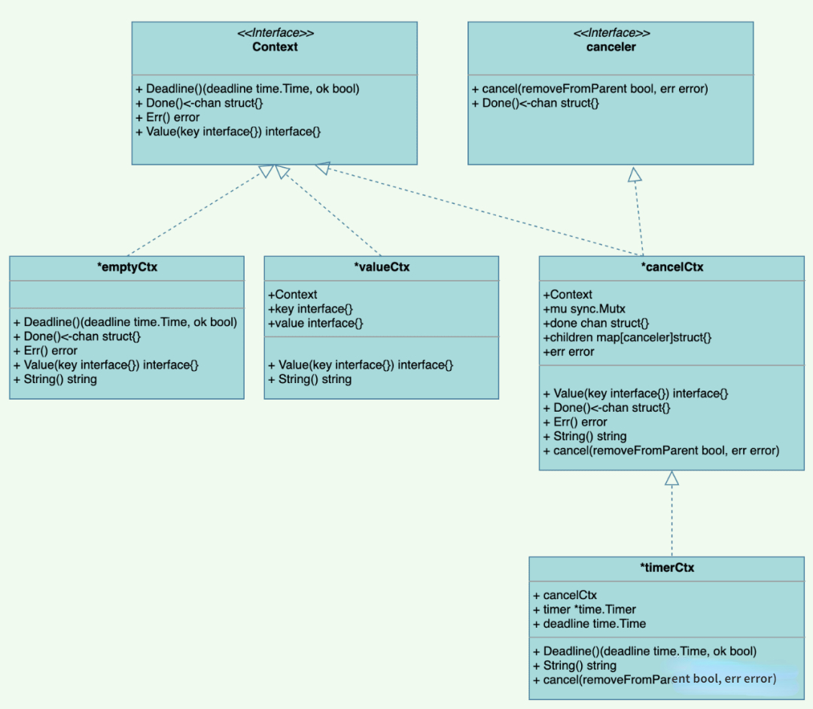
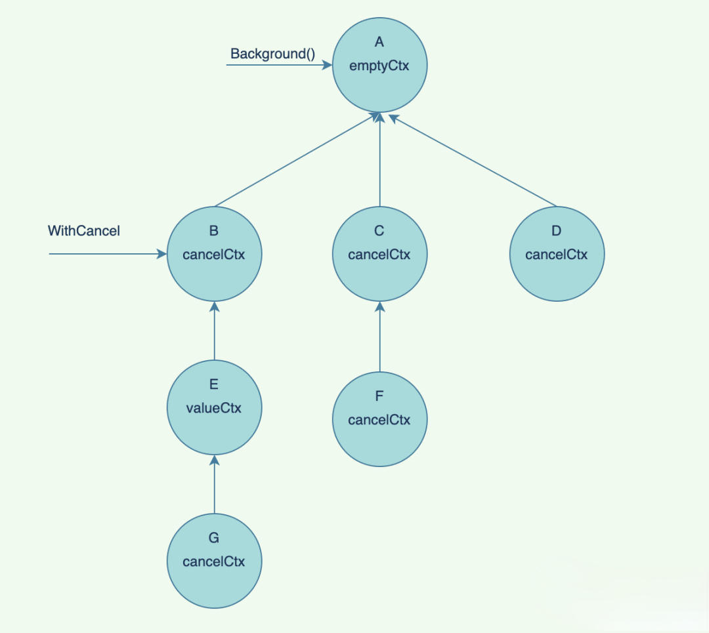
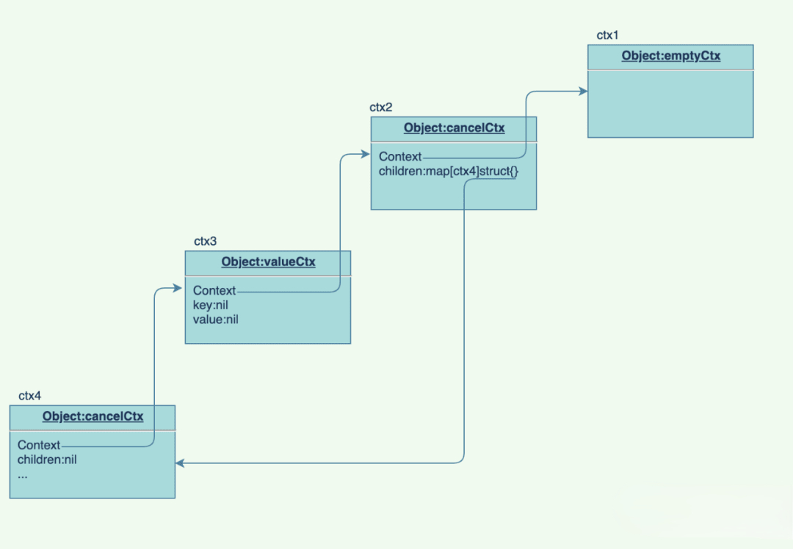
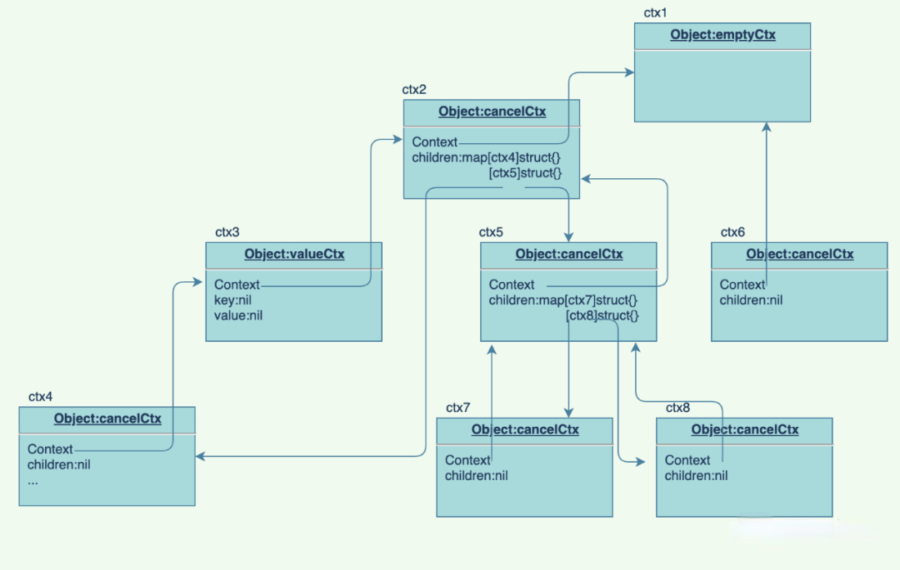
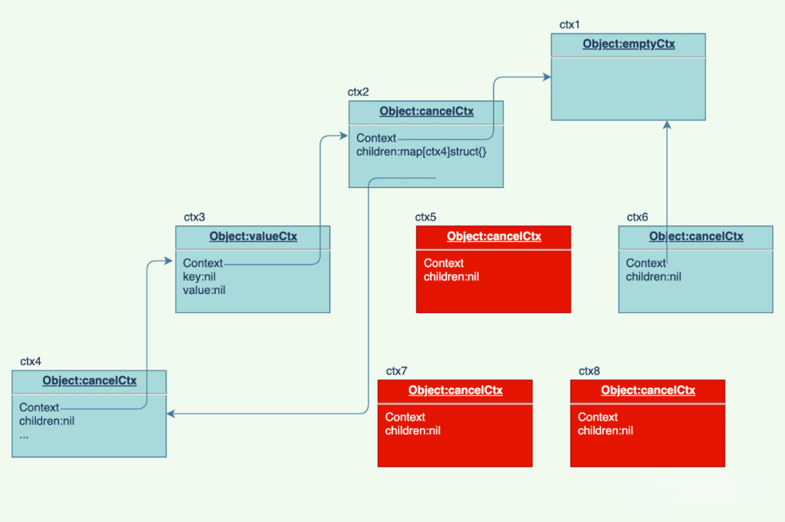
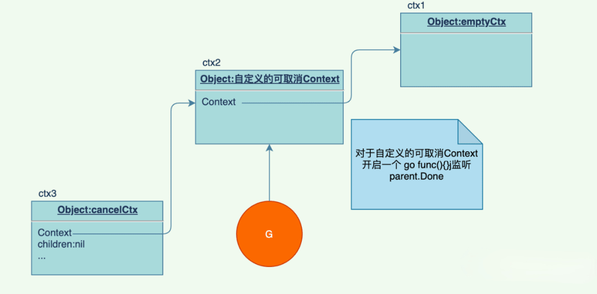
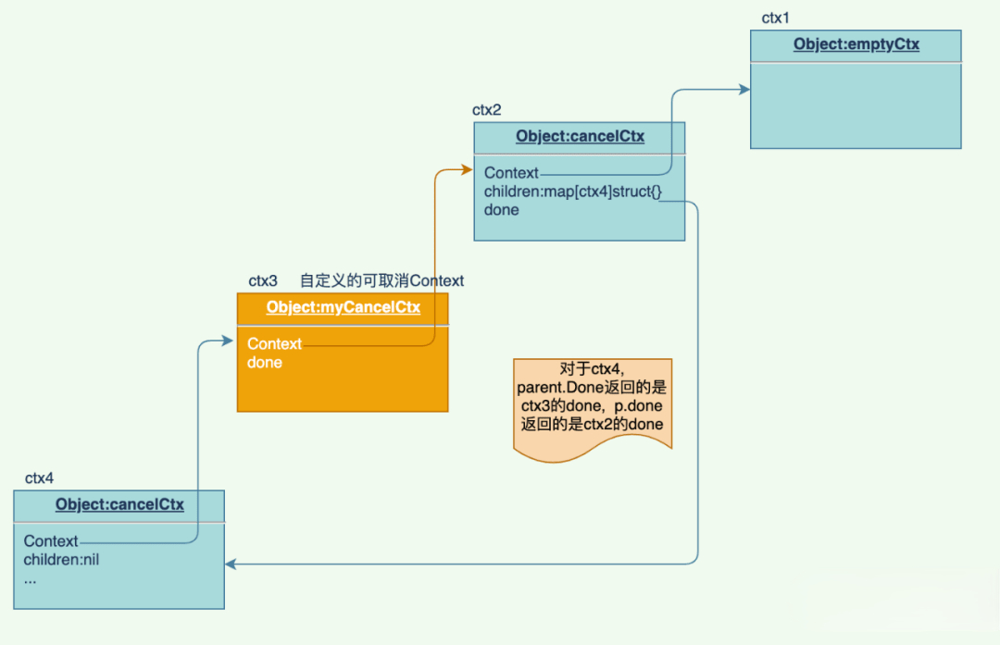
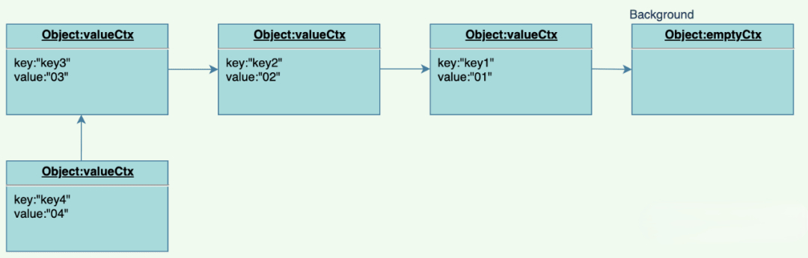

# context

context 翻译成中文就是上下文，在软件开发环境中，是指接口之间或函数调用之间，除了传递业务参数之外的额外信息，像在微服务环境中，传递追踪信息 traceID， 请求接收和返回时间，以及登录操作用户的身份等等。本文说的 context 是指 golang 标准库中的 context 包。

Go 标准库中的 context 包，提供了 goroutine 之间的**传递信息**的机制，**信号同步**，除此之外还有**超时**（timeout）和**取消**（cancel）机制。

## 必要性

Context 可以控制 goroutine 的运行，超时、取消方法的调用。这些功能其实也有别的实现方法，比如：控制 goroutine 的运行，可以通过 select + channel 的机制实现，超时控制也可以通过 ticker 实现，取消方法调用也可以向 channel 中发送信号，通知方法退出。

既然 Context 能实现的功能，也有别的方式能够实现，那为啥还要 Context 呢？在一些复杂的场景中，通过 channel 等方式控制非常繁琐，而采用 Context 可以很方便的实现上述功能。

`场景 1`：主协程启动了 m 个子协程，分别编号为 g1, g2, ... gm。对于 g1 协程，它又启动了 n 个子协程，分别编号为 g11, g12, ... g1n。现在希望主协程取消的时候或 g1 取消的时候，g1 下面的所有子协程也取消执行，采用 channel 的方法，需要申请 2 个 channel，一个是主协程退出通知的channel，另一个是 g1 退出时的 channel。g1 的所有子协程需要同时 select 这 2 个 channel。现在是 2 层，用 channel 还能接受，如果层级非常深，那监控起来需要很多的 channel，操作非常繁琐。采用 Context 可以简单的达到上述效果，不用申请一堆 channel。

`场景 2`: 在微服务中，任务 A 运行依赖于下游的任务 B, 考虑到任务 B 可能存在服务不可用，所以通常在任务 A 中会加入超时返回逻辑，需要开一个定时器，同时任务 A 也受控于父协程，当父协程退出时，希望任务A也退出，那么在任务 A 中也要监控父协程通过 channle 发送的取消信息，那有没有一种方式将这两种情况都搞定，不用既申请定时器又申请 channel，因为他们的目的都是取消任务 A 的运行，Context 就能搞定这种场景。


## 特性

- Context 是 gorountine 并发安全的；

- 支持树状的上级控制一个或者多个下级，不支持反向控制和平级控制；

- gorountine 传递 cancel 信号，结束子 gorountine 生命；

- gorountine 初始化启动子 gorountine 服务时，传入截止时刻或者超时时间来控制子 gorountine；

- gorountine 结束，对应的所有子 gorountine 生命周期结束。


## 数据结构

context 定义了两大接口，Context 和 canceler，结构体类型 `*emptyCtx`、`*valueCtx` 实现了 Context 接口，`*cancelCtx` 同时实现了 Context 接口和 cancelr 接口，`*timerCtx` 内嵌了 cancelCtx，它也间接实现了 Context 和 canceler 接口。类型结构如下：

<p align="center">

</p>


### Context 接口

Context 具体实现包括 4 个方法，分别是 Deadline、Done、Err 和 Value，如下所示：

```go
// Context 接口,下面定义的四个方法都是幂等的
type Context interface {
    // 返回这个 Context 被取消的截止时间，如果没有设置截止时间，ok 的值返回的是 false,
    // 后续每次调用对象的 Deadline 方法时，返回的结果都和第一次相同，即具有幂等性
    Deadline() (deadline time.Time, ok bool)

    // 返回一个 channel 对象，在 Context 被取消时，此 channel 会被 close。
    // 如果没有被取消，可能返回 nil。每次调用 Done 总是会返回相同的结果，
    // 当 channel 被 close 的时候，可以通过 ctx.Err 获取错误信息
    Done() <-chan struct{}

    // 返回一个 error 对象，当 channel 没有被 close 的时候，Err 方法返回 nil，
    // 如果 channel 被 close，Err 方法会返回 channel 被 close 的原因，
    // 可能是被 cancel，deadline 或 timeout 取消
    Err() error

    // 返回此 cxt 中指定 key 对应的 value
    Value(key interface{}) interface{}
}
```


### canceler 接口

canceler 接口定义如下所示，如果一个 Context 类型实现了下面定义的 2 个方法，该 Context 就是一个可取消的 Context。Context 包中结构体指针 `*cancelCtx` 和 `*timerCtx` 实现了 canceler 接口。

为什么不将这里的 canceler 接口与 Context 接口合并呢？况且他们定义的方法中都有 Done 方法。可以解释得通的说法是，源码作者认为 cancel 方法并不是 Context 必须的，根据最小接口设计原则，将两者分开。像 emptyCtx 和 valueCtx 不是可取消的，所以他们只要实现 Context 接口即可。cancelCtx 和 timerCtx 是可取消的 Context，他们要实现 2 个接口中的所有方法。

WithCancel 提供了创建可取消 Context 方法，它有 2 个返回值，分别是 Context 类型和 func() 类型，`Context`（第一个返回值）在使用时一般会传给其他协程，`func()`（第二个返回值）放在 main 协程或顶级协程中处理，实现了调用方 caller 和被调方 callee 隔离。callee 只管负责收到 caller 发送的取消信息时执行退出操作。

```go
// canceler 接口，核心是 cancel 方法
// canceler 是不可导出的，外部不能直接操作 canceler 类型对象，只能通过 func() 操作。
type canceler interface {
    cancel(removeFromParent bool, err error)
    // 这里的 Done() 不能省略，propagateCancel 中的 child.Done() 在使用
    // 因为 Context 接口中已有 Done() 方法了，它们的签名是一模一样的
    Done() <-chan struct{}
}
```


### emptyCtx

```go
type emptyCtx int
 
func (*emptyCtx) Deadline() (deadline time.Time, ok bool) {
    return
}
 
func (*emptyCtx) Done() <-chan struct{} {
    return nil
}
 
func (*emptyCtx) Err() error {
    return nil
}
 
func (*emptyCtx) Value(key interface{}) interface{} {
    return nil
}
 
func (e *emptyCtx) String() string {
    switch e {
        case background:
            return "context.Background"
        case todo:
            return "context.TODO"
    }
    return "unknown empty Context"
}
 
var (
    // background 和 todo 是两个全局 Context，实现方式都是返回 nil 值
    // 两者都不可导出，通过包提供的 Background() 和 TODO() 导出供外部使用
    // 两者都是不可取消的 Context，通常都是放在 main 函数或者最顶层使用
    background = new(emptyCtx)
    todo       = new(emptyCtx)
)

// Background returns a non-nil, empty Context. It is never canceled, has no
// values, and has no deadline. It is typically used by the main function,
// initialization, and tests, and as the top-level Context for incoming
// requests.
func Background() Context {
    return background
}
 
// TODO returns a non-nil, empty Context. Code should use context.TODO when
// it's unclear which Context to use or it is not yet available (because the
// surrounding function has not yet been extended to accept a Context
// parameter).
func TODO() Context {
    return todo
}
```


### cancelCtx

cancleCtx 结构字段比 emptyCtx 丰富多了，它内嵌了 Context 接口，在 golang 中，内嵌也就是继承，当我们将一个实现了 Context 的结构体赋值给 cancleCtx 的时候，cancelCtx 也就实现了 Context 定义的 4 个方法。只不过 *cancelCtx 重写了 Done、Err 和 Value 方法。

cancelCtx 可以级联成一个树形结构，如下图所示：当 B 被取消的时候，挂在它下面的 G 也会被取消，E 节点是不可被取消的节点，所以它就不存在取消说法。就是当父节点被取消的时候，它下面所有的子节点都会被取消。

<p align="center">

</p>

```go
// cancelCtx 是可取消的 Context，当它被取消的时候，它的孩子 cancelCtx 也都会被取消，也就是级联取消
type cancelCtx struct {
    Context
    // 互斥锁字段，保护下面字段，防止存在 data race
    mu sync.Mutex 
    // done 表示是否取消标记，当 done 被取消，也就是 close(done) 之后
    // 调用 cancelCtx.Done()，会直接返回
    // 延迟创建，由首次取消调用关闭
    done chan struct{} 
    // 记录可取消的孩子节点，首次取消调用置为 nil
    children map[canceler]struct{} 
    // 当 done 没有取消即没有关闭的时候，err 返回 nil，
    // 当 done 被关闭时，err 返回非空值，
    // err 值的内容反映被关闭的原因，是主动 cancel 还是 timeout 取消
    err error 
}
```

`*cancelCtx.Value` 方法返回的是 cancelCtx 的自身地址，只有当可被取消的类型是 context 中定义的 cancelCtx 时，才会被返回，否则，递归查询 c.Context.Value，直到最顶级的 emptyCtx，会返回 nil。

```go
// *cancelCtx.Value 并不是给外部使用的，它主要表示当前调用者的 Context 是一个 *cancelCtx
func (c *cancelCtx) Value(key interface{}) interface{} {
    if key == &cancelCtxKey {
        return c
    }
    return c.Context.Value(key)
}
```

结合下面的图很好理解，ctx4.Value(&cancelCtxKey) 会返回它本身的地址 &ctx4。对于 ctx3.Value(&cancelCtxKey)，因为它是 valueCtx，结合 valueCtx.Value(key) 源码可以看到，它的 key 不可能是 &cancelCtxKey，因为在包外是不能获取到 cancelCtxKey 地址的，它是不可导出的，会走到 ctx3.Context.Value(&cancelCtxKey)，就是在执行 ctx2.Value(&cancelCtxKey)，ctx2 是 cancelCtx，所以会返回 ctx2 的地址 &ctx2。

<p align="center">

</p>

`Done` 方法用于通知该 Context 是否被取消，通过监听 channel 关闭达到被取消通知目的，c.done 没有被关闭的时候，调用 Done 方法会被阻塞，被关闭之后，调用 Done 方法返回 struct{}。这里采用惰性初始化的方法，当 c.done 未初始化的时候，先初始化。

```go
// 初始化的时候 *cancelCtx.done 是未初始化的 channel，所以它的值是 nil，这里判断如果它是 nil 
// 表明 channel done 还未初始化，先进行初始化。如果已初始化，返回的是 c.done 的值。
// 这里有两点对于新手值得学习：
// 一是 c.done 先赋值给一个临时变量，return 的是临时变量，不能直接 return c.done
// 因为这样 c.done 会处于 c.mu 锁之外，未起到保护作用。
// 二是这里采用惰性初始化方式，新创一个 *cancelCtx 的时候没有立即初始化，
// 而是在使用 *cancelCtx.Done 时进行初始化
func (c *cancelCtx) Done() <-chan struct{} {
    c.mu.Lock()
    if c.done == nil {
        c.done = make(chan struct{})
    }
    d := c.done
    c.mu.Unlock()
    return d
}
```

`cancel` 方法通过关闭 *cancelCtx.done 达到通知 callee 的目的。如果 c.done 还未初始化，说明 Done 方法还未被调用，这时候直接将 c.done 赋值一个已关闭的 channel，Done 方法被调用的时候不会阻塞直接返回 strcut{}。然后递归对子节点进行 cancel 操作，最后将当前的 cancelCtx 从它所挂载的父节点中的 children map 中删除。

注意 `removeFromParent` 参数，对所有子节点进行 cancel 的时候，即下面的 child.cancle(false,err) 传递的是 false，都会执行 c.children=nil 做清空操作，所以没有必要传 true，在最外层 cancel function 被 cancel 的时候，removeFromParent 要传 true，这里需要将 cancelCtx 从它的父节点 children 中移除掉，因为父级节点并没有取消。

<p align="center">

</p>

<p align="center">

</p>

```go
// 取消操作，通过关闭 *cancelCtx.done 达到通知的效果，WithCancel 函数调用的时候
// 返回一个 context 和 cancel function，cancel function 是一个闭包函数，关联了外层
// 的 context，当 cancel function 被调用的时候，实际执行的是 *cancelCtx.cancel 函数
// 将 *cancelCtx.done 关闭，callee 调用 context.Done 会返回，然后对挂在下面的 children
// canceler 执行递归操作，将所有的 children 自底向上取消。
// note: 这里在递归取消子 canceler 的时候，removeFromParent 传递参数为 false, 为啥这样写呢？
// 因为这里所有子 canceler 的 children 都会执行 c.children=nil，做清空操作，
// 所有没有必要传 true 进行 removeChild(c.Context,c) 操作了。
// 在最外层 cancel function 调用 cancel 的时候，removeFromParent 要传 true, 这里需要
// 将 *cancelCtx 从它的父级 canceler 中的 children 中移除掉，因为父级 canceler 并没有取消
func (c *cancelCtx) cancel(removeFromParent bool, err error) {
    if err == nil {
        panic("context: internal error: missing cancel error")
    }
    c.mu.Lock()
    if c.err != nil {
        c.mu.Unlock()
        return // already canceled
    }
    c.err = err
    if c.done == nil {
        c.done = closedchan
    } else {
        close(c.done)
    }
    for child := range c.children {
        // NOTE: acquiring the child's lock while holding parent's lock.
        // 子 *cancelCtx 不用执行 removeChild() 操作，自底向上递归清理了 children.
        child.cancel(false, err)
    }
    c.children = nil
    c.mu.Unlock()
    
    if removeFromParent {
        removeChild(c.Context, c)
    }
}
```

查找 child 的挂载点，找到第一个 *cancelCtx，将 child 挂在它下面，如果父节点都是不可取消的，那就不存在挂载点，直接返回。还有一种情况，找到了可取消的 Context，但这个 Context 不是 cancelCtx，这种可取消的 Context 是我们自定义结构体类型，它是没有 children 的。对应下面的单独开启一个 goroutine 的代码，监听 parent.Done，当 parent 被取消的时候，取消下面的子节点，即 child.cancel。child.Done 是不能省略不写的，当 child 取消的时候，这里启动的 groutine 退出，防止泄露。

<p align="center">

</p>

```go
// 查找 child 的挂载点，如果父级 Context 都是不可取消的，直接返回，因为不存在这样的挂载点
// 从 parent 中沿着父级向上查找第一个 *cancelCtx，找到了就将 child 添加到
// p.children 中，如果没有找到 *cancelCtx，但是一个别类型的可取消Context，启动一个
// goroutine 单独处理
 
func propagateCancel(parent Context, child canceler) {
    done := parent.Done()
        if done == nil {
        return // parent is never canceled
    }
    
    select {
        case <-done:
        // parent is already canceled
        child.cancel(false, parent.Err())
        return
        default:
    }
    
    if p, ok := parentCancelCtx(parent); ok {
        p.mu.Lock()
        if p.err != nil {
        // parent has already been canceled
        child.cancel(false, p.err)
        } else {
            if p.children == nil {
                p.children = make(map[canceler]struct{})
            }
            p.children[child] = struct{}{}
        }
        p.mu.Unlock()
    } else {
        atomic.AddInt32(&goroutines, +1)
        // 走到这里表示找到了一个可取消的 Context(done 非 nil)，但这个可取消的 Context
        // 并不是 *cancelCtx, 那这个 Context 是啥呢？它可能是我们自己实现的可取消的 
        // Context 类型，他是没有 children map 字段的，当它被取消的时候，要通知
        // 子 Context 取消，即要执行 child.cancel
        // 这里的 case <- parent.Done()不能省略
        go func() {
            select {
            // 这里的 parent.Done() 也是不能省略的，当 parent Context 取消的时候，
            // 要取消下面的子 Context child
            // 如果去掉，就不能级联取消子Context了。
            case <-parent.Done():
            // 因为父级 Context 并不是 *cancelCtx，也就不存在 p.children，
            // 不用执行 removeChild 操作，这里直接传 false
            child.cancel(false, parent.Err())
    
            // 当 child 取消的时候，这里启动的 groutine 退出，防止泄露
            case <-child.Done():
            }
        }()
    }
}
```

`parentCancel` 查找 parent 的第一个 *cancelCtx，如果 done 为 nil 表示是不可取消的 Context，如果 done 为 closedchan 表示 Context 已经被取消了，这两种情况可以直接返回，不存 cancelCtx 了。

parent.Value(&cancelCtxKey) 递归向上查找节点是不是 cancelCtx。注意这里 p.done==done 的判断，是防止下面的情况，parent.Done 找到的可取消 Context 是我们自定义的可取消 Context，这样 parent.Done 返回的 done 和 cancelCtx 肯定不在一个同级，它们的 done 肯定是不同的。这种情况也返回 nil。

<p align="center">

</p>

```go
// 从 parent 位置沿着父级不断的向上查找，直到遇到第一个 *cancelCtx 或者不存这样的 *cancelCtx
func parentCancelCtx(parent Context) (*cancelCtx, bool) {
 done := parent.Done()
    // done=closedchan 表示父级可取消的 Context 已取消，可以自己返回了
    // done=nil 表示一直向上查找到了顶级的 background/todo Context，也可以直接返回了
    if done == closedchan || done == nil {
        return nil, false
    }
    // 递归向上查询第一个 *cancelCtx
    p, ok := parent.Value(&cancelCtxKey).(*cancelCtx)
    if !ok {
        return nil, false
    }
    p.mu.Lock()
    // 这里为啥要判断 p.done==done, 见源码分析说明
    ok = p.done == done
    p.mu.Unlock()
    if !ok {
        return nil, false
    }
    return p, true
}
```

`removeChild` 比较简单，将 child 从 parent 最先遇到的 *cancelCtx 中的 children map 中删除。

```go
// 从 parent 中找到最先遇到的 *cancelCtx，这个是 child 的挂载点，
// 将 child 从最先遇到的 *cancelCtx map 中删除。
func removeChild(parent Context, child canceler) {
    p, ok := parentCancelCtx(parent)
    if !ok {
        return
    }
    p.mu.Lock()
    if p.children != nil {
        delete(p.children, child)
    }
    p.mu.Unlock()
}
```


### timerCtx

timerCtx 内嵌有 cancelCtx，所以它是一个可取消的 Context，此外它有超时定时器和超时截止时间字段，对 timer 和 deadline 的访问，是通过 cancelCtx.mu 加锁防止 data race 的。

```go
// timeCtx 超时取消 Context，内嵌有 cancelCtx，所以间接实现了 Context 接口
type timerCtx struct {
    cancelCtx
    // 超时定时器
    timer *time.Timer // Under cancelCtx.mu.
    // 超时截止时间
    deadline time.Time
}
```

`WithDeadline` 是创建 timerCtx 的构造函数，用于返回一个可超时取消的 Context。

```go
// 可以理解为创建超时 Context 的构造函数，需要传入一个超时接着时间，创建了一个 *timeCtx 类型
// 通过 *timeCtx 结构体定义可以看到，它内嵌了一个 cancelCtx 类型，这里需要注意下，
// 虽然内嵌的是 cancelCtx 类型，但是他是实现了 Context 接口的，因为 cancelCtx 中
// 内嵌有 Context，所以 cancelCtx 实现了 Context 接口，只不过重写了 
// *cancelCtx.Done(), *cancel.Err(), *cancel.Value() 的实现
// 进一步 timerCtx 内嵌有 cancelCtx，所以 timerCtx 也实现了 Context 接口
func WithDeadline(parent Context, d time.Time) (Context, CancelFunc) {
    // 父级 Context 的超时时间比 d 早，直接创建一个可取消的 context, 原因是
    // 父级 context 比子 context 先超时，当父级超时时，会自动调用 cancel 函数，
    // 子级 context 也会被取消了。所以不用单独处理子级 context 的定时器，到时之后，
    // 自动调用 cancel 函数。
    if cur, ok := parent.Deadline(); ok && cur.Before(d) {
        // The current deadline is already sooner than the new one.
        return WithCancel(parent)
    }
    c := &timerCtx{
        cancelCtx: newCancelCtx(parent),
        deadline:  d,
    }
    // 同 cancelCtx 的操作相同 ，将当前的 c 挂到父级 context 节点上
    propagateCancel(parent, c)
    dur := time.Until(d)
    if dur <= 0 {
        // 如果时间已超时，直接取消
        c.cancel(true, DeadlineExceeded) // deadline has already passed
        return c, func() { c.cancel(false, Canceled) }
    }
    c.mu.Lock()
    defer c.mu.Unlock()
    if c.err == nil {
        // 启动一个定时器，在 dur 时间后，自动进行取消操作
        c.timer = time.AfterFunc(dur, func() {
        c.cancel(true, DeadlineExceeded)
        })
    }
    return c, func() { c.cancel(true, Canceled) }
}
```

`Deadline` 方法返回 timerCtx 是否设置了超时截止日期，这里始终返回 true，因为通过 WithTimeout 和 WithDeadline 创建的 *timerCtx 都设置了超时时间。

```go
// *timeCtx 重写了 Deadline 实现，方法会返回这个
// Context 被取消的截止日期。如果没有设置截止日期，
// ok 的值是 false。后续每次调用这个对象的 Deadline 方法时，
// 都会返回和第一次调用相同的结果
// note: 这里 ok 为啥直接返回 true 呢？因为通过创建 *timeCtx 的两个方法 WithDeadline
// 和 WithTimeout 都设置了 *timeCtx.deadline 值
func (c *timerCtx) Deadline() (deadline time.Time, ok bool) {
    return c.deadline, true
}
```

*timerCtx 重写了 cancel 的 cancel 方法，先会执行 *timeCtx.cancelCtx.cancel，将子级 context 取消，然后将当前的 *timerCtx 从父级 Context 移除掉，最后将定时器停止掉并清空。

```go
func (c *timerCtx) cancel(removeFromParent bool, err error) {
    c.cancelCtx.cancel(false, err)
    if removeFromParent {
        // Remove this timerCtx from its parent cancelCtx's children.
        removeChild(c.cancelCtx.Context, c)
    }
    c.mu.Lock()
    if c.timer != nil {
        c.timer.Stop()
        c.timer = nil
    }
    c.mu.Unlock()
}
```

`WithTimeout` 是对 WithDeadline 的包装，将 timeout 转换成了 deadline。

```go
// 提供了创建超时 Context 的构造函数，内部调用的是 WithDeadline，
// 创建的都是 *timerCtx 类型。
func WithTimeout(parent Context, timeout time.Duration) (Context, CancelFunc) {
    return WithDeadline(parent, time.Now().Add(timeout))
}
```


### valueCtx

key-value Context，在协程中传递信息的 Context，key 和 value 分别对应传递信息的键值对。进行 key 和 value 的赋值（WithValue 函数）与访问（Value 函数）操作时，并没有加锁处理，因为不需要，具体原因见 *valueCtx.Value 处的说明。

```go
type valueCtx struct {
    Context
    key, val interface{}
}
```

`WithValue` 函数是产生 *valueCtx 的唯一方法，即该函数是 *valueCtx 的构造函数。key 不能为空且是可以比较的，在 golang 中 

- int、float、string、bool、complex、pointer、channel、interface、array 是可以比较的；
- slice、map、function 是不可比较的，复合类型中带有不可比较的类型，该复合类型也是不可比较的。

```go
func WithValue(parent Context, key, val interface{}) Context {
    if key == nil {
        panic("nil key")
    }
    if !reflectlite.TypeOf(key).Comparable() {
        panic("key is not comparable")
    }
    return &valueCtx{parent, key, val}
}
```

使用 WithValue 的时候注意传递的 value 是线程安全的。withValue 可能在多个 goroutine 中使用，而 *withValue.value 在赋值时无需加锁保护，但是要确保对 value 操作的安全性，例如当 value 是一个 map 对象时，在每个 groutine 是不能修改的，那怎么办呢？当需要修改的时候，采用 COW 技术即写时复制，将原 map 复制一份新的，在新的上面修改。

<p align="center">

</p>

`Value` 函数提供根据键查询值的功能，valueCtx 组成了一个链式结构，可以理解成一个头插法创建的单链表，Value 函数从当前的 Context 查询 key，如果没有查到，继续查询 valueCxt 的 Context 是否有对应的 key，可以想象成从当前链表节点，向后顺序查询后继节点是否存在对应的 key，直到尾节点（background 或 todo Context），background/todo Value 返回 nil。

Value 操作没有加锁处理，因为传递给子协程的 valueCtx 进行 Value 操作时，其它协程不会对 valueCtx 进行修改操作，这个 valueCtx 是只读的Context，所以在 valueCtx 中对 key 和 value 的操作没有进行加锁保护处理，因为不存在 data race。

```go
func (c *valueCtx) Value(key interface{}) interface{} {
    // 要查询的 key 与当前的 valueCtx(c) 中的 key 相同，直接返回
    if c.key == key {
        return c.val
    }
    // 否则递归查询 c 中的 Context，如果所有的 Context 都没有，则最后会走到 
    // background/todo Context，background/todo Context 的 Value 函数直接返回 nil
    return c.Context.Value(key)
}
```

valueCtx 实现了链式查找。如果不存在，还会向 parent Context 去查 找，如果 parent 还是 valueCtx 的话，还是遵循相同的原则：valueCtx 会嵌入 parent，所以还是会查找 parent 的 Value 方法。下面的 ctx.Value("key1") 会不断查询父节点，直到第二个父节点，查到结果返回。

<p align="center">

</p>

```go
func main() {
    ctx := context.Background()
    ctx = WithValue(ctx, "key1", "01")
    ctx = WithValue(ctx, "key2", "02")
    ctx = WithValue(ctx, "key3", "03")
    ctx = WithValue(ctx, "key4", "04")
    
    fmt.Println(ctx.Value("key1"))
}
```

```go
// valueCtx 还实现了 String() string 签名函数，该签名是 fmt 包中一个接口，也就说
// valueCtx 实现了 fmt 中的 print 接口，可以直接传参给 fmt.Println(valueCtx) 进行打印
// 当前也可以直接 fmt.Println(valueCtx.String()) 打印。
func (c *valueCtx) String() string {
    return contextName(c.Context) + ".WithValue(type " +
    reflectlite.TypeOf(c.key).String() +
    ", val " + stringify(c.val) + ")"
}
```

```go
// stringify 只给 *valueCtx.String() 使用，在 *valueCtx.String() 函数中，调用了
// stringify(v.val), v.val 要么是 string 类型，要么实现了 stringer 接口，
// stringer 接口定义了一个方法 String() string
// 即 v.val 要么是 string 类型， 要么该类型实现了 String() string 方法
func stringify(v interface{}) string {
    switch s := v.(type) {
        case stringer:
            return s.String()
        case string:
            return s
    }
    return "<not Stringer>"
}
```


### 应用场景

- 并发多服务调用情况下。比如一个请求进来，启动 3 个 goroutine 进行  RpcA 、RpcB 、RpcC 三个服务的调用。这时候只要有其中一个服务错误，就返回错误，同时取消另外两个 Rpc 服务。可以通过 WithCancel 方法来实现；
- 超时请求。比如对 Http、Rpc 进行超时限制，可以通过 WithDeadline 和 WithTimeout 来实现；
- 携带数据。比如一个请求的用户信息，一般业务场景，我们会有一个专门的中间件来校验用户信息，然后把用户信息注入到 context 中，或者共享给派生出来的多个 goroutine 使用，可以通过 WithValue 方法实现。


# sort

## sort.SearchInts

SearchInts 在排序的整数切片中搜索 x 并返回 Search 指定的索引。 如果 x 不存在，则返回值是插入 x 的索引（它可能是 len(a)）。 切片必须按升序排序。

源码：

```go
func SearchInts(a []int, x int) int {
	return Search(len(a), func(i int) bool { return a[i] >= x })
}
func Search(n int, f func(int) bool) int {
	// 定义 f(-1) == false and f(n) == true.
	// 如果 f(i-1) == false, 则f(j) == true.
	i, j := 0, n
	for i < j {
		h := int(uint(i+j) >> 1) // 转换成uint防止溢出
		// i ≤ h < j
		if !f(h) {
			i = h + 1 // 保证f(i-1) == false
		} else {
			j = h // 保证 f(j) == true
		}
	}
	// 此时i == j, f(i-1) == false, f(j) == f(i) == true 得出 answer is i.
	return i
}
```


# strings

## strings.Split

### 描述

strings.Split函数用于将指定的分隔符切割字符串，并返回切割后的字符串切片。

### 语法

需要导入 strings包

```go
import "strings"

strings.Split(s, sep)
```

### 参数

| 参数 |      说明      |       备注       |
| :--: | :------------: | :--------------: |
|  s   | 待分割的字符串 | 字符串类型的参数 |
| sep  |     分隔符     | 字符串类型的参数 |

### 返回值

返回一个字符串切片。

### 使用示例

Split() 函数将字符串根据分隔符切割。切割后返回一个字符串切片，切片 len 和 cap 值等于原字符串中存在分隔符的数量 + 1（仅在 s 不是空字符串的情况下成立）。

```go
package main
 
import (
	"fmt"
	"strings"
)
 
func main() {
	demo := "I&love&Go,&and&I&also&love&Python."
	string_slice := strings.Split(demo, "&")
 
	fmt.Println("result:",string_slice)
	fmt.Println("len:",len(string_slice))
	fmt.Println("cap:", cap(string_slice))
}
```

运行结果如下：

```go
result: [I love Go, and I also love Python.]
len: 8
cap: 8
```

### 注意事项

1. 当分隔符不存在于原字符串中时

当分隔符在原字符串中不存在的情况下，Split()函数仅仅将原字符串转换成一个 len 和 cap 值都为 1 的字符串切片。

2. 当分隔符是空字符串时

当分隔符是空字符串时，Split() 函数将字符串中的每一个字符分割成一个单独的元素。

3. 参数都为空字符串

当 Split() 函数的两个参数都是空字符串时（即 s 和 sep 都是空字符串），Split() 函数返回一个 len 和 cap 值都为 0 的空字符串切片。

4. 当s为空字符串，sep不为空字符串时

不同于上一个场景，在这种情况下虽然得到的结果仍然是字符串切片，但是字符串切片的 len 和 cap 值是 1（而不是像上一个场景中的值是 0）。返回的结果是包含一个空字符串的字符串切片。
