# 概述

Go 语言也称为 Golang，是由 Google 公司开发的一种静态强类型、编译型、并发型、并具有垃圾回收功能的编程语言。

其具有以下几个主要特性：

## 语法简单

抛开语法样式不谈，单就类型和规则而言，Go 与 C99、C11 相似之处颇多，这也是 Go 语言被冠以 “NextC” 名号的重要原因。

Go 语言的语法处于简单和复杂的两极。C 语言简单到你每写下一行代码，都能在脑中想象出编译后的模样，指令如何执行，内存如何分配，等等。而 C 的复杂在于，它有太多隐晦而不着边际的规则，着实让人头疼。相比较而言，Go 从零开始，没有历史包袱，在汲取众多经验教训后，可从头规划一个规则严谨、条理简单的世界。

Go 语言的语法规则严谨，没有歧义，更没什么黑魔法变异用法。任何人写出的代码都基本一致，这使得 Go 语言简单易学。放弃部分“灵活”和“自由”，换来更好的可维护性。

将 “++”、“--” 从运算符降级为语句，保留指针，但默认阻止指针运算。还有，将切片和字典作为内置类型，从运行时的层面进行优化，这也算是一种“简单”。

## 并发模型

时至今日，并发编程已成为程序员的基本技能，在各个技术社区都能看到诸多与之相关的讨论主题。在这种情况下 Go 语言却一反常态做了件极大胆的事，从根本上将一切都并发化，运行时用 Goroutine 运行所有的一切，包括 main.main 入口函数。

可以说，Goroutine 是 Go 最显著的特征。它用类协程的方式来处理并发单元，却又在运行时层面做了更深度的优化处理。这使得语法上的并发编程变得极为容易，无须处理回调，无须关注线程切换，仅一个关键字，简单而自然。

搭配 channel，实现 CSP 模型。将并发单元间的数据耦合拆解开来，各司其职，这对所有纠结于内存共享、锁粒度的开发人员都是一个可期盼的解脱。若说有所不足，那就是应该有个更大的计划，将通信从进程内拓展到进程外，实现真正意义上的分布式。

## 内存分配

将一切并发化固然是好，但带来的问题同样很多。如何实现高并发下的内存分配和管理就是个难题。好在 Go 选择了 tcmalloc，它本就是为并发而设计的高性能内存分配组件。

可以说，内存分配器是运行时三大组件里变化最少的部分。刨去因配合垃圾回收器而修改的内容，内存分配器完整保留了 tcmalloc 的原始架构。使用 cache 为当前执行线程提供无锁分配，多个 central 在不同线程间平衡内存单元复用。在更高层次里，heap 则管理着大块内存，用以切分成不同等级的复用内存块。快速分配和二级内存平衡机制，让内存分配器能优秀地完成高压力下的内存管理任务。

在最近几个版本中，编译器优化卓有成效。它会竭力将对象分配在栈上，以降低垃圾回收压力，减少管理消耗，提升执行性能。可以说，除偶尔因性能问题而被迫采用对象池和自主内存管理外，我们基本无须参与内存管理操作。

## 垃圾回收

垃圾回收一直是个难题。早年间，Java 就因垃圾回收低效被嘲笑了许久，后来 Sun 连续收纳了好多人才和技术才发展到今天。可即便如此，在 Hadoop 等大内存应用场景下，垃圾回收依旧捉襟见肘、步履维艰。

相比 Java，Go 面临的困难要更多。因指针的存在，所以回收内存不能做收缩处理。幸好，指针运算被阻止，否则要做到精确回收都难。

每次升级，垃圾回收器必然是核心组件里修改最多的部分。从并发清理，到降低 STW 时间，直到 Go 的 1.5 版本实现并发标记，逐步引入三色标记和写屏障等等，都是为了能让垃圾回收在不影响用户逻辑的情况下更好地工作。尽管有了努力，当前版本的垃圾回收算法也只能说堪用，离好用尚有不少距离。

## 静态链接

Go 刚发布时，静态链接被当作优点宣传。只须编译后的一个可执行文件，无须附加任何东西就能部署。这似乎很不错，只是后来风气变了。连着几个版本，编译器都在完善动态库 buildmode 功能，场面一时变得有些尴尬。

暂不说未完工的 buildmode 模式，静态编译的好处显而易见。将运行时、依赖库直接打包到可执行文件内部，简化了部署和发布操作，无须事先安装运行环境和下载诸多第三方库。这种简单方式对于编写系统软件有着极大好处，因为库依赖一直都是个麻烦。

## 标准库

功能完善、质量可靠的标准库为编程语言提供了充足动力。在不借助第三方扩展的情况下，就可完成大部分基础功能开发，这大大降低了学习和使用成本。最关键的是，标准库有升级和修复保障，还能从运行时获得深层次优化的便利，这是第三方库所不具备的。

Go 标准库虽称不得完全覆盖，但也算极为丰富。其中值得称道的是 net/http，仅须简单几条语句就能实现一个高性能 Web Server，这从来都是宣传的亮点。更何况大批基于此的优秀第三方 Framework 更是将 Go 推到 Web/Microservice 开发标准之一的位置。

当然，优秀第三方资源也是语言生态圈的重要组成部分。近年来崛起的几门语言中，Go 算是独树一帜，大批优秀作品频繁涌现，这也给我们学习 Go 提供了很好的参照。

## 工具链

完整的工具链对于日常开发极为重要。Go 在此做得相当不错，无论是编译、格式化、错误检查、帮助文档，还是第三方包下载、更新都有对应的工具。其功能未必完善，但起码算得上简单易用。

内置完整测试框架，其中包括单元测试、性能测试、代码覆盖率、数据竞争，以及用来调优的 pprof，这些都是保障代码能正确而稳定运行的必备利器。

除此之外，还可通过环境变量输出运行时监控信息，尤其是垃圾回收和并发调度跟踪，可进一步帮助我们改进算法，获得更佳的运行期表现


# 基础数据类型

## Silce（切片）

`slice` 是 Go 中的一种基本的数据结构，使用这种结构可以用来管理数据集合。


### slice 底层结构

slice 数据结构如下:

```go
type slice struct {
    array unsafe.Pointer
    len   int
    cap   int
}
```

slice 的结构体由3部分构成，Pointer 是指向一个数组的指针，len 代表当前切片的长度，cap 是当前切片的容量。cap 总是大于等于 len 的。

slice 自身并不是动态数组或者数组指针。它内部实现的数据结构通过指针引用底层数组，设定相关属性将数据读写操作限定在指定的区域内。

slice 是对数组一个连续片段的引用，所以切片是一个引用类型（因此更类似于 C/C++ 中的数组类型，或者 Python 中的 list 类型）。这个片段可以是整个数组，或者是由起始和终止索引标识的一些项的子集。

切片本身不包含任何数据，它仅仅是底层数组的一个上层表示。对切片进行的任何修改都将反映在底层数组中。当多个切片共享同一个数组时，对每一个切片的修改都将会反映到这个数组中。

**Go 中对 nil 的 Slice 和空 Slice 的处理是一致的吗？**

首先 Go 的 JSON 标准库对 `nil slice` 和 空 `slice` 的处理是不一致的。

通常错误的用法，会报**数组越界**的错误，因为只是声明了 slice，却没有给实例化的对象。

```go
var slice []int
slice[1] = 0
```

此时 slice 的值是 nil，这种情况可以用于需要返回 slice 的函数，当函数出现异常的时候，保证函数依然会有 nil 的返回值。

`empty slice` 是指 slice 不为 nil，但是 slice 没有值，slice 的底层空间是空的，此时的定义如下：

```go
slice := make([]int,0）
//or
slice := []int{}
```
当我们查询或者处理一个空的列表的时候，这非常有用，它会告诉我们返回的是一个列表，但是列表内没有任何值。

总之，`nil slice` 和 `empty slice`是不同的东西，需要我们加以区分。


### 切片与数组的区别

1. 初始化方式

**数组**：
```Go
a := [3]int{1,2,3} //指定长度
//or
a := [...]int{1,2,3} //不指定长度
//虽然数组在初始化时也可以不指定长度，但 Go 语言会根据数组中元素个数自动设置数组长度，并且不可改变。
s := []int{1,2,3} 
```

如果将 append 用在数组上，你将会收到报错：first argument to append must be slice。

**切片**：
```Go
s := make([]int, 3) //指定长度
//or
s := []int{1,2,3} //不指定长度
```

切片其实还有一个指定长度和容量的初始化方式：
```Go
s := make([]int, 3, 5)//初始化一个长度为3，容量为5的切片
```

切片还可以从一个数组中初始化（可应用于如何将数组转换成切片）：
```Go
a := [3]int{1,2,3}
s := a[:]
```

2. 函数传递

当切片和数组作为参数在函数（func）中传递时，数组传递的是值，而切片传递的是指针。因此当传入的切片在函数中被改变时，函数外的切片也会同时改变。相同的情况，函数外的数组则不会发生任何变化。

在 Go 中数组是值类型而不是引用类型。这意味着当数组变量被赋值时，将会获得原数组的拷贝，新数组中元素的改变不会影响原数组中元素的值。如果将数组作为参数传递给函数，仍然是值传递，在函数中对（作为参数传入的）数组的修改不会造成原数组的改变。

当将一个切片作为参数传递给一个函数时，虽然是值传递，但是指针始终指向同一个数组。因此将切片作为参数传给函数时，函数对该切片的修改在函数外部也可以看到。


### slice 如何扩容

通常我们在对 slice 进行 append 等操作时，可能会造成 slice 的自动扩容。

1. 预估扩容后的容量 newCap

* 如果扩容前容量翻倍，还是小于所需的最小容量，那么预估容量就等于所需的最小容量。

* 如果扩容前元素个数小于 1024，直接翻倍；如果扩容前元素大于等于 1024，那就先扩容原来的 1/4。

<p align="center">
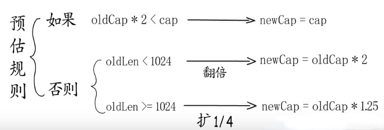
</p>

2. newCap 需要多大内存

这一步需要计算需要的内存，这就和元素类型挂钩了。用 `预估容量 * 元素类型大小` 得到的就是所需内存。但是不可以直接分配这么多内存。

简单来说，在许多编程语言中，申请内存并不是直接与操作系统交涉的，而是与语言自身实现的内存管理模块进行交涉。它会提前向操作系统申请一块内存，分成常用的规格管理起来，我们申请内存时，它会帮我们匹配到足够大且最接近的规格。

如果扩容之后，还没有触及原数组的容量，切片中的指针指向的位置，就还是原数组；如果扩容之后，超过了原数组的容量，Go 就会开辟一块新的内存，把原来的值拷贝过来，这种情况丝毫不会影响到原数组。

通过 slice 源码可以看到，append 的实现只是简单的在内存中将旧 slice 复制给新 slice。

```go

newcap := old.cap

if newcap+newcap < cap {
    newcap = cap
} else {
    for {
        if old.len < 1024 {
            newcap += newcap
        } else {
            newcap += newcap / 4
        }
        if newcap >= cap {
            break
        }
    }
}
```


### slice 内存优化

当将一个切片作为参数传递给一个函数时，虽然是值传递，但是指针始终指向同一个数组。因此将切片作为参数传给函数时，函数对该切片的修改在函数外部也可以看到。

当将一个切片作为参数传递给一个函数时，虽然是值传递，但是指针始终指向同一个数组。因此将切片作为参数传给函数时，函数对该切片的修改在函数外部也可以看到。

解决该问题的一个方法是使用 copy 函数 `func copy(dst, src[]T) int` 来创建该切片的一个拷贝。这样我们就可以使用这个新的切片，原来的数组可以被垃圾回收。


## Map（映射）

### map 底层结构

Go 中 Map 是一个 KV 对集合，底层使用`hash table`，用`链地址法`来解决冲突 ，出现冲突时，不是每一个 Key 都申请一个结构通过链表串起来，而是以 bmap 为最小粒度挂载，一个 bmap 可以放 8 个 KV。

在哈希函数的选择上，会在程序启动时，检测 cpu 是否支持 `aes`，如果支持，则使用`aes hash`，否则使用`memhash`。

```markdown
hash函数,有加密型和非加密型。加密型的一般用于加密数据、数字摘要等，典型代表就是md5、sha1、sha256、aes256 这种,非加密型的一般就是查找。

在map的应用场景中，用的是查找。

选择hash函数主要考察的是两点：性能、碰撞概率。
```

#### 结构体定义

```go
type hmap struct {
    // 当前 map 中元素数量 即 len(map) 返回的值。
	count     int 
    // 当前 map 所处状态标记，比如正在写入、正在迭代等。
	flags     uint8
    // 桶的数量的值，最终 map 创建的桶的数量为 2^B 
    // 另外在使用 Key 的哈希值选桶的时候
    // 取的是该哈希值的低 B 位作为选桶的值
	B         uint8   
    // 当前溢出桶的数量
	noverflow uint16
    // hash 种子，在创建该结构体的时候动态生成
	hash0     uint32  
	
    // 指向第一个桶的指针，是一个连续的地址（因为是个数组）
    // 这里面存的是 *bmap
	buckets    unsafe.Pointer  
    // 旧桶第一个桶的指针，用于在扩容搬迁的时候未完成搬迁时保存之前的旧桶
	oldbuckets unsafe.Pointer  
    // 搬迁桶的进度，就是处于扩容搬迁时，目前搬到哪了
	nevacuate  uintptr 
    // 溢出桶，当 bmap 中存储的数据过多、单个 bmap 已经装满时
    // 就会使用 extra.nextOverflow 中的桶存储溢出的数据。
    // 溢出桶不一定会使用，因为是个可选字段
	extra *mapextra  
}

 type mapextra struct {
// 如果 key 和 value 都不包含指针，而且是内联的
// 那么我们就将 bucket 类型标记为不包含指针。
// 这样就避免了 gc 阶段对 hmap 的扫描。
// 然而，bmap.overflow 是一个指针。为了防止溢出桶被gc处理
// 我们在 hmap.extra.overflow 和 hmap.extra.oldoverflow 中存储所有溢出桶的指针。
// overflow 和 oldoverflow 只在 key 和 value 不包含指针的情况下使用
	overflow    *[]*bmap
	oldoverflow *[]*bmap
// 存储一个已经创建好了但是暂未使用的空 bmap 溢出桶
 	nextOverflow *bmap
}

// 实际存储 k，v 数据的桶
// 该结构体还有一些字段会在编译期添加
// 比如 下一个溢出桶的地址
// key，value 所处的地址等
 type bmap struct {
    // 这里存储 Key 的哈希值的高 8 位。例如 11111111 00000000
    // 用于在查找时快速的去判断当前 Key 是否存在这个桶里
    // 因此得出，每个桶只能存放 8 个 Key-Value 映射
    tophash [bucketCnt]uint8
}

//实际上编辑期间会动态生成一个新的结构体
type bmap struct {
    topbits  [8]uint8
    keys     [8]keytype
    values   [8]valuetype
    pad      uintptr
    overflow uintptr
}
```

#### 内存布局

<p align="center">
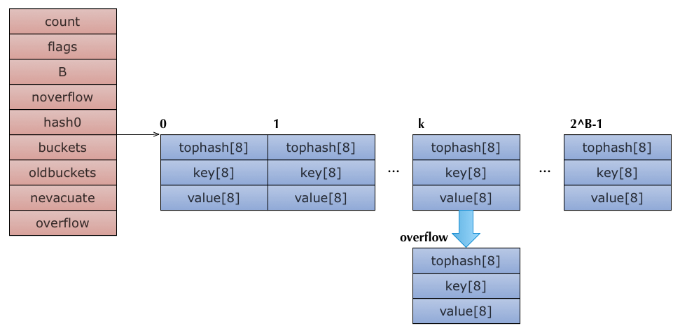
</p>

<p align="center">
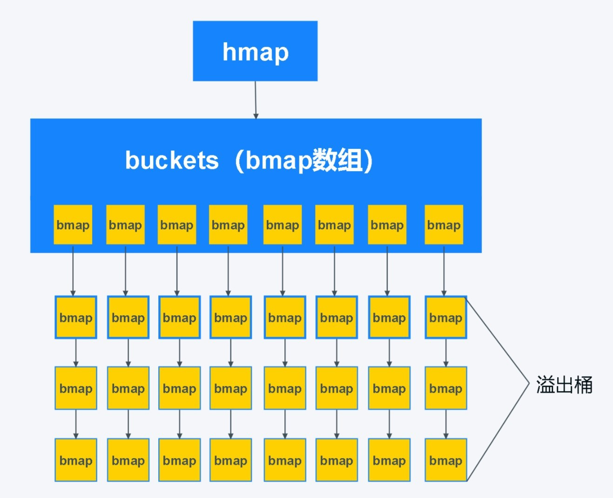
</p>

每个 map 的底层结构是 hmap，是有若干个结构为 bmap 的 bucket 组成的数组。每个 bucket 底层都采用链表结构。

bmap 就是我们常说的“桶”，桶里面会最多装 8 个 key，这些 key之所以会落入同一个桶，是因为它们经过哈希计算后，哈希结果是“一类”的，关于 key 的定位我们在 map 的查询和赋值中详细说明。

在桶内，又会根据 key 计算出来的 hash 值的高 8 位来决定 key 到底落入桶内的哪个位置（一个桶内最多有8个位置）。

当 map 的 key 和 value 都不是指针，并且 size 都小于 128 字节的情况下，会把 bmap 标记为不含指针，这样可以避免 GC 时扫描整个 hmap。

但是，我们看 bmap 其实有一个 overflow 的字段，是指针类型的，破坏了 bmap 不含指针的设想，这时会把 overflow 移动到 hmap 的 extra 字段来。

这样随着哈希表存储的数据逐渐增多，我们会扩容哈希表或者使用额外的桶存储溢出的数据，不会让单个桶中的数据超过 8 个，不过溢出桶只是临时的解决方案，创建过多的溢出桶最终也会导致哈希的扩容。


### map 的常见操作

1. 创建 makemap

map 的创建比较简单，在参数校验之后，需要找到合适的 B 来申请桶的内存空间，接着便是创建 hmap 这个结构，以及对它的初始化。

<p align="center">

</p>

2. 访问 mapaccess

在找不到对应 key 的情况下，会返回 **nil**。

go 为了保证遍历 map 的结果是**无序**的，做了以下事情：map 在遍历时，并不是从固定的 0 号 bucket 开始遍历的，每次遍历，都会从一个随机值序号的 bucket，再从其中随机的 cell 开始遍历。然后再按照桶序及相同的 cell 顺序遍历下去，直到回到起始桶结束。

如果 map 正处于扩容状态时，需要先判断当前遍历的 bucket 是否已经完成搬迁，如果数据还在老的 bucket，那么就去老的 bucket 中拿数据。

<p align="center">
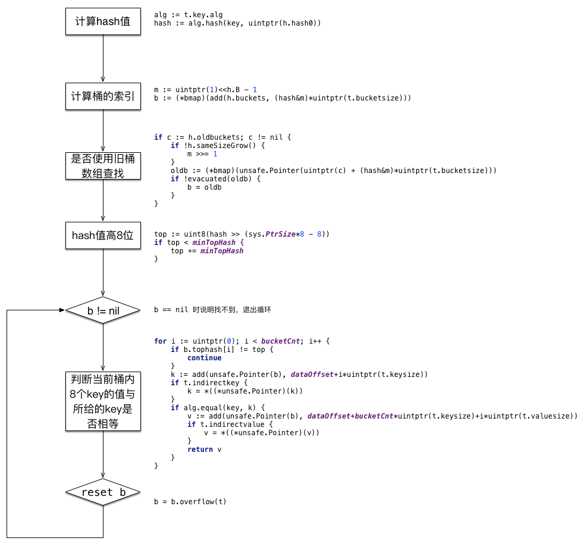
</p>

<p align="center">

</p>

如果要实现顺序读取 map，可以先把 map 中的 key 通过 sort 包排序。

```go
package main

import (
    "fmt"
    "sort"
)

func main() {
    var m = map[string]int{
        "hello":         0,
        "morning":       1,
        "keke":          2,
        "jame":   		 3,
    }
    var keys []string
    for k := range m {
        keys = append(keys, k)
    }
    sort.Strings(keys)
    for _, k := range keys {
        fmt.Println("Key:", k, "Value:", m[k])
    }
}
```

运行：

```Go
Key: hello Value: 0
Key: jame Value: 3
Key: keke Value: 2
Key: morning Value: 1
```

3. 分配 mapassign

为一个 key 分配空间的逻辑，大致与查找类似，但增加了写保护和扩容的操作。注意，分配过程和删除过程都没有在 oldbuckets 中查找，这是因为首先要进行扩容判断和操作。

<p align="center">
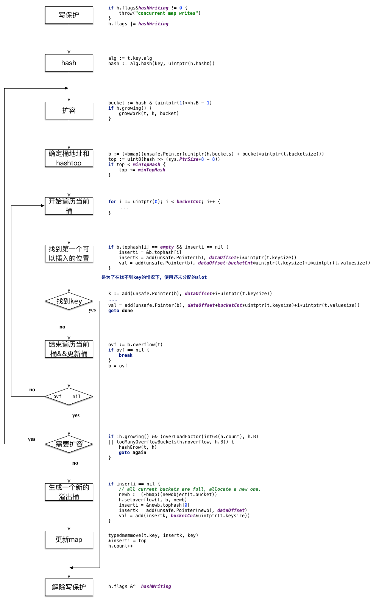
</p>

4. 删除 mapdelete

删除某个 key 的操作与分配类似，由于 hashmap 的存储结构是数组 + 链表，所以真正删除 key 仅仅是将对应的 slot 设置为 empty，并没有减少内存。

<p align="center">
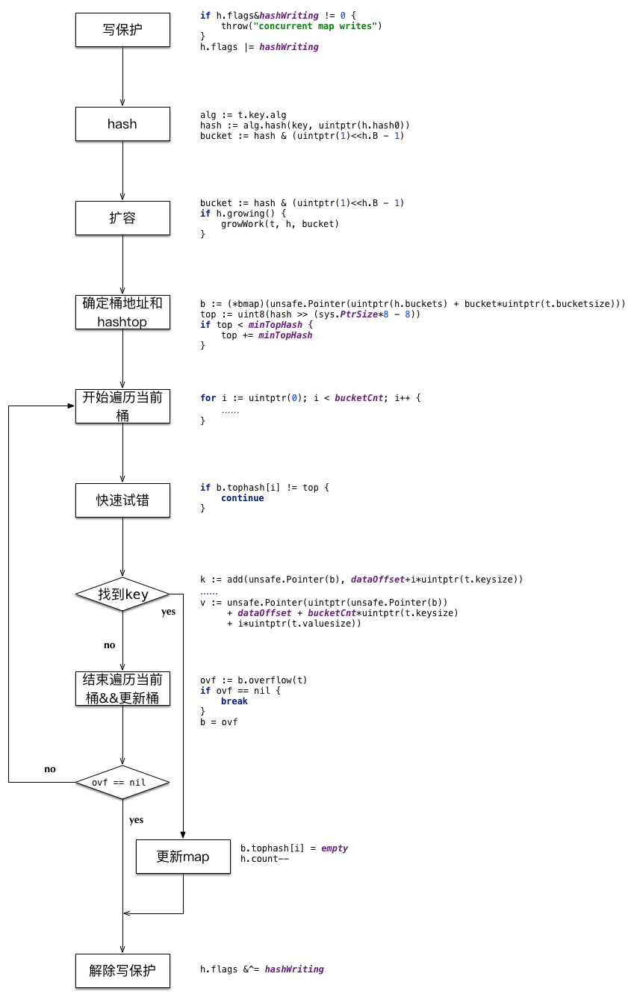
</p>


### map 扩容

随着哈希表中元素的逐渐增加，哈希的性能会逐渐恶化，所以我们需要更多的桶和更大的内存保证哈希的读写性能，这个时候我们就需要用到扩容了。

#### 扩容条件

`mapassign` 函数会在以下两种情况发生时触发哈希的扩容：

* 装载因子已经超过 6.5，即元素个数 >= 桶（bucket）总数 * 6.5。这时候说明大部分的桶可能都快满了（即平均每个桶存储的键值对达到 6.5 个），如果插入新元素，有大概率需要挂在溢出桶（overflow bucket）上。

* 溢出桶太多。当桶总数 < 2 ^ 15 时，如果溢出桶总数 >= 桶总数，则认为溢出桶过多。当桶总数 >= 2 ^ 15 时，直接与 2 ^ 15 比较，当溢出桶总数 >= 2 ^ 15 时，即认为溢出桶太多了。

```Markdown
在某些场景下，比如不断的增删，这样会造成 overflow 的 bucket 数量增多，但负载因子又不高。
```

#### 扩容过程

- 当装载因子 >= 6.5 或者溢出 bmap 过多时，会产生扩容。
  
- 如果是装载因子 >= 6.5 的扩容则为**翻倍扩容**，创建一个当前桶个数 * 2 的桶列表；如果溢出桶过多但装载因子 < 6.5 时为**等量扩容**，即把当前稀疏的桶内元素进行整理，使其没有那么多的溢出桶。

- 然后会把当前的桶放到 `hmap.oldbuckets` 字段作为旧桶，然后把当前的溢出桶（如果有）也放到 `hmap.extra.oldoverflow` 作为旧的溢出桶。

- 在扩容时不会触发搬迁操作，搬迁操作只会在写入/删除操作时被触发。

- 搬迁操作过程：
    - 翻倍扩容搬迁过程：
        - 找到当前 key 的 hash 对应的旧桶，然后算出对应的新桶 xy[0]，保存其上下文，再找到一个根据当前新桶 + 旧桶数量偏移的哪个桶xy[1]，也保存其上下文。比如当前 key 的哈希对应的旧桶是 3 号，那么 xy[0] 也是新桶的3号桶，然后 xy[1] 的桶号就为 3 + 旧桶的个数——比如7号。
        - 由于翻倍扩容时当前旧桶对应两个新桶，所以需要针对当前旧桶中的 key 做重新 hash，选择一个目标桶出来，即当前 key 处于 3 号桶，经过重新哈希后可能放到了 7 号桶，找到目标桶后，将对应的 key，value，tophash复制过去，完成一个 key-value 的搬迁。然后循环此过程。
    - 等量扩容搬迁过程：
        - 与翻倍扩容相同，但只保存一个新桶的上下文，因为等量扩容没有创建更多的桶，扩容是对应的关系，即当前的 key 处于 3 号桶，搬迁后也属于 3 号桶。
        - 剩余过程与翻倍扩容相同。
    - 搬迁完毕后，将旧桶做一些标记以便可以 gc 清除，然后如果此次搬迁是按照顺序搬迁，即 `h.nevacuate` 记录的桶搬迁的，则更新 `h.nevacuate` 到下次应该搬迁的桶上。

<p align="center">
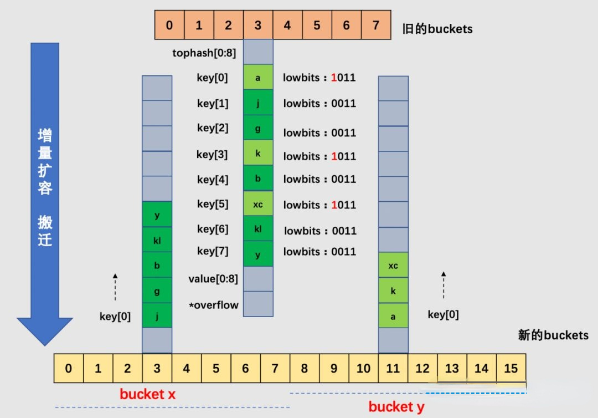
</p>
<p align="center">
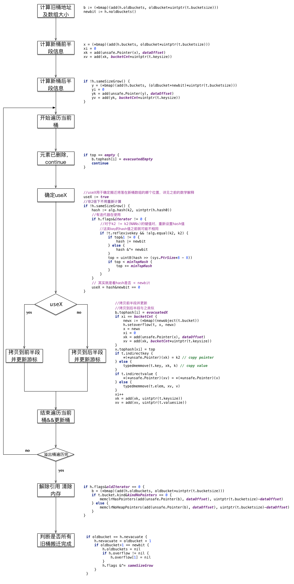
</p>
### 其他注意事项

1. map 是无序的，每次打印出来的 map 都会不一样，它不能通过 index 获取，而必须通过 key 获取。
2. map 不能使用操作符进行比较，只能用来检查 map 是否为空，否则会报错。
3. 内置的 len() 函数同样适用于 map，返回 map 拥有的 key 的数量。
4. map 的零值是 nil，可以理解成空指针。所以如果只声明不初始化（通过 make 等方式），我们就不能直接去操作这个 map，否则会得到一个 panic。
5. 映射是引用类型（与切片相似）。当将映射分配给一个新变量时，它们都指向相同的内部数据结构，此时一个的变化会反映到另一个。


## Channel（通道）

`Channel` 是 Go 中的一个核心类型，可以把它看成一个管道，通过它并发核心单元就可以发送或者接收数据进行通讯 (communication)，Channel 也可以理解是一个**先进先出的队列**，通过管道进行通信。

Golang 的 Channel, 发送一个数据到 Channel 和从 Channel 接收一个数据都是**原子性**的。

Go 的设计思想就是，*不要通过共享内存来通信，而是通过通信来共享内存*，前者就是传统的加锁，后者就是 Channel。也就是说，设计 Channel 的主要目的就是在多任务间传递数据的。

Channel 是**线程安全**的，即在使用过程中，有多个协程同时向一个 Channel 发送数据，或读取数据是完全可行的，不需要额外的操作。


### Channel 的分类

Channel 分为无缓冲和有缓冲两种。

```go
ch := make(chan int)    //无缓冲 channel 由于没有缓冲，发送和接收需要同步。
ch := make(chan int, 2) //有缓冲 channel 不要求发送和接收操作同步。
```

**无缓冲 Channel**

Channel 无缓冲时，无缓冲 chan 是指在接收前没有能力保存任何值的通道。无缓冲的通道只有当发送方和接收方都准备好时才会传送数据，否则准备好的一方将会被阻塞。

由于无缓冲 Channel 这种阻塞发送方和接收方的特性，所以我们在使用时要防止死锁的发生。很明显，如果我们在一个线程内向同一个 Channel 同时进行读取和发送的操作，就会导致死锁。

**有缓冲 Channel**

Channel 有缓冲时，当缓冲满时阻塞发送，当缓冲空时阻塞接收。

下面的介绍默认为有缓冲 Channel。


### Channel 底层结构

Channel 在运行时使用 `runtime.hchan` 结构体表示:

```go
type hchan struct {
     qcount   uint           // 当前队列里还剩余元素个数
     dataqsiz uint           // 环形队列长度，即缓冲区的大小，即 make(chan T,N) 中的 N
     buf      unsafe.Pointer // 环形队列指针
     elemsize uint16         // 每个元素的大小
     closed   uint32         // 标识当前通道是否处于关闭状态，创建通道后，该字段设置 0，即打开通道；通道调用 close 将其设置为 1，通道关闭
     elemtype *_type         // 元素类型，用于数据传递过程中的赋值
     sendx    uint           // 环形缓冲区的状态字段，它只是缓冲区的当前索引-支持数组，它可以从中发送数据
     recvx    uint           // 环形缓冲区的状态字段，它只是缓冲区当前索引-支持数组，它可以从中接受数据
     recvq    waitq          // 等待读消息的 goroutine 队列
     sendq    waitq          // 等待写消息的 goroutine 队列

     // lock protects all fields in hchan, as well as several
     // fields in sudogs blocked on this channel.
     // Do not change another G's status while holding this lock
     // (in particular, do not ready a G), as this can deadlock
     // with stack shrinking.
     lock mutex             // 互斥锁，为每个读写操作锁定通道，因为发送和接受必须是互斥操作
}

type waitq struct {
     first *sudog
     last  *sudog
}
```

**整体结构图：**

<p align="center">

</p>

hchan 结构体中有五个字段涉及构建底层的循环队列:

```go
* qcount   — Channel 中的元素个数；
* dataqsiz — Channel 中的循环队列的长度；
* buf      — Channel 的缓冲区数据指针；
* sendx    — Channel 的发送操作处理到的位置；
* recvx    — Channel 的接收操作处理到的位置；
```

通常, `elemsize` 和 `elemtype` 分别表示当前 Channel 能够收发的元素类型和大小.

`sendq` 和 `recvq` 存储了当前 Channel 由于缓冲区空间不足而阻塞的 Goroutine 列表，这些等待队列使用双向链表`runtime.waitq`表示，链表中所有的元素都是`runtime.sudog`结构.

`waitq` 表示一个在等待列表中的 Goroutine，该结构体中存储了阻塞的相关信息以及两个分别指向前后`runtime.sudog`的指针。


### Channel 是异步的

Channel 是异步进行的, Channel 存在3种状态：

* nil，未初始化的状态，只进行了声明，或者手动赋值为 nil
* active，正常的 Channel，可读或者可写
* closed，已关闭，千万不要误认为关闭 Channel后，Channel的值是nil

下面我们对channel的三种操作解析:

1. 零值（nil）通道；
2. 非零值但已关闭的通道；
3. 非零值并且尚未关闭的通道。

|  操作   | 一个零值nil通道 | 一个非零值但已关闭的通道  |  一个非零值且尚未关闭的通道  |
|-----------|---------------|----------------------|--------------------------|
|  关闭   |  产生 panic  |      产生 panic      |    成功关闭               |
|发送数据    |  永久阻塞      |     产生 panic     |    阻塞或者成功发送       |
|接收数据    |  永久阻塞      |       永不阻塞       |    阻塞或者成功接收       |


### Channel 相关操作

#### Channel 初始化

* 如果当前 Channel 中不存在缓冲区，那么就只会为 `hchan` 分配一段内存空间；
* 如果当前 Channel 中存储的类型不是指针类型，就会为当前的 Channel 和底层的数组分配一块连续的内存空间；
* 在默认情况下会单独为 `hchan` 和缓冲区分配内存。

#### Channel 收发数据

向 Channel **发送数据**的过程中可能会触发 Goroutine 调度的时机：

* 发送数据时发现 Channel 上存在等待接收数据的 Goroutine，立刻设置处理器的 `runnext` 属性，但是并不会立刻触发调度；

* 发送数据时并没有找到接收方并且缓冲区已经满了，这时就会将自己加入 Channel 的 `sendq` 队列并调用 `runtime.goparkunlock` 触发 Goroutine 的调度让出处理器的使用权。

从 Channel **接收数据**时，会触发 Goroutine 调度的时机：

* 当 Channel 为空时；

* 当缓冲区中不存在数据并且也不存在数据的发送者时。

#### Channel 关闭

我们可以使用 close 关键字关闭一个 channel。

```Go
c := make(chan int, 2)
close(c)
```
1. 向已关闭的 channel **发送数据**

向一个已关闭的 channel 发送数据，会导致程序抛出 panic。因此关闭 channel 的操作原则上应该由发送者完成，如果由接受者关闭 channel，则会遇到这个风险。

2. 从已关闭的 channel **读取数据**

从一个已关闭的 channel 中读取数据不会报错。接受者不会被一个已关闭的 channel 阻塞，而且接受者从关闭的 channel 中仍然可以读取出数据，只不过是这个 channel 的数据类型的默认值。

> 我们可以通过指定接受状态位来观察接受的数据是否是从一个已关闭的channel所发送出来的数据。例如 j, ok := <-c ，则 ok 为 false 时，则代表 channel 已经被关闭。

#### for 循环

我们可以使用 for 循环持续地从一个 channel 中接受数据，当 channel 为空时，for 循环会被阻塞。当 channel 被关闭时，则会跳出 for 循环。

```Go
package main

import (
	"fmt"
	"time"
)

func main() {
	c := make(chan int)
	go func() {
		for i := 0; i < 3; i++ {
			c <-i
			fmt.Printf("send %d\n", i)
			time.Sleep(time.Second)
		}
		fmt.Println("ready close channel")
		close(c)
	}()

	for i := range c {
		fmt.Printf("receive %d\n", i)
	}
	fmt.Println("quit for loop")
}
```

#### select 语法

使用 `select` 语句可以在多个可供选择的 channel 中读取任意一个数据执行。如果没有任何一个 channel 可以读取数据，则线程会被阻塞住，直到可以从某一个 channel 中读取数据为止。

`select` 语句还可以用于发送方。语句随机挑选一个仍有缓冲区的 channel 发送数据，如果缓冲区已满，则这个 channel 的 case 语句将会被阻塞。

> select 语句不会自动循环，如果需要循环读取，需要手动在 select 语句外加循环。

**避免 select 语句被阻塞**的两种方法：

* 关闭一个 channel
* 使用 default 关键字

使用 `select` 语句时，我们可以使用 `default` 关键字。和 switch 类似，这是一个默认的分支。如果所有的 channel 都没有准备好（例如对于发送者所有的 channel 都缓存已满，或对于接受者所有 channel 的缓存已空），则程序会进入 `default` 分支的逻辑。

```Go
package main

import (
	"fmt"
	"time"
)

func main() {
	c := make(chan int)
	c2 := make(chan int)
	go func() {
		time.Sleep(2 * time.Second)
		c <- 1
	}()
	go func() {
		time.Sleep(1 * time.Second)
		c2 <- 2
	}()

	select {
	case i := <-c:
		fmt.Printf("receive from c: %d\n", i)
	case i := <- c2:
		fmt.Printf("receive from c2: %d\n", i)
	default:
		fmt.Println("default")
	}
}
```

#### time 标准库中的 Channel

golang 的 `time` 标准库里提供了一些定时发送数据的 channel，可以帮助我们实现一些功能。

例如利用 `time.After()` 函数配合 `select` 语句使用，可以实现**超时**的功能。本质上是 `time.After()` 函数返回了一个 channel 并在我们设定的时间后向其发送一个数据。

```Go
package main

import (
	"fmt"
	"time"
)

func main() {
	c := make(chan int)
	go func() {
		time.Sleep(2 * time.Second)
		c <- 1
	}()

	select {
	case i := <-c:
		fmt.Printf("receive from c: %d\n", i)
	case <-time.After(time.Second):
		fmt.Println("timeout! ")
	}
}
```

`time` 标准库中的 `time.NewTicker()` 函数返回一个带有 channel 的结构体，并定时向这个结构体中发送时间数据，以实现**定时器**的功能。

```Go
package main

import (
	"fmt"
	"time"
)

func main() {
	c := time.NewTicker(time.Second)
	for t := range c.C {
		fmt.Printf("receive t :%s\n", t)
	}
}
```


## make 和 new 的区别

Go 中的值类型和引用类型:

`值类型`：int，float，bool，string，struct，array
变量直接存储值，分配**栈区**的内存空间，这些变量所占据的空间在函数被调用完后会自动释放。

`引用类型`：slice，map，chan，值类型对应的指针
变量存储的是一个地址（或者理解为指针），指针指向内存中真正存储数据的首地址。内存通常在**堆**上分配，通过 GC 回收。

1. make 用于内建类型（map、slice 和 channel）的内存分配；new 用于各种类型的内存分配。

2. new 分配返回的是指针，即类型 *Type；make 返回引用，即 Type。

> 指针是一个变量，只不过这个变量存储的是一个地址，指向内存的一个存储单元，即指针是一个实体；而引用跟原来的变量实质上是同一个东西，只不过是原变量的一个别名，在内存占有同一个存储单元。

3. new 分配的空间被清零；make 分配空间后，会进行初始化。

make 和 new 对应底层的内存分配图：

<p align="center">

</p>


# 并发控制

Golang 是为并发而生的语言，Go 语言是为数不多的在语言层面实现并发的语言；也正是 Go 语言的并发特性，吸引了全球无数的开发者。


## Goroutine

### 进程 线程 协程

* 进程

进程是程序的一次执行过程，是程序在执行过程中的分配和管理资源的基本单位，每个进程都有自己的地址空间，进程是系统进行资源分配和调度的一个独立单位。

每个进程都有自己的独立内存空间，不同进程通过 `IPC`（Inter-Process Communication）进程间通信来通信。由于进程比较重量，占据独立的内存，所以上下文进程间的切换开销（栈、寄存器、虚拟内存、文件句柄等）比较大，但相对比较稳定安全。

* 线程

线程是进程的一个实体，线程是内核态，而且是 CPU 调度和分派的基本单位，它是比进程更小的能独立运行的基本单位。线程自己基本上不拥有系统资源，只拥有一点在运行中必不可少的资源（如程序计数器、一组寄存器和栈），但是它可与同属一个进程的其他线程共享进程所拥有的全部资源。

线程间通信主要通过共享内存，上下文切换很快，资源开销较少，但相比进程不够稳定容易丢失数据。

* 协程

协程是一种用户态的轻量级线程，协程的调度完全由用户控制。协程拥有自己的寄存器上下文和栈。

协程调度切换时，将寄存器上下文和栈保存到其他地方，在切回来的时候，恢复先前保存的寄存器上下文和栈，直接操作栈则基本没有内核切换的开销，可以不加锁的访问全局变量，所以上下文的切换非常快。


### Goroutine 和线程的区别

1. 从**调度**上看，goroutine 的调度开销远远小于线程调度开销。

OS 的线程由 OS 内核调度，每隔几毫秒，一个硬件时钟中断发到 CPU，CPU 调用一个调度器内核函数。这个函数暂停当前正在运行的线程，把他的寄存器信息保存到内存中，查看线程列表并决定接下来运行哪一个线程，再从内存中恢复线程的注册表信息，最后继续执行选中的线程。这种线程切换需要一个完整的上下文切换：即保存一个线程的状态到内存，再恢复另外一个线程的状态，最后更新调度器的数据结构。某种意义上，这种操作还是很慢的。

Go 运行的时候包涵一个自己的调度器，这个调度器使用一个称为一个 M:N 调度技术，m 个 goroutine 到 n 个 os 线程（可以用`GOMAXPROCS`来控制 n 的数量），Go 的调度器不是由硬件时钟来定期触发的，而是由特定的 go 语言结构来触发的，他不需要切换到内核语境，所以调度一个 goroutine 比调度一个线程的成本低很多。

2. 从**栈空间**上，goroutine 的栈空间更加动态灵活。

每个 OS 的线程都有一个固定大小的栈内存，通常是 **2MB**，栈内存用于保存在其他函数调用期间那些正在执行或者临时暂停的函数的局部变量。这个固定大小的栈同时很大又很小。因为 2MB 的栈对于一个小小的 goroutine 来说是很大的内存浪费，而对于一些复杂的任务（如深度嵌套的递归）来说又显得太小。

goroutine 的栈采取了动态扩容方式， 初始时仅为 **2KB**，随着任务执行按需增长，最大可达 1GB，且完全由 golang 自己的调度器 Go Scheduler 来调度。此外，GC 还会周期性地将不再使用的内存回收，收缩栈空间。在 go 程序中，一次创建十万左右的 goroutine 也不罕见（2KB * 100,000 = 200MB）。

3. goroutine 没有一个特定的**标识**。

在大部分支持多线程的操作系统和编程语言中，线程有一个独特的标识，通常是一个整数或者指针，这个特性可以让我们构建一个线程的局部存储，本质是一个全局的 `map`，以线程的标识作为键，这样每个线程可以独立使用这个 map 存储和获取值，不受其他线程干扰。

goroutine 中没有可供程序员访问的标识，这源于一种纯函数的理念：不希望滥用线程局部存储导致一个不健康的“超距作用”，即函数的行为不仅取决于它的参数，还取决于运行它的线程标识。


### 如何限制 Goroutine 的数量

在 Golang 中，Goroutine 虽然很好，但是数量太多了，往往会带来很多麻烦，比如耗尽系统资源导致程序崩溃，或者 CPU 使用率过高导致系统忙不过来。

所以我们可以限制下 Goroutine 的数量，这样就需要在每一次执行 go 之前判断 goroutine 的数量，如果数量超了，就要阻塞 go 的执行。

所以通常我们第一时间想到的就是使用`channel`。每次执行的 go 之前向通道写入值，直到通道满的时候就阻塞了，

```go
package main

import "fmt"

var ch chan  int

func elegance(){
	<-ch
	fmt.Println("the ch value receive",ch)
}

func main(){
	ch = make(chan int,5)
	for i:=0;i<10;i++{
		ch <-1
		fmt.Println("the ch value send",ch)
		go elegance()
		fmt.Println("the result i",i)
	}

}
```

这样每次同时运行的 goroutine 就被限制为 5 个了。但是新的问题出现了，因为并不是所有的 goroutine 都执行完了，在 main 函数退出之后，还有一些 goroutine 没有执行完就被强制结束了。这个时候我们就需要用到`sync.WaitGroup`。使用 WaitGroup 等待所有的 goroutine 退出。

```go
package main

import (
	"fmt"
	"runtime"
	"sync"
	"time"
)

// Pool Goroutine Pool
type Pool struct {
	queue chan int
	wg *sync.WaitGroup
}

// New 新建一个协程池
func NewPool(size int) *Pool{
	if size <=0{
		size = 1
	}
	return &Pool{
		queue:make(chan int,size),
		wg:&sync.WaitGroup{},
	}
}

// Add 新增一个执行
func (p *Pool)Add(delta int){
	// delta为正数就添加
	for i :=0;i<delta;i++{
		p.queue <-1
	}
	// delta为负数就减少
	for i:=0;i>delta;i--{
		<-p.queue
	}
	p.wg.Add(delta)
}

// Done 执行完成减一
func (p *Pool) Done(){
	<-p.queue
	p.wg.Done()
}

// Wait 等待Goroutine执行完毕
func (p *Pool) Wait(){
	p.wg.Wait()
}

func main(){
	// 这里限制5个并发
	pool := NewPool(5)
	fmt.Println("the NumGoroutine begin is:",runtime.NumGoroutine())
	for i:=0;i<20;i++{
		pool.Add(1)
		go func(i int) {
			time.Sleep(time.Second)
			fmt.Println("the NumGoroutine continue is:",runtime.NumGoroutine())
			pool.Done()
		}(i)
	}
	pool.Wait()
	fmt.Println("the NumGoroutine done is:",runtime.NumGoroutine())
}
```

其中，Go的`GOMAXPROCS`默认值已经设置为 CPU 的核数，这里允许我们的 Go 程序充分使用机器的每一个 CPU，最大程度的提高我们程序的并发性能。

`runtime.NumGoroutine`函数在被调用后，会返回系统中的处于特定状态的 Goroutine 的数量。这里的特定状态是指 `Grunnable\Gruning\Gsyscall\Gwaition`，处于这些状态的 Groutine 即被看做是活跃的或者说正在被调度。

> 注意：垃圾回收所在 Groutine 的状态也处于这个范围内的话，也会被纳入该计数器。


### Goroutine 何时结束

1. main goroutine 结束，子 goroutine 立即结束

```go
package main

import (
	"fmt"
	"time"
)

func main() {
	// main 函数中 goroutine 如果结束，子 goroutine 不会再执行
	fmt.Println("main函数开始")
	go func() {
		time.Sleep(1 * time.Second)
		fmt.Println("main中子goroutine结束")
	}()
	fmt.Println("main函数结束")
}
/*
main函数开始
main函数结束
*/
```

2. main 函数如果不结束，父函数即使结束，父函数中的 goroutine 也会执行

```go
package main

import (
	"fmt"
	"time"
)

func main() {
	// main 函数如果不结束，父函数即使结束，父函数中的 goroutine 也会执行
	fmt.Println("main函数开始")
	notMainFunc()
	time.Sleep(3 * time.Second)
	fmt.Println("main函数结束")
}

func notMainFunc() {
	fmt.Println("notMainFunc开始")
	go func() {
		time.Sleep(1 * time.Second)
		println("notMainFunc中子goroutine结束")
	}()
	fmt.Println("notMainFunc结束")
}
/*
main函数开始
notMainFunc开始
notMainFunc结束
notMainFunc中子goroutine结束
main函数结束
*/
```

3. main 函数如果不结束，父 goroutine 即使结束，父 goroutine 中的子 goroutine 也会执行

```go
package main

import (
	"fmt"
	"time"
)

func main() {
	// main 函数如果不结束，父 goroutine 即使结束，父 oroutine 中的子 goroutine 也会执行
	fmt.Println("main函数开始")
	go notMainFunc()
	time.Sleep(3 * time.Second)
	fmt.Println("main函数结束")
}

func notMainFunc() {
	fmt.Println("notMainFunc开始")
	go func() {
		time.Sleep(1 * time.Second)
		println("notMainFunc中子goroutine结束")
	}()
	fmt.Println("notMainFunc结束")
}
/*
main函数开始
notMainFunc开始
notMainFunc结束
notMainFunc中子goroutine结束
main函数结束
*/
```

**结论：**

只要 main 函数不结束，子 goroutine 会一直执行；main 函数结束，子 goroutine 会立即结束。


## Golang 中常用的并发模型

Golang中常用的并发模型有三种：**Channel**、**WaitGroup**、**Context**。


### 通过 channel 通知实现并发控制

Golang 的 CSP（Communicating Sequential Processes，通信顺序过程） 并发模型，是通过 Goroutine 和 Channel 来实现的。

Goroutine 是 Go 语言中并发的执行单位。有点抽象，其实就是和传统概念上的“线程”类似，可以理解为“线程”。Channel 是 Go 语言中各个并发结构体（Goroutine）之间的通信机制。通常 Channel，是各个 Goroutine 之间通信的”管道“，有点类似于 Linux 中的管道。

无缓冲的通道指的是通道的大小为 0，也就是说，这种类型的通道在接收前没有能力保存任何值，它要求发送 goroutine 和接收 goroutine 同时准备好，才可以完成发送和接收操作。

从上面无缓冲的通道定义来看，发送 goroutine 和接收 gouroutine 必须是同步的，同时准备后，如果没有同时准备好的话，先执行的操作就会阻塞等待，直到另一个相对应的操作准备好为止。这种无缓冲的通道我们也称之为同步通道。

```go
func main() {
    ch := make(chan struct{})
    go func() {
        fmt.Println("start working")
        time.Sleep(time.Second * 1)
        ch <- struct{}{}
    }()

    <-ch

    fmt.Println("finished")
}
```

当主 goroutine 运行到 `<-ch` 接受 channel 的值的时候，如果该  channel 中没有数据，就会一直阻塞等待，直到有值。 这样就可以简单实现并发控制。


### 通过 sync.WaitGroup 实现并发控制

Goroutine 是异步执行的，有的时候为了防止在结束 main 函数的时候结束掉 Goroutine，所以需要同步等待，这个时候就需要用 WaitGroup 了，在 Sync 包中，提供了 WaitGroup，它会等待它收集的所有 goroutine 任务全部完成。

在WaitGroup里主要有三个方法:

* Add, 可以添加或减少 goroutine 的数量；
* Done, 相当于Add(-1)；
* Wait, 执行后会堵塞主线程，直到 WaitGroup 里的值减至0。

在主 goroutine 中 Add(delta int) 所要等待 goroutine 的数量。在每一个goroutine 完成后 Done() 表示这一个 goroutine 已经完成，当所有的 goroutine 都完成后，在主 goroutine 中 WaitGroup 返回。

```go
func main(){
    var wg sync.WaitGroup
    var urls = []string{
        "http://www.golang.org/",
        "http://www.google.com/",
    }
    for _, url := range urls {
        wg.Add(1)
        go func(url string) {
            defer wg.Done()
            http.Get(url)
        }(url)
    }
    wg.Wait()
}
```

在 Golang 官网中对于 WaitGroup 介绍是`A WaitGroup must not be copied after first use`，在 WaitGroup 第一次使用后，不能被拷贝。

应用示例:

```go
func main(){
 wg := sync.WaitGroup{}
    for i := 0; i < 5; i++ {
        wg.Add(1)
        go func(wg sync.WaitGroup, i int) {
            fmt.Printf("i:%d", i)
            wg.Done()
        }(wg, i)
    }
    wg.Wait()
    fmt.Println("exit")
}

```

运行:

```go
i:1i:3i:2i:0i:4fatal error: all goroutines are asleep - deadlock!

goroutine 1 [semacquire]:
sync.runtime_Semacquire(0xc000094018)
        /home/keke/soft/go/src/runtime/sema.go:56 +0x39
sync.(*WaitGroup).Wait(0xc000094010)
        /home/keke/soft/go/src/sync/waitgroup.go:130 +0x64
main.main()
        /home/keke/go/Test/wait.go:17 +0xab
exit status 2
```

它提示所有的 `goroutine` 都已经睡眠了，出现了**死锁**。这是因为 wg 被拷贝传递到了 goroutine 中，导致只有 Add 操作，其实 Done操作是在 wg 的副本执行的。因此 Wait 就会死锁。

第一种修改方式: 将匿名函数中 wg 的传入类型改为 `*sync.WaitGroup`,这样就能引用到正确的`WaitGroup`了。

第二种修改方式: 将匿名函数中的 wg 的传入参数去掉，因为 Go 支持闭包类型，在匿名函数中可以直接使用外面的 wg 变量.


### 通过 Context 实现并发控制

在 Go 1.7 以后引进的强大的 `Context` 上下文，可以用来实现并发控制。

通常，在一些简单场景下使用 channel 和 WaitGroup 已经足够了，但是当面临一些复杂多变的网络并发场景下 `channel` 和 `WaitGroup` 显得有些力不从心了。

比如一个网络请求 Request，每个 Request 都需要开启一个 goroutine 做一些事情，这些 goroutine 又可能会开启其他的 goroutine，比如数据库和 RPC 服务。

所以我们需要一种可以**跟踪 goroutine** 的方案，才可以达到控制他们的目的，这就是 Go 语言为我们提供的 Context，称之为上下文非常贴切，它就是 goroutine 的上下文。

Context 包括一个程序的运行环境、现场和快照等。每个程序要运行时，都需要知道当前程序的运行状态，通常 Go 将这些封装在一个 Context 里，再将它传给要执行的 goroutine 。

> context 包主要是用来处理多个 goroutine 之间共享数据，及多个 goroutine 的管理。

Context 对象是线程安全的，你可以把一个 Context 对象传递给任意个数的 gorotuine，对它执行取消操作时，所有 goroutine 都会接收到取消信号。

一个 Context 不能拥有 Cancel 方法，同时我们也只能 Done channel 接收数据。其中的原因是一致的：接收取消信号的函数和发送信号的函数通常不是一个。

典型的场景是：父操作为子操作操作启动 goroutine，子操作也就不能取消父操作。


## 资源共享

Golang 中安全读写共享变量的方式有：

- 通过 Channel （**语言**支持）
- 加 Mutex 锁 （**操作系统**支持）
- 通过原子性操作进行 （**硬件**支持）


###  Go 中的锁

Go中的三种锁包括：互斥锁，读写锁，`sync.Map`的安全的锁.   


#### 互斥锁

##### 互斥锁的底层结构

Go 并发程序对共享资源进行访问控制的主要手段，由标准库代码包 sync 中的 Mutex 结构体表示。

```go
// Mutex 是互斥锁，零值是解锁的互斥锁，首次使用后不得复制互斥锁。
type Mutex struct {
    state int32
    sema  uint32
}
```

声明一个互斥锁：     
```go
var mutex sync.Mutex
```

`state` 和 `sema` 两个加起来只占 8 字节空间的结构体表示了 Go 语言中的互斥锁。

互斥锁的状态比较复杂，如下图所示，最低三位分别表示 mutexLocked、mutexWoken 和 mutexStarving，剩下的位置用来表示当前有多少个 Goroutine 等待互斥锁的释放。

<p align="center">

</p>

在默认情况下，互斥锁的所有状态位都是 0，int32 中的不同位分别表示了不同的状态：

* mutexLocked 表示互斥锁的锁定状态；
* mutexWoken 表示从正常模式被唤醒；
* mutexStarving 当前的互斥锁进入饥饿状态；
* waitersCount 当前互斥锁上等待的 Goroutine 个数；

sync.Mutex 有两种模式，正常模式和饥饿模式。

`正常模式` 下，锁的等待者会按照先进先出的顺序获取锁。但是刚被唤起的 Goroutine 与新创建的 Goroutine 竞争时，大概率会获取不到锁，为了减少这种情况的出现，一旦 Goroutine 超过 1ms 没有获取到锁，它就会将当前互斥锁切换饥饿模式，防止部分 Goroutine 被饿死。

饥饿模式是在 Go 语言 1.9 版本引入的优化，目的是保证互斥锁的公平性（Fairness）。

`饥饿模式` 中，互斥锁会直接交给等待队列最前面的 Goroutine。新的 Goroutine 在该状态下不能获取锁、也不会进入自旋状态，它们只会在队列的末尾等待。

如果一个 Goroutine 获得了互斥锁并且它在队列的末尾或者它等待的时间少于 1ms，那么当前的互斥锁就会被切换回正常模式。

比较来说，正常模式下的互斥锁能够提供更好的性能，饥饿模式能避免 Goroutine 由于陷入等待无法获取锁而造成的高`尾延迟（Tail Latency）`。

##### 互斥锁的指针方法

`sync.Mutex`包中的类型只有两个公开的指针方法 Lock 和 Unlock。
          
```go
// Locker表示可以锁定和解锁的对象。
type Locker interface {
    Lock()
    Unlock()
}

// 锁定当前的互斥量
// 如果锁已被使用，则调用goroutine被阻塞，直到互斥锁可用。
func (m *Mutex) Lock() {
	// Fast path: grab unlocked mutex.
	if atomic.CompareAndSwapInt32(&m.state, 0, mutexLocked) {
		if race.Enabled {
			race.Acquire(unsafe.Pointer(m))
		}
		return
	}
	// Slow path (outlined so that the fast path can be inlined)
	m.lockSlow()
}
```

互斥锁的加锁是靠 `sync.Mutex.Lock` 方法完成的, 当锁的状态是 0 时，将 `mutexLocked` 位置成 1。

如果互斥锁的状态不是 0 时就会调用 `sync.Mutex.lockSlow` 尝试通过自旋（Spinnig）等方式等待锁的释放。

`自旋` 是一种多线程同步机制，线程进入自旋状态后会一直保持对 CPU 的占用，持续检查某个条件是否为真。通常在多核的 CPU 上，自旋可以避免 Goroutine 的切换，使用得当会对性能带来很大的增益，但是往往使用的不得当就会拖慢整个程序。

因此 Goroutine **进入自旋的条件**非常苛刻：

- 互斥锁只有在普通模式才能进入自旋；
- `runtime.sync_runtime_canSpin` 需要返回 true：
    - 需要运行在多 CPU 的机器上；
    - 当前的 Goroutine 为了获取该锁进入自旋的次数小于四次；
    - 当前机器上至少存在一个正在运行的处理器 P 并且处理的运行队列为空。

一旦当前 Goroutine 能够进入自旋就会调用`runtime.sync_runtime_doSpin` 和 `runtime.procyield` 并执行 30 次的 PAUSE 指令，该指令只会占用 CPU 并消耗 CPU 时间。

处理了自旋相关的特殊逻辑之后，互斥锁会根据上下文计算当前互斥锁最新的状态。之后，使用 CAS 函数 `sync/atomic.CompareAndSwapInt32` 更新该状态。

如果我们没有通过 CAS 获得锁，会调用 `runtime.sync_runtime_SemacquireMutex` 使用信号量保证资源不会被两个 Goroutine 获取。

`runtime.sync_runtime_SemacquireMutex` 会在方法中不断调用尝试获取锁，并休眠当前 Goroutine 等待信号量的释放，一旦当前 Goroutine 可以获取信号量，它就会立刻返回，`sync.Mutex.Lock` 方法的剩余代码也会继续执行。

在正常模式下，这段代码会设置唤醒和饥饿标记、重置迭代次数并重新执行获取锁的循环；在饥饿模式下，当前 Goroutine 会获得互斥锁，如果等待队列中只存在当前 Goroutine，互斥锁还会从饥饿模式中退出。

互斥锁的解锁过程 `sync.Mutex.Unlock` 与加锁过程相比就很简单，该过程会先使用 `sync/atomic.AddInt32` 函数快速解锁，这时会发生下面的两种情况：

* 如果该函数返回的新状态等于 0，当前 Goroutine 就成功解锁了互斥锁；

* 如果该函数返回的新状态不等于 0，这段代码会调用 `sync.Mutex.unlockSlow` 方法开始慢速解锁：

```go 
// 如果在进入解锁时未锁定m，则为运行时错误。
// 锁定的互斥锁与特定的goroutine无关。
// 允许一个goroutine锁定Mutex然后安排另一个goroutine来解锁它。
func (m *Mutex) Unlock() {
	if race.Enabled {
		_ = m.state
		race.Release(unsafe.Pointer(m))
	}

	// Fast path: drop lock bit.
	new := atomic.AddInt32(&m.state, -mutexLocked)
	if new != 0 {
		// Outlined slow path to allow inlining the fast path.
		// To hide unlockSlow during tracing we skip one extra frame when tracing GoUnblock.
		m.unlockSlow(new)
	}
}
```

`sync.Mutex.unlockSlow` 方法首先会校验锁状态的合法性, 如果当前互斥锁已经被解锁过了就会直接抛出异常 `sync: unlock of unlocked mutex` 中止当前程序。

一般情况下会根据当前互斥锁的状态，分别处理正常模式和饥饿模式下的互斥锁：

在正常模式下，这段代码会分别处理以下两种情况处理:

* 如果互斥锁不存在等待者或者互斥锁的 `mutexLocked`、`mutexStarving`、`mutexWoken` 状态不都为 0，那么当前方法就可以直接返回，不需要唤醒其他等待者；
* 如果互斥锁存在等待者，会通过 `sync.runtime_Semrelease`唤醒等待者并移交锁的所有权。

在饥饿模式下，上述代码会直接调用 `sync.runtime_Semrelease` 方法将当前锁交给下一个正在尝试获取锁的等待者，等待者被唤醒后会得到锁，在这时互斥锁还不会退出饥饿状态。

互斥锁的**加锁**过程：

* 如果互斥锁处于初始化状态，就会直接通过置位 `mutexLocked` 加锁；
* 如果互斥锁处于 mutexLocked 并且在普通模式下工作，就会进入自旋，执行 30 次 PAUSE 指令消耗 CPU 时间等待锁的释放；
* 如果当前 Goroutine 等待锁的时间超过了 1ms，互斥锁就会切换到饥饿模式；
* 互斥锁在正常情况下会通过`runtime.sync_runtime_SemacquireMutex`函数将尝试获取锁的 Goroutine 切换至休眠状态，等待锁的持有者唤醒当前 Goroutine；
* 如果当前 Goroutine 是互斥锁上的最后一个等待的协程或者等待的时间小于 1ms，当前 Goroutine 会将互斥锁切换回正常模式。

互斥锁的**解锁**过程：

* 当互斥锁已经被解锁时，那么调用 `sync.Mutex.Unlock` 会直接抛出异常；
* 当互斥锁处于饥饿模式时，会直接将锁的所有权交给队列中的下一个等待者，等待者会负责设置 `mutexLocked` 标志位；
* 当互斥锁处于普通模式时，如果没有 Goroutine 等待锁的释放或者已经有被唤醒的 Goroutine 获得了锁，就会直接返回；在其他情况下会通过`sync.runtime_Semrelease` 唤醒对应的 Goroutine。

面对 C 或 Java 的锁类工具，我们可能会犯一个错误：忘记及时解开已被锁住的锁，从而导致流程异常。但 Go 由于存在 `defer`，所以此类问题出现的概率极低。关于 defer 解锁的方式如下：

```go
var mutex sync.Mutex
func Write()  {
    mutex.Lock()
    defer mutex.Unlock()
}
```

如果对一个已经上锁的对象再次上锁，那么就会导致该锁定操作被**阻塞**，直到该互斥锁回到被解锁状态。

```go
package main

import (
  "fmt"
  "sync"
  "time"
)

func main() {
	var mutex sync.Mutex
	fmt.Println("begin lock")
	mutex.Lock()
	fmt.Println("get locked")
	for i := 1; i <= 3; i++ {
		go func(i int) {
			fmt.Println("begin lock ", i)
			mutex.Lock()
			fmt.Println("get locked ", i)
		}(i)
	}
	time.Sleep(time.Second)
	fmt.Println("Unlock the lock")
	mutex.Unlock()
	fmt.Println("get unlocked")
	time.Sleep(time.Second)
}
```

我们在 for 循环之前开始加锁，然后在每一次循环中创建一个协程，并对其加锁，但是由于之前已经加锁了，所以这个 for 循环中的加锁会陷入阻塞直到 main 中的锁被解锁，`time.Sleep(time.Second)`是为了能让系统有足够的时间运行 for 循环，输出结果如下：

```go
> go run mutex.go 
begin lock
get locked
begin lock  3
begin lock  1
begin lock  2
Unlock the lock
get unlocked
get locked  3
```

这里可以看到解锁后，三个协程会重新抢夺互斥锁权，最终协程 3 获胜。

互斥锁锁定操作的逆操作并不会导致协程阻塞，但是有可能导致引发一个无法恢复的运行时的 panic，比如**对一个未锁定的互斥锁进行解锁时就会发生 panic**。避免这种情况的最有效方式就是使用`defer`。

我们知道如果遇到 panic，可以使用 recover 方法进行恢复，但是如果对重复解锁互斥锁引发的 panic 却是无用的（Go 1.8 及以后）。

```go
package main

import (
  "fmt"
  "sync"
)

func main() {
	defer func() {
		fmt.Println("Try to recover the panic")
		if p := recover(); p != nil {
			fmt.Println("recover the panic : ", p)
		}
	}()
	var mutex sync.Mutex
	fmt.Println("begin lock")
	mutex.Lock()
	fmt.Println("get locked")
	fmt.Println("unlock lock")
	mutex.Unlock()
	fmt.Println("lock is unlocked")
	fmt.Println("unlock lock again")
	mutex.Unlock()
}
```

运行:

```go
> go run mutex.go 
begin lock
get locked
unlock lock
lock is unlocked
unlock lock again
fatal error: sync: unlock of unlocked mutex

goroutine 1 [running]:
runtime.throw(0x4bc1a8, 0x1e)
     /home/keke/soft/go/src/runtime/panic.go:617 +0x72 fp=0xc000084ea8 sp=0xc000084e78 pc=0x427ba2
sync.throw(0x4bc1a8, 0x1e)
     /home/keke/soft/go/src/runtime/panic.go:603 +0x35 fp=0xc000084ec8 sp=0xc000084ea8 pc=0x427b25
sync.(*Mutex).Unlock(0xc00001a0c8)
     /home/keke/soft/go/src/sync/mutex.go:184 +0xc1 fp=0xc000084ef0 sp=0xc000084ec8 pc=0x45f821
main.main()
     /home/keke/go/Test/mutex.go:25 +0x25f fp=0xc000084f98 sp=0xc000084ef0 pc=0x486c1f
runtime.main()
     /home/keke/soft/go/src/runtime/proc.go:200 +0x20c fp=0xc000084fe0 sp=0xc000084f98 pc=0x4294ec
runtime.goexit()
     /home/keke/soft/go/src/runtime/asm_amd64.s:1337 +0x1 fp=0xc000084fe8 sp=0xc000084fe0 pc=0x450ad1
exit status 2
```

这里试图对重复解锁引发的 panic 进行 recover，但是我们发现操作失败，虽然互斥锁可以被多个协程共享，但还是建议将**对同一个互斥锁的加锁解锁操作放在同一个层次的代码中**。


#### 读写锁

读写锁是针对读写操作的互斥锁，可以分别针对读操作与写操作进行锁定和解锁操作。

读写锁的访问控制规则如下：

1. 多个写操作之间是互斥的；
2. 写操作与读操作之间也是互斥的；
3. 多个读操作之间不是互斥的。

读写互斥锁在互斥锁之上提供了额外的更细粒度的控制，能够在读操作远远多于写操作时提升性能。

在 Go 的标准库代码包中 `sync.RWMutex` 结构体表示为:

```go
// RWMutex是一个读/写互斥锁，可以由任意数量的读操作或单个写操作持有。
// RWMutex的零值是未锁定的互斥锁。
// 首次使用后，不得复制RWMutex。
// 如果goroutine持有RWMutex进行读取而另一个goroutine可能会调用Lock，那么在释放初始读锁之前，goroutine不应该期望能够获取读锁定。 
// 特别是，这种禁止递归读锁定。 这是为了确保锁最终变得可用; 阻止的锁定会阻止新读操作获取锁定。
type RWMutex struct {
     w           Mutex  // 如果有待处理的写操作就持有
     writerSem   uint32 // 写操作等待读操作完成的信号量
     readerSem   uint32 // 读操作等待写操作完成的信号量
     readerCount int32  // 当前正在执行的读操作的数量
     readerWait  int32  // 当写操作被阻塞时等待的读操作个数
}
```

##### 写锁

当我们想要**获取写锁**时，需要调用 `sync.RWMutex.Lock` 方法:

```go
func (rw *RWMutex) Lock() {
	if race.Enabled {
		_ = rw.w.state
		race.Disable()
	}
	// First, resolve competition with other writers.
	rw.w.Lock()
	// Announce to readers there is a pending writer.
	r := atomic.AddInt32(&rw.readerCount, -rwmutexMaxReaders) + rwmutexMaxReaders
	// Wait for active readers.
	if r != 0 && atomic.AddInt32(&rw.readerWait, r) != 0 {
		runtime_SemacquireMutex(&rw.writerSem, false, 0)
	}
	if race.Enabled {
		race.Enable()
		race.Acquire(unsafe.Pointer(&rw.readerSem))
		race.Acquire(unsafe.Pointer(&rw.writerSem))
	}
}
```

这里调用结构体持有的 `sync.Mutex` 的 `sync.Mutex.Lock` 方法阻塞后续的写操作。因为互斥锁已经被获取，其他 Goroutine 在获取写锁时就会进入自旋或者休眠；

调用 `sync/atomic.AddInt32` 方法阻塞后续的读操作：如果仍然有其他 Goroutine 持有互斥锁的读锁`（r != 0）`，该 Goroutine 会调用 `runtime.sync_runtime_SemacquireMutex` 进入休眠状态等待所有读锁所有者执行结束后释放 `writerSem` 信号量将当前协程唤醒。

**释放写锁**会调用 `sync.RWMutex.Unlock` 方法：

```go 
func (rw *RWMutex) Unlock() {
	if race.Enabled {
		_ = rw.w.state
		race.Release(unsafe.Pointer(&rw.readerSem))
		race.Disable()
	}

	// Announce to readers there is no active writer.
	r := atomic.AddInt32(&rw.readerCount, rwmutexMaxReaders)
	if r >= rwmutexMaxReaders {
		race.Enable()
		throw("sync: Unlock of unlocked RWMutex")
	}
	// Unblock blocked readers, if any.
	for i := 0; i < int(r); i++ {
		runtime_Semrelease(&rw.readerSem, false, 0)
	}
	// Allow other writers to proceed.
	rw.w.Unlock()
	if race.Enabled {
		race.Enable()
	}
}
```

解锁与加锁的过程正好相反，写锁的释放分为以下几个步骤：

1. 调用 `sync/atomic.AddInt32` 函数将 `readerCount` 变回正数，释放读锁；
2. 通过 for 循环触发所有由于获取读锁而陷入等待的 Goroutine：
3. 调用 `sync.Mutex.Unlock` 方法释放写锁。

获取写锁时会先阻塞写锁的获取，后阻塞读锁的获取，这种策略能够保证读操作不会被连续的写操作饿死。

##### 读锁

**获取读锁**方法 `sync.RWMutex.RLock` 就比较简单了，该方法会通过 `sync/atomic.AddInt32` 将 `readerCount` 加一：

```go 
func (rw *RWMutex) RLock() {
	if race.Enabled {
		_ = rw.w.state
		race.Disable()
	}
	if atomic.AddInt32(&rw.readerCount, 1) < 0 {
		// A writer is pending, wait for it.
		runtime_SemacquireMutex(&rw.readerSem, false, 0)
	}
	if race.Enabled {
		race.Enable()
		race.Acquire(unsafe.Pointer(&rw.readerSem))
	}
}
```

如果`RLock`该方法返回负数（其他 Goroutine 获得了写锁），当前 Goroutine 就会调用`runtime.sync_runtime_SemacquireMutex` 陷入休眠等待锁的释放；如果`RLock`的结果为非负数（没有 Goroutine 获得写锁），当前方法就会成功返回。

**释放读锁**会调用如下所示的`RUnlock`方法：

```go
func (rw *RWMutex) RUnlock() {
	if race.Enabled {
		_ = rw.w.state
		race.ReleaseMerge(unsafe.Pointer(&rw.writerSem))
		race.Disable()
	}
	if r := atomic.AddInt32(&rw.readerCount, -1); r < 0 {
		// Outlined slow-path to allow the fast-path to be inlined
		rw.rUnlockSlow(r)
	}
	if race.Enabled {
		race.Enable()
	}
}
```

该方法会先减少正在读资源的`readerCount` 整数，根据 `sync/atomic.AddInt32` 的返回值不同会分别进行处理：

* 如果返回值大于等于零，表示读锁直接解锁成功；
* 如果返回值小于零，表示有一个正在执行的写操作，在这时会调用`rUnlockSlow`方法。

```go
func (rw *RWMutex) rUnlockSlow(r int32) {
	if r+1 == 0 || r+1 == -rwmutexMaxReaders {
		race.Enable()
		throw("sync: RUnlock of unlocked RWMutex")
	}
	// A writer is pending.
	if atomic.AddInt32(&rw.readerWait, -1) == 0 {
		// The last reader unblocks the writer.
		runtime_Semrelease(&rw.writerSem, false, 1)
	}
}
```

`rUnlockSlow`会减少获取锁的写操作等待的读操作数`readerWait`，并在所有读操作都被释放之后触发写操作的信号量`writerSem`，此时调度器就会唤醒尝试获取写锁的 Goroutine。

##### 读写锁总结

读写锁的控制**总结**为：

* 调用 `sync.RWMutex.Lock` 尝试获取写锁时：

每次 `sync.RWMutex.RUnlock` 都会将 `readerCount` 其减一，当它归零（已无任何读锁定）时该 Goroutine 就会获得写锁, 将 `readerCount` 减少 `rwmutexMaxReaders` 个数以阻塞后续的读操作。

* 调用 `sync.RWMutex.Unlock` 释放写锁时：
  

先试图唤醒所有想进行读锁定而被阻塞的协程，然后再释放持有的互斥锁。

> 若对一个未被写锁定的读写锁进行写解锁，就会引发一个不可恢复的 panic，同理对一个未被读锁定的读写锁进行读解锁也会如此。


#### sync.Map 安全锁

Golang 中的`sync.Map`是并发安全的，其实也就是 sync 包中 golang 自定义的一个名叫 Map 的结构体。

应用示例:

```go
package main

import (
    "sync"
    "fmt"
)

func main() {
    // 开箱即用
    var sm sync.Map

    // store 方法,添加元素
    sm.Store(1,"a")

    // Load 方法，获得value
    if v,ok:=sm.Load(1);ok{
    fmt.Println(v)
    }

    // LoadOrStore方法，获取或者保存
    // 参数是一对key：value，如果该key存在且没有被标记删除则返回原先的value（不更新）和true；不存在则store，返回该value 和false

    if vv,ok:=sm.LoadOrStore(1,"c");ok{
    fmt.Println(vv)
    }

    if vv,ok:=sm.LoadOrStore(2,"c");!ok{
    fmt.Println(vv)
    }

    // 遍历该map，参数是个函数，该函数参的两个参数是遍历获得的key和value，返回一个bool值，当返回false时，遍历立刻结束。
    sm.Range(func(k,v interface{})bool{
    fmt.Print(k)
    fmt.Print(":")
    fmt.Print(v)
    fmt.Println()
    return true
    })
}
```

运行 :
```go
a
a
c
1:a
2:c
```

`sync.Map` 的数据结构:

```go
type Map struct {
    // 该锁用来保护 dirty
    mu Mutex
    // 存读的数据，因为是 atomic.value 类型，只读类型，所以它的读是并发安全的
    read atomic.Value // readOnly
    // 包含最新的写入的数据，并且在写的时候，会把 read 中未被删除的数据拷贝到该 dirty 中
    // 因为是普通的 map，存在并发安全问题，需要用到上面的 mu 字段。
    dirty map[interface{}]*entry
    // 从 read 读数据的时候，会将该字段+1，当等于 len（dirty）的时候，会将 dirty 拷贝到 read 中（从而提升读的性能）。 
    misses int
}
```

`read` 的数据结构：

```go
type readOnly struct {
  m  map[interface{}]*entry
  // Map.dirty 的数据和 m 中的数据不一样时为 true
  amended bool 
}
```

`entry` 的数据结构：

```go
type entry struct {
    //可见 value 是个指针类型，虽然 read 和 dirty 存在冗余情况（amended=false）
    //但是由于是指针类型，存储的空间应该不是问题
    p unsafe.Pointer // *interface{}
}
```

`Delete` 方法:

```go
func (m *Map) Delete(key interface{}) {
    read, _ := m.read.Load().(readOnly)
    e, ok := read.m[key]
    // 如果 read 中没有，并且 dirty 中有新元素，那么就去 dirty 中去找
    if !ok && read.amended {
        m.mu.Lock()
        // 这是双检查（上面的 if 判断和锁不是一个原子性操作）
        read, _ = m.read.Load().(readOnly)
        e, ok = read.m[key]
        if !ok && read.amended {
            // 直接删除
            delete(m.dirty, key)
        }
        m.mu.Unlock()
    }
    if ok {
      // 如果 read 中存在该 key，则将该 value 赋值 nil（采用标记的方式删除！）
      e.delete()
    }
}

func (e *entry) delete() (hadValue bool) {
    for {
        p := atomic.LoadPointer(&e.p)
        if p == nil || p == expunged {
            return false
        }
        if atomic.CompareAndSwapPointer(&e.p, p, nil) {
            return true
        }
    }
}
```

`Store` 方法:

```go
func (m *Map) Store(key, value interface{}) {
    // 如果 m.read 存在这个 key，并且没有被标记删除，则尝试更新。
    read, _ := m.read.Load().(readOnly)
    if e, ok := read.m[key]; ok && e.tryStore(&value) {
        return
    }
    // 如果 read 不存在或者已经被标记删除
    m.mu.Lock()
    read, _ = m.read.Load().(readOnly)
    if e, ok := read.m[key]; ok {
    // 如果 entry 被标记 expunge，则表明 dirty 没有 key，可添加入 dirty，并更新 entry
        if e.unexpungeLocked() { 
            //加入 dirty 中
            m.dirty[key] = e
        }
        // 更新 value 值
        e.storeLocked(&value) 
        // dirty 存在该 key，更新
    } else if e, ok := m.dirty[key]; ok { 
        e.storeLocked(&value)
        // read 和 dirty 都没有，新添加一条
    } else {
    		// dirty 中没有新的数据，往 dirty 中增加第一个新键
        if !read.amended { 
            // 将 read 中未删除的数据加入到 dirty 中
            m.dirtyLocked() 
            m.read.Store(readOnly{m: read.m, amended: true})
        }
        m.dirty[key] = newEntry(value) 
    }
    m.mu.Unlock()
}

// 将 read 中未删除的数据加入到 dirty 中
func (m *Map) dirtyLocked() {
    if m.dirty != nil {
        return
    }
    read, _ := m.read.Load().(readOnly)
    m.dirty = make(map[interface{}]*entry, len(read.m))
    // read 如果较大的话，可能影响性能
    for k, e := range read.m {
    // 通过此次操作，dirty 中的元素都是未被删除的，可见 expunge 的元素不在 dirty 中
        if !e.tryExpungeLocked() {
            m.dirty[k] = e
        }
    }
}

// 判断 entry 是否被标记删除，并且将标记为 nil 的 entry 更新标记为 expunge
func (e *entry) tryExpungeLocked() (isExpunged bool) {
    p := atomic.LoadPointer(&e.p)
    for p == nil {
        // 将已经删除标记为 nil 的数据标记为 expunged
        if atomic.CompareAndSwapPointer(&e.p, nil, expunged) {
            return true
        }
        p = atomic.LoadPointer(&e.p)
    }
    return p == expunged
}

// 对 entry 尝试更新
func (e *entry) tryStore(i *interface{}) bool {
    p := atomic.LoadPointer(&e.p)
    if p == expunged {
        return false
    }
    
    for {
        if atomic.CompareAndSwapPointer(&e.p, p, unsafe.Pointer(i)) {
            return true
        }
        p = atomic.LoadPointer(&e.p)
        if p == expunged {
            return false
        }
    }
}

// read 里将标记为 expunge 的更新为 nil
func (e *entry) unexpungeLocked() (wasExpunged bool) {
    return atomic.CompareAndSwapPointer(&e.p, expunged, nil)
}

// 更新 entry
func (e *entry) storeLocked(i *interface{}) {
    atomic.StorePointer(&e.p, unsafe.Pointer(i))
}
```
因此，每次操作先检查 read，因为 read 并发安全，性能好些；read 不满足，则加锁检查 dirty，一旦是新的键值，dirty 会被 read 更新。

`Load` 方法:

Load 方法是一个加载方法，查找 key。

```go
func (m *Map) Load(key interface{}) (value interface{}, ok bool) {
    // 因 read 只读，线程安全，先查看是否满足条件
    read, _ := m.read.Load().(readOnly)
    e, ok := read.m[key]
    // 如果 read 没有，并且 dirty 有新数据，那从 dirty 中查找，由于 dirty 是普通 map，线程不安全，这个时候用到互斥锁了
    if !ok && read.amended {
        m.mu.Lock()
        // 双重检查
        read, _ = m.read.Load().(readOnly)
        e, ok = read.m[key]
        // 如果 read 中还是不存在，并且 dirty 中有新数据
        if !ok && read.amended {
            e, ok = m.dirty[key]
            // missLocked() 函数是 sync.Map 性能得以保证的重要函数
            // 作用是将有锁的 dirty 数据，替换到只读线程安全的 read 里
            m.missLocked()
        }
        m.mu.Unlock()
    }
    if !ok {
        return nil, false
    }
    return e.load()
}

// dirty 提升至 read 的关键函数。当 misses 因为经过多次 load，大小等于 len(dirty) 的时候
// 将 dirty 替换到 read 里，以此达到性能提升。
func (m *Map) missLocked() {
    misses++
    if m.misses < len(m.dirty) {
        return
    }
    // 原子操作，耗时很小
    m.read.Store(readOnly{m: m.dirty})
    m.dirty = nil
    m.misses = 0
}
```
sync.Map() 的几点特性：

- `sync.Map`是通过冗余的两个数据结构`(read、dirty)`，实现性能的提升；
- read 和 dirty 是共享内存的，尽量减少冗余内存的开销；
- read 是原子性的，可以并发读，写需要加锁；
- dirty 就是原生 Map 类型，需要配合各类锁读写；
- 为了提升性能，`load`、`delete`、`store` 等操作尽量使用只读的 read；
- sync.Map 适用于读多写少的场景；
- 对于数据的删除，采用延迟标记删除法，只有在提升 dirty 的时候才删除；
- sync.Map 没有提供获取长度size的方法，需要通过遍历来计算。


### 原子操作 CAS

从硬件的层面实现原子操作，有两种方式：

* 总线加锁：因为 CPU 和其他硬件的通信都是通过总线控制的，所以可以通过在总线加 LOCK# 锁的方式实现原子操作，但这样会阻塞其他硬件对 CPU 的访问，开销比较大；

* 缓存锁定：频繁使用的内存会被处理器放进高速缓存中，那么原子操作就可以直接在处理器的高速缓存中进行而不需要使用总线锁，主要依靠缓存一致性来保证其原子性。（MESI协议）

CAS 算法（Compare And Swap）是原子操作的一种，是一种有名的无锁算法。无锁编程，即不使用锁的情况下实现多线程之间的变量同步，也就是在没有线程被阻塞的情况下实现变量的同步，所以也叫非阻塞同步（Non-blocking Synchronization）。可用于在多线程编程中实现不被打断的数据交换操作，从而避免多线程同时改写某一数据时由于执行顺序不确定性以及中断的不可预知性产生的数据不一致问题。

该操作通过将内存中的值与指定数据进行比较，当数值一样时将内存中的数据替换为新的值。

Go 中的 CAS 操作是借用了 CPU 提供的原子性指令来实现。CAS 操作修改共享变量时候不需要对共享变量加锁，而是通过类似**乐观锁**的方式进行检查，本质还是不断的占用 CPU 资源换取加锁带来的开销（比如上下文切换开销）。一般格式如下：

```Go
fun addValue(delta int32){
    for{
        oldValue := atomic.LoadInt32(&addr)
        if atomic.CompareAndSwapInt32(&addr, oldValue, oldValue+delta){
            break;
        }
    }
}
```

先从一个内存地址 `&addr` 读取出来当前存储的值，假如读取完以后，没有其它线程对此变量 进行修改的话，则下面的 `atomic.CompareAndSwapInt32` 语句会在执行时先再判断一次它的值是否与上次的相等，这时必须是相等的，则直接更新它的值；如果在读取值后，有其它线程对变量值进行了修改，发现值不相等，这时就再重新开始下一轮的判断，直到修改成功为止。

```go
package main

import (
	"fmt"
	"sync"
	"sync/atomic"
)

var (
	counter int32          //计数器
	wg      sync.WaitGroup //信号量
)

func main() {
	threadNum := 5
	wg.Add(threadNum)
	for i := 0; i < threadNum; i++ {
		go incCounter(i)
	}
	wg.Wait()
}

func incCounter(index int) {
	defer wg.Done()

	spinNum := 0
	for {
		// 原子操作
		old := counter
		ok := atomic.CompareAndSwapInt32(&counter, old, old+1)
		if ok {
			break
		} else {
			spinNum++
		}
	}
	fmt.Printf("thread,%d,spinnum,%d\n", index, spinNum)
}
```

当主函数 main 首先创建了 5 个信号量，然后开启五个线程执行 incCounter 方法，incCounter 内部执行，使用 cas 操作递增 counter 的值，`atomic.CompareAndSwapInt32`具有三个参数，第一个是变量的地址，第二个是变量当前值，第三个是要修改变量为多少，该函数如果发现传递的 old 值等于当前变量的值，则使用第三个变量替换变量的值并返回 true，否则返回 false。

这里之所以使用**无限循环**是因为在高并发下每个线程执行 CAS 并不是每次都成功，失败了的线程需要重新获取变量当前的值，然后重新执行 CAS 操作。读者可以把线程数改为 10000 或者更多就会发现输出`thread,5329,spinnum,1` 其中这个 1 就说明该线程尝试了两个 CAS 操作，第二次才成功。

> 比起直接使用锁，使用 CAS 这个过程不需要形成**临界区**和创建**互斥量**，所以会比使用锁更加高效，但是需要注意在高并发下这是使用 CPU 资源做交换的。


## GMP 调度

`Goroutine 协程` 拥有自己的寄存器上下文和栈。协程调度切换时，将寄存器上下文和栈保存到其他地方，在切回来的时候，恢复先前保存的寄存器上下文和栈。因此，协程能保留上一次调用时的状态（即所有局部状态的一个特定组合），每次过程重入时，就相当于进入上一次调用的状态，换种说法：进入上一次离开时所处逻辑流的位置。

线程和进程的操作是由程序触发系统接口，最后的执行者是系统；协程的操作执行者则是用户自身程序，goroutine 也是协程。

groutine 能拥有强大的并发实现是通过 GMP 调度模型实现的。


### GMP 数据结构

<p align="center">
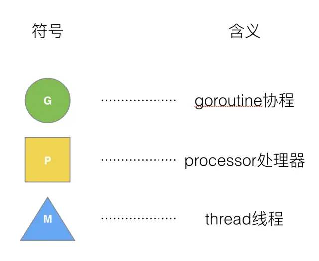
</p>
Go的调度器内部有四个重要的结构：G，M，P，Sched，如上图所示（Sched未给出）。

- G：表示 Goroutine，每个 Goroutine 对应一个 G 结构体，G 存储 Goroutine 的运行堆栈、状态以及任务函数，可重用。G 并非执行体，每个 G 需要绑定到 P 才能被调度执行；

* M：Machine，OS 线程抽象，代表着真正执行计算的资源，在绑定有效的 P 后，进入 schedule 循环；而 schedule 循环的机制大致是从 Global 队列、P 的 Local 队列以及 wait 队列中获取 G，切换到 G 的执行栈上并执行 G 的函数，调用 goexit 做清理工作并回到 M，如此反复。M 并不保留 G 状态，这是 G 可以跨 M 调度的基础，M 的数量是不定的，由 Go Runtime 调整，为了防止创建过多 OS 线程导致系统调度不过来，目前默认最大限制为10000个。M 是一个很大的结构，里面维护小对象内存 cache（mcache）、当前执行的 goroutine、随机数发生器等等非常多的信息；
* P：Processor，表示逻辑处理器， 对 G 来说，P 相当于 CPU 核，G 只有绑定到 P（在 P 的 local runq 中）才能被调度；对 M 来说，P 提供了相关的执行环境（Context），如内存分配状态（mcache）、任务队列（G）等。P 的数量决定了系统内最大可并行的 G 的数量（前提：物理 CPU 核数 >= P的数量），P 的数量由用户设置的 GOMAXPROCS 决定，但是不论 GOMAXPROCS 设置为多大，P 的数量最大为 256。
* Schedt：代表调度器，它维护有存储 M 和 G 的队列以及调度器的一些状态信息等。

#### G

G：Goroutine，每个 Gotoutine 对应一个 G 结构体，G 存储 Goroutine 的栈、指令指针，还有一些对于调用 goroutines 很重要的其它信息，比如阻塞它的任何 channel，以及任务函数。可重用（函数实体）G 需要保存到 P 才能被调度执行。

简单的说，G就是一个协程，里面包含了相应的栈，寄存器，执行的函数指令等，可以看成是一个任务体。

```Go
type g struct {
  stack          stack // 描述了真实的栈内存，包括上下界

  m              *m    // 当前的M
  sched          gobuf // goroutine切换时，用于保存G的上下文      
  param          unsafe.Pointer // 用于传递参数，睡眠时其他goroutine可以设置param，唤醒时该goroutine可以获取
  atomicstatus   uint32
  stackLock      uint32 
  goid           int64 // goroutine的ID
  waitsince      int64 // g被阻塞的大体时间
  lockedm        *m    // G被锁定只在这个M上运行
}
```

其中最主要的当然是 `sched` 了，它保存了 goroutine 的上下文。goroutine 切换的时候，不同于线程有 OS 来负责这部分数据，而是由一个 `gobuf` 对象来保存，这样能够更加轻量级。`gobuf` 的结构：

```Go
type gobuf struct {
    sp   uintptr   // 当前的栈指针
    pc   uintptr   // 程序计数器指针
    g    guintptr  // g自身的指针，为了能快速地访问到goroutine中的信息
    ctxt unsafe.Pointer
    ret  sys.Uintreg
    lr   uintptr
    bp   uintptr // for GOEXPERIMENT=framepointer
}
```

#### M

M：Machine，OS 内核线程抽象，所有 M 都是有线程栈的。如果不对该线程栈提供内存的话，系统会给该线程栈提供内存(不同操作系统提供的线程栈大小不同)。当指定了线程栈，则 M.stack → G.stack，M 的 PC 寄存器指向 G 提供的函数，然后去执行。

```Go
type m struct {
    g0      *g               // 带有调度栈的goroutine

    gsignal       *g         // 处理信号的goroutine
    tls           [6]uintptr // thread-local storage
    mstartfn      func()
    curg          *g         // 当前运行的goroutine
    caughtsig     guintptr 
    p             puintptr   // 关联p和执行的go代码
    nextp         puintptr
    id            int32
    mallocing     int32      // 状态

    spinning      bool       // m是否out of work
    blocked       bool       // m是否被阻塞
    inwb          bool       // m是否在执行写屏蔽

    printlock     int8
    incgo         bool       // m是否在执行cgo
    fastrand      uint32
    ncgocall      uint64     // cgo调用的总数
    ncgo          int32      // 当前cgo调用的数目
    park          note
    alllink       *m         // 用于链接allm
    schedlink     muintptr
    mcache        *mcache    // 当前m的内存缓存
    lockedg       *g         // 锁定g在当前m上执行，而不会切换到其他m
    createstack   [32]uintptr// thread创建的栈
}
```

结构体 M 中有两个 G 是需要关注一下的：
- curg，代表结构体 M 当前绑定的结构体G；
- g0，是带有**调度栈**的 goroutine，这是一个比较特殊的 goroutine。普通的 goroutine 的栈是在**堆**上分配的可增长的栈，而 G0 的栈是 M 对应的线程的栈。所有调度相关的代码，会先切换到该 goroutine 的栈中再执行。也就是说线程的栈也是用的是 G 实现，而不是使用的 OS 的。

#### P

P：Prosessor，代表一个处理器。每一个运行的 M 都必须绑定一个 P，就像线程必须在某一个 CPU 核上执行一样，由 P 来调度 G 在 M 上的运行。P 的个数就是 `GOMAXPROCS`（最大256），启动时固定的，一般不修改。M 的个数和 P 的个数不一定一样多（会有休眠的 M 或者不需要太多的 M）（M 最大10000）。每一个 P 保存着本地 G 任务队列，也有一个全局 G 任务队列。P 的数据结构：

```Go
type p struct {
    lock mutex

    id          int32
    status      uint32     // 状态，可以为Pidle, Prunning, Psyscall, Pgcstop, Pdead
    link        puintptr
    schedtick   uint32     // 每调度一次加1
    syscalltick uint32     // 每一次系统调用加1
    sysmontick  sysmontick 
    m           muintptr   // 回链到关联的m
    mcache      *mcache
    racectx     uintptr

    goidcache    uint64    // goroutine的ID的缓存
    goidcacheend uint64

    // 可运行的goroutine的队列
    runqhead uint32
    runqtail uint32
    runq     [256]guintptr

    runnext guintptr       // 下一个运行的g

    sudogcache []*sudog
    sudogbuf   [128]*sudog

    palloc persistentAlloc // per-P to avoid mutex

    pad [sys.CacheLineSize]byte
}
```

#### schedt

`schedt`可以看做是一个全局的调度者：

```Go
type schedt struct {
    goidgen  uint64
    lastpoll uint64

    lock mutex

    midle        muintptr // idle状态的m
    nmidle       int32    // idle状态的m个数
    nmidlelocked int32    // locked状态的m个数
    mcount       int32    // 创建的m的总数
    maxmcount    int32    // m允许的最大个数

    ngsys uint32          // 系统中goroutine的数目，会自动更新

    pidle      puintptr   // idle状态的p
    npidle     uint32
    nmspinning uint32 

    // 全局的可运行的g队列
    runqhead guintptr
    runqtail guintptr
    runqsize int32

    // dead的G的全局缓存
    gflock       mutex
    gfreeStack   *g
    gfreeNoStack *g
    ngfree       int32

    // sudog的缓存中心
    sudoglock  mutex
    sudogcache *sudog
}
```

大多数需要的信息都已放在了结构体 G 、M 和 P中，`schedt`结构体只是一个壳。可以看到，其中有 M 的 idle 队列，P的 idle 队列，以及一个全局的就绪的 G 队列。`schedt`结构体中的`Lock`是非常必须的，如果 M 或 P 等做一些非局部的操作，它们一般需要先**锁住调度器**。


### GMP 的设计策略

- 复用线程：避免频繁的创建、销毁线程，而是对线程的复用；
    - **work stealing** 机制
    当本线程无可运行的 G 时，尝试从其他线程绑定的 P 偷取 G，而不是销毁线程。
    - **hand off** 机制
    当本线程因为 G 进行系统调用阻塞时，线程释放绑定的 P，把 P 转移给其他空闲的线程执行。

- 利用并行：`GOMAXPROCS`设置 P 的数量，最多有`GOMAXPROCS`个线程分布在多个 CPU 上同时运行。`GOMAXPROCS`也限制了并发的程度，比如 GOMAXPROCS = 核数 / 2，则最多利用了一半的 CPU 核进行并行；

- 抢占：在 coroutine 中要等待一个协程主动让出 CPU 才执行下一个协程；在 Go 中，一个 goroutine 最多占用 CPU 10ms，以防止其他 goroutine 被饿死，这就是 goroutine 不同于 coroutine 的一个地方；

- 全局 G 队列：在新的调度器中依然有全局 G 队列，但功能已经被弱化了，当 M 执行 work stealing 从其他 P 偷不到 G 时，它可以从全局 G 队列获取 G。此外，P 也会周期性地检查全局队列上的 goroutine，来防止全局 goroutine 因为得不到执行而饿死。

<p align="center">
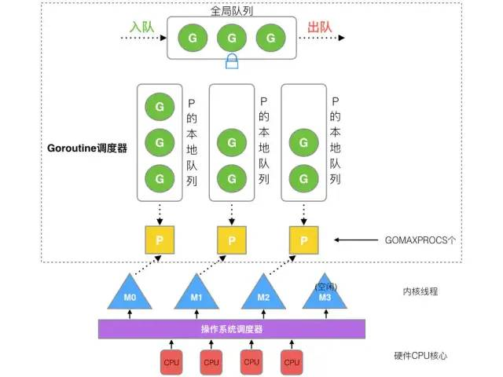
</p>

- 全局队列（Global Queue）：存放等待运行的G；

- P 的本地队列（Local Queue）：同全局队列类似，存放的也是等待运行的G，存的数量有限，不超过 256 个。新建 G' 时，G' **优先**加入到 P 的本地队列，如果本地队列满了，则会把本地队列中**一半**的 G 移动到全局队列。；

- P 列表：所有的 P 都在程序启动时创建，并保存在数组中，最多有`GOMAXPROCS`（可配置）个；

- M：线程想运行任务就得获取 P，从 P 的本地队列**无锁**地取出 G，并切换到 G 的堆栈执行。P 队列为空时，M 会先尝试从其他 P 的本地队列偷**一半**放到自己 P 的本地队列，若偷不到则从全局队列拿一批 G 放到 P 的本地队列。M 运行 G，G 执行之后，M 会从 P 获取下一个 G，不断重复下去。

> Goroutine 调度器和 OS 调度器是通过 M 结合起来的，每个 M 都代表了 1 个内核线程，OS 调度器负责把内核线程分配到 CPU 的核上执行。

**P 和 M 何时被创建?**

1. P 何时创建：在确定了 P 的最大数量 n 后，运行时系统会根据这个数量创建 n 个 P；

2. M 何时创建：没有足够的 M 来关联 P 并运行其中的可运行的 G。比如所有的 M 此时都阻塞住了，而 P 中还有很多就绪任务，就会去线程缓存寻找空闲的 M，如果没有空闲的，就会创建新的 M。

#### go func() 调度流程

<p align="center">
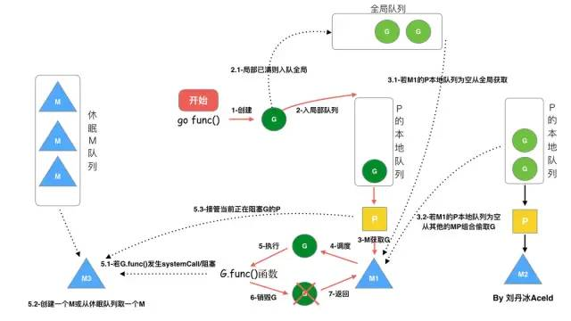
</p>

从上图我们可以分析出几个结论：

1. 我们通过 go func() 来创建一个 goroutine；

2. 有两个存储 G 的队列，一个是局部调度器 P 的本地队列、一个是全局 G 队列。新创建的 G 会先保存在 P 的本地队列中，如果 P 的本地队列已经满了就会保存在全局的队列中；

3. G 只能运行在 M 中，一个 M 必须持有一个 P，M 与 P 是 1：1 的关系。M 会从 P 的本地队列弹出一个可执行状态的 G 来执行，如果 P 的本地队列为空，就会向其他的 M P 组合偷取一个可执行的 G 来执行；

4. 一个 M 调度 G 执行的过程是一个循环机制；

5. 当 M 执行某一个 G 时候如果发生了 syscall 或其余阻塞操作，M 会阻塞，如果当前有一些 G 在执行，runtime 会把这个线程 M 从 P 中摘除（detach），然后再创建一个新的操作系统的线程（如果有空闲的线程可用就复用空闲线程）来服务于这个P；

6. 当 M 系统调用结束时候，这个 M 会尝试获取一个空闲的 P 执行，并把可运行的 G 放入到这个 P 的本地队列。如果获取不到 P，那么这个线程 M 变成休眠状态，加入到空闲线程中，然后这个 G 会被放入全局队列中。

#### 调度器的生命周期

<p align="center">
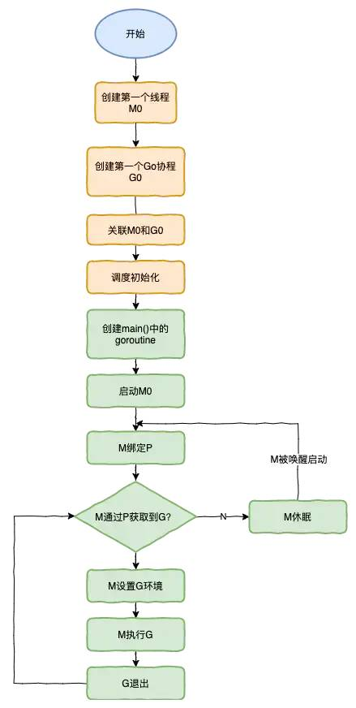
</p>

**特殊的 M0 和 G0**：

M0 是启动程序后的编号为 0 的主线程，这个 M 对应的实例会在全局变量 runtime.m0 中，不需要在 heap 上分配，M0 负责执行初始化操作和启动第一个 G，在之后 M0 就和其他的 M 一样了。

G0 是每次启动一个 M 都会第一个创建的 gourtine，G0 仅用于负责调度的 G，G0 不指向任何可执行的函数, 每个 M 都会有一个自己的 G0。在调度或系统调用时会使用 G0 的栈空间, 全局变量的 G0 是 M0 的 G0。

我们来跟踪一段代码:

```Go
package main

import "fmt"

func main() {
   fmt.Println("Hello world")
}
```

接下来我们来针对上面的代码对调度器里面的结构做一个分析。也会经历如上图所示的过程：

1. runtime 创建最初的线程 M0 和 goroutine G0，并把二者关联；

2. 调度器初始化：初始化 M0、栈、垃圾回收，以及创建和初始化由`GOMAXPROCS`个 P 构成的 P 列表；

3. 示例代码中的 main 函数是 `main.main`，runtime 中也有 1 个 main 函数 —— `runtime.main`，代码经过编译后，`runtime.main` 会调用 `main.main`，程序启动时会为 `runtime.main` 创建 goroutine，称它为 main goroutine 吧，然后把 main goroutine 加入到 P 的本地队列；

4. 启动 M0，M0 已经绑定了 P，会从 P 的本地队列获取 G，获取到 main goroutine；

5. G 拥有栈，M 根据 G 中的栈信息和调度信息设置运行环境；

6. M 运行 G；

7. G 退出，再次回到 M 获取可运行的 G，这样重复下去，直到 `main.main `退出，`runtime.main` 执行 Defer 和 Panic 处理，或调用 `runtime.exit` 退出程序。

调度器的生命周期几乎占满了一个 Go 程序的一生，runtime.main 的 goroutine 执行之前都是为调度器做准备工作，runtime.main 的 goroutine运行，才是调度器的真正开始，直到 runtime.main 结束而结束。

### GMP 场景解析

1. G1 创建 G2

P 拥有 G1，M1 获取 P 后开始运行 G1，G1 使用 go func() 创建了 G2，为了**局部性** G2 优先加入到 P1 的本地队列。

<p align="center">
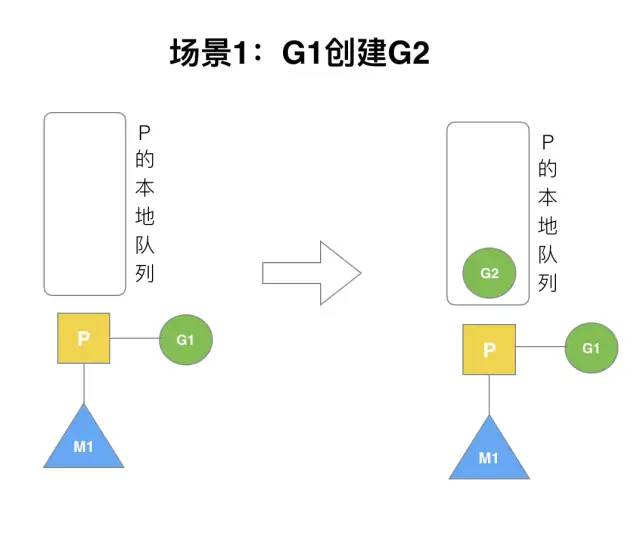
</p>

2. G1 执行完毕

G1 运行完成后（函数：goexit），M 上运行的 goroutine 切换为 G0，G0 负责调度时协程的切换（函数：schedule）。从 P 的本地队列取 G2，从 G0 切换到 G2，并开始运行 G2（函数：execute）。实现了线程 M1 的复用。

<p align="center">
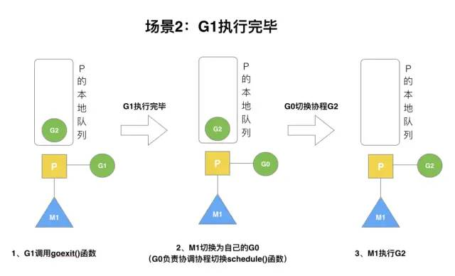
</p>

3. G2 开辟过多的 G

假设每个 P 的本地队列只能存 3 个 G。G2 要创建了 6 个 G，前 3 个 G（G3, G4, G5）已经加入 p1 的本地队列，p1 本地队列满了。

<p align="center">
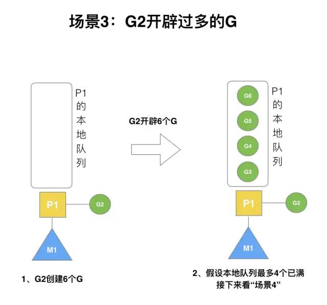
</p>

4. G2 本地满再创建 G7

G2 在创建 G7 的时候，发现 P1 的本地队列已满，需要执行负载均衡（把 P1 中本地队列中前一半的 G，还有新创建 G 转移到全局队列）。

实现中并不一定是新的 G，如果 G 是 G2 之后就执行的，会被保存在本地队列，利用某个老的 G 替换新 G 加入全局队列。

<p align="center">
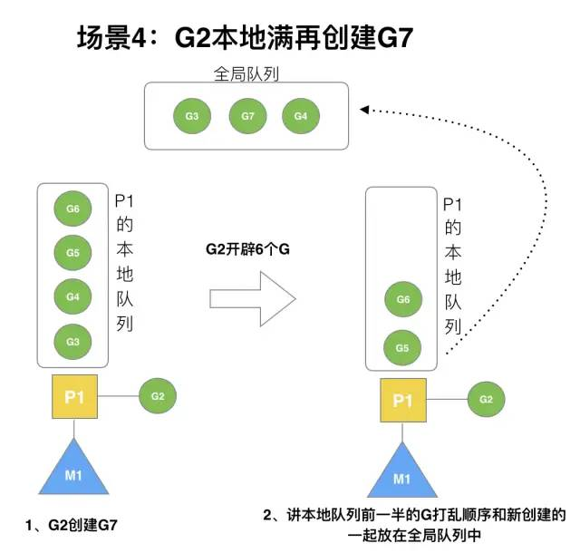
</p>

5. G2 本地未满创建 G8

G2 创建 G8 时，P1 的本地队列未满，所以 G8 会被加入到 P1 的本地队列。

<p align="center">
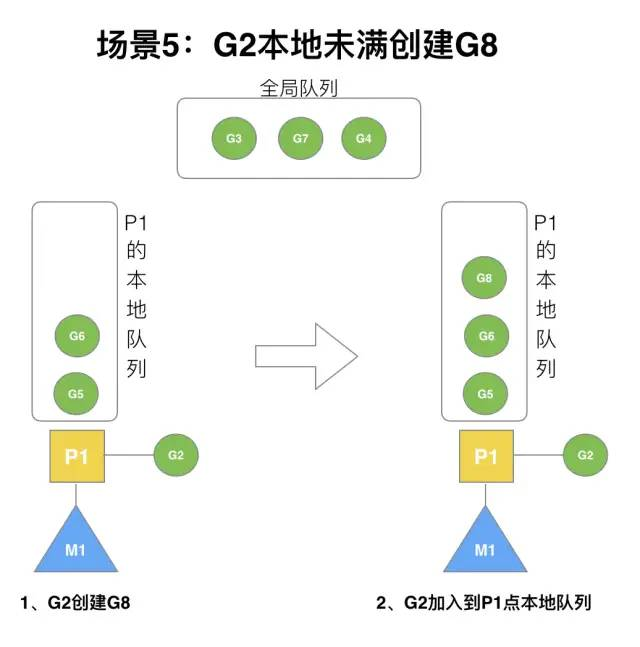
</p>

6. 唤醒正在休眠的 M

规定：在创建 G 时，运行的 G 会尝试唤醒其他空闲的 P 和 M 组合去执行。

假定 G2 唤醒了 M2，M2 绑定了 P2，并运行 G0，但 P2 本地队列没有 G，M2 此时为**自旋线程**（没有 G 但为运行状态的线程，不断寻找 G）。

<p align="center">
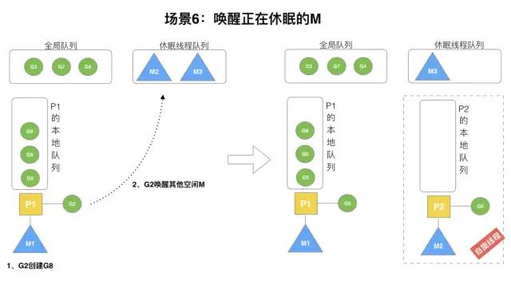
</p>

7. 被唤醒的 M2 从全局队列取批量 G

M2 尝试从全局队列（简称“GQ”）取一批 G 放到 P2 的本地队列（函数：`findrunnable()`）。M2 从全局队列取的 G 数量符合下面的公式：

$$ n = min \{ len(GQ) / GOMAXPROCS + 1, len(GQ) / 2 \} $$

至少从全局队列取 1 个 G，但每次不要从全局队列移动太多的 G 到 P 本地队列，给其他 P 留点。这是从全局队列到 P 本地队列的负载均衡。

<p align="center">
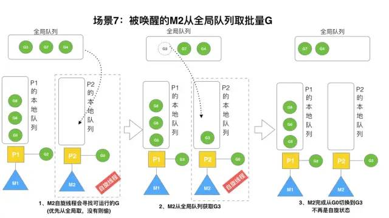
</p>

8. M2 从 M1 中偷取 G

假设 G2 一直在 M1 上运行，经过 2 轮后，M2 已经把 G7、G4 从全局队列获取到了 P2 的本地队列并完成运行，全局队列和 P2 的本地队列都空了，如场景 8 图的左半部分。

<p align="center">
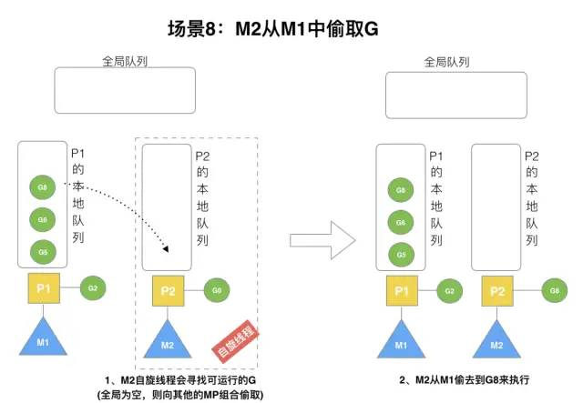
</p>

全局队列已经没有 G，那 M 就要执行 Work Stealing(偷取)：从其他有 G 的 P 那里偷取一半 G 过来，放到自己的 P 本地队列。P2 从 P1 的本地队列尾部取一半的 G，本例中一半则只有 1 个 G8，放到 P2 的本地队列并执行。

9. 自旋线程的最大限制

G1 本地队列 G5、G6 已经被其他 M 偷走并运行完成，当前 M1 和 M2 分别在运行 G2 和 G8，M3 和 M4 没有 goroutine 可以运行，M3 和 M4 处于自旋状态，它们不断寻找 goroutine。

<p align="center">
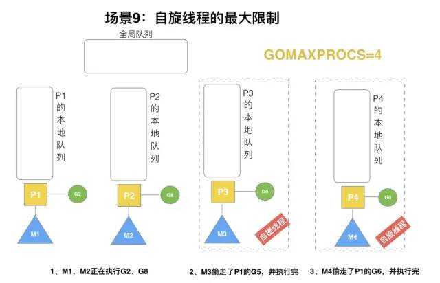
</p>

为什么要让 M3 和 M4 自旋？自旋本质是在运行，线程在运行却没有执行 G，就变成了浪费 CPU。为什么不销毁现场来节约 CPU 资源？因为创建和销毁线程也会浪费时间，我们希望当有新 goroutine 创建时，立刻能有 M 运行它，如果销毁再新建就增加了时延，降低了效率。当然也考虑了过多的自旋线程是浪费 CPU，所以系统中最多有`GOMAXPROCS`个自旋的线程（当前例子中的 GOMAXPROCS=4，所以一共 4 个 P），多余的空闲线程会让它们休眠。

10. G 发生系统调用 / 阻塞

假定当前除了 M3 和 M4 为自旋线程，还有 M5 和 M6 为空闲的线程（没有得到 P 的绑定，注意我们这里最多就只能够存在 4 个 P，所以 P 的数量应该永远是 M >= P, 大部分都是 M 在抢占需要运行的 P)，G8 创建了 G9，G8 进行了**阻塞的系统调用**（调用结果返回之前，当前线程会被挂起。函数只有在得到结果之后才会返回。），M2 和 P2 立即解绑，P2 会执行以下判断：如果 P2 本地队列有 G、全局队列有 G 或有空闲的 M，P2都会立马唤醒 1 个 M 和它绑定，否则 P2 则会加入到空闲 P 列表，等待 M 来获取可用的 p。本场景中，P2 本地队列有 G9，可以和其他空闲的线程 M5 绑定。

<p align="center">
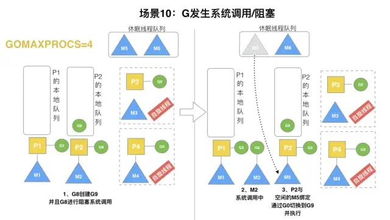
</p>

11. G 发生系统调用 / 非阻塞

G8 创建了 G9，假如 G8 进行了**非阻塞系统调用**（指在不能立刻得到结果之前，该函数不阻塞当前线程，立刻返回）。M2 和 P2 会解绑，但 M2 会记住 P2，然后 G8 和 M2 进入系统调用状态。当 G8 和 M2 退出系统调用时，会尝试获取 P2，如果无法获取，则获取空闲的 P，如果依然没有，G8 会被记为可运行状态，并加入到全局队列，M2 因为没有 P 的绑定而变成休眠状态（长时间休眠等待 GC 回收销毁）。

<p align="center">
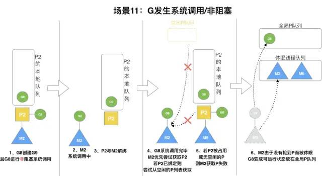
</p>

### Goroutine 调度实例

1. 只有一个 P

```Go
package main
 
import (
 "fmt"
 "runtime"
 "time"
)
 
func main() {
    runtime.GOMAXPROCS(1)
    for i := 0; i < 10; i++ {
        i := i
        go func() {
            fmt.Println(i)
        }()
    }
 
    time.Sleep(time.Hour)
}
```

当我们用 go1.14 及之后的版本运行时：

```Go
$ go1.14 run main.go
 
9
0
1
2
3
4
5
6
7
8
```

因为一开始就设置了只有一个 P，所以 for 循环里面“生产”出来的 goroutine 都会进入到 P 的 runnext 和本地队列，而不会涉及到全局队列。

每次生产出来的 goroutine 都会第一时间塞到 runnext，而 i 从 1 开始，runnext 已经有 goroutine 在了，所以这时会把 **old goroutine 移动到 P 的本队队列中**去，再把 **new goroutine 放到 runnext**。之后会重复这个过程……

因此这后当一次 i 为 9 时，新 goroutine 被塞到 runnext，其余 goroutine 都在本地队列。

之后，main goroutine 执行 sleep 语句，这是一个好的调度时机：main goroutine 挂起，运行 P 的 runnext 和本地可运行队列里的 gorotuine。

而我们又知道，**runnext 里的 goroutine 执行优先级最高**，因此会先打印出 9，接着再执行本地队列中的 goroutine，按照先进先出的顺序打印：0, 1, 2, 3, 4, 5, 6, 7, 8。

然而当我们用 go1.13 运行时：

```Go
$ go1.13.8 run main.go

0
1
2
3
4
5
6
7
8
```

go 1.13 的 time 包会生产一个名字叫 timerproc 的 goroutine 出来，它专门用于唤醒挂在 timer 上的时间未到期的 goroutine；因此这个 goroutine 会把 runnext 上的 goroutine 挤出去。因此输出顺序就是：0, 1, 2, 3, 4, 5, 6, 7, 8, 9。

而 go 1.14 把这个唤醒的 goroutine 干掉了，取而代之的是，在调度循环的各个地方、sysmon 里都是唤醒 timer 的代码，timer 的唤醒更及时了，但代码也更难看懂了。


# 内存管理

## 内存结构

<p align="center">

</p>

arena 区域就是我们所谓的**堆区**，Go 动态分配的内存都是在这个区域，它把内存分割成 8KB 大小的页，一些页组合起来称为 mspan。

bitmap 区域标识 arena 区域哪些地址保存了对象，并且用 4 bit 标志位表示对象是否包含指针、GC 标记信息。bitmap 中一个 byte 大小的内存对应 arena 区域中 4 个指针大小（指针大小为 8B ）的内存，所以 bitmap 区域的大小是 512GB / (4 * 8B) * 1B= 16GB。

<p align="center">

</p>

<p align="center">

</p>

此外我们还可以看到 bitmap 的高地址部分指向 arena 区域的低地址部分，这里 bitmap 的地址是由高地址向低地址增长的。

spans 区域存放 mspan（是一些 arena 分割的页组合起来的内存管理基本单元，后文会再讲）的指针，每个指针对应一页，所以 spans 区域的大小就是512GB / 8KB * 8B = 512MB。

除以 8KB 是计算 arena 区域的页数，而最后乘以 8 是计算 spans 区域所有指针的大小。创建 mspan 的时候，按页填充对应的 spans 区域，在回收 object 时，根据地址很容易就能找到它所属的 mspan。


### 栈的内存

栈和堆只是虚拟内存上 2 块不同功能的内存区域：

* 栈在高地址，从高地址向低地址增长。

* 堆在低地址，从低地址向高地址增长。

栈和堆相比优势：

* 栈的内存管理简单，分配比堆上快。

* 栈的内存不需要回收，而堆需要，无论是主动 free，还是被动的垃圾回收，这都需要花费额外的 CPU。

* 栈上的内存有更好的局部性，堆上内存访问就不那么友好了，CPU 访问的 2 块数据可能在不同的页上，CPU 访问数据的时间可能就上去了。


### 堆的内存

通常在 Golang 中,当我们谈论内存管理的时候，主要是指堆内存的管理，因为栈的内存管理不需要程序去操心。

<p align="center">

</p>

堆内存管理中主要是三部分：
1. 分配内存块
2. 回收内存块
3. 组织内存块

<p align="center">

</p>

一个内存块包含了 3 类信息，如下图所示，元数据、用户数据和对齐字段，内存对齐是为了提高访问效率。下图申请 5Byte 内存的时候，就需要进行内存对齐。

<p align="center">

</p>

释放内存实质是把使用的内存块从链表中取出来，然后标记为未使用，当分配内存块的时候，可以从未使用内存块中有先查找大小相近的内存块，如果找不到，再从未分配的内存中分配内存。

上面这个简单的设计中还没考虑内存碎片的问题，因为随着内存不断的申请和释放，内存上会存在大量的碎片，降低内存的使用率。为了解决内存碎片，可以将 2 个连续的未使用的内存块合并，减少碎片。


### Golang 的栈空间管理

Go语言的运行环境（runtime）会在 goroutine 需要的时候动态地分配栈空间，而不是给每个 goroutine 分配固定大小的内存空间。这样就避免了需要程序员来决定栈的大小。

1. 分块式的栈

`分块式的栈`是最初 Go 语言组织栈的方式。当创建一个 goroutine 的时候，它会分配一个 8KB 的内存空间来给 goroutine 的栈使用。我们可能会考虑当这 8KB 的栈空间被用完的时候该怎么办? 

为了处理这种情况，每个 Go 函数的开头都有一小段检测代码。这段代码会检查我们是否已经用完了分配的栈空间。如果是的话，它会调用`morestack`函数。`morestack`函数分配一块新的内存作为栈空间，并且在这块栈空间的底部填入各种信息（包括之前的那块栈地址）。在分配了这块新的栈空间之后，它会重试刚才造成栈空间不足的函数。这个过程叫做**栈分裂**（stack split）。

在新分配的栈底部，还插入了一个叫做`lessstack`的函数指针。这个函数还没有被调用。这样设置是为了从刚才造成栈空间不足的那个函数返回时做准备的。当我们从那个函数返回时，它会跳转到`lessstack`。`lessstack`函数会查看在栈底部存放的数据结构里的信息，然后调整栈指针（stack pointer）。这样就完成了从新的栈块到老的栈块的跳转。接下来，新分配的这个块栈空间就可以被**释放**掉了。

分块式的栈让我们能够按照需求来扩展和收缩栈的大小。 Go 开发者不需要花精力去估计 goroutine 会用到多大的栈。创建一个新的 goroutine 的开销也不大。当 Go 开发者不知道栈会扩展到多少大时，它也能很好的处理这种情况。

问题在于，缩减栈空间是一个开销相对较大的操作。如果在一个循环里有栈分裂，那么它的开销就变得不可忽略了。一个函数会扩展，然后分裂栈。当它返回的时候又会释放之前分配的内存块。如果这些都发生在一个循环里的话，代价是相当大的。

这就是所谓的**热分裂问题**（hot split problem）。它是Go语言开发者选择新的栈管理方法的主要原因。新的方法叫做栈复制法。

2. 栈复制法

`栈复制法（stack copying）`一开始和分块式的栈很像。当 goroutine 运行并用完栈空间的时候，栈溢出检查会被触发。但是，不像之前的方法那样分配一个新的内存块并链接到老的栈内存块，新的方法会分配一个两倍大的内存块并把老的内存块内容复制到新的内存块里。这样做意味着当栈缩减回之前大小时，我们不需要做任何事情。栈的缩减没有任何代价。而且，当栈再次扩展时，运行环境也不需要再做任何事。它可以重用之前分配的空间。

栈的复制听起来很容易，但实际操作并非那么简单。存储在栈上的变量的地址可能已经被使用到。也就是说程序使用到了一些指向栈的指针。当移动栈的时候，所有指向栈里内容的指针都会变得无效。然而，**指向栈内容的指针自身也必定是保存在栈上的**。这是为了保证内存安全的必要条件。否则一个程序就有可能访问一段已经无效的栈空间了。

因为垃圾回收的需要，我们必须知道栈的哪些部分是被用作指针了。当我们移动栈的时候，我们可以更新栈里的指针让它们指向新的地址。所有相关的指针都会被更新。我们使用了垃圾回收的信息来复制栈，但并不是任何使用栈的函数都有这些信息。因为很大一部分运行环境是用C语言写的，很多被调用的运行环境里的函数并没有指针的信息，所以也就不能够被复制了。当遇到这种情况时，我们只能**退回到分块式的栈**并支付相应的开销。

这也是为什么现在运行环境的开发者正在用 Go 语言重写运行环境的大部分代码。无法用 Go 语言重写的部分（比如*调度器的核心代码*和*垃圾回收器*）会在特殊的栈上运行。这个特殊栈的大小由运行环境的开发者设置。

这些改变除了使栈复制成为可能，它也允许我们在将来实现并行垃圾回收。

3. 在虚拟内存中分配大内存段

另外一种不同的栈处理方式就是在虚拟内存中分配大内存段。由于物理内存只是在真正使用时才会被分配，因此看起来好似你可以分配一个大内存段并让操作系统处理它。下面是这种方法的一些问题：

首先，32 位系统只能支持 **4GB** 虚拟内存，并且应用只能用到其中的3G空间。由于同时运行百万 goroutines 的情况并不少见，因此你很可能用光虚拟内存，即便我们假设每个 goroutine 的 stack 只有8K。

第二，然而我们可以在 64 位系统中分配大内存，它依赖于**过量内存使用**。所谓过量使用是指当你分配的内存大小超出物理内存大小时，依赖操作系统保证在需要时能够分配出物理内存。然而，允许过量使用可能会导致一些风险。由于一些进程分配了超出机器物理内存大小的内存，如果这些进程使用更多内存时，操作系统将不得不为它们补充分配内存。这会导致操作系统将一些内存段放入磁盘缓存，这常常会增加不可预测的处理延迟。正是考虑到这个原因，一 些新系统关闭了对过量使用的支持。


## 内存逃逸

所谓逃逸分析（Escape analysis）是指由编译器决定内存分配的位置，不需要程序员指定。

在函数中申请一个新的对象：

* 如果分配在**栈**中，则函数执行结束可自动将内存回收；

* 如果分配在**堆**中，则函数执行结束可交给 GC（垃圾回收）处理。

### 逃逸原因

1. 指针逃逸

Go 可以返回局部变量指针，这其实是一个典型的变量逃逸案例，示例代码如下：

```Go
package main

type Student struct {
    Name string
    Age  int
}

func StudentRegister(name string, age int) *Student {
    s := new(Student) //局部变量s逃逸到堆

    s.Name = name
    s.Age = age

    return s
}

func main() {
    StudentRegister("Jim", 18)
}
```

虽然 在函数 `StudentRegister()` 内部 s 为局部变量，其值通过函数返回值返回，s 本身为一指针，其指向的内存地址不会是栈而是堆，这就是典型的逃逸案例。

2. 栈空间不足逃逸（空间开辟过大）

当栈空间不足以存放当前对象时，或无法判断当前切片长度时，就会将对象分配到堆中。

3. 动态类型逃逸（不确定长度大小）

很多函数参数为 interface 类型，比如 fmt.Println(a …interface{})，编译期间很难确定其参数的具体类型，也能产生逃逸。

```Go
func F() {
	a := make([]int, 0, 20)     // 栈 空间小
	b := make([]int, 0, 20000) // 堆 空间过大 逃逸
 
	l := 20
	c := make([]int, 0, l) // 堆 动态分配不定空间 逃逸
}
```

4. 闭包引用对象逃逸

```Go
package main

import "fmt"

func Fibonacci() func() int {
    a, b := 0, 1
    return func() int {
        a, b = b, a+b
        return a
    }
}

func main() {
    f := Fibonacci()

    for i := 0; i < 10; i++ {
        fmt.Printf("Fibonacci: %d\n", f())
    }
}
```

Fibonacci() 函数中原本属于局部变量的 a 和 b 由于闭包的引用，不得不将二者放到堆上，以致产生逃逸。

### 逃逸分析的作用

1. 逃逸分析的好处是为了减少 gc 的压力，不逃逸的对象分配在栈上，当函数返回时就回收了资源，不需要 gc 标记清除；

2. 逃逸分析完后可以确定哪些变量可以分配在栈上，栈的分配比堆快，性能好(逃逸的局部变量会在堆上分配，而没有发生逃逸的则由编译器在栈上分配)。

3. 同步消除，如果你定义的对象的方法上有同步锁，但在运行时，却只有一个线程在访问，此时逃逸分析后的机器码，会去掉同步锁运行。

**函数传递指针真的比传值效率高吗？**

我们知道传递指针可以减少底层值的拷贝，可以提高效率，但是如果拷贝的数据量小，由于指针传递会产生逃逸，可能会使用堆，也可能会增加 GC 的负担，所以传递指针不一定是高效的。


## GC 垃圾回收

### GC的触发条件

Go中对 GC 的触发时机存在两种形式：

* 主动触发(手动触发)，通过调用`runtime.GC` 来触发`GC`，此调用阻塞式地等待当前`GC`运行完毕.
* 被动触发，分为两种方式：
  a. 使用系统监控，当超过两分钟没有产生任何`GC`时，强制触发 `GC`.
  b. 使用步调（Pacing）算法，其核心思想是控制内存增长的比例，当前内存分配达到一定比例则触发。

### 三色标记法

- 灰色：对象已被标记，但这个对象包含的子对象未标记；
- 黑色：对象已被标记，且这个对象包含的子对象也已标记，gcmarkBits 对应的位为 1（该对象不会在本次 GC 中被清理）；
- 白色：对象未被标记，gcmarkBits 对应的位为 0（该对象将会在本次 GC 中被清理）。

例如，当前内存中有 A~F 一共 6 个对象，根对象 a、b 本身为栈上分配的局部变量，分别引用了对象 A、B，而 B 对象又引用了对象 D，则 GC 开始前各对象的状态如下图所示:

<p align="center">

</p>

1. 初始状态下所有对象都是白色的；
2. 接着开始扫描根对象 a、b。由于根对象引用了对象 A、B，那么 A、B 变为灰色对象。接下来就开始分析灰色对象，分析 A 时，A 没有引用其他对象很快就转入黑色；B 引用了 D，则 B 转入黑色的同时还需要将 D 转为灰色，进行接下来的分析；
3. 灰色对象只有 D，由于 D 没有引用其他对象，所以 D 转入黑色。标记过程结束；
4. 最终，黑色的对象会被保留下来，白色对象会被回收掉。
   
### GC 流程

1. Sweep Termination: 对未清扫的 span 进行清扫，只有上一轮的 GC 的清扫工作完成才可以开始新一轮的 GC；
2. Mark: 扫描所有根对象，和根对象可以到达的所有对象，标记它们不被回收；
3. Mark Termination: 完成标记工作，重新扫描部分根对象（要求 STW）；
4. Sweep: 按标记结果清扫 span。

标记-清除（mark and sweep）算法的 STW（stop the world）操作，就是 runtime 把所有的线程全部冻结掉，意味着用户逻辑是暂停的。这样所有的对象都不会被修改了，这时候去扫描是绝对安全的。

Go 如何减短这个过程呢？标记-清除算法包含两部分逻辑：标记和清除。

我们知道 Golang 三色标记法中最后只剩下的黑白两种对象，黑色对象是程序恢复后接着使用的对象，如果不碰触黑色对象，只清除白色的对象，肯定不会影响程序逻辑。所以：**清除操作和用户逻辑可以并发**。

**标记操作和用户逻辑也是并发的**，用户逻辑会时常生成对象或者改变对象的引用，通过写屏障来避免这种情况对 GC 的影响。

目前整个 GC 流程会进行两次 STW（Stop The World），第一次是 Mark 阶段的开始，第二次是 Mark Termination 阶段。

- 第一次 STW 会准备根对象的扫描，启动写屏障（Write Barrier）和辅助 GC（mutator assist）；
- 第二次 STW 会重新扫描部分根对象，禁用写屏障（Write Barrier）和辅助 GC（mutator assist）。

需要注意的是，不是所有根对象的扫描都需要 STW，例如扫描栈上的对象只需要停止拥有该栈的 G。

从 GO 1.9 开始，写屏障的实现使用了 Hybrid Write Barrier，大幅减少了第二次 STW 的时间。

### 写屏障

因为 go 支持并行 GC，GC 的扫描和 go 代码可以同时运行，这样带来的问题是 GC 扫描的过程中 go 代码有可能改变了对象的依赖树。

例如开始扫描时发现根对象 A 和 B，B 拥有 C 的指针。

1. GC 先扫描A，A 放入黑色；
2. B 把 C 的指针交给 A；
3. GC 再扫描 B，B 放入黑色；
4. C 在白色，会回收；但是 A 其实引用了 C。

为了避免这个问题, go 在 GC 的标记阶段会启用写屏障（Write Barrier）：

1. GC 先扫描 A，A 放入黑色；
2. B 把 C 的指针交给 A；
3. 由于 A 在黑色，所以 C 放入灰色；
4. C 没有子对象，放入黑色；
5. 扫描 B，B 没有子对象，放入黑色。

开启写屏障之后，当指针发生改变，GC 会认为在这一轮的扫描中这个指针是存活的，所以放入灰色。


## 内存泄露

通常内存泄漏，指的是能够预期的能很快被释放的内存由于附着在了长期存活的内存上、或生命期意外地被延长，导致预计能够立即回收的内存而长时间得不到回收。

在 Go 中，由于 goroutine 的存在，内存泄漏除了附着在长期对象上之外，还存在多种不同的形式。

1. 预期能被快速释放的内存因被根对象引用而没有得到迅速释放。

当有一个全局对象时，可能不经意间将某个变量附着在其上，且忽略了将其进行释放，则该内存永远不会得到释放。包括：

* 字符串截取引起剩余字节内存泄露
* 切片截取引起子切片内存泄漏
* 丢失的子切片元素中的指针元素未被置空
* 函数数组传参产生临时性的内存泄漏

2. goroutine 泄漏

Goroutine 作为一种逻辑上理解的轻量级线程，需要维护执行用户代码的**上下文**信息。在运行过程中也需要消耗一定的内存来保存这类信息，而这些内存在目前版本的 Go 中是不会被释放的。

因此，如果一个程序持续不断地产生新的 goroutine，且不结束已经创建的 goroutine 并复用这部分内存，就会造成内存泄漏。

例如:

```go
func main() {
	for i := 0; i < 10000; i++ {
		go func() {
			select {}
		}()
	}
}
```


# 其它问题

## defer 原理

defer 意为延迟，在 golang 中用于延迟执行一个函数。它可以帮助我们处理容易忽略的问题，如资源释放、连接关闭等。但在实际使用过程中，有一些需要注意的地方。

### defer 作用规则

1. 若函数中有多个 defer，其执行顺序为 **先进后出**，可以理解为栈。

```go
package main

import "fmt"

func main() {
  for i := 0; i < 5; i++ {
    defer fmt.Println(i)
  }
}

```
运行:

```go
4
3
2
1
0
```

2. defer 调用的函数**参数**的值在 defer 定义时就确定了, 而 defer 函数**内部所使用的变量**的值需要在这个函数运行时才确定。

```Go
package main
 
import "fmt"
 
func main() {
    i := 1
    defer fmt.Println("Deferred print:",i)
    i++
    fmt.Println("Normal print:", i)
}
```

运行：

```Go
Normal print: 2
Deferred print: 1
```

```Go
package main
 
import "fmt"
 
func f1() (r int) {
    r = 1
    defer func() {
        r++
        fmt.Println(" r value = ",r)
    }()
    r = 2
    return
}
 
func main() {
    f1()
}
```

运行：

```Go
r value =  3
```

3. Go 的函数返回值是通过堆栈返回的, **return 语句不是原子操作**，而是被拆成了三步：

* 给返回值赋值 (rval)
* 调用 defer 表达式
* 返回给调用函数 (ret)

```go
package main

import "fmt"

func main() {
    fmt.Println(increase(1)) // 3. increase(1) = ret = 2
}

func increase(d int) (ret int) {
    defer func() {
        ret++ // 2. ret = ret + 1 = 2
    }()

    return d // 1. ret = d = 1
}
```
运行输出:

```go
2
```

4. 对于**链式**函数，只会 defer 最**后**一个；对于**嵌套**函数，只会 defer 最**外**层。

```Go
package main

import "fmt"

type Slice []int
func NewSlice() Slice {
	return make(Slice, 0)
}

func (s *Slice) Add(elem int) *Slice {
	*s = append(*s, elem)
	fmt.Print(elem)
	return s
}

func main() {
	s := NewSlice()
	defer s.Add(1).Add(2).Add(4)
	s.Add(3)
}
```

运行：

```Go
1234
```

```Go
package main

import "fmt"

func GetFn() func() {
    fmt.Println("outside")
    return func() {
        fmt.Println("inside")
    }
}

func main() {
    defer GetFn()()
    fmt.Println("main...")
}
```

运行：

```Go
outside
main...
inside
```

```Go
package main

import "fmt"

func show(x int) {
    fmt.Print(x + 1)
    return
}

func get(n int) int {
    fmt.Print(n)
    return n
}

func main() {
    defer show(get(1))
    defer show(get(3))
    fmt.Print(5)
}
```

运行：

```Go
13542
```

1. 若 defer 表达式有返回值，将会被**丢弃**。

### defer 其他实例

闭包与匿名函数：

* 闭包：可以使用另外一个函数作用域中的变量的函数
* 匿名函数：没有函数名的函数

在实际开发中，defer 的使用经常伴随着闭包与匿名函数的使用。

```go
package main

import "fmt"

func main() {
    for i := 0; i < 5; i++ {
        defer func() {
            fmt.Println(i)
        }()
    }
}

```
运行输出:

```go
5
5
5
5
5
```
之所以这样是因为 defer 表达式中的 i 是对 for 循环中 i 的**引用**。到最后，i 加到 5，故最后全部打印 5。

如果将 i 作为参数传入 defer 表达式中，在传入最初就会进行求值保存，只是没有执行延迟函数而已。

应用示例:

```go
func f1() (result int) {
    defer func() {
        result++
    }()
    return 0
}
```

```go
func f2() (r int) {
    t := 5
   defer func() {
    t = t + 5
   }()
   return t
}
```

```go
func f3() (r int) {
    defer func(r int) {
        r = r + 5
    }(r)
    return 1
}
```

```go
type Test struct {
    Max int
}

func (t *Test) Println() {
    fmt.Println(t.Max)
}

func deferExec(f func()) {
    f()
}

func call() {
    var t *Test
    defer deferExec(t.Println)

    t = new(Test)
}
```

有没有得出结果？例 1 的答案不是 0，例 2 的答案不是 10，例 3 的答案也不是 6。

defer 是在 return 之前执行的，这个在[官方文档](https://golang.org/ref/spec#defer_statements)中是明确说明了的。要使用 defer 时不踩坑，最重要的一点就是要明白，`return xxx`这一条语句并不是一条原子指令!

> 函数返回的过程是这样的：先给返回值赋值，然后调用 defer 表达式，最后才是返回到调用函数中。
defer 表达式可能会在设置函数返回值之后、返回到调用函数之前，修改返回值，使最终的函数返回值与你想象的不一致。
其实使用 defer 时，用一个简单的转换规则改写一下，就不会迷糊了。改写规则是将 return 语句拆分，return xxx 会被改写成:
返回值 = xxx
调用 defer 函数
空的 return

f1：比较简单，参考结论 2，将 0 赋给 result，defer 延迟函数修改 result，最后返回给调用函数。正确答案是 1。

f1 可以修改成长这样的:
```go
func f() (result int) {
     result = 0  // return语句不是一条原子调用，return xxx其实是赋值＋ret指令
     func() { // defer被插入到return之前执行，也就是赋返回值和ret指令之间
         result++
     }()
     return
}
```
所以这个返回值是1。

f2：defer 是在 t 赋值给 r 之后执行的，而 defer 延迟函数只改变了 t 的值，r 不变。正确答案 5。

f2可以修改成这样的:
```go
func f() (r int) {
     t := 5
     r = t // 赋值指令
     func() {        // defer被插入到赋值与返回之间执行，这个例子中返回值r没被修改过
         t = t + 5
     }
     return        // 空的return指令
}
```
所以这个的结果是 5。

f3：这里将 r 作为参数传入了 defer 表达式。故 func (r int) 中的 r 非 func f() (r int) 中的 r，只是参数命名相同而已。正确答案 1。

f3可以修改成这样的:
```go
func f() (r int) {
     r = 1  // 给返回值赋值
     func(r int) {        // 这里改的r是传值传进去的r，不会改变要返回的那个r值
          r = r + 5
     }(r)
     return        // 空的return
}

```
所以这个例子的结果是1。

f4：这里将发生 panic。将方法传给 deferExec，实际上在传的过程中对方法求了值。而此时的 t 任然为 nil。

因此，defer 确实是在 return 之前调用的，但表现形式上却可能不像。根本原因是 `return xxx` 语句并不是一条原子指令，defer 被插入到了赋值与 ret 之间，因此可能有机会改变最终的返回值。

defer 关键字的实现跟 go 关键字很类似，不同的是它调用的是`runtime.deferproc`而不是`runtime.newproc`。

### defer 的底层设计

源码包中 src/runtime/panic.go 定义了两个方法，分别用于创建 defer 和执行 defer。

```Go
deferproc(): 负责把 defer 函数处理成 _defer 实例，并存入 goroutine 中的链表

deferreturn(): 负责把 defer 从 goroutine 链表中的 defer 实例取出并执行

简单理解为：
- 编译器在编译阶段把 defer 语句替换成 函数 deferproc()
- 在函数 return() 前插入了函数 deferreturn()
- 在运行时，每次执行 deferproc() 都创建一个运行时 _defer 实例并存储
- 函数返回前执行 deferreturn() 依次取出 _defer 实例并执行
```

在 defer 出现的地方，插入了指令`call runtime.deferproc`，然后在函数返回之前的地方，插入指令`call runtime.deferreturn`。

普通的函数返回时，汇编代码类似:
```go
add xx SP
return
```
如果其中包含了defer语句，则汇编代码是：

```go 
call runtime.deferreturn，
add xx SP
return
```
goroutine 的控制结构中，有一张表记录 defer，调用`runtime.deferproc`时会将需要 defer 的表达式记录在表中，而在调用`runtime.deferreturn`的时候，则会依次从 defer 表中出**栈**并执行。

## G0 的作用

在 Go 中 g0 作为一个特殊的 goroutine，为 scheduler 执行调度循环提供了场地（栈）。对于一个线程来说，g0 总是它**第一个**创建的 goroutine。

之后，它会不断地寻找其他普通的 goroutine 来执行，直到进程退出。

当需要执行一些任务，且不想扩栈时，就可以用到 g0 了，因为 g0 的栈比较大。

g0 其他的一些“职责”有：创建 `goroutine`、`deferproc` 函数里新建 `_defer`、垃圾回收相关的工作（例如 stw、扫描 goroutine 的执行栈、一些标识清扫的工作、栈增长）等等。

## http 包

Golang 的 http 包中处理 HTTP 请求主要跟两个东西相关：ServeMux 和 Handler。

`ServeMux` 本质上是一个 HTTP 请求路由器（或者叫多路复用器，Multiplexor）。它把收到的请求与一组预先定义的 URL 路径列表做对比，然后在匹配到路径的时候调用关联的处理器（Handler）。

`处理器（Handler）`负责输出 HTTP 响应的头和正文。任何满足了 http.Handler 接口的对象都可作为一个处理器。通俗的说，对象只要有个如下签名的 ServeHTTP 方法即可：
```go 
ServeHTTP(http.ResponseWriter, *http.Request)
```
Go 语言的 HTTP 包自带了几个函数用作常用处理器，比如`FileServer`，`NotFoundHandler` 和 `RedirectHandler`。

应用示例:
```go 
package main

import (
	"log"
	"net/http"
)

func main() {
	mux := http.NewServeMux()

	rh := http.RedirectHandler("http://www.baidu.com", 307)
	mux.Handle("/foo", rh)

	log.Println("Listening...")
	http.ListenAndServe(":3000", mux)
}
```

在这个应用示例中,首先在 main 函数中我们只用了 `http.NewServeMux` 函数来创建一个空的 `ServeMux`。 然后我们使用 `http.RedirectHandler` 函数创建了一个新的处理器，这个处理器会对收到的所有请求，都执行307重定向操作到 `http://www.baidu.com`。

接下来我们使用 `ServeMux.Handle` 函数将处理器注册到新创建的 `ServeMux`，所以它在 URL 路径`/foo` 上收到所有的请求都交给这个处理器。 最后我们创建了一个新的服务器，并通过 `http.ListenAndServe` 函数监听所有进入的请求，通过传递刚才创建的 `ServeMux`来为请求去匹配对应处理器。 

在浏览器中访问 `http://localhost:3000/foo`，你应该能发现请求已经成功的重定向了。

此刻你应该能注意到一些有意思的事情：`ListenAndServer` 的函数签名是` ListenAndServe(addr string, handler Handler)` ，但是第二个参数我们传递的是个`ServeMux`。

通过这个例子我们就可以知道,`net/http`包在编写 golang web 应用中有很重要的作用，它主要提供了基于 HTTP 协议进行工作的 client 实现和 server 实现，可用于编写 HTTP 服务端和客户端。

## 深拷贝和浅拷贝

1. 深拷贝（Deep Copy）

拷贝的是数据本身，新创建的对象与原对象不共享内存，新创建的对象在内存中开辟一个新的内存地址，新对象值修改时不会影响原对象值。既然内存地址不同，释放内存地址时，可分别释放。

值类型的数据，默认全部都是深拷贝：`array`、`int`、`string`、`struct`、`float`、`bool`。

1. 浅拷贝（Shallow Copy）

拷贝的是数据地址，只复制指向的对象的指针，此时新对象和老对象指向的内存地址是一样的，新对象值修改时老对象也会变化。释放内存地址时，同时释放内存地址。

引用类型的数据，默认全部都是浅拷贝：`slice`、`map`。