# 导引

## 操作系统基本特征

操作系统的主要特征为：`并发`、`共享`、`虚拟`、`异步`。

1. 并发

`并发`是指宏观上在一段时间内能同时运行多个程序，而`并行`则指同一时刻能运行多个指令。并行需要硬件支持，如多流水线或者多处理器。

操作系统通过引入进程和线程，使得程序能够并发运行。

<p align="center">

</p>

2. 共享

共享是指系统中的资源可以被多个并发进程共同使用。

有两种共享方式：互斥共享和同时共享。

`互斥共享`的资源称为临界资源，例如打印机等，在同一时间只允许一个进程访问，需要用同步机制来实现对临界资源的访问。

`同时共享`的资源在一段时间内可由多个进程"同时"访问，这种"同时"是宏观上的，在微观上，这些进程可能是交替对该资源进行访问，磁盘设备就是这类资源。

3. 虚拟

虚拟就是通过某种技术把一个物理实体转变为若干个逻辑上的对应物。主要有两种虚拟技术：时分复用技术和空分复用技术。

* 时分复用技

`时分复用`技术可以用来实现虚拟处理机、虚拟设备等，用来提高资源的利用率。

**虚拟处理机**技术。虚拟处理机技术借助多道程序设计技术，即为每一道程序建立一个进程，让多道程序并发执行，从而达到分时使用一台计算机，这台计算机能够同时为多个用户服务，使得每个终端用户都认为有一个处理机专门为他服务。

**虚拟设备**技术。通过虚拟设备技术将一台物理 I/O 设备虚拟为多态逻辑上的 I/O 设备，并允许用户占用一台逻辑上的 I/O 设备，这样可以允许在一段时间内由一个用户访问的设备变为在一段时间内允许多个用户同时访问的共享设备。

* 空分复用技术

`空分复用`技术可以用来实现虚拟磁盘、虚拟存储等，用来提高资源利用率。

**虚拟磁盘**技术。通过虚拟磁盘技术可以将一个硬盘虚拟为多台虚拟磁盘，这样使用起来既安全又方便。如将一块硬盘划分为C、D、E等逻辑盘。

**虚拟存储器**技术。利用存储器的空闲空间来存放程序，提高内存利用率。还可以通过虚拟存储器技术（实质上是时分复用技术）在逻辑上扩大存储器的容量，它可以使得一道程序通过时分复用技术在远小于它的内存空间中运行。

时分复用或空分复用中逻辑设备数为 N，那么每台虚拟设备速度必然等于或低于物理设备速度的 1/N。

4. 异步

在多道程序环境下，允许多个进程并发执行，但只有进程在获得所需的资源后方可执行，如正在执行的进程 A 提出打印请求，需要使用打印机，但是此时进程 B 正在使用打印机，故此时进程 A 只能等待并且放弃处理机资源，当进程 B 使用完打印机后，并且分配处理机才能运行，可以看出，进程的执行通常不是一气呵成的，而是走走停停的方式。

进程以不可预知的速度向前推进，此即进程的异步性。但只要运行环境相同，OS 需要保证程序运行的结果也要相同。


## 操作系统基本功能

1. 进程管理

进程控制、进程同步、进程通信、死锁处理、处理机调度等。

2. 内存管理

内存分配、地址映射、内存保护与共享、虚拟内存等。

3. 文件管理

文件存储空间的管理、目录管理、文件读写管理和保护等。

4. 设备管理

完成用户的 I/O 请求，方便用户使用各种设备，并提高设备的利用率。

主要包括缓冲管理、设备分配、设备处理、虛拟设备等。


## 系统调用

计算机的底层其实是硬件的交互，不同的硬件还有可能有不同的差异，如果让程序自己来处理，那程序员的脑子不知道要背诵多少接口。所以操作系统屏蔽了这些复杂的操作，让用户可以通过系统调用，操作这些底层的接口。

所以，我们把需要执行高权限的 CPU 指令，例如 IO 操作，内存操作，硬件操作等，需要交给 Linux 操作系统内核运行，称之为内核态。

<p align="center">
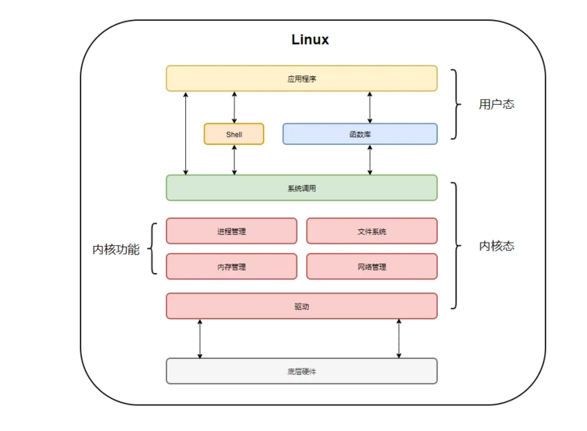
</p>

如果一个进程在用户态需要使用内核态的功能，就进行系统调用从而陷入内核，由操作系统代为完成。

<p align="center">

</p>

具体流程为：

- 保存用户态现场
- 复制用户态参数
- 参数校验
- 执行内核态代码
- 复制执行结果
- 恢复用户态现场

Linux 的系统调用主要有以下这些：

| Task     | Commands                   |
| -------- | ---------------------------|
| 进程控制  | fork(); exit(); wait();     |
| 进程通信  | pipe(); shmget(); mmap();   |
| 文件操作  | open(); read(); write();    |
| 设备操作  | ioctl(); read(); write();   |
| 信息维护  | getpid(); alarm(); sleep(); |
| 安全     | chmod(); umask(); chown();  |


## 微内核

### 大内核

大内核是将操作系统功能作为一个紧密结合的整体放到内核。

由于各模块共享信息，因此有很高的性能。


### 微内核的特点

1. 足够小的内核

由于操作系统不断复杂，因此将一部分操作系统功能移出内核，从而降低内核的复杂性。移出的部分根据分层的原则划分成若干服务，相互独立。在微内核结构下，操作系统被划分成小的、定义良好的模块，只有微内核这一个模块运行在内核态，其余模块运行在用户态。

微内核并不是一个完整的 OS，而只是操作系统中最基本的部分，它通常用于实现与硬件紧密相关的处理、实现一些比较基本的功能、负责客户和服务器之间的通信。

因为需要频繁地在用户态和核心态之间进行切换，所以会有一定的性能损失。

<p align="center">

</p>

2. 基于客户/服务器模式

将操作系统中最基本的功能放入内核中，把其他绝大部分功能放在微内核外面的一组服务器（进程）中实现。如用于提供对进程进行管理的进程服务器，提供对虚拟存储器管理的虚拟存储器服务器，提供 I/O 设备管理的 I/O 设备管理服务器。他们都是被作为进程来实现的，运行在用户态，客户与服务器之间是借助微内核提供的消息传递机制来实现信息交互的。如下图：

<p align="center">

</p>

可以看到客户进程与服务器是通过微内核来完成通信的。

3. 应用"机制与策略分离"原理

所谓机制，是指实现某一功能的具体执行结构，而策略，则是在机制的基础上，借助于某些参数或算法来实现该功能的优化，或达到不同的功能目标。通常，机制处于一个系统的基层，而策略则处于系统的高层。在微内核系统中，机制通常放在 OS 的微内核中。

4. 采用面向对象技术

利用面向对象技术的抽象和隐蔽原则来控制系统的复杂性，利用对象、封装、继承等概念来确保操作系统的正确性、可靠性、易修改性等。


### 微内核的基本功能

1. 进程（线程）管理

为实现进程（线程）调度功能，必须在进程管理中设置一个或多个进程（线程）优先级队列，能将指定优先级进程（线程）从所在队列中取出，并将其投入执行。由于这部分属于调度功能的机制部分，应将它放入微内核中。而如何确定每类用户进程的优先级，以及如何修改他们的优先级，都是属于策略问题，可将他们放在微内核外的进程管理服务器中。

由于进程之间的通信功能是微内核 OS 最基本的功能，因此几乎所有的微内核OS 都将进程通信功能放在微内核中，此外，还将进程的切换、线程的调度、以及处理机之间的同步功能也放入微内核中。

2. 低级存储器管理

在微内核中，配置了最基本的低级存储器管理机制。如用于将用户控制的逻辑地址变换为内存空间的物理地址的页表机制和地址变换机制，这部分是依赖于机器的，因此放入微内核中，而采取何种页面算法、采用何种内存分配和回收策略都是具体的策略，放在微内核外的存储器管理服务器中去实现。　

3. 中断和陷入处理　

微内核可以捕获所发生的中断和陷入事件，并进行相应的前期处理。如进行中断现场保护，识别中断和陷入的类型，然后将有关事件的信息转化成消息后，把它发送给相关的服务器。服务器根据中断和陷入的类型，调用相应的处理程序来进行后期处理。


## 中断与异常

### 中断（interrupt）

由 CPU 执行指令以外的事件引起，如 **I/O 完成中断**，表示设备输入/输出处理已经完成，处理器能够发送下一个输入/输出请求。此外还有**时钟中断**、**控制台中断**等。

### 异常

由 CPU 执行指令的内部事件引起，如`非法操作码`、`地址越界`、`算术溢出`等。主要有以下三类：

1. 陷入（trap）

陷入是有意的异常，是执行一条指令的结果。就像中断处理程序一样，陷入处理程序将控制返回到下一条指令。陷入最重要的用途是在用户程序和内核之间提供一个像过程一样的接口，即系统调用。

2. 故障（fault）

故障由错误情况引起，它有可能被故障处理程序修正。根据故障是否能够被修复，故障处理程序要么重新执行引起故障的指令，要么将其终止。典型的故障示例是**缺页异常**。

3. 终止（abort）

终止是不可恢复的致命错误造成的结果，通常是一些硬件错误，比如 DRAM 或者 SARM 位被损坏时发生的奇偶错误。终止处理程序不会将控制返回给应用程序，而是会终止这个应用程序。

### 总结

|  类型   |      原因        |      示例      |   响应方式   |    返回行为     |
|--------|------------------|----------------|-------------|-----------------|
|  中断   | 来自 I/O 设备的信号 | I/O 中断、时钟中断 |   异步   | 总是返回到下一条指令 |
|  陷入   | 有意的异常         | 系统调用           |   同步   | 总是返回到下一条指令 |
|  故障   | 潜在可恢复的错误    | 缺页异常、除法错误 |   同步   |  可能返回到当前指令   |
|  终止   | 不可恢复的错误      | 机器检查          |   同步   | 不会返回            |


## 堆和栈

`栈区（stack）` 由**编译器**自动分配释放，存放局部变量、函数参数、返回数据、返回地址等。编译器用它实现函数调用，调用函数时，栈增长，函数返回时，栈收缩。

栈的特性：
* 内存分配取决于编译器，用户栈在程序运行期间可以动态的扩展和收缩。
* 数据从栈中的进出满足“后进先出”的规律。
* 栈向低地址方向增长，esp（栈指针）指向栈顶元素。

`堆区（heap）` 一般由**程序员**分配释放（堆在操作系统对进程初始化的时候分配），若程序员不释放，程序结束时可能由 OS 回收，每个进程，内核都维护着一个变量 brk 指向堆顶。

堆的特性：
* 内存分配取决于程序员，某些语言（例如 C/C++）可以手动释放该片内存。
* 所有（包括数组）的对象都存在堆上。
* 堆内存被同一进程内的所有线程共享。
* 引用类型总是放在堆中。
* 堆向高地址方向增长，内核维护的变量 brk 指向堆顶。

> 全局区/静态区：全局变量、静态变量、常量的存储区域，程序终止时由系统释放。
文字常量区：存放常量字符串，程序结束后由系统释放。
程序代码区：存放函数体（类成员函数和全局函数）的二进制代码。

栈和堆的区别：
* 栈内存的的是局部变量，堆内存的是实体。
* 栈内存的更新速度会更快些（局部变量），堆内存的更新速度相对更慢。
* 栈内存的访问直接从地址读取数据到寄存器，然后放到目标地址；堆内存的访问先将分配的地址放到寄存器，再读取地址的值，最后再放到目标文件中，开销更大。
* 栈内存是连续的空间，堆内存一般情况下是不连续的，频繁地开辟、释放空间容易产生内存碎片（外碎片）。

栈和堆的联系：
堆中对象直接由栈中的句柄（引用）管理，所以堆负责产生真实对象，栈负责管理对象。

举个例子，在 C 语言中： 

```c
int a[N];   // go on a stack
int* a = (int *)malloc(sizeof(int) * N);  // go on a heap
```
<p align="center">

</p>
**用户栈与内核栈**

内核在创建进程时，会同时创建 task_struct 和进程相应堆栈。每个进程都会有两个堆栈，一个`用户栈`，存在于用户空间，一个`内核栈`，存在于内核空间。当进程在用户空间运行时，CPU 堆栈寄存器的内容是用户堆栈地址，使用用户栈；当进程在内核空间时，CPU 堆栈寄存器的内容是内核栈地址空间，使用的是内核栈。

当进程因为中断或系统调用进入内核时，进程使用的堆栈也需要从用户栈到内核栈。进程陷入内核态后，先把用户堆栈的地址保存到内核堆栈中，然后设置设置 CPU 堆栈寄存器为内核栈的地址，这样就完成了用户栈到内核栈的转换。

当进程从内核态恢复到用户态时，把内核中保存的用户态堆栈的地址恢复到堆栈指针寄存器即可。这样就实现了内核栈到用户栈的转换。

> 注意：陷入内核栈时，如何知道内核栈的地址呢？
> 进程由用户栈到内核栈转换时，进程的内核栈总是空的。每次从用户态陷入内核时，得到的内核栈都是空的，所以在进程陷入内核时，直接把内核栈顶地址给堆栈指针寄存器即可。


# 进程管理

## 进程与线程

<p align="center">

</p>

1. 进程

**进程是资源分配的基本单位**，用来管理资源（例如：内存，文件，网络等资源）

进程的一个经典定义是*一个执行中程序的实例*。系统中的每个程序都运行在某个进程的上下文中。`上下文`是由程序正确运行所需的状态组成的，这个状态包括存放在内存中的程序的代码和数据，它的栈、通用目的寄存器的内容、程序计数器、环境变量以及打开文件描述符的集合。

进程控制块 (Process Control Block, PCB) 描述进程的基本信息和运行状态，所谓的创建进程和撤销进程，都是指对 PCB 的操作。**（PCB是描述进程的数据结构）**

<p align="center">

</p>

上面是 4 个程序创建了 4 个进程，这 4 个进程可以并发地执行。

2. 线程

**线程是独立调度的基本单位**。一个进程中可以有多个线程，它们共享进程资源。

QQ 和浏览器是两个进程，浏览器进程里面有很多线程，例如 HTTP 请求线程、事件响应线程、渲染线程等等，线程的并发执行使得在浏览器中点击一个新链接从而发起 HTTP 请求时，浏览器还可以响应用户的其它事件。

3. 区别

（一）拥有资源

进程是资源分配的基本单位，但是线程不拥有资源，线程可以访问隶属进程的资源。

（二）调度

线程是独立调度的基本单位，在同一进程中，线程的切换不会引起进程切换，从一个进程内的线程切换到另一个进程中的线程时，会引起进程切换。

（三）系统开销

由于创建或撤销进程时，系统都要为之分配或回收资源，如内存空间、I/O 设备等，所付出的开销远大于创建或撤销线程时的开销。类似地，在进行进程切换时，涉及当前执行进程 CPU 环境的保存及新调度进程 CPU 环境的设置，而线程切换时只需保存和设置少量寄存器内容，开销很小。

（四）通信方面

进程间通信 (IPC) 需要进程同步和互斥手段的辅助，以保证数据的一致性。而线程间可以通过直接读/写同一进程中的数据段（如全局变量）来进行通信。


## 进程控制块（PCB）

一般情况下，`PCB（Process Control Block，进程控制块）`中包含以下内容：

- 进程标识符（内部，外部）
- 处理机的信息（通用寄存器，指令计数器，PSW，用户的栈指针）
- 进程调度信息（进程状态，进程的优先级，进程调度所需的其它信息，事件）
- 进程控制信息（程序的数据的地址，资源清单，进程同步和通信机制，链接指针）

  
## 进程调度算法

### 进程状态的切换

<p align="center">

</p>

就绪状态（ready）:等待被调度
运行状态（running）
阻塞状态（waiting）:等待资源

需要注意的是:

* 只有就绪态和运行态可以相互转换，其它的都是单向转换。就绪状态的进程通过调度算法从而获得 CPU 时间，转为运行状态；而运行状态的进程，在分配给它的 CPU 时间片用完之后就会转为就绪状态，等待下一次调度。

* 阻塞状态是缺少需要的资源从而由运行状态转换而来，但是该资源不包括 CPU 时间，缺少 CPU 时间会从运行态转换为就绪态。

* 进程只能自己阻塞自己，因为只有进程自身才知道何时需要等待某种事件的发生。

相信很多人都听说过进程调度的算法，但是不同环境的调度算法目标不同，因此需要针对不同环境来讨论调度算法。

### 批处理系统

批处理系统没有太多的用户操作，在该系统中，调度算法目标是保证**吞吐量**和**周转时间**（从提交到终止的时间）。

1. 先来先服务

`先来先服务` first-come first-serverd（`FCFS`），非抢占式的调度算法，按照请求的顺序进行调度。有利于长作业，但不利于短作业，因为短作业必须一直等待前面的长作业执行完毕才能执行，而长作业又需要执行很长时间，造成了短作业等待时间过长。

2. 短作业优先

`短作业优先` shortest job first（`SJF`），非抢占式的调度算法，按估计运行时间最短的顺序进行调度。长作业有可能会饿死，处于一直等待短作业执行完毕的状态。因为如果一直有短作业到来，那么长作业永远得不到调度。

3. 最短剩余时间优先

`最短剩余时间优先` shortest remaining time next（`SRTN`），最短作业优先的抢占式版本，按剩余运行时间的顺序进行调度。 当一个新的作业到达时，其整个运行时间与当前进程的剩余时间作比较。如果新的进程需要的时间更少，则挂起当前进程，运行新的进程。否则新的进程等待。

### 交互式系统

交互式系统有大量的用户交互操作，在该系统中调度算法的目标是**快速地进行响应**。

1. 时间片轮转算法

将所有进程按 FCFS （先来先服务） 的原则排成一个队列，每次调度时，把 CPU 时间分配给队首进程，该进程可以执行一个时间片。当时间片用完时，由计时器发出时钟中断，调度程序便停止该进程的执行，并将它送往就绪队列的末尾，同时继续把 CPU 时间分配给队首的进程。

时间片轮转算法的效率和时间片的大小有很大关系。因为进程切换都要保存进程的信息并且载入新进程的信息，如果时间片太小，会导致进程切换得太频繁，在进程切换上就会花过多时间；而如果时间片过长，那么实时性就不能得到保证。
<p align="center">

</p>

2. 优先级调度

为每个进程分配一个优先级，按优先级进行调度。

为了防止低优先级的进程永远等不到调度，可以随着时间的推移增加等待进程的优先级。

3. 多级反馈队列

通常，如果一个进程需要执行 100 个时间片，如果采用时间片轮转调度算法，那么需要交换 100 次。

多级队列是为这种需要连续执行多个时间片的进程考虑，它设置了多个队列，每个队列时间片大小都不同，例如 1,2,4,8,..。进程在第一个队列没执行完，就会被移到下一个队列。这种方式下，之前的进程只需要交换 7 次。

每个队列优先权也不同，最上面的优先权最高。因此只有上一个队列没有进程在排队，才能调度当前队列上的进程。

可以将这种调度算法看成是时间片轮转调度算法和优先级调度算法的结合。

<p align="center">

</p>

### 实时系统

实时系统要求一个请求在一个确定时间内得到响应。

分为硬实时和软实时，前者必须满足绝对的截止时间，后者可以容忍一定的超时。

## 进程同步

### 基本概念

* 临界区

对临界资源进行访问的那段代码称为临界区。

为了互斥访问临界资源，每个进程在进入临界区之前，需要先进行检查。

```markdown
 entry section
 critical section;
 exit section
```
* 同步与互斥

同步：多个进程按一定顺序执行；

互斥：多个进程在同一时刻只有一个进程能进入临界区。

* 信号量

```markdown
P 和 V 是来源于两个荷兰语词汇，P() ---prolaag （荷兰语，尝试减少的意思），V() ---verhoog（荷兰语，增加的意思）
```
`信号量（Semaphore）`是一个整型变量，可以对其执行 down 和 up 操作，也就是常见的 P 和 V 操作。

> down : 如果信号量大于 0 ，执行 -1 操作；如果信号量等于 0，进程睡眠，等待信号量大于 0；（阻塞）
up ：对信号量执行 +1 操作，唤醒睡眠的进程让其完成 down 操作。（唤醒）

down 和 up 操作需要被设计成原语，不可分割，通常的做法是在执行这些操作的时候**屏蔽中断**。

如果信号量的取值只能为 0 或者 1，那么就成为了 `互斥量（Mutex）` ，0 表示临界区已经加锁，1 表示临界区解锁。

```c
typedef int semaphore;
semaphore mutex = 1;
void P1() {
    down(&mutex);
    // 临界区
    up(&mutex);
}

void P2() {
    down(&mutex);
    // 临界区
    up(&mutex);
}
```
* 使用信号量实现生产者-消费者问题

通常，使用一个缓冲区来保存数据，只有缓冲区没有满，生产者才可以放入数据；只有缓冲区不为空，消费者才可以拿走数据。

因为缓冲区属于临界资源，因此需要使用一个互斥量 mutex 来控制对缓冲区的互斥访问。

为了同步生产者和消费者的行为，需要记录缓冲区中数据的数量。数量可以使用信号量来进行统计，这里需要使用两个信号量：empty 记录空缓冲区的数量，full 记录满缓冲区的数量。其中，empty 信号量是在生产者进程中使用，当 empty 不为 0 时，生产者才可以放入数据；full 信号量是在消费者进程中使用，当 full 信号量不为 0 时，消费者才可以取走数据。

这里需要注意，**不能先对缓冲区进行加锁，再测试信号量**。也就是说，不能先执行 down(mutex) 再执行 down(empty)。如果这么做了，那么可能会出现这种情况：生产者对缓冲区加锁后，执行 down(empty) 操作，发现 empty = 0，此时生产者睡眠。消费者不能进入临界区，因为生产者对缓冲区加锁了，也就无法执行 up(empty) 操作，empty 永远都为 0，那么生产者和消费者就会一直等待下去，造成死锁。

```c
#define N 100
typedef int semaphore;
semaphore mutex = 1;
semaphore empty = N;
semaphore full = 0;

void producer() {
    while(TRUE){
        int item = produce_item(); // 生产一个产品
        // down(&empty) 和 down(&mutex) 不能交换位置，否则造成死锁
        down(&empty); // 记录空缓冲区的数量，这里减少一个产品空间
        down(&mutex); // 互斥锁
        insert_item(item);
        up(&mutex); // 互斥锁
        up(&full); // 记录满缓冲区的数量，这里增加一个产品
    }
}

void consumer() {
    while(TRUE){
        down(&full); // 记录满缓冲区的数量，减少一个产品
        down(&mutex); // 互斥锁
        int item = remove_item();
        up(&mutex); // 互斥锁
        up(&empty); // 记录空缓冲区的数量，这里增加一个产品空间
        consume_item(item);
    }
}
```
### 管程

**管程的定义**

系统中的各种硬件资源和软件资源均可用数据结构抽象地描述其资源特性，即用少量信息和对该资源所执行的操作来表征该资源，而忽略它们的内部结构和实现细节。因此，可以利用共享数据结构抽象地表示系统中的共享资源，并且将对该共享数据结构实施的特定操作定义为一组过程。进程对共享资源的申请、释放和其它操作必须通过这组过程，间接地对共享数据结构实现操作。

对于请求访问共享资源的诸多并发进程，可以根据资源的情况接受或阻塞，确保每次仅有一个进程进入管程，执行这组过程，使用共享资源，达到对共享资源所有访问的统一管理,有效地实现进程互斥。

代表共享资源的数据结构以及由对该共享数据结构实施操作的一组过程所组成的资源管理程序共同构成了一个操作系统的资源管理模块，我们称之为`管程`，管程被请求和释放资源的进程所调用。

> Hansan 为管程所下的定义是：“一个管程定义了一个数据结构和能为并发进程所执行(在该数据结构上)的一组操作，这组操作能同步进程和改变管程中的数据。”

**管程的组成**

管程由四部分组成：

- 管程的名称；
- 局部于管程的共享数据结构说明；
- 对该数据结构进行操作的一组过程；
- 对局部于管程的共享数据设置初始值的语句。

**管程的特性与作用**

管程是为了解决信号量在临界区的 PV 操作上的配对的麻烦，把配对的 PV 操作集中在一起，生成的一种并发编程方法。

实际上，管程中包含了面向对象的思想，它将表征共享资源的数据结构及其对数据结构操作的一组过程，包括同步机制，都集中并封装在一个对象内部，隐藏了实现细节。

封装于管程内部的数据结构仅能被封装于管程内部的过程所访问，任何管程外的过程都不能访问它；反之，封装于管程内部的过程也仅能访问管程内的数据结构。所有进程要访问临界资源时，都只能通过管程间接访问，而管程每次只准许一个进程进入管程，执行管程内的过程，从而实现了进程互斥。

使用信号量机制实现的生产者消费者问题需要客户端代码做很多控制，而管程把控制的代码独立出来，不仅不容易出错，也使得客户端代码调用更容易。

管程引入了 `条件变量` 以及相关的操作：`wait()` 和 `signal()` 来实现同步操作。对条件变量执行 wait() 操作会导致调用进程阻塞，把管程让出来给另一个进程持有。signal() 操作用于唤醒被阻塞的进程。

### 经典同步问题

1. 读-写问题

允许多个进程同时对数据进行读操作，但是不允许读和写以及写和写操作同时发生。

Rcount：读操作的进程数量（Rcount=0）

CountMutex：对于Rcount进行加锁（CountMutex=1）

WriteMutex：互斥量对于写操作的加锁（WriteMutex=1）
```c
Rcount = 0;
semaphore CountMutex = 1;
semaphore WriteMutex = 1;

void writer(){
    while(true){
        sem_wait(WriteMutex);
        // TO DO write();
        sem_post(WriteMutex);
    }
}

// 读者优先策略
void reader(){
    while(true){
        sem_wait(CountMutex);
        if(Rcount == 0)
            sem_wait(WriteMutex);
        Rcount++;
        sem_post(CountMutex);
        
        // TO DO read();
        
        sem_wait(CountMutex);
        Rcount--;
        if(Rcount == 0)
            sem_post(WriteMutex);
        sem_post(CountMutex);
	}
}
```
2. 哲学家进餐问题

<p align="center">

</p>

五个哲学家围着一张圆桌，每个哲学家面前放着食物。哲学家的生活有两种交替活动：吃饭以及思考。当一个哲学家吃饭时，需要先拿起自己左右两边的两根筷子，并且一次只能拿起一根筷子。

第一种方案:

下面是一种错误的解法，考虑到如果所有哲学家同时拿起左手边的筷子，那么就无法拿起右手边的筷子，造成死锁。
```c
#define N 5		   // 哲学家个数
void philosopher(int i)   {// 哲学家编号：0 － 4
    while(TRUE)
    {
        think();			// 哲学家在思考
        take_fork(i);			// 去拿左边的叉子
        take_fork((i + 1) % N);	// 去拿右边的叉子
        eat();				// 吃面条中….
        put_fork(i);			// 放下左边的叉子
        put_fork((i + 1) % N);	// 放下右边的叉子
    }
}
```

第二种方案:

对拿叉子的过程进行了改进，但仍不正确.
```c
#define N 5	 // 哲学家个数
while(1){       
    take_fork(i);			// 去拿左边的叉子
    if(fork((i+1)%N)) {		// 右边叉子还在吗
    	take_fork((i + 1) % N);// 去拿右边的叉子
    	break;			// 两把叉子均到手
    }
    else {				// 右边叉子已不在
    	put_fork(i);		// 放下左边的叉子
    	wait_some_time();	// 等待一会儿
    }
}
```
第三种方案:

等待时间随机变化。可行，但非万全之策.
```c
#define N 5	 // 哲学家个数
while(1) {       
	take_fork(i);			// 去拿左边的叉子
	if(fork((i+1)%N)) {		// 右边叉子还在吗
	    take_fork((i + 1) % N);// 去拿右边的叉子
	    break;			// 两把叉子均到手
	}
	else {				// 右边叉子已不在
	    put_fork(i);		// 放下左边的叉子
	    wait_random_time( );	// 等待随机长时间
	}
}
```
第四种方案:

互斥访问。正确，但每次只允许一人进餐
```c
semaphore mutex	   // 互斥信号量，初值1
void philosopher(int i)  // 哲学家编号i：0－4	
{
	while(TRUE){
	    think();			// 哲学家在思考
	    P(mutex);			// 进入临界区
	    take_fork(i);			// 去拿左边的叉子
	    take_fork((i + 1) % N);	// 去拿右边的叉子
	    eat();				// 吃面条中….
	    put_fork(i);			// 放下左边的叉子
	    put_fork((i + 1) % N);	// 放下右边的叉子
	    V(mutex);			// 退出临界区
	}
}
```
正确方案如下：

为了防止死锁的发生，可以设置两个条件（临界资源）：

* 必须同时拿起左右两根筷子；
* 只有在两个邻居都没有进餐的情况下才允许进餐。

```c
//1. 必须由一个数据结构，来描述每个哲学家当前的状态
#define N 5
#define LEFT i // 左邻居
#define RIGHT (i + 1) % N    // 右邻居
#define THINKING 0
#define HUNGRY   1
#define EATING   2
typedef int semaphore;
int state[N];                // 跟踪每个哲学家的状态

//2. 该状态是一个临界资源，对它的访问应该互斥地进行
semaphore mutex = 1;         // 临界区的互斥

//3. 一个哲学家吃饱后，可能要唤醒邻居，存在着同步关系
semaphore s[N];              // 每个哲学家一个信号量

void philosopher(int i) {
    while(TRUE) {
        think();
        take_two(i);
        eat();
        put_tow(i);
    }
}

void take_two(int i) {
    P(&mutex);  // 进入临界区
    state[i] = HUNGRY; // 我饿了
    test(i); // 试图拿两把叉子
    V(&mutex); // 退出临界区
    P(&s[i]); // 没有叉子便阻塞
}

void put_tow(i) {
    P(&mutex);
    state[i] = THINKING;
    test(LEFT);
    test(RIGHT);
    V(&mutex);
}

void test(i) {         // 尝试拿起两把筷子
    if(state[i] == HUNGRY && state[LEFT] != EATING && state[RIGHT] !=EATING) {
        state[i] = EATING;
        V(&s[i]); // 通知第i个人可以吃饭了
    }
}
```

## 进程通信

进程同步与进程通信（Inter-Process Communication，IPC）很容易混淆，它们的区别在于：

* 进程同步：控制多个进程按一定顺序执行
* 进程通信：进程间传输信息

进程通信是一种手段，而进程同步是一种目的。也可以说，为了能够达到进程同步的目的，需要让进程进行通信，传输一些进程同步所需要的信息。

进程通信方式：

<p align="center">

</p>

* 直接通信
发送进程直接把消息发送给接收进程，并将它挂在接收进程的消息缓冲队列上，接收进程从消息缓冲队列中取得消息。

Send 和 Receive 原语的使用格式如下：
```c
Send(Receiver,message);//发送一个消息message给接收进程Receiver
Receive(Sender,message);//接收Sender进程发送的消息message
```
* 间接通信

间接通信方式是指进程之间的通信需要通过作为共享数据结构的实体。该实体用来暂存发送进程发给目标进程的消息。

发送进程把消息发送到某个中间实体中，接收进程从中间实体中取得消息。这种中间实体一般称为信箱，这种通信方式又称为信箱通信方式。该通信方式广泛应用于计算机网络中，相应的通信系统称为电子邮件系统。

1. 管道

（1）匿名管道（Pipe）

匿名管道是通过调用 pipe 函数创建的，fd[0] 用于读，fd[1] 用于写。
```c
#include <unistd.h>
int pipe(int fd[2]);
```
它具有以下限制：
- 只支持半双工通信（单向传输）
- 只能在父子进程或者兄弟进程中使用

<p align="center">

</p>

（2）命名管道（named pipe）

命名管道，也称为 FIFO，去除了管道只能在父子进程中使用的限制。
```c
#include <sys/stat.h>
int mkfifo(const char *path, mode_t mode);
int mkfifoat(int fd, const char *path, mode_t mode);
```
FIFO 常用于客户-服务器应用程序中，FIFO 用作汇聚点，在客户进程和服务器进程之间传递数据。

<p align="center">

</p>

2. 系统 IPC

（1）消息队列

消息队列相比于 FIFO，具有以下优点：

> i. 可以独立于读写进程存在，从而避免了 FIFO 中同步管道的打开和关闭时可能产生的困难；
ii. 避免了 FIFO 的同步阻塞问题，不需要进程自己提供同步方法；
iii.读进程可以根据消息类型有选择地接收消息，而不像 FIFO 那样只能默认地接收。

（2）信号量（semaphore）

信号量是一个计数器，用于为多个进程提供对共享数据对象的访问。

（3）共享存储

允许多个进程共享一个给定的存储区。因为数据不需要在进程之间复制，所以这是**最快**的一种 IPC。

需要使用信号量用来同步对共享存储的访问。

多个进程可以将同一个文件映射到它们的地址空间从而实现共享内存（`内存映射`，mapped memory）。另外 XSI 共享内存不是使用文件，而是使用使用内存的匿名段。

3. 套接字

与其它通信机制不同的是，套接字可用于不同机器间的进程通信。


## 线程通信

线程通信就是当多个线程共同操作共享的资源时，互相告知自己的状态以避免资源争夺。

1. synchronized 同步

synchronized 同步本质上就是 “**共享内存**” 式的通信。多个线程需要访问同一个共享变量，谁拿到了锁（获得了访问权限），谁就可以执行。

2. while 轮询的方式

while 轮询的方式就是，ThreadA 不断地改变条件，ThreadB 不停地通过 while 语句检测这个条件 (比如 list.size()==5) 是否成立 ，从而实现了线程间的通信。但是这种方式会浪费 CPU 资源。

3. wait/notify 机制

当条件未满足时，ThreadA 调用 wait() 放弃 CPU，并进入阻塞状态。（不像 while 轮询那样占用 CPU）

当条件满足时，ThreadB 调用 notify() 通知线程 A，所谓通知线程 A，就是唤醒线程 A，并让它进入可运行状态。


## 进程操作

Linux 进程结构可由三部分组成：

* 代码段（程序）
* 数据段（数据）
* 堆栈段（控制块 PCB）

进程控制块是进程存在的惟一标识，系统通过 PCB 的存在而感知进程的存在。系统通过 PCB 对进程进行管理和调度。PCB 包括创建进程、执行进程、退出进程以及改变进程的优先级等。

### 0 号进程与 1 号进程

一般程序转换为进程分以下几个步骤：

1. 内核将程序读入内存，为程序分配内存空间；

2. 内核为该进程分配进程标识符 PID 和其他所需资源；

3. 内核为进程保存 PID 及相应的状态信息，把进程放到运行队列中等待执行，程序转化为进程后可以被操作系统的调度程序调度执行了。

在 UNIX 里，除了进程 0（即 PID=0 的交换进程，Swapper Process）以外的所有进程都是由其他进程使用系统调用 fork 创建的，这里调用 fork 创建新进程的进程即为父进程，而相对应的为其创建出的进程则为子进程，因而除了进程 0 以外的进程都只有一个父进程，但一个进程可以有多个子进程。操作系统内核以进程标识符（Process Identifier，即 PID ）来识别进程。

进程 0 是系统引导时创建的一个特殊进程，在其调用 fork 创建出一个子进程（即 PID=1 的进程 1）后，进程 0 就转为交换进程（有时也被称为空闲进程），而进程 1 就是系统里其他所有进程的祖先。

> 进程 0：idle 进程，由系统自动创建，运行在内核态，Linux 引导中创建的第一个进程，也是唯一一个没有通过 fork 或者 kernel_thread 产生的进程。完成**加载**系统后，演变为进程调度、交换及存储管理进程。 　　
进程 1：init 进程，由 0 进程创建，完成系统的**初始化**. 是系统中所有其它用户进程的祖先进程。

Linux 中 1 号进程是由 0 号进程来创建的，因此必须要知道的是如何创建 0 号进程，由于在创建进程时，程序一直运行在内核态，而进程运行在用户态，因此创建 0 号进程涉及到特权级的变化，即从特权级 0 变到特权级 3，Linux 是通过**模拟中断返回**来实现特权级的变化以及创建 0 号进程的，通过将 0 号进程的代码段选择符以及程序计数器 EIP 直接压入内核态堆栈，然后利用 iret 汇编指令中断返回跳转到 0 号进程运行。

由 0 号进程创建 1 号进程（内核态），1 号内核线程负责执行内核的部分初始化工作及进行系统配置，并创建若干个用于高速缓存和虚拟主存管理的内核线程。随后，1 号进程调用 do_execve 运行可执行程序 init，并演变成用户态 1 号进程，即 init 进程。

> 1 号内核进程调用 `execve()` 从文件 `/etc/inittab` 中加载可执行程序 init 并执行，这个过程并没有使用调用 `do_fork()`，因此两个进程都是 1 号进程。

init 进程是 linux 内核启动的第一个用户级进程。init 有许多很重要的任务，比如像*启动 getty（用于用户登录）*、实现*运行级别*、以及*处理孤立进程*。它按照配置文件 `/etc/initab` 的要求，完成系统启动工作，创建编号为 1 号、2 号 … 的若干终端注册进程 getty。

每个 getty 进程设置其进程组标识号，并监视配置到系统终端的接口线路。当检测到来自终端的连接信号时，getty 进程将通过函数 `do_execve()` 执行注册程序 login，此时用户就可输入注册名和密码进入登录过程，如果成功，由login 程序再通过函数 `execv()` 执行 shell，该 shell 进程接收 getty 进程的 pid，取代原来的 getty 进程。再由 shell 直接或间接地产生其他进程。

> 上述过程可描述为：0 号进程 -> 1 号内核进程 -> 1 号用户进程（init 进程）-> getty 进程 -> shell 进程

当内核启动了自己之后（已被装入内存、已经开始运行、已经初始化了所有的设备驱动程序和数据结构等等），通过启动用户级程序 init 来完成引导进程的内核部分。因此，init 总是第一个进程（它的进程号总是 1）。

当 init 开始运行，它通过执行一些管理任务来结束引导进程，例如检查文件系统、清理 /tmp、启动各种服务以及为每个终端和虚拟控制台启动 getty，在这些地方用户将登录系统。


### fork() 函数

#### fork() 创建子进程

进程是系统中基本的执行单位。Linux 系统允许任何一个用户进程创建一个子进程，创建成功后，子进程存在于系统之中，并且独立于父进程。该子进程可以接受系统调度，可以得到分配的系统资源。系统也可以检测到子进程的存在，并且赋予它与父进程同样的权利。

Linux系统下使用 ``fork()`` 函数创建一个子进程，其函数原型如下：

```c
#include <unistd.h>
pid_t fork(void);
```

在讨论 `fork()` 函数之前，有必要先明确父进程和子进程两个概念。除了 0 号进程（该进程是系统自举时由系统创建的）以外，Linux 系统中的任何一个进程都是由其他进程创建的。创建新进程的进程，即调用 `fork()` 函数的进程就是父进程，而新创建的进程就是子进程。

`fork()` 函数不需要参数，返回值是一个进程标识符 (PID)。对于返回值，有以下 3 种情况：

1. 对于父进程，`fork()` 函数返回新创建的子进程的 PID。

2. 对于子进程，`fork()` 函数返回 0。由于系统的 0 号进程是内核进程，所以子进程的进程标识符不会是 0，由此可以用来区别父进程和子进程。

3. 如果创建出错，则 `fork()` 函数返回 -1。

`fork()` 函数会创建一个新的进程，并从内核中为此进程分配一个新的可用的进程标识符 (PID)，之后，为这个新进程分配进程空间，并将父进程的进程空间中的内容复制到子进程的进程空间中。这时候，系统中又多了一个进程，这个进程和父进程一模一样，两个进程都要接受系统的调度。

<p align="center">

</p>

下面给出的示例程序用来创建一个子进程，该程序在父进程和子进程中分别输出不同的内容。

```c
#include <stdio.h>
#include <stdlib.h>
#include <unistd.h>
int main(void){
	pid_t pid; // 保存进程ID
	pid = fork(); // 创建一个新进程
	if(pid < 0){ // fork出错
		printf("fail to fork\n");
		exit(1);
	}else if(pid == 0){	// 子进程
        // 打印子进程的进程ID
		printf("this is child, pid is : %u\n", getpid()); 
	}else{
        // 打印父进程和其子进程的进程ID
		printf("this is parent, pid is : %u, child-pid is : %u\n", getpid(), pid);	
	}
	return 0;
}
```

运行 :

```c
> ./fork 
Parent, PID: 2598, Sub-process PID: 2599
Sub-process, PID: 2599, PPID: 2598
```

由于创建的新进程和父进程在系统看来是地位平等的两个进程，所以运行机会也是一样的，我们不能够对其执行先后顺序进行假设，先执行哪一个进程取决于系统的调度算法。如果想要指定运行的顺序，则需要执行额外的操作。正因为如此，程序在运行时并不能保证输出顺序和上面所描述的一致。

`getpid()` 是获得当前进程的 PID，而 `getppid()` 则是获得父进程的 PID。

#### 父子进程的共享资源

子进程被创建时得到与父进程用户级虚拟地址空间相同（但是独立）的一份**副本**，包括代码段、数据段、堆、共享库、用户栈、打开的文件描述符。

此后，父进程和子进程对各自数据段和堆栈段所做的任何更改都是独立的，不会反映在另一个进程的内存中。但是，子进程和父进程的文件描述符所对应的文件表项是共享的，这意味着子进程对文件的读写直接影响父进程的文件偏移量。

下面的程序定义了一个全局变量 global、一个局部变量 stack 和一个指针 heap。该指针用来指向一块动态分配的内存区域。之后，该程序创建一个子进程，在子进程中修改 global、stack 和动态分配的内存中变量的值。然后在父子进程中分别打印出这些变量的值。由于父子进程的运行顺序是不确定的，因此我们先让父进程额外休眠2秒，以保证子进程先运行。

```c
#include <stdio.h>
#include <stdlib.h>
#include <unistd.h>
// 全局变量，在数据段中
int global; 
int main(){
	pid_t pid;
	int stack = 1; // 局部变量，在栈中
	int * heap;
	heap = (int *)malloc(sizeof(int)); // 动态分配的内存，在堆中
	*heap = 2;
	pid = fork(); // 创建一个子进程
	if(pid < 0){ // 创建子进程失败
		printf("fail to fork\n");
		exit(1);	
	}else if(pid == 0){ // 子进程，改变各变量的值
		global++; // 修改栈、堆和数据段
		stack++;
		(*heap)++;
		printf("the child, data : %d, stack : %d, heap : %d\n", global, stack, *heap);
		exit(0); // 子进程运行结束
	}
    // 父进程休眠2秒钟，保证子进程先运行
	sleep(2); 
    // 输出结果
	printf("the parent, data : %d, stack : %d, heap : %d\n", global, stack, *heap);
	return 0;
}
```

程序运行效果如下：

```c
> ./fork 
In sub-process, global: 2, stack: 2, heap: 3
In parent-process, global: 1, stack: 1, heap: 2
```

由于父进程休眠了2秒钟，子进程先于父进程运行，因此会先在子进程中修改数据段和堆栈段中的内容。因此不难看出，子进程对这些数据段和堆栈段中内容的修改并不会影响到父进程的进程环境。


#### fork() 函数出错

有两种情况可能会导致`fork()`函数出错：

1. 系统中已经有太多的进程存在了；

2. 调用 `fork()` 函数的用户进程太多了。

一般情况下，系统都会对一个用户所创建的进程数加以限制。如果操作系统不对其加限制，那么恶意用户可以利用这一缺陷攻击系统。下面是一个利用进程的特性编写的一个病毒程序，该程序是一个死循环，在循环中不断调用`fork()`函数来创建子进程，直到系统中不能容纳如此多的进程而崩溃为止。

<p align="center">

</p>

```c
#include <unistd.h>
int main(){
	while(1)
		fork(); /* 不断地创建子进程，使系统中进程溢满 */
	return 0;
}
```


### vfork() 函数

#### vfork() 创建共享空间的子进程

进程在创建一个新的子进程之后，子进程的地址空间完全和父进程分开。父子进程是两个独立的进程，接受系统调度和分配系统资源的机会均等，因此父进程和子进程更像是一对兄弟。如果父子进程共用父进程的地址空间，则子进程就不是独立于父进程的。

Linux 环境下提供了一个与 `fork()` 函数类似的函数，也可以用来创建一个子进程，只不过新进程与父进程共用父进程的地址空间，其函数原型如下：

```c
#include <unistd.h>
pid_t vfork(void);
```

`vfork()` 和 `fork()` 函数的区别如下：

1. `vfork()` 函数产生的子进程和父进程完全共享地址空间，包括代码段、数据段和堆栈段，子进程对这些共享资源所做的修改，可以影响到父进程。由此可知，`vfork()` 函数与其说是产生了一个进程，还不如说是产生了一个线程；

2. `vfork()` 函数产生的子进程一定比父进程先运行，也就是说父进程调用了 `vfork()` 函数后会等待子进程运行后再运行。

在子进程中，我们先让其休眠 2 秒以释放 CPU 控制权，在前面的 `fork()` 示例代码中我们已经知道这样会导致其他线程先运行，也就是说如果休眠后父进程先运行的话，则第 1 点则为假；否则为真。第 2 点为真，则会先执行子进程，那么全局变量便会被修改，如果第 1 点为真，那么后执行的父进程也会输出与子进程相同的内容。

```c
//@file vfork.c
//@brief `vfork()` usage
#include <stdio.h>
#include <stdlib.h>
#include <unistd.h>

int global = 1;

int main(void){
    pid_t pid;
    int   stack = 1;
    int  *heap;

    heap = (int *)malloc(sizeof(int));
    *heap = 1;

    pid = vfork();
    if (pid < 0){
        perror("fail to vfork");
        exit(-1);
    }else if (pid == 0) {
        //sub-process, change values
        sleep(2);//release cpu controlling
        global = 999;
        stack  = 888;
        *heap  = 777;
        //print all values
        printf("In sub-process, global: %d, stack: %d, heap: %d\n",global,stack,*heap);
        exit(0);
    }else{
        //parent-process
        printf("In parent-process, global: %d, stack: %d, heap: %d\n",global,stack,*heap);
    }

    return 0;
}
```

运行

```c
> ./vfork 
In sub-process, global: 999, stack: 888, heap: 777
In parent-process, global: 999, stack: 888, heap: 777
```


#### 在函数内部调用 vfork()

在使用 `vfork()` 函数时应该注意不要在任何函数中调用 `vfork()` 函数。下面的示例是在一个非 main 函数中调用了 `vfork()` 函数。该程序定义了一个函数 f1()，该函数内部调用了 `vfork()` 函数。之后，又定义了一个函数 f2()，这个函数没有实际的意义，只是用来覆盖函数 f1() 调用时的栈帧。main 函数中先调用 f1() 函数，接着调用 f2() 函数。

```c
#include <stdio.h>
#include <stdlib.h>
#include <unistd.h>

int f1(void){
    vfork();
    return 0;
}

int f2(int a, int b){
    return a+b;
}

int main(void){
    int c;
    
    f1();
    c = f2(1,2);
    printf("%d\n",c);

    return 0;
}
```

运行:

```c
> ./vfork 
3
Segmentation fault (core dumped)
```

通过运行结果可以看出，一个进程运行正常，打印出了预期结果，而另一个进程似乎出了问题，发生了段错误。出现这种情况的原因可以用下图来分析一下：

<p align="center">

</p>

调用 `vfork()` 之后产生了一个子进程，并且和父进程共享堆栈段，两个进程都要从 f1() 函数返回。由于子进程先于父进程运行，所以子进程先从 f1() 函数中返回，并且调用 f2() 函数，其栈帧覆盖了原来 f1() 函数的栈帧。当子进程运行结束，父进程开始运行时，就出现了右图的情景，父进程需要从 f1() 函数返回，但是 f1() 函数的栈帧已经被 f2() 函数的所替代，因此就会出现父进程返回出错，发生段错误的情况。

由此可知，使用 `vfork()` 函数之后，子进程对父进程的影响是巨大的，其同步就很必要的了。


### exec 函数

当用 fork 函数创建新的子进程后，子进程往往要调用一种 exec 函数以执行另一个程序。当程序调用一种 exec 函数时，该进程执行的程序完全替换为新程序，而新程序则从其 main 函数开始执行。因为调用 exec 并不创建新进程，所以前后的进程 ID 并未改变。exec 只是用磁盘上的一个新程序替换了当前进程的代码段、数据段和堆栈段。

有 7 种不同的 exec 函数可供使用，它们常常被统称为 exec 函数。

```c
#include <unistd.h>

extern char **environ;

int execl(const char *path, const char *arg, ...);
int execlp(const char *file, const char *arg, ...);
int execle(const char *path, const char *arg,..., char * const envp[]);
int execv(const char *path, char *const argv[]);
int execvp(const char *file, char *const argv[]);
int execvpe(const char *file, char *const argv[],char *const envp[]);

/*
参数：
*path：可执行文件的路径名。
*arg：可执行程序所带的参数，第一个参数为可执行文件名字，没有带路经且arg必须以NULL结束。
*file：如果参数file中包含/，则就将其视为路径名，否则就按PATH环境变量，在它所指定的各目录中搜寻可执行文件。
*/

/*
*返回值：
如果执行成功则函数不会返回，执行失败则直接返回 -1，失败原因存于 errno  中。
*/

/*
函数名中的字符可以帮助理解和分辨：
l 表示以参数列表的形式调用
v 表示以参数数组的方式调用
e 表示可传递环境变量
p 表示 PATH 中搜索执行的文件，如果给出的不是绝对路径就会去 PATH 搜索相应名字的文件，如 PATH 没有设置， 则会默认在 /bin, /usr/bin 下搜索。
*/
```

exec 函数族的作用是根据指定的文件名找到可执行文件，并用它来取代调用进程的内容，换句话说，就是在调用进程内部执行一个可执行文件。这里的可执行文件既可以是二进制文件，也可以是任何 Linux 下可执行的脚本文件。

与一般情况不同，exec 函数族的函数执行成功后不会返回，因为调用进程的实体，包括代码段、数据段和堆栈等都已经被新的内容取代，只留下进程 ID 等一些表面上的信息仍保持原样。只有调用失败了，它们才会返回一个 -1，从原程序的调用点接着往下执行。

fork 有以下两种用法：

- 一个父进程希望复制自己，使父进程和子进程同时执行不同的代码段。这在网络服务进程中是常见的：父进程等待客户端的服务请求，当这种请求到达时，父进程调用 fork，使子进程处理此请求，父进程则继续等待下一个服务请求。

- 一个进程要执行一个不同的程序。这对 shell 是常见的情况，在这种情况下，子进程从 fork 返回后立刻调用 exec。

> 程序是一堆代码和数据，可以作为目标文件存在于磁盘上，或者作为段存在于地址空间中；进程是执行中程序的一个具体实例。程序总是运行在某个进程的上下文中。
>
> fork 函数在新的子进程中运行相同的程序，新的子进程是父进程的一个复制品；execve 函数在当前进程的上下文中加载并运行一个新的程序，它会覆盖当前进程的地址空间，但并没有创建一个新的进程，新的程序仍然有相同的 PID，并且继承了调用 execve 时已打开的所有文件描述符。


### COW 技术

`写时复制（Copy-on-write，COW）`是一种计算机程序设计领域的优化策略。其核心思想是：如果有多个调用者（callers）同时请求相同资源（如内存或磁盘上的数据存储），他们会共同获取相同的指针指向相同的资源，直到某个调用者试图修改资源的内容时，系统才会真正复制一份专用副本（private copy）给该调用者，而其他调用者所见到的最初的资源仍然保持不变。这过程对其他的调用者都是透明的（transparently）。此作法主要的优点是如果调用者没有修改该资源，就不会有副本（private copy）被建立，因此多个调用者只是读取操作时可以共享同一份资源。

> “读时共享，写时复制。”

在 Linux 系统中，使用 `fork()` 创建新的进程，会直接将父进程的数据拷贝到子进程中，拷贝完之后，父进程和子进程之间的代码段、数据段和堆栈是相互独立的。但是，往往子进程都会执行 `exec()` 来做自己想要实现的功能，这样原有的数据会被清空。

可见很多时候复制给子进程的数据是无效的，于是就有了 Copy On Write（写时复制）这项技术：

- 在 fork 之后 exec 之前，两个进程用的是相同的物理空间（内存区），子进程的代码段、数据段、堆栈都是指向父进程的物理空间，也就是说，两者的虚拟空间不同，但其对应的物理空间是同一个；
- 当父子进程中有更改相应段的行为发生时，再为子进程相应的段分配物理空间。如果子进程调用 exec，内核会给子进程的代码段、数据段、堆栈段分配相应的物理空间（至此两者有各自的进程空间，互不影响）。

**COW 的实现原理：**

`fork()` 之后，kernel 把父进程中所有的内存页的权限都设为 `read-only`，然后子进程的地址空间指向父进程。当父子进程都只读内存时，相安无事。当其中某个进程写内存时，CPU 硬件检测到内存页是 read-only 的，于是触发页异常中断（`page-fault`），陷入 kernel 的一个中断例程。中断例程中，kernel 就会把触发的异常的页复制一份，于是父子进程各自持有独立的一份。

**COW 的优点：**

- 可减少分配和复制大量资源时带来的瞬间延时；

- 可减少不必要的资源分配。比如 fork 进程时，并不是所有的页面都需要复制，父进程的代码段和只读数据段都不被允许修改，所以无需复制。

**COW 的缺点：**

- 如果在 fork() 之后，父子进程都还需要继续进行写操作，那么会产生大量的分页错误（页异常中断，page-fault），这样就得不偿失。


### 退出进程

当一个进程需要退出时，需要调用退出函数。Linux 环境下使用 `exit()` 函数退出进程，其函数原型如下：

```c
#include <stdlib.h>
void exit(int status);
```

`exit()` 函数的参数表示进程的退出状态，这个状态的值是一个整型，保存在全局变量 \$? 中，0 表示正常退出，其他表示非正常退出（一般都用 -1 或者 1）。在 shell 中可以通过 echo \$? 来检查退出状态值。

> 注意：`exit()` 直接使进程停止运行，清除其使用的内存空间，销毁其在内核中的各种数据结构，并且释放掉进程的资源。

- 进程退出：
    - 正常退出：return； exit； _exit
    - 异常退出：调用 abort 函数；进程收到某个信号，而该信号使程序终止
- 区别：
    - exit 和 return：exit 是一个函数，带有参数，exit 执行完后把控制权交给系统；return 是函数执行完后的返回（如果是 main 函数，则为退出程序），return 执行完后把控制权交给调用函数
    - exit 和 abort：exit 是正常终止进程；abort 是异常终止
    - exit 和 _exit：_exit() 函数的作用是直接使进程停止运行，清除其使用的内存空间，并清除其在内核的各种数据结构；exit() 函数在调用 exit 系统调用前要检查文件的打开情况，把文件缓冲区中的内容写回文件。也就是下图中的“清理 I/O 缓冲”

<p align="center">

</p>


### 设置进程所有者

每个进程都有两个用户 ID，实际用户 ID 和有效用户 ID。通常这两个 ID 的值是相等的，其取值为进程所有者的用户 ID。但是，在有些场合需要改变进程的有效用户 ID。Linux 环境下使用 `setuid()` 函数改变一个进程的实际用户 ID 和有效用户 ID，其函数原型如下：
```c
#include <unistd.h>
int setuid(uid_t uid);
```
`setuid()` 函数的参数表示改变后的新用户 ID，如果成功修改当前进程的实际用户 ID 和有效用户 ID，函数返回值为 0；如果失败，则返回 -1。只有两种用户可以修改进程的实际用户 ID 和有效用户 ID：

1. 根用户：根用户可以将进程的实际用户 ID 和有效用户 ID 更换。

2. 其他用户：该用户的用户 ID 等于进程的实际用户 ID 或者保存的用户 ID。

用户可以将自己的有效用户 ID 改回去。这种情况多出现于下面的情况：一个进程需要具有某种权限，所以将其有效用户 ID 设置为具有这种权限的用户 ID，当进程不需要这种权限时，进程还原自己之前的有效用户 ID，使自己的权限复原。下面给出一个修改的示例：
```c
#include <stdio.h>
#include <stdlib.h>
#include <unistd.h>
int main(void){
	FILE *fp;
	uid_t uid;
	uid_t euid;
	uid = getuid();		/* 得到进程的实际用户ID */
	euid = geteuid();	/* 得到进程的有效用户ID */
	printf("the uid is : %d\n", uid);
	printf("the euid is : %d\n", euid);
	if(setuid(8000) == -1){ /* 改变进程的实际用户ID和有效用户ID */
		perror("fail to set uid");
		exit(1);
	}
	printf("after changing\n");
	uid = getuid();		/* 再次得到进程的实际用户ID */
	euid = geteuid();	/* 再次得到进程的有效用户ID */
	printf("the uid is : %d\n", uid);
	printf("the euid is : %d\n", euid);
	return 0;
}
```
运行:
```c
> ./setuid
the uid is : 0
the euid is : 0
after changing
the uid is : 8000
the euid is : 8000
```


### 孤儿进程和僵尸进程

在 Unix/Linux 中，正常情况下，子进程是通过父进程创建的，子进程在创建新的进程。子进程的结束和父进程的运行是一个异步过程，即父进程永远无法预测子进程到底什么时候结束。当一个进程完成它的工作终止之后，它的父进程需要调用 wait() 或者 waitpid() 系统调用取得子进程的终止状态。

`孤儿进程`：一个父进程退出，而它的一个或多个子进程还在运行，那么那些子进程将成为孤儿进程。孤儿进程将被 init 进程（进程号为1）所收养，并由 init 进程对它们完成状态收集工作。

`僵尸进程`：一个进程使用 fork 创建子进程，如果子进程退出，而父进程并没有调用 wait 或 waitpid 获取子进程的状态信息，那么子进程的进程描述符仍然保存在系统中。这种进程称之为僵尸进程。

**问题和影响**

Unix 提供了一种机制可以保证只要父进程想知道子进程结束时的状态信息，就可以得到。这种机制就是：在每个进程退出的时候，内核释放该进程所有的资源，包括打开的文件，占用的内存等。但是仍然为其保留一定的信息（包括进程号 the process ID，退出状态 the termination status of the process，运行时间 the amount of CPU time taken by the process 等)。直到父进程通过 wait / waitpid 来取时才释放。但这样就导致了问题，如果进程不调用 wait / waitpid 的话， 那么保留的那段信息就不会释放，其进程号就会一直被占用，但是系统所能使用的进程号是有限的，如果大量的产生僵尸进程，将因为没有可用的进程号而导致系统不能产生新的进程。此即为僵尸进程的危害，应当避免。

孤儿进程是没有父进程的进程，孤儿进程这个重任就落到了 init 进程身上，init 进程就好像是一个民政局，专门负责处理孤儿进程的善后工作。每当出现一个孤儿进程的时候，内核就把孤 儿进程的父进程设置为 init，而 init 进程会循环地 wait() 它的已经退出的子进程。这样，当一个孤儿进程凄凉地结束了其生命周期的时候，init 进程就会代表党和政府出面处理它的一切善后工作。因此孤儿进程并不会有什么危害。

任何一个子进程（init 除外）在`exit()` 之后，并非马上就消失掉，而是留下一个称为僵尸进程 (Zombie) 的数据结构，等待父进程处理。这是每个子进程在结束时都要经过的阶段。如果子进程在`exit()`之后，父进程没有来得及处理，这时用 ps 命令就能看到子进程的状态是 Z。如果父进程能及时处理，可能用 ps 命令就来不及看到子进程的僵尸状态，但这并不等于子进程不经过僵尸状态。如果父进程在子进程结束之前退出，则子进程将由 init 接管。 init 将会以父进程的身份对僵尸状态的子进程进行处理。

**僵尸进程影响场景**

例如有个进程，它定期的产生一个子进程，这个子进程需要做的事情很少，做完它该做的事情之后就退出了，因此这个子进程的生命周期很短，但是，父进程只管生成新的子进程，至于子进程退出之后的事情，则一概不闻不问，这样，系统运行上一段时间之后，系统中就会存在很多的僵尸进程，倘若用 ps 命令查看的话，就会看到很多状态为 Z 的进程。 严格地来说，僵尸进程并不是问题的根源，最有危害的是产生出大量僵尸进程的那个父进程。因此，当我们寻求如何消灭系统中大量的僵尸进程时，答案就是把产生大量僵尸进程的那个元凶枪毙掉（也就是通过 kill 发送 SIGTERM 或者 SIGKILL 信号啦）。kill 了真正元凶进程之后，它产生的僵尸进程就变成了孤儿进程，这些孤儿进程会被 init 进程接管，init 进程会 wait() 这些孤儿进程，释放它们占用的系统进程表中的资源，这样，这些已经僵死的孤儿进程就能瞑目而去了。

**孤儿进程应用示例**

```c
#include <stdio.h>
#include <stdlib.h>
#include <errno.h>
#include <unistd.h>

int main(){
    pid_t pid;
    //创建一个进程
    pid = fork();
    //创建失败
    if (pid < 0){
        perror("fork error:");
        exit(1);
    }
    
    //子进程
    if (pid == 0){
        printf("I am the child process.\n");
        //输出进程ID和父进程ID
        printf("pid: %d\tppid:%d\n",getpid(),getppid());
        printf("I will sleep five seconds.\n");
        //睡眠5s，保证父进程先退出
        sleep(5);
        printf("pid: %d\tppid:%d\n",getpid(),getppid());
        printf("child process is exited.\n");
    }else{
    	//父进程
        printf("I am father process.\n");
        //父进程睡眠1s，保证子进程输出进程id
        sleep(1);
        printf("father process is  exited.");
    }
    return 0;
}
```
运行:
```c
> ./test
I am father process.
I am the child process.
pid:3906  ppid:3905
I will sleep five seconds.
father process is exited.
```

**僵尸进程应用示例**

```c
#include <stdio.h>
#include <unistd.h>
#include <errno.h>
#include <stdlib.h>

int main(){
    pid_t pid;
    pid = fork();
    if (pid < 0){
        perror("fork error:");
        exit(1);
    }else if (pid == 0){
        printf("I am child process.I am exiting.\n");
        exit(0);
    }
    printf("I am father process.I will sleep two seconds\n");
    //等待子进程先退出
    
    sleep(2);
    //输出进程信息
    
    system("ps -o pid,ppid,state,tty,command");
    printf("father process is exiting.\n");
    return 0;
}
```
运行:
```c
> ./test
I am father process.I will sleep five seconds.
I am child process.I am exiting.
PID   PPID   S   TT  	   COMMAND
3344  3343   S   PTS/1    -bash
4061  3344   S   PTS/1    ./test
4062  4061   Z   PTS/1    [test] <default> 
4063  4061   R   PTS/1    ps -o pid,ppid,state,tty,command
father process is exiting.
```

**僵尸进程解决办法**

* 父进程回收法

子进程退出时向父进程发送 `SIGCHILD` 信号，父进程处理 SIGCHILD 信号。在信号处理函数中调用 wait 进行处理僵尸进程。

* init 进程回收法

将子进程变成孤儿进程，从而其的父进程变为 init 进程，通过 init 进程可以处理僵尸进程。


### 守护进程

Linux Daemon（守护进程）是运行在后台的一种特殊进程。它独立于控制终端并且周期性地执行某种任务或等待处理某些发生的事件。它不需要用户输入就能运行而且提供某种服务，不是对整个系统就是对某个用户程序提供服务。Linux 系统的大多数服务器就是通过守护进程实现的。常见的守护进程包括系统日志进程 `syslogd`、 web 服务器 `httpd`、邮件服务器 `sendmail` 和数据库服务器 `mysqld` 等。

守护进程一般在系统启动时开始运行，除非强行终止，否则直到系统关机都保持运行。守护进程经常以超级用户（root）权限运行，因为它们要使用特殊的端口（1-1024）或访问某些特殊的资源。

一个守护进程的父进程是 init 进程，因为它真正的父进程在 fork 出子进程后就先于子进程 exit 退出了，所以它是一个由 init 继承的孤儿进程。守护进程是非交互式程序，没有控制终端，所以任何输出，无论是向标准输出设备 stdout 还是标准出错设备 stderr 的输出都需要特殊处理。

守护进程的名称通常以 d 结尾，比如 sshd、xinetd、crond 等

编写守护进程的一般步骤步骤：

* 在父进程中执行 fork 并 exit 推出；

* 在子进程中调用 setsid 函数创建新的会话；

* 在子进程中调用 chdir 函数，让根目录 / 成为子进程的工作目录；

* 在子进程中调用 umask 函数，设置进程的 umask 为 0；

* 在子进程中关闭任何不需要的文件描述符


## 上下文切换

`上下文切换`，有时也称做进程切换或任务切换，是指 CPU 从一个进程或线程切换到另一个进程或线程。在操作系统中，CPU 切换到另一个进程需要保存当前进程的状态并恢复另一个进程的状态：当前运行任务转为就绪（或者挂起、删除）状态，另一个被选定的就绪任务成为当前任务。

<p align="center">

</p>

根据任务的不同，可以分为：进程上下文切换、线程上下文切换、中断上下文切换。


### 进程上下文切换

内核为每个进程维持一个上下文（context）。上下文就是内核重新启动一个被抢占的进程所需的状态。它由一些对象的值组成，这些对象包括：

- 寄存器
  - 通用寄存器：EAX（累加器）、EBX（基址寄存器）、ECX（计数器）、EDX（数据寄存器）、EBP（扩展基址寄存器）、ESI（源变址寄存器）、EDI（目的变址寄存器）、ESP（栈指针寄存器）
  - 状态寄存器：用来存放两类信息：指令执行结果的状态信息（有无进位、溢出，结果正负、奇偶、是否为零等）和存放控制信息（允许中断、跟踪标志等）
  - 程序计数器：用于存放下一条指令所在单元的地址
  - 浮点寄存器
- 栈
  - 用户栈：用户进程空间中的一块区域，用于保存用户进程的子程序间相互调用的参数、返回值、返回点以及子程序(函数)的局部变量
  - 内核栈：属于操作系统空间的一块区域，其主要用途为存放上下文切换时的进程信息（保护中断现场）
- 内核数据结构
  - 页表：描述地址空间
  - 进程表：包含当前进程信息
  - 文件表：包含进程已打开文件的信息

#### 特权级别

Intel 的 CPU 将特权级别分为4个级别：RING0, RING1, RING2, RING3。Windows 只使用其中的两个级别 RING0 和 RING3，RING0 只给操作系统用，RING3 谁都能用。如果普通应用程序企图执行 RING0 指令，则 Windows 会显示“非法指令”错误信息。

操作系统（内核）的代码运行在最高运行级别 RING0 上，可以使用特权指令，包括控制中断、修改页表、访问设备等等。应用程序的代码运行在最低运行级别上 RING3 上，不能做受控操作。如果要做，比如要访问磁盘，写文件，那就要通过执行系统调用（函数），执行系统调用的时候，CPU 的运行级别会发生从 RING3 到 RING0 的切换，并跳转到系统调用对应的内核代码位置执行，这样内核就为你完成了设备访问，完成之后再从 RING0 到 RING3 。这个过程也称作用户态和内核态的切换。  

> 注意：特权级别是 CPU 实现的，操作系统的不同模式是在 CPU 实现的基础上进行对应的。

处理器通常是用某个某个控制寄存器中的一个`模式位`（mode bit）来提供这种功能的，该寄存器描述了进程当前享有的特权。当设置了模式位时，进程就运行在`内核模式`（有时也叫超级用户模式）中。一个运行在内核模式的进程可以执行指令集中的任何指令，并且可以访问系统中的任何内存位置。

没有设置模式位时，进程就运行在`用户模式`中。用户模式中的进程不允许执行特权指令，比如停止处理器、改变模式位，或者发起一个 I/O 操作。也不允许用户模式中的进程直接引用地址空间中内核区内的代码和数据。任何这样的尝试都会导致致命的保护故障。反之，用户程序必须通过系统调用接口间接地访问内核代码和数据。

#### 系统调用

从用户态到内核态的转变，需要通过系统调用来完成。比如，当我们查看文件内容时，就需要多次系统调用来完成：首先调用 open() 打开文件，然后调用 read() 读取文件内容，并调用 write() 将内容写到标准输出，最后再调用 close() 关闭文件。

在这个过程中就发生了 CPU 上下文切换，整个过程是这样的：

1、保存 CPU 寄存器里原来用户态的指令位；
2、为了执行内核态代码，CPU 寄存器需要更新为内核态指令的新位置；
3、跳转到内核态运行内核任务；
4、当系统调用结束后，CPU 寄存器需要恢复原来保存的用户态，然后再切换到用户空间，继续运行进程。

所以一次系统调用的过程，其实是发生了两次 CPU 上下文切换。（用户态 - 内核态 - 用户态）

系统调用过程通常称为特权模式切换，而不是上下文切换。系统调用属于同进程内的 CPU 上下文切换。实际上，系统调用过程中，CPU 的上下文切换是无法避免的。

#### 进程上下文切换与系统调用的区别

1、系统调用过程中，并不会涉及到虚拟内存等进程用户态的资源，也不会切换进程。这跟我们通常所说的进程上下文切换是不一样的：进程上下文切换，是指从一个进程切换到另一个进程运行；而系统调用过程中一直是同一个进程在运行。

2、进程是由内核来管理和调度的，进程的切换只能发生在内核态。所以，进程的上下文不仅包括了虚拟内存、栈、全局变量等用户空间的资源，还包括了内核堆栈、寄存器等内核空间的状态。因此，进程的上下文切换就比系统调用时多了一步：在保存内核态资源（当前进程的内核状态和 CPU 寄存器）之前，需要先把该进程的**用户态资源**（虚拟内存、栈等）保存下来；而加载了下一进程的内核态后，还需要刷新进程的虚拟内存和用户栈。

#### 进程上下文切换潜在的性能问题

根据 Tsuna 的测试报告，每次上下文切换都需要几十纳秒到数微秒的 CPU 时间。这个时间还是相当可观的，特别是在进程上下文切换次数较多的情况下，很容易导致 CPU 将大量时间耗费在寄存器、内核栈以及虚拟内存等资源的保存和恢复上，进而大大缩短了真正运行进程的时间。这也正是导致平均负载升高的一个重要因素。

Linux 通过 TLB（Translation Lookaside Buffer）来管理虚拟内存到物理内存的映射关系。当虚拟内存更新后，TLB 也需要刷新，内存的访问也会随之变慢。特别是在多处理器系统上，缓存是被多个处理器共享的，刷新缓存不仅会影响当前处理器的进程，还会影响共享缓存的其他处理器的进程。

#### 发生进程上下文切换的场景

1、时间片轮转调度
2、系统资源不足（比如内存不足）
3、进程通过睡眠函数 sleep 这样的方法将自己主动挂起
4、有优先级更高的进程运行
5、发生硬件中断时，CPU 上的进程会被中断挂起，转而执行内核中的中断服务程序


### 线程上下文切换

线程与进程最大的区别在于：线程是调度的基本单位，而进程则是资源拥有的基本单位。所谓内核中的任务调度，实际上的调度对象是线程；而进程只是给线程提供了虚拟内存、全局变量等资源。

对于线程和进程，我们可以这么理解：

1、当进程只有一个线程时，可以认为进程就等于线程。 
2、当进程拥有多个线程时，这些线程会共享相同的*虚拟内存*和*全局变量*等资源。这些资源在上下文切换时是不需要修改的。
3、另外，线程也有自己的私有数据，比如*栈*和*寄存器*等，这些在上下文切换时也是需要保存的。

**发生线程上下文切换的场景**

1、前后两个线程属于不同进程。此时，因为资源不共享，所以切换过程就跟进程上下文切换时是一样的；
2、前后两个线程属于同一个进程。此时，因为虚拟内存是共享的，所以在切换时，虚拟内存这些资源就保持不动，只需要切换线程的私有数据、寄存器等不共享的数据。


## 线程资源

### 线程私有资源

线程运行的本质就是函数的执行，函数运行时的信息保存在栈帧中，栈帧中保存了函数的返回值、调用其它函数的参数、该函数使用的局部变量以及该函数使用的寄存器信息。

如图所示，假设函数A调用函数B：

<p align="center">
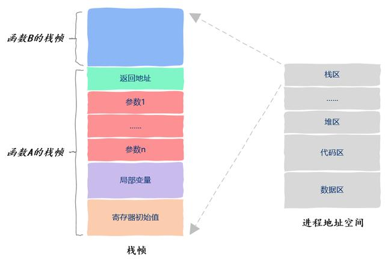
</p>
由于操作系统随时可以暂停线程的运行，因此我们保存以及恢复程序计数器中的值就能知道线程是从哪里暂停的以及该从哪里继续运行了。由于线程运行的本质就是函数运行，函数运行时信息是保存在栈帧中的，因此每个线程都有自己独立的、私有的栈区。

> Linux 下由 OS 决定栈区的大小，Windows 平台下栈区的大小是被记录在可执行文件中的（由编译器来设置），即：Windows 下可以由编译器来决定栈大小，默认 1 MB； Linux 下由系统环境变量来控制栈的大小，默认 8 MB。

函数运行时需要额外的寄存器来保存一些信息，像部分局部变量之类，这些寄存器也是线程私有的，一个线程不可能访问到另一个线程的这类寄存器信息。

线程的私有资源包括：**所属线程的栈区**、**程序计数器**、**栈指针**以及**函数运行使用的寄存器**


### 线程共享资源

线程的共享资源包括：所属进程的**代码区**、**数据区**、**堆区**，以及地址空间中的**动态链接库**、**打开的文件**。

* 代码区

进程地址空间中的代码区保存的是我们写的代码，更准确的是编译后的可执行机器指令。

那么这些机器指令又是从哪里来的呢？答案是从可执行文件中加载到内存的，可执行程序中的代码区就是用来初始化进程地址空间中的代码区的。

<p align="center">
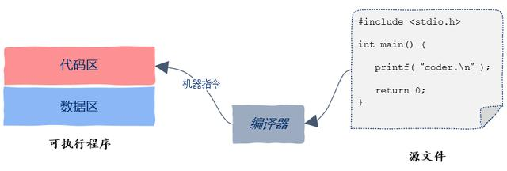
</p>

线程之间共享代码区，这就意味着程序中的任何一个函数都可以放到线程中去执行，不存在某个函数只能被特定线程执行的情况。

* 数据区

进程地址空间中的数据区，这里存放的就是所谓的全局变量，也就是那些你定义在函数之外的变量，在 C 语言中就像这样：

<p align="center">
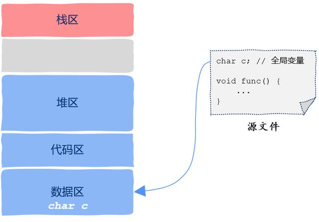
</p>

在程序员运行期间，也就是 run time，数据区中的全局变量有且仅有一个实例，所有的线程都可以访问到该全局变量。

值得注意的是，在C语言中还有一类特殊的“全局变量”，那就是用static关键词修饰过的变量，就像这样：
```C
void func(){
    static int a = 10;
}
```
虽然变量 a 定义在函数内部，但其依然具有全局变量的特性，也就是说变量 a 放在了进程地址空间的数据区域，即使函数执行完后该变量依然存在；而普通的局部变量随着函数调用结束，将和函数栈帧一起被回收掉。

* 堆区

我们在 C/C++ 中用 malloc 或者 new 出来的数据就存放在堆区。只要知道变量的地址即指针，任何一个线程都可以访问指针指向的数据，因此堆区也是线程共享的属于进程的资源。

<p align="center">
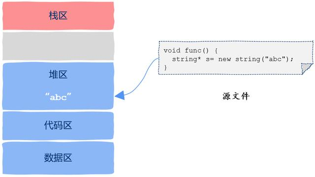
</p>

* 栈区

从线程这个抽象的概念上来说，栈区是线程私有的。然而从实际的实现上看，栈区属于线程私有这一规则并没有被严格遵守。

不像进程地址空间之间的严格隔离，线程的栈区没有严格的隔离机制来保护。因此如果一个线程能拿到来自另一个线程栈帧上的指针，那么该线程就可以改变另一个线程的栈区，也就是说这些线程可以任意修改本属于另一个线程栈区中的变量。

<p align="center">
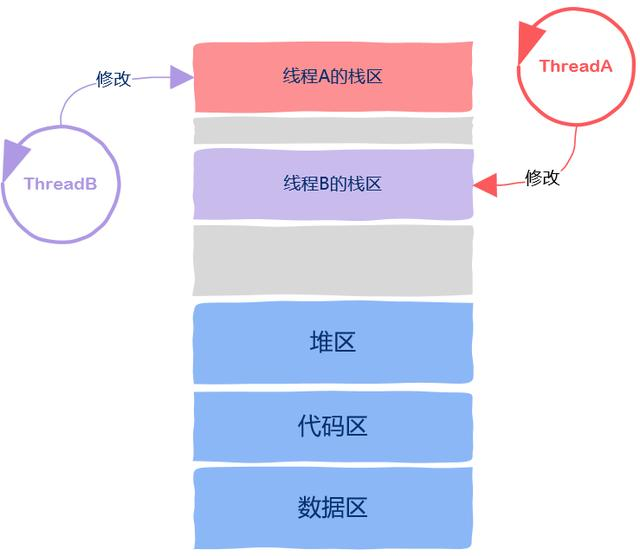
</p>

* 动态链接库

Windows 中的 exe 文件，Linux 中的 ELF 文件，这些可以被操作系统直接运行的程序就是我们所说的可执行程序。

编译器在将源码文件翻译成机器指令后，接下来还有一个重要的步骤，就是链接，链接完成后生成的才是可执行程序。完成链接这一过程的就是链接器。

<p align="center">
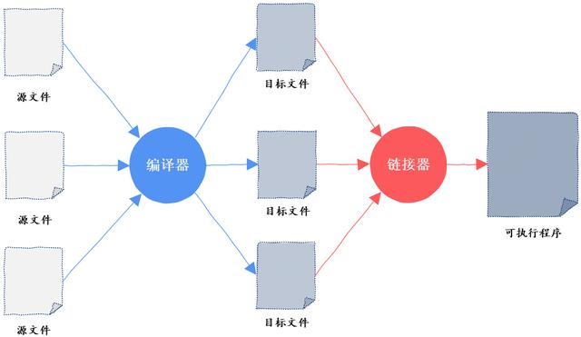
</p>

链接器可以有两种链接方式。`静态链接`是把所有的机器指令一股脑全部打包到可执行程序中；`动态链接`是我们不把动态链接的部分打包到可执行程序，而是在可执行程序运行起来后去内存中找动态链接的那部分代码，这就是所谓的静态链接和动态链接。

动态链接的部分生成的库就是我们熟悉的动态链接库，在 Windows 下是以 DLL 结尾的文件，在 Linux 下是以 so 结尾的文件。

如果一个程序是动态链接生成的，那么其**地址空间**中有一部分包含的就是动态链接库，这一部分的地址空间也是被所有线程所共享的。

<p align="center">
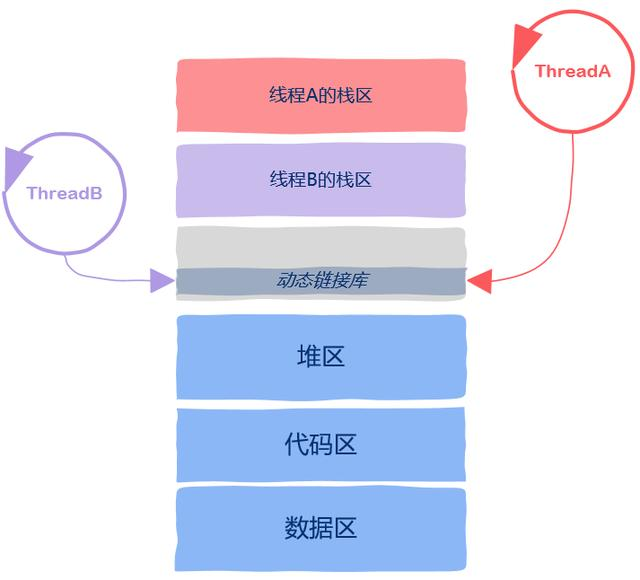
</p>

* 文件

如果程序在运行过程中打开了一些文件，那么进程**地址空间**中还保存有打开的文件信息，进程打开的文件也可以被所有的线程使用，这也属于线程间的共享资源。

<p align="center">
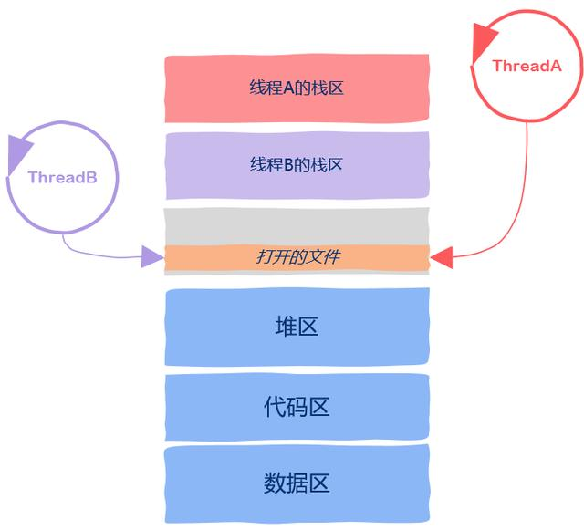
</p>


## 死锁

造成死锁的原因主要是有两种：

1、可重用资源引起的
2、消耗资源过多引起的

### 什么是死锁

造成死锁的原因就是多个线程或进程对同一个资源的争抢或相互依赖。一个最简单的解释就是你去面试，面试官问你告诉我什么是死锁，我就录用你，你回答面试官你录用我，我告诉你。

如果一个进程集合里面的每个进程都在等待只能由这个集合中的其他一个进程（包括他自身）才能引发的事件，这种情况就是死锁。


我们可以看一个例子，有资源 A、B，进程 C、D 描述如下：

资源 A 和资源 B，都是不可剥夺资源，现在进程 C 已经申请了资源 A，进程 D 也申请了资源 B，进程 C 接下来的操作需要用到资源 B，而进程 D 恰好也在申请资源A，进程 C、D 都得不到接下来的资源，那么就引发了死锁。

然后套用回去定义：如果一个进程集合里面（进程 C 和进程 D）的每个进程（进程 C 和进程 D）都在等待只能由这个集合中的其他一个进程（对于进程 C，他在等进程 D；对于进程 D，他在等进程 C）才能引发的事件（释放相应资源）。

这里的资源包括软件（程序）和硬件（扫描仪）。

### 产生死锁的原因

1. 资源竞争

系统中的资源可以分为两类：

`可剥夺资源`是指某进程在获得这类资源后，该资源可以再被其他进程或系统剥夺，CPU 和主存均属于可剥夺资源；

`不可剥夺资源`是指当系统把这类资源分配给某进程后，再不能强行收回，只能在进程用完后自行释放，如磁带机、打印机等。

产生死锁中的竞争资源之一指的是竞争不可剥夺资源。例如：系统中只有一台打印机，可供进程 P1 使用，假定 P1 已占用了打印机，若 P2 继续要求打印机打印将阻塞。

产生死锁中的竞争资源另外一种资源指的是竞争临时资源（临时资源包括硬件中断、信号、消息、缓冲区内的消息等），通常消息通信顺序进行不当，则会产生死锁。

2. 进程间推进顺序非法

若 P1 保持了资源 R1，P2 保持了资源 R2，系统处于不安全状态，因为这两个进程再向前推进，便可能发生死锁。

例如，当 P1 运行到 P1：Request（R2）时，将因 R2 已被 P2 占用而阻塞；当 P2 运行到 P2：Request（R1）时，也将因 R1 已被 P1 占用而阻塞，于是发生进程死锁。


### 死锁的必要条件

1、互斥条件：进程要求对所分配的资源进行排它性控制，即在一段时间内某资源仅为一进程所占用。
2、请求和保持条件：当进程因请求资源而阻塞时，对已获得的资源保持不放。
3、不剥夺条件：进程已获得的资源在未使用完之前，不能剥夺，只能在使用完时由自己释放。
4、循环等待条件：有两个或者两个以上的进程组成一条环路，该环路中的每个进程都在等待下一个进程所占有的资源。

<p align="center">

</p>

### 解决死锁的基本方法

1. 鸵鸟策略

把头埋在沙子里，假装根本没发生问题。因为解决死锁问题的代价很高，因此鸵鸟策略这种不采取任务措施的方案会获得更高的性能。当发生死锁时不会对用户造成多大影响，或发生死锁的概率很低，可以采用鸵鸟策略。

大多数操作系统，包括 Unix，Linux 和 Windows，处理死锁问题的办法仅仅是忽略它。

2. 死锁预防

- 资源一次性分配：一次性分配所有资源，这样就不会再有请求了；（破坏请求和保持条件）
- 允许进程只获得运行初期需要的资源，便开始运行，在运行过程中逐步释放掉分配到的已经使用完毕的资源，然后再去请求新的资源；（破坏请求和保持条件）
- 可剥夺资源：即当某进程获得了部分资源，但得不到其它资源，则释放已占有的资源（破坏不可剥夺条件）；
- 资源有序分配法：系统给每类资源赋予一个编号，每一个进程按编号递增的顺序请求资源，释放则相反（破坏环路等待条件）。

<p align="center">

</p>

这样虽然避免了循环等待，但是这种方法是比较低效的，资源的执行速度回变慢，并且可能在没有必要的情况下拒绝资源的访问。比如说，进程 c 想要申请资源 1，如果资源 1 并没有被其他进程占有，此时将它分配个进程 c 是没有问题的，但是为了避免产生循环等待，该申请会被拒绝，这样就降低了资源的利用率。

3. 死锁避免

死锁避免是利用额外的检验信息，在分配资源时判断是否会出现死锁，只在不会出现死锁的情况下才分配资源。

- 如果一个进程的请求会导致死锁，则不启动该进程；
- 如果一个进程的增加资源请求会导致死锁 ，则拒绝该申请。

避免死锁的具体实现通常利用`银行家算法`，通过对进程需求、占有和系统拥有资源的实时统计，确保系统在分配给进程资源不会造成死锁才会给与分配。

死锁避免的优点：不需要死锁预防中的抢占和重新运行进程，并且比死锁预防的限制要少。

死锁避免的限制：
- 必须事先声明每个进程请求的最大资源量；
- 考虑的进程必须无关的，也就是说，它们执行的顺序必须没有任何同步要求的限制；
- 分配的资源数目必须是固定的；
- 在占有资源时，进程不能退出。

4. 死锁检测与死锁恢复：

不试图阻止死锁，而是当检测到死锁发生时，采取措施进行恢复。

(1) 每种类型一个资源的死锁检测

<p align="center">

</p>

图中是资源分配图，其中方框表示资源，圆圈表示进程。资源指向进程表示该资源已经分配给该进程，进程指向资源表示进程请求获取该资源。

图 a 可以抽取出环，如图 b，它满足了环路等待条件，因此会发生死锁。

每种类型一个资源的死锁检测算法是通过检测**有向图是否存在环**来实现，从一个节点出发进行深度优先搜索，对访问过的节点进行标记，如果访问了已经标记的节点，就表示有向图存在环，也就是检测到死锁的发生。

(2) 每种类型多个资源的死锁检测

<p align="center">

</p>

图中有三个进程四个资源，每个数据代表的含义如下：

* E 向量：资源总量.
* A 向量：资源剩余量.
* C 矩阵：每个进程所拥有的资源数量，每一行都代表一个进程拥有资源的数量.
* R 矩阵：每个进程请求的资源数量.

因此就会有:

每个进程最开始时都不被标记，执行过程有可能被标记。当算法结束时，任何没有被标记的进程都是死锁进程。

i.   寻找一个没有标记的进程 Pi，它所请求的资源小于等于 A；
ii.  如果找到了这样一个进程，那么将 C 矩阵的第 i 行向量加到 A 中，标记该进程，并转回 i；
iii. 如果没有这样一个进程，算法终止。

(3) 死锁恢复

* 抢占资源：从一个或多个进程中抢占足够数量的资源分配给死锁进程，以解除死锁状态；
* 回滚
* 终止（或撤销）进程：终止或撤销系统中的一个或多个死锁进程，直至打破死锁状态。
    a、终止所有的死锁进程。这种方式简单粗暴，但是代价很大，很有可能会导致一些已经运行了很久的进程前功尽弃。
     b、逐个终止进程，直至死锁状态解除。该方法的代价也很大，因为每终止一个进程就需要使用死锁检测来检测系统当前是否处于死锁状态。另外，每次终止进程的时候终止那个进程呢？每次都应该采用最优策略来选择一个“代价最小”的进程来解除死锁状态。一般根据如下几个方面来决定终止哪个进程：
    - 进程的优先级
    - 进程已运行时间以及运行完成还需要的时间
    - 进程已占用系统资源
    - 进程运行完成还需要的资源
    - 终止进程数目
    - 进程是交互还是批处理


5. 如何在程序开发中避免死锁

死锁，发生的主要原因在于了有多个进程去竞争资源，也就是同时去抢占。

可以自己写一个支持多线程的**消息管理类**，单开一个线程访问独占资源，其它线程用消息交互实现间接访问。 这种机制适应性强、效率高，更适合多核环境。

# 内存管理

## 虚拟内存

虚拟内存是当代操作系统必备的一项重要功能，它向进程屏蔽了底层的 RAM 和磁盘，并向进程提供了远超物理内存大小的内存空间。

虚拟内存的目的是为了让物理内存扩充成更大的逻辑内存，从而让程序获得更多的可用内存。引入虚拟内存后，每个进程都要各自的虚拟内存，内存的并发访问问题的粒度可以从多进程级别降低到多线程级别。

为了更好的管理内存，操作系统将内存抽象成地址空间。每个程序拥有自己的地址空间，这个地址空间被分割成多个块，每一块称为一页。这些页被映射到物理内存，但不需要映射到连续的物理内存，也不需要所有页都必须在物理内存中。当程序引用到一部分不在物理内存中的地址空间时，由硬件执行必要的映射，将缺失的部分装入物理内存并重新执行失败的指令。

由此可以看出，虚拟内存允许程序不用将地址空间中的每一页都映射到物理内存，也就是说一个程序不需要全部调入内存就可以运行，这使得有限的内存运行大程序称为可能。例如有一台计算机可以产生 16 位地址，那么一个程序的地址空间范围是 0~64K。该计算机只有 32KB 的物理内存，虚拟内存技术允许该计算机运行一个 64K 大小的程序。

<p align="center">

</p>

## 分页系统

`内存管理单元`（MMU）：管理着地址空间和物理内存的转换。

`页表`（Page table）：`页`（地址空间）和`页框`（物理内存空间）的映射表。例如下图中，页表的第 0 个表项为 010，表示第 0 个页映射到第 2 个页框。页表项的最后一位用来标记页是否在内存中。

页表存放着 16 个页，这 16 个页需要用 4 个比特位来进行索引定位。因此对于虚拟地址（0010 000000000100），前 4 位是用来存储页面号，而后 12 位存储在页中的偏移量。

（0010 000000000100）根据前 4 位得到页号为 2，读取表项内容为（110 1），它的前 3 为为页框号，最后 1 位表示该页在内存中。最后映射得到物理内存地址为（110 000000000100）。

<p align="center">

</p>
虚拟存储器提供了三个重要的功能：

- 将主存看做存储在磁盘上的地址空间的高速缓存，从而提高了主存使用效率；
- 为每个进程提供一致的地址空间，简化存储器管理；
- 保护每个进程的地址空间不被其他进程破坏。


## 页面置换算法

在程序运行过程中，如果要访问的页面不在内存中，就发生缺页中断从而将该页调入内存中。此时如果内存已无空闲空间，系统必须从内存中调出一个页面到磁盘对换区中来腾出空间。

页面置换算法和缓存淘汰策略类似，可以将内存看成磁盘的缓存。在缓存系统中，缓存的大小有限，当有新的缓存到达时，需要淘汰一部分已经存在的缓存，这样才有空间存放新的缓存数据。

页面置换算法的主要目标是使页面置换频率最低（也可以说缺页率最低）。

* 最佳置换算法（Optimal，OPT）

所选择的被换出的页面将是**最长时间内不再被访问**，通常可以保证获得最低的缺页率。

是一种理论上的算法，因为无法知道一个页面多长时间不再被访问。

例如：一个系统为某进程分配了三个物理块，并有如下页面引用序列：`70120304230321201701`

开始运行时，先将 7, 0, 1 三个页面装入内存。当进程要访问页面 2 时，产生缺页中断，会将页面 7 换出，因为页面 7 再次被访问的时间最长。

* 最近最久未使用（Least Recently Used，LRU）

虽然无法知道将来要使用的页面情况，但是可以知道过去使用页面的情况。LRU 将**最近最久未使用**的页面换出。

为了实现 LRU，需要在内存中维护一个所有页面的*链表*。当一个页面被访问时，将这个页面移到链表表头。这样就能保证链表表尾的页面时最近最久未访问的。

因为每次访问都需要更新链表，因此这种方式实现的 LRU 代价很高。
<p align="center">

</p>

> OPT 和 LRU 都属于同一类算法，称为堆栈算法，不可能有 Belady 异常。

* 最近未使用（Not Recently Used，NRU）

NRU 将**最近未使用**的页面换出。

每个页面都有两个状态位：R 与 M，当页面被访问时设置页面的 R=1，当页面被修改时设置 M=1。其中 R 位会定时被清零。可以将页面分成以下四类：

```markdown
R=0，M=0
R=0，M=1
R=1，M=0
R=1，M=1
```
当发生缺页中断时，NRU 算法随机地从类编号最小的非空类中挑选一个页面将它换出。

NRU 优先换出已经被修改的**脏页面**（R=0，M=1），而不是被频繁使用的干净页面（R=1，M=0）。

* First In First Out (FIFO)

选择换出的页面是**最先进入**的页面。

该算法会将那些经常被访问的页面也被换出，从而使缺页率升高。

> 采用 FIFO 算法时，可能出现 **Belady 异常**：如果对一个进程未分配它所要求的全部页面，有时就会出现分配的页面数增多但缺页率反而提高的异常现象。

* 第二次机会算法

FIFO 算法可能会把经常使用的页面置换出去，为了避免这一问题，对该算法做一个简单的修改：

当页面被访问 (读或写) 时设置该页面的 R 位为 1。需要替换的时候，检查最老页面的 R 位。如果 R 位是 0，那么这个页面既老又没有被使用，可以立刻置换掉；如果是 1，就将 R 位清 0，并把该页面放到链表的尾端，修改它的装入时间使它就像刚装入的一样，然后继续从链表的头部开始搜索。

<p align="center">

</p>

* 时钟置换算法（CLOCK）

第二次机会算法需要在链表中移动页面，降低了效率。

Clock 算法在页表项中增加访问位，描述页面在过去一段时间的内访问情况，将各页面组织成环形链表，指针指向最先调入的页面。访问页面时，在页表项记录页面访问情况；缺页时，从指针处开始顺序查找未被访问的页面进行置换

时钟算法是 LRU 和 FIFO 的折中。

<p align="center">

</p>

## 分段系统

虚拟内存采用的是分页技术，也就是将地址空间划分成固定大小的页，每一页再与内存进行映射。

下图为一个编译器在编译过程中建立的多个表，有 4 个表是动态增长的，如果使用分页系统的一维地址空间，动态增长的特点会导致覆盖问题的出现。
<p align="center">

</p>

分段的做法是把每个表分成段，一个段构成一个独立的地址空间。每个段的长度可以不同，并且可以动态增长。

<p align="center">

</p>

### 段页式

程序的地址空间划分成多个拥有独立地址空间的段，每个段上的地址空间划分成大小相同的页。这样既拥有分段系统的共享和保护，又拥有分页系统的虚拟内存功能。

### 分页与分段的比较

1. 对程序员的透明性：分页透明，但是分段需要程序员显式划分每个段。
2. 地址空间的维度：分页是一维地址空间，分段是二维的。
3. 大小是否可以改变：页的大小不可变，段的大小可以动态改变。
4. 出现的原因：分页主要用于实现虚拟内存，从而获得更大的地址空间；分段主要是为了使程序和数据可以被划分为逻辑上独立的地址空间并且有助于共享和保护。


## 计算机的存储体系

这里总结对比一下寄存器、cache、内存、磁盘的各自特点。

<p align="center">

</p>

这个图表达了计算机的存储体系，从上至下依次是：

* CPU寄存器
* Cache
* 内存
* 硬盘等辅助存储设备
* 鼠标等外接设备

从上至下，访问速度越来越慢，访问时间越来越长。

CPU 速度很快，但硬盘等持久存储很慢，如果 CPU 直接访问磁盘，磁盘可以拉低 CPU 的速度，机器整体性能就会低下，为了弥补这 2 个硬件之间的速率差异，所以在 CPU 和磁盘之间增加了比磁盘快很多的内存。

<p align="center">

</p>

然而，CPU 跟内存的速率也不是相同的，从上图可以看到，CPU 的速率提高的很快（摩尔定律），然而内存速率增长的很慢，虽然 CPU 的速率现在增加的很慢了，但是内存的速率也没增加多少，速率差距很大，从 1980 年开始 CPU 和内存速率差距在不断拉大，为了弥补这 2 个硬件之间的速率差异，所以在 CPU 跟内存之间增加了比内存更快的 Cache，Cache 是内存数据的缓存，可以降低 CPU 访问内存的时间。


### 寄存器

`寄存器`: 寄存器是中央处理器的组成部份，可用来暂存指令、数据和位址。通常有通用寄存器，如指令寄存器 IR、程序计数器 (PC)、累加器 (ACC)、堆栈指针寄存器 (SP) 等，另外还有状态寄存器 (标记状态 Z、N、V、C)。寄存器最靠近 CPU，随取随用，速度最快。


### Cache

`Cache`: 即高速缓冲存储器，通常由 SRAM（Static Random Access Memory 静态存储器）组成，位于 CPU 与内存之间，容量小但速度快。由于 CPU 快而内存慢，CPU 不存在直接读或者写内存的情况，每次读或者写内存都要访问 Cache。

#### 分级

Cache Line 是 Cache 与内存同步的最小单位，典型的虚拟内存页面大小为4K，Cache line 为 32 或 64 字节。Cache 中一般保存着 CPU 刚用过或循环使用的部分数据，当 CPU 再次使用该部分数据时可从 Cache 中直接调用,这样就抹平了 CPU 与内存的速度差。Cache 又分为 L1、L2、L3（L1、L2 一般集成在 CPU 上）。

理论上 L1 有着跟寄存器相同的速度，但 L1 工作在写通过 (write-through) 模式下时，需要加锁用来同步 Cache 和内存的内容，这段期间 L1 不能被访问，所以 L1 就没寄存器快。L2、L3 同样需要加锁，并且 L2 比 L1 慢，L3 比 L2 慢。因此 L1 速率最快，与 CPU 速率最接近，是 RAM 速率的 100 倍，L2 速率就降到了 RAM 的25倍，L3的速率更靠近 RAM 的速率。

<p align="center">
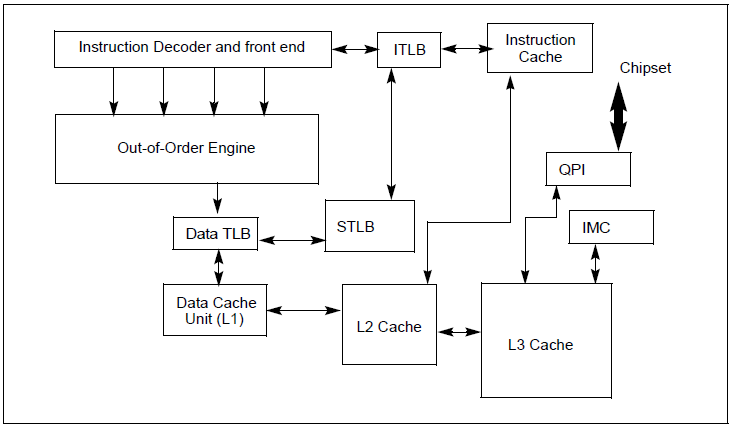
</p>

CPU 产品中，一级缓存的容量基本在 4KB ~ 64KB 之间，二级缓存的容量则分为 128KB、256KB、512KB、1MB、2MB 等。一级缓存容量各产品之间相差不大，而二级缓存容量则是提高 CPU 性能的关键。二级缓存容量的提升是由 CPU 制造工艺所决定的，容量增大必然导致 CPU 内部晶体管数的增加，要在有限的 CPU 面积上集成更大的缓存，对制造工艺的要求也就越高。常见的 CPU 三级缓存在 10MB 左右。

<p align="center">
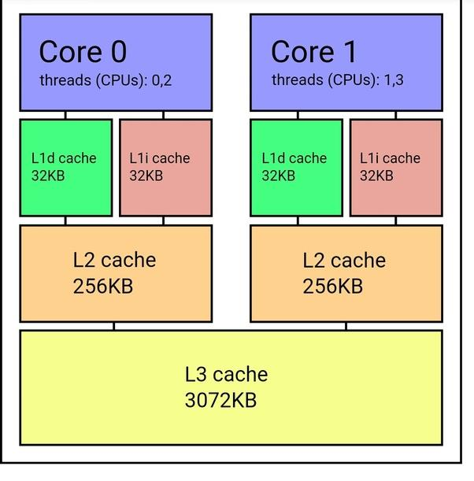
</p>

Cache 下还有一个 TLB（快表），TLB 是一个内存管理单元用于改进虚拟地址到物理地址转换速度的缓存。

#### 映射方式

- 直接映射高速缓存，每个组只有一个 line，选中组之后不需要和组中的每个 line 比对，因为只有一个line；
- 组相联高速缓存， S 个组，每个组 E 个 line；
- 全相联高速缓存，只有一个组，不用 hash 来确定组，直接挨个比对高位地址，来确定是否命中。

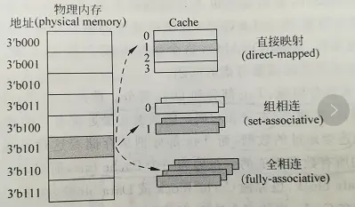


### 内存

`RAM` (主要针对 `DRAM`)：即内存，其作用是用于暂存 CPU 的运算数据，以及与硬盘等外部存储器交换的数据。内存的一个存储周期是从存储器收到有效地址 (EA) 开始，经过地址译码、驱动，直到被访问的存储单元被读出/写入为止。

简单介绍下 CPU 访问内存的流程：

*  找到数据（一般为操作数）地址（或地址的地址）。（地址一般放在通用寄存器内）
*  将地址送往内存管理单元（MMU），由 MMU 将虚拟的内存地址翻译成实际的物理地址。
*  将物理地址送往内存控制器，由控制器进行译码找到对应的存储体。
*  从对应的存储体读取数据送回给控制器，最后再送回 CPU。

可以看出内存的工作流程比 Cache 多出许多，每一步都会产生延迟。并且当外围设备（比如磁盘）通过 DMA 控制器与内存进行数据传输时（走数据总线），会与上面的 CPU 访问内存发生冲突，此时 CPU 和 DMA 就会轮流挪用内存周期，这样 CPU 访问内存的速度就更慢了。


### HardDisk

`HardDisk`又称硬盘驱动器，常见的有磁性旋转机械盘和基于闪存的固态硬盘 SSD，这里主要讲机械盘。当进行数据存取时，主要的速度影响来自于磁头的寻道时间和盘片的旋转时间，通常需要花费数毫秒的时间。如果是顺序 I/O 还好，如果是随机 I/O，速度将很慢。虽然磁盘内部、操作系统及应用程序都对磁盘进行了缓存优化，但速度还是远远不及内存。

由此可以看到存储体系的分层设计，自顶向下，速率越来越低，访问时间越来越长，从磁盘到 CPU 寄存器，上一层都可以看做是下一层的缓存。


# 设备管理

## 磁盘

### 磁盘结构

磁盘结构主要包括:

* 盘面（Platter）：一个磁盘有多个盘面；
* 磁道（Track）：盘面上的圆形带状区域，一个盘面可以有多个磁道；
* 扇区（Track Sector）：磁道上的一个弧段，一个磁道可以有多个扇区，它是最小的物理储存单位，目前主要有 512 bytes 与 4 K 两种大小；
* 磁头（Head）：与盘面非常接近，能够将盘面上的磁场转换为电信号（读），或者将电信号转换为盘面的磁场（写）；
* 制动手臂（Actuator arm）：用于在磁道之间移动磁头；
* 主轴（Spindle）：使整个盘面转动。

<p align="center">

</p>

<p align="center">

</p>

### 磁盘调度算法

读写一个磁盘块的时间的影响因素有：

* 旋转时间（主轴旋转磁盘，使得磁头移动到适当的扇区上）

* 寻道时间（制动手臂移动，使得磁头移动到适当的磁道上）

* 实际的数据传输时间

  其中，**寻道时间**最长，因此磁盘调度的主要目标是使磁盘的平均寻道时间最短。

1. 先来先服务 (First Come First Served，FCFS)

* 按照磁盘请求的顺序进行调度
* 公平对待所有进程
* 在有很多进程的情况下，接近随机调度的性能
* 优点是公平和简单。缺点也很明显，因为未对寻道做任何优化，使平均寻道时间可能较长。

<p align="center">

</p>

2. 最短寻道时间优先 (Shortest Seek Time First，SSTF)

优先调度与当前磁头所在磁道距离最近的磁道。

虽然平均寻道时间比较低，但是不够公平。如果新到达的磁道请求总是比一个在等待的磁道请求近，那么在等待的磁道请求会一直等待下去，也就是出现饥饿现象。具体来说，两边的磁道请求更容易出现**饥饿现象**。

<p align="center">

</p>

3. 电梯算法 (SCAN)

电梯总是保持一个方向运行，直到该方向没有请求为止，然后改变运行方向。

电梯算法（扫描算法）和电梯的运行过程类似，总是按一个方向来进行磁盘调度，直到该方向上没有未完成的磁盘请求，然后改变方向。

因为考虑了移动方向，因此所有的磁盘请求都会被满足，解决了 SSTF 的饥饿问题。

<p align="center">

</p>


## I/O 管理

### I/O 同步

传统的 UNIX 实现在内核中设有缓冲区高速缓存或页面高速缓存，大多数磁盘 I/O 都通过缓冲进行。当将数据写入文件时，内核通常先将该数据复制到其中一个缓冲区中，当该缓冲区写满或者内核需要重用该缓冲区以便存放其他磁盘块数据时，再将该缓冲排入输出队列，然后待其到达队首时，才进行实际的 I/O 操作。这种输出方式被称为`延迟写`（delayed write）。

延迟写减少了磁盘读写次数，但是却降低了文件内容的更新速度，使得欲写到文件中的数据在一段时间内并没有写到磁盘上。当系统发生故障时，这种延迟可能造成文件更新内容的丢失。

为了保证磁盘上实际文件系统与缓冲区高速缓存中内容的一致性，UNIX 系统提供了 sync、fsync 和 fdatasync 三个函数。

- `sync` 函数只是将所有修改过的块缓冲区排入写队列，然后就返回，它并不等待实际写磁盘操作结束。通常称为 update 的系统守护进程会周期性地（一般每隔 30 秒）调用 sync 函数。这就保证了定期冲洗内核的块缓冲区。命令 sync(1) 也调用 sync 函数；

- `fsync` 函数只对由文件描述符 filedes 指定的单一文件起作用，并且该调用会阻塞等待直到设备报告 IO 完成，然后返回。fsync 可用于数据库，这种应用程序需要确保将修改过的块立即写到磁盘上；

- `fdatasync` 函数类似于 fsync，但它只影响文件的数据部分。而除数据外，fsync 还会同步更新文件的属性。

> 除了同步文件的修改内容（脏页），fsync 还会同步文件的描述信息（metadata，包括 size、访问时间 st_atime & st_mtime 等等），因为文件的数据和 metadata 通常存在硬盘的不同地方，因此 fsync 至少需要两次 IO 写操作。


## 文件管理

### 系统处理过程

#### 编译系统

以下是一个 main.c 程序：
```c
#include <stdio.h>
int main(){
    printf("Golang is Best Language\n");
    return 0;
}
```
在 Unix 系统上，由编译器把源文件转换为目标文件。
```c
gcc -o main main.c
```
整个运行过程:

<p align="center">

</p>

* 预处理阶段 (Preprocessing phase)

预处理（cpp）根据以字符 # 开头的命令，修改原始的 C 程序，生成扩展名为 .i 的文件。
```go
> gcc -E main.c -o main.i
```
* 编译阶段 (Compilation phase)

编译器（cc1）将文本文件 main.i 翻译成文本文件 main.s，它包含一个汇编语言程序。
```go
> gcc -S main.i -o main.s
```
* 汇编阶段 (Assembly phase)

编译器（as）将 main.s 翻译成机器语言指令，把这些指令打包成一种叫做可重定位目标程序（relocatable object program）的格式，并将结果保存在目标文件 main.o 中。
```go
>  as main.s -o main.o
```

* 链接阶段 (Linking phase)
printf 函数是标准 C 库中的一个函数，在 printf.o 这个单独预编译好的目标文件中。连接器（ld）将 printf.o 和 main.o 合并，结果得到 main 可执行目标文件。
```go
> gcc main.o -o main
```

#### 静态链接

静态连接器以一组可重定向目标文件为输入，生成一个完全链接的可执行目标文件作为输出。链接器主要完成以下两个任务：

* 符号解析：每个符号对应于一个函数、一个全局变量或一个静态变量，符号解析的目的是将每个符号引用与一个符号定义关联起来。
* 重定位：链接器通过把每个符号定义与一个内存位置关联起来，然后修改所有对这些符号的引用，使得它们指向这个内存位置。

<p align="center">

</p>

**目标文件**

* 可执行目标文件：可以直接在内存中执行；
* 可重定向目标文件：可与其它可重定向目标文件在链接阶段合并，创建一个可执行目标文件；
* 共享目标文件：这是一种特殊的可重定向目标文件，可以在运行时被动态加载进内存并链接；

#### 动态链接

静态库有以下两个问题：

* 当静态库更新时那么整个程序都要重新进行链接；
* 对于 printf 这种标准函数库，如果每个程序都要有代码，这会极大浪费资源。

共享库是为了解决静态库的这两个问题而设计的，在 Linux 系统中通常用 .so 后缀来表示，Windows 系统上它们被称为 DLL。它具有以下特点：

* 在给定的文件系统中一个库只有一个文件，所有引用该库的可执行目标文件都共享这个文件，它不会被复制到引用它的可执行文件中；
* 在内存中，一个共享库的 .text 节（已编译程序的机器代码）的一个副本可以被不同的正在运行的进程共享。

<p align="center">

</p>
